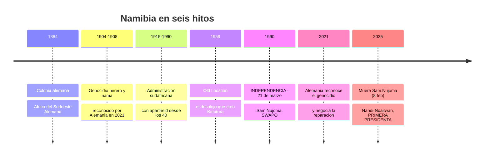
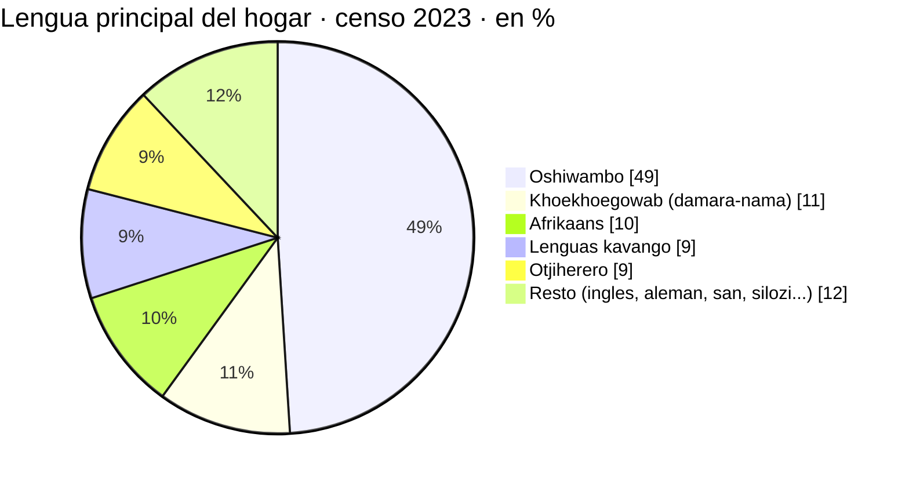
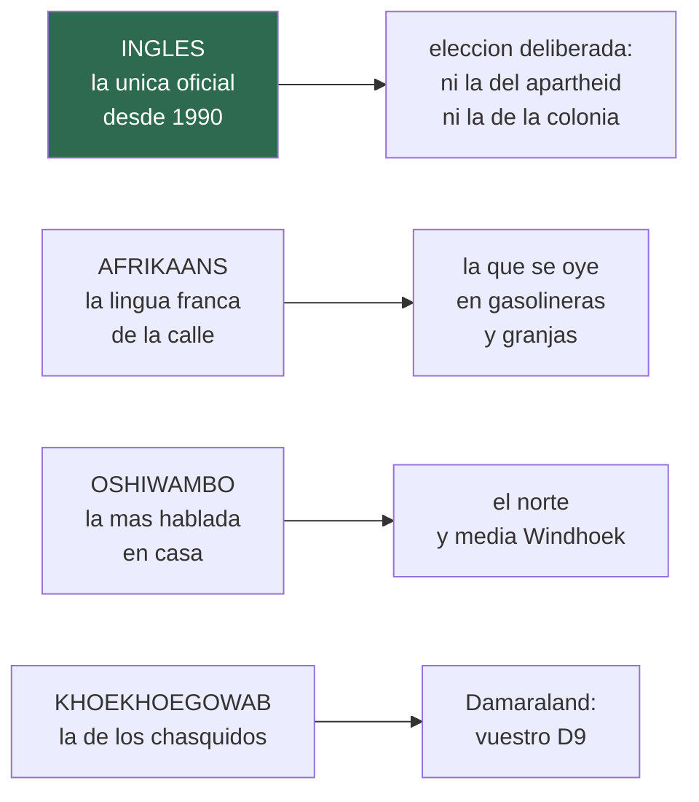
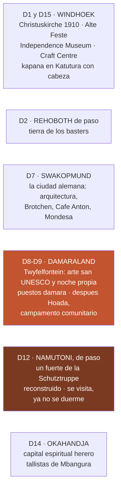

# 19 · Cultura de Namibia

> **Namibia · 30 oct – 15 nov 2026 · la clásica del norte** — [← índice del dossier](README.md)
>
> Quién vive en el país que vais a cruzar: los pueblos, las lenguas, la historia que explica lo que
> se ve por la ventanilla, y la etiqueta que hace el viaje más fácil — atado a los días de la ruta.
>
> **~N$20 = €1**, de bolsillo *(el cambio real de 2026 va por **18,5–19,4** — BCE, 28/08: el euro de estas páginas se queda ~7 % corto)* · **✅** fuente primaria · **◐** secundaria concordante ·
> **○** práctica común, sin fuente · **❌** sin verificar, dicho en blanco
>
> *Escrito el 09/08/2026. La mesa y los mercados están en [`08`](08-comida-compras-y-regalos.md);
> las palabras del paisaje (pan, vlei, koppie) en el README; aquí está el resto: la gente.*

Este documento existe porque la ruta no cruza solo paisajes: **cruza Rehoboth (D2), la Swakopmund
alemana (D7), los grabados san de Twyfelfontein (D8, y desde el 24/08 con noche propia allí), un
fuerte de la Schutztruppe que se visita de paso (Namutoni, D12) y la capital espiritual herero
(D14)** — y todo eso se ve distinto
sabiendo tres cosas de historia y cuatro de trato.

---

## 1. La historia mínima — seis fechas que explican lo que veréis

- **La colonia alemana duró solo 31 años (1884–1915)** y dejó una huella desproporcionada: la
  arquitectura de Swakopmund y Windhoek, el idioma que aún se oye en la costa, las cervezas de la
  *Reinheitsgebot* *(ver `08`)* — y la peor página del país.
- **El genocidio herero y nama (1904–1908)** — tras el levantamiento de 1904, la orden de
  exterminio del general von Trotha empujó a decenas de miles de hereros al desierto del Omaheke y
  a los campos de concentración *(Shark Island, en Lüderitz)*. Se considera **el primer genocidio
  del siglo XX**; **Alemania lo reconoció formalmente en 2021** y negocia desde entonces la
  reparación con Namibia ◐ *([BBC, 28/05/2021](https://www.bbc.com/news/world-europe-57279008))*.
  No es historia de vitrina: el vestido herero y el Herero Day de Okahandja *(§2 y §6)* salen de ahí.
- **La administración sudafricana (1915–1990)** trajo el apartheid: en 1959 el desalojo forzoso del
  barrio negro de Windhoek *(la «Old Location»)* hacia el nuevo **Katutura** —en otjiherero,
  **«el lugar donde no queremos vivir»**— dejó una docena de muertos y una fecha que hoy es
  festivo *(10 de diciembre)* ◐. Katutura es hoy donde se come el kapana *(`08`)*.
- **La independencia llegó el 21 de marzo de 1990**, tras la larga guerra de la SWAPO desde
  Angola. Namibia es **más joven que sus viajeros**: la generación que la fundó sigue en los
  campamentos, las granjas y los surtidores que vais a cruzar.
- 🆕 **Y lo que ha pasado desde entonces, que es lo que se habla hoy** *(añadido el 28/08)*:
  **Sam Nujoma, el presidente fundador, murió el 8 de febrero de 2025** a los 95 y **está enterrado
  en Heroes' Acre desde el 1 de marzo** ✅ — el monumento por el que pasáis el D2 *(`10`)* es ahora
  su tumba. Y desde el **21 de marzo de 2025** gobierna **Netumbo Nandi-Ndaitwah, la primera
  presidenta** del país, sucediendo a Nangolo Mbumba ✅. Namibia marca además el **28 de mayo como
  Día del Recuerdo del Genocidio** desde 2025: por eso los festivos ya son **catorce**, no trece.

Fuentes ◐: [Wikipedia — History of Namibia](https://en.wikipedia.org/wiki/History_of_Namibia) ·
[Wikipedia — Herero and Namaqua genocide](https://en.wikipedia.org/wiki/Herero_and_Nama_genocide) ·
[BBC — Germany officially recognises colonial-era Namibia genocide](https://www.bbc.com/news/world-europe-57279008) ·
[Wikipedia — Katutura](https://en.wikipedia.org/wiki/Katutura)

---

## 2. Quién es quién — los pueblos, y dónde os los cruzáis

**~3 millones de habitantes en un país del tamaño de Francia y el Reino Unido juntos: el segundo
país menos denso del mundo** ◐. La lengua del hogar, según el censo de 2023 *(redondeado ◐)*:

- **Ovambo (~la mitad del país)** — el bloque del norte, más allá de la Línea Roja que cruzaréis
  simbólicamente en Etosha *(`07`)*. Agricultores de mahangu, columna de la SWAPO y de la
  política desde 1990. Su cocina —oshifima, espinaca silvestre— se prueba en **Xwama (Windhoek)**
  o **Hafeni (Swakopmund)** *(`08`)*.
- **Herero** — ganaderos otjiherero-hablantes. Lo inconfundible: **el vestido victoriano de las
  mujeres con el tocado de cuernos de vaca** *(otjikaiva)* — nacido de la ropa de las misioneras
  alemanas y convertido, tras el genocidio, **en bandera de identidad**: llevar el traje del
  opresor a la manera propia. Su capital espiritual es **Okahandja (vuestra B1 del D14)**, con las
  tumbas de los jefes y la peregrinación anual de finales de agosto *(fuera de vuestras fechas)* ◐.
- **Himba** — los ovahimba del Kunene profundo, parientes de los herero que no pasaron por la
  misión: **el otjize** *(la pasta de ocre y grasa que da a piel y trenzas el rojo famoso)*.
  ⚠️ **Vuestra ruta NO llega a su territorio** *(Kaokoland queda fuera de esta ruta)*:
  los veréis, si acaso, en los pueblos y mercados del eje Kamanjab–Outjo. Existen «aldeas de
  demostración» visitables cerca de Kamanjab ◐ — si os tienta, la regla de abajo *(§4)* vale
  doble: con guía local, comprando artesanía y sin tratar a nadie como decorado ○.
- **Damara** — khoekhoegowab-hablantes *(la lengua de los chasquidos)*, mayoría en el Damaraland
  que cruzáis el D8 y el D9: **Twyfelfontein —donde ahora se duerme—, los puestos de artesanía de
  la C39/D3254 (`08`) y el campamento comunitario de Hoada** son su tierra y su economía.
- **San** — los primeros: cazadores-recolectores cuyos chamanes **grabaron Twyfelfontein hace
  entre 6.000 y 2.000 años** ◐ *(radiocarbono c. 5.850–180 BP según
  [Wikipedia](https://en.wikipedia.org/wiki/Twyfelfontein); la horquilla «2.000–5.000» que se daba
  con ✅ no se ha podido leer en la ficha de UNESCO, que devuelve 403 — el Patrimonio Mundial, 2007,
  sí: [UNESCO](https://whc.unesco.org/en/list/1255))*. Hoy son la minoría más golpeada del país;
  su rastro en vuestra ruta es el arte —el de la roca y la **joyería de cáscara de huevo de
  avestruz** del Craft Centre *(`08`)*.
- **Nama, basters y coloured** — los nama comparten lengua con los damara y sufrieron el
  genocidio junto a los herero. Los **basters de Rehoboth** *(vuestra primera parada de la B1 el
  D2)* son una comunidad de origen mixto nama-afrikáner llegada del Cabo en 1870, con su propio
  capítulo de autogobierno ◐.
- **Blancos (~2–6 %, según la fuente ◐)** — afrikáners, alemanes y angloparlantes *(el **Allgemeine
  Zeitung** no es el periódico de Swakopmund como decía aquí: se hace en **Windhoek**, nació en 1916
  como *Der Kriegsbote* y es **el diario más antiguo de Namibia y el único diario en alemán de
  África que sobrevivió a la Primera Guerra Mundial** ✅ — corregido el 28/08)*: la mayoría de las granjas del centro y buena parte
  del sector turístico que os va a atender.

Fuentes ◐: [Wikipedia — Demographics of Namibia](https://en.wikipedia.org/wiki/Demographics_of_Namibia) ·
[Wikipedia — Himba people](https://en.wikipedia.org/wiki/Himba_people) ·
[Wikipedia — Herero people](https://en.wikipedia.org/wiki/Herero_people) ·
[Wikipedia — Rehoboth Basters](https://en.wikipedia.org/wiki/Baster)

---

## 3. Las lenguas — y con cuál os vais a manejar

- **Con inglés vais sobrados en toda la ruta** ○: es la lengua de la escuela, los parques, los
  lodges y los carteles. La Constitución de 1990 la hizo **única oficial** a propósito — un país
  con una docena de lenguas eligió como neutral la que no era de nadie ◐
  *([Constitución, art. 3](https://www.lac.org.na/laws/annoSTAT/Namibian%20Constitution.pdf))*.
- **El afrikáans se oye más de lo que se lee**: es la lingua franca informal. Dos palabras que
  regalan sonrisas ○: **«baie dankie»** *(muchas gracias)* y **«lekker»** *(rico, estupendo — vale
  para la tarta de Solitaire)*. En oshiwambo, **«tangi»** es gracias ○.
- **El khoekhoegowab suena a percusión**: los chasquidos *(ǀ ǁ ǃ ǂ)* son consonantes de pleno
  derecho. No intentéis imitarlos a la primera — pedid que os enseñen: es un rompehielos
  infalible en Damaraland ○.
- **El alemán sobrevive en la costa**: en Swakopmund (D7) se desayuna con «Brötchen» y el
  Apfelstrudel del Café Anton *(`08`)* sin cambiar de idioma ◐.

---

## 4. Etiqueta — las cinco reglas que allanan el viaje ○

*Todo este bloque es práctica común de viaje contrastada entre guías, no dato duro — por eso va
en ○ de una pieza.*

1. **Se saluda antes de pedir.** «Good morning, how are you?» **antes** de preguntar por el
   diésel o la parcela. La transacción sin saludo es la grosería clásica del turista con prisa —
   y en Namibia nadie tiene prisa.
2. **Las fotos a personas se piden, siempre.** En mercados y aldeas, pedir permiso suele implicar
   comprar algo o una propina — es lo justo: la imagen es suya. A niños, mejor no. Y los
   retratos «étnicos» sin permiso son exactamente lo que parece: safari humano.
3. **La mano derecha** *(o las dos)* para dar y recibir — dinero, cambio, regalos.
4. **El regateo existe, pero es suave**: en los puestos de Damaraland (D9) y Okahandja (D14) se
   regatea sonriendo y sin rematar — la diferencia son céntimos para vosotros y la cena para el
   artesano. En tiendas con precio marcado *(Craft Centre)*, no se regatea.
5. **El reloj es orientativo** *(«African time»)*: el briefing del coche, la recepción, el
   guiado — todo llega, y llega mejor si no se le mete prisa. La única puntualidad sagrada del
   país son **las puertas de los parques** *(`01`)*.

Y una de dinero: **las propinas ya están medidas en [`07`](07-logistica.md)** *(gasolinero ~N$10 ·
~€0,50; guía de safari N$75–150 · ~€4–8 por persona y día)* — son parte del sueldo real de quien
os atiende, no un extra.

---

## 5. Religión, domingos y fiestas

- **~9 de cada 10 namibios son cristianos, la mayoría luteranos** — herencia de las misiones
  finlandesa y alemana ◐ *([Wikipedia — Religion in
  Namibia](https://en.wikipedia.org/wiki/Religion_in_Namibia))*. El domingo se toma en serio:
  **la ley seca dominical del alcohol (`08`) es tan cultural como legal**, y vuestros dos
  domingos de viaje *(1 y 8 de noviembre)* ya están planificados con ella.
- **En vuestra quincena no cae ningún festivo nacional** ✅ *(verificado el 24/08 contra el
  calendario oficial de 2026: los **catorce** festivos *(trece del Public Holidays Act de 1990 más
  el Día del Recuerdo del Genocidio, 28 de mayo, desde 2025)* caen todos fuera —
  el más cercano por detrás es **Heroes' Day, el 26 de agosto**, y por delante el **Día de los
  Derechos Humanos, el 10 de diciembre**. **En octubre y noviembre no hay ninguno.**)* Así que la
  única restricción de calendario que os aplica es **el domingo** *(alcohol, `08`)* — el
  calendario de horarios de `08`
  vale tal cual. Los grandes son el **21 de marzo** *(Independencia)*, el **26 de agosto**
  *(Heroes' Day — y, en fechas cercanas, el **Herero Day** de Okahandja: miles de hereros de
  uniforme y vestido victoriano honrando a sus jefes caídos)* y el **10 de diciembre** *(Human
  Rights Day, por los muertos de la Old Location)* ◐
  *([Wikipedia — Public holidays in Namibia](https://en.wikipedia.org/wiki/Public_holidays_in_Namibia))*.

---

## 6. La cultura, día a día de VUESTRA ruta

- **D1/D15 · Windhoek** — la **Christuskirche** *(1910)* y el **Alte Feste** *(el fuerte de 1890)*
  quedan juntos y a diez minutos del Craft Centre; enfrente, el **Independence Memorial Museum**
  —el edificio dorado construido, curiosidad, por el estudio norcoreano Mansudae ◐— cuenta la
  versión namibia de todo el §1. Entrada del museo: gratuita según guías ◐, horario ❌ sin
  verificar. El kapana de Katutura, mejor con alguien local o en tour *(`08`)*.
- **D2 · Rehoboth** *(de paso por la B1)* — la capital baster: no hay parada prevista, pero ya
  sabéis qué es cuando la crucéis.
- **D7 · Swakopmund** — la colonia que no se fue: paseo de media hora entre el **Woermannhaus**,
  el faro y el muelle de 1905 *(la cena, en `08`)*. Los **tours de Mondesa** *(el township)*
  existen y los llevan vecinos ◐ — misma regla ética del §4.
- **D8–D9 · Twyfelfontein y Hoada** — los dos días más culturales del viaje sin proponérselo, y
  desde el 24/08 son **dos**: el **arte rupestre san** con guía local *(N$270 · ~€13,5 ◐, `11`)*
  **se ve sin reloj**, porque se duerme allí mismo; al día siguiente, la **artesanía damara comprada
  al artista** en los puestos del cruce *(`08`)* y la noche en **Hoada, campamento comunitario**
  cuya caja se queda en la conservancy ◐.
- **D12 · Namutoni** *(de paso, ya no se duerme — cambio del 24/08)* — el fuerte blanco es la
  reconstrucción del puesto
  alemán que **en enero de 1904 defendieron siete soldados frente a cientos de guerreros
  ondonga** — resistieron el día y escaparon de noche; los ovambo lo arrasaron, y la versión
  reconstruida es hoy un campamento de NWR con museo ◐. **Vosotros lo cruzáis la tarde del D12**
  camino de Onguma: da tiempo al museo y a la torre del atardecer, contando el reloj hacia atrás
  desde las 19:10 que cierra Von Lindequist
  *([Wikipedia — Fort Namutoni](https://en.wikipedia.org/wiki/Fort_Namutoni))*.
- **D14 · Okahandja** — los **tallistas de Mbangura** ya están en el plan de regalos *(`08`)*;
  ahora ya sabéis por qué esta parada de carretera es, además, suelo sagrado herero.

---

## 7. Para el coche: qué escuchar ○

Sin pretensión de discografía — cuatro nombres que os sitúan la radio *(práctica común ○)*:
**Jackson Kaujeua** *(la voz histórica de la canción de la independencia)*, **The Dogg** y
**Gazza** *(los dos grandes del kwaito namibio)*, **EES** *(el «Nam-slang» de la comunidad
alemana-namibia)* — y el **oviritje** herero que suena en Okahandja. La NBC emite en las doce
lenguas del país: girar el dial por la grava de Damaraland es un curso de idiomas gratis.

---

## 🕳️ Lo que este documento no afirma

Las cifras de población y lengua son **del censo vía secundarias (◐, redondeadas)**; la etiqueta
del §4 es **práctica común (○)**, no norma escrita; los horarios y tarifas de museos de Windhoek
**no están verificados (❌)** — se preguntan en la puerta; y de las «aldeas de demostración» himba
no se recomienda ni se desaconseja: **se documenta el dilema y se deja a vuestro criterio** ○.

---

*Precios en N$ y € · ~N$20 = €1 · Escrito el 09/08/2026 — fuentes enlazadas en cada sección*
