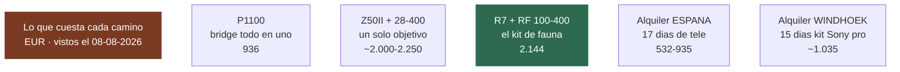
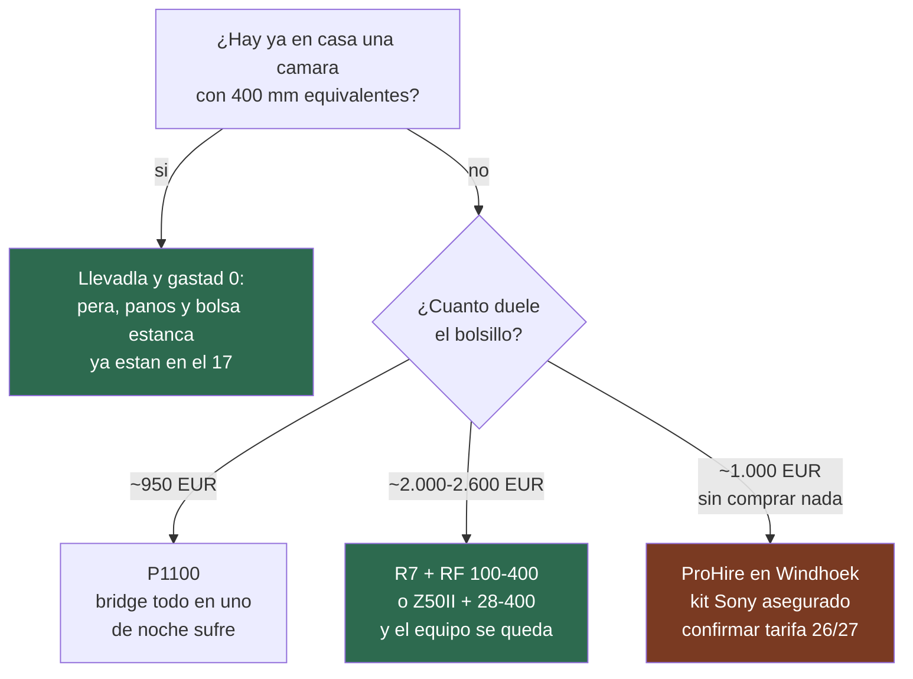

# 19 · La cámara: qué comprar y si alquilar

> **Namibia · 30 oct – 15 nov 2026 · la clásica del norte** — [← índice del dossier](README.md)
>
> Qué cámara y qué objetivo para **este** viaje, en dos gamas con **precio real de tienda**, y la
> cuenta honesta de **comprar frente a alquilar** — con la sorpresa de que la alternativa seria de
> alquiler no está en España, sino en Windhoek.
>
> **~N$20 = €1** *(rango 19,5–20,5)* · **✅** fuente primaria · **◐** secundaria concordante ·
> **○** práctica común, sin fuente · **❌** sin verificar, dicho en blanco
>
> *Precios vistos el 08/08/2026 · nada de esto entra en el presupuesto de [`02`](02-presupuesto.md)*

---

## 📐 Lo que pide esta ruta, antes de mirar tiendas

- **El teleobjetivo es el único hueco caro.** La fauna se hace **desde el coche, parado en la
  charca** (`09`): por debajo de ~**400 mm equivalentes** el elefante llena el encuadre pero el
  león queda lejos, y **500–600 mm equivalentes** es donde el safari en coche se vuelve cómodo ○.
  El paisaje —dunas, costa— lo resuelve cualquier zoom de paseo.
- **El polvo dicta la segunda regla.** La calima de la grava se mete hasta dentro del coche
  (`06`), y cada cambio de objetivo al aire libre es una invitación al sensor ○: **cuantos menos
  objetivos, mejor** — el «todo en uno» aquí no es pereza, es higiene. La pera de aire, los paños
  y la bolsa estanca ya están en la lista del [`17`](17-lista-de-equipaje.md).
- **Se dispara apoyado en la ventanilla**, con una sudadera doblada haciendo de saco; el trípode
  no sirve dentro del coche — sí en la charca iluminada de noche y bajo el cielo del desierto
  *(la técnica, en la guía de fauna: [`09`](09-fauna-etosha.md))*.
- **Y el cielo juega a favor**: las cuatro noches de Etosha (D9–D12) caen en **luna nueva**
  *(novilunio el 9–10 nov — el bloque 🌙 de [`01`](01-itinerarios-dia-a-dia.md))* — Vía Láctea
  de libro para el trípode, y **charca iluminada sin luz lunar de fondo**: ISO arriba sin miedo ○.
- **El peso no es excusa**: todo lo de abajo baja de 1,6 kg, y la franquicia del vuelo son 23 kg
  por persona *([`02`](02-presupuesto.md) §8)*.

---

## 🏆 La gama «mejor relación calidad-precio» — ~2.150 € el kit de fauna

El camino clásico, un cuerpo APS-C con un tele compacto:

- **Canon EOS R7** *(APS-C, 32,5 Mpx, 612 g con batería ◐)* — **1.349 €** en oferta y en stock ✅
  *([Fotocasión](https://www.fotocasion.es/catalogo/cuerpo-canon-eos-r7/54452/), antes 1.590 €)*.
  El sensor APS-C multiplica la focal ×1,6: es lo que convierte un tele modesto en uno de safari.
- **Canon RF 100-400 f/5.6-8** *(635 g ✅)* — **795 €** en stock ✅
  *([Fotocasión](https://www.fotocasion.es/catalogo/objetivo-canon-rf-100-40056-8-is-usm/53474/))*.
  Montado en la R7 es un **160–640 mm equivalente** — exactamente el rango del párrafo de
  arriba — y el conjunto queda en **~1,25 kg** ◐.
- **Total fauna: 2.144 €.** Con una lente de paseo **RF-S 18-150** *(310 g ◐)* desde **~458 €** ◐
  *([idealo](https://www.idealo.es/precios/201967197/canon-rf-s-18-150mm-f3-5-6-3-is-stm.html))*:
  **~2.600 €** el equipo completo.
- En **importación gris** *(garantía no europea, cada cual sabrá)* el RF 100-400 baja a **571 €** ◐
  *([e-infinity](https://www.e-infin.com/eu/es/item/4284/lente_canon_rf_100-400_mm_f/5.6-8_is_usm))*.

Y la alternativa con **un solo objetivo**, que es la respuesta más elegante a la regla del polvo:

- **Nikon Z50 II** — desde **~749 €** ◐
  *([idealo](https://www.idealo.es/precios/205066388/nikon-z50ii-body.html); 1.029 € en
  [Fotocasión](https://www.fotocasion.es/catalogo/cuerpo-nikon-z50-mark-ii/58079/) ◐)* con el
  **Nikkor Z 28-400 f/4-8** *(725 g ◐)* — **1.233 €** ◐
  *([Visanta](https://visanta.com/objetivos-nikon/29911-objetivo-nikkor-z-28-400mm-f48-vr.html);
  984 € en gris ◐)*. En el sensor DX es un **42–600 mm equivalente sin cambiar jamás de
  objetivo**. **Conjunto: ~2.000–2.250 €** ◐.

---

## 💶 La gama ajustada — ~950 € y a rodar

- **Nikon Coolpix P1100** *(bridge, 24–3.000 mm equivalentes, ƒ2.8–8, sensor pequeño de 1/2,3" ◐)* —
  **936 €** ✅ *([Phone House](https://www.phonehouse.es/camaras/nikon/coolpix-p1100.html),
  vendedor marketplace; 1.349 € en
  [FotoRuanoPro](https://fotoruanopro.com/camaras-bridge/56340-nikon-coolpix-p1100-VQA170EA.html) ✅;
  desde ~804 € en [idealo](https://www.idealo.es/precios/205832133/nikon-coolpix-p1100.html) ◐)*.
  Un alcance que ningún kit de arriba toca y **una sola pieza, sin cambios de objetivo**; el peaje
  es el sensor: de día en la charca sobra, **de noche en la charca iluminada sufre** ○. Y un aviso:
  pesa **1.410 g** ◐ — *más que la R7 con el 100-400 puesto*.
- **Sony RX10 IV**, la bridge legendaria de sensor grande: **desde 1.999 €** ◐
  *([idealo](https://www.idealo.es/precios/5739272/sony-cyber-shot-dsc-rx10-mark-iv.html))* — una
  cámara de 2017 a precio de 2026. Descartada por precio, no por calidad.
- La **segunda mano con garantía** *(por ejemplo [MPB](https://www.mpb.com))* rebaja cualquiera de
  estas cifras; aquí no se cotiza porque su stock cambia a diario ○. **La cuenta completa de la
  segunda mano —comprar, viajar y revender, con precios vistos el 09/08— está en
  [`22`](22-camara-segunda-mano.md).**

---

## 🔄 ¿Alquilar en España? La cuenta dice que no

- El clásico que citan los foros, `alquilerdeobjetivos.es`, **ya no existe: el dominio ni
  resuelve** ✅ *(comprobado el 08/08/2026)*.
- **[Camaralia](https://www.camaralia.com/es/808-alquiler-montura-canon)** *(recogida presencial en
  Sevilla)*: Sigma 150-600 Contemporary a **48,40 €/día y 193,60 €/semana** IVA incluido ✅ →
  **~532 €** los 17 días *(2 × 193,60 + 3 × 48,40 = 532,40 — dos semanas + 3 días, cuenta propia ◐)*. **Fianza del 25 % del valor
  del equipo** ✅ y, lo que de verdad pica, en sus
  [condiciones](https://www.camaralia.com/es/content/4-condiciones-generales-de-alquiler):
  **sin seguro — daño o robo los paga el arrendatario a precio de mercado** ✅, y la **salida al
  extranjero hay que comunicarla** y sus trámites corren de tu cuenta ✅.
- **[objetivosdealquiler.com](https://objetivosdealquiler.com/categoria-producto/alquiler/)**:
  EF 100-400 L II a **44 €/día** y RF 100-500 L a **55 €/día** ✅, sin descuento por duración
  publicado ❌ → **748–935 €** los 17 días *(cuenta propia ◐)*. **Es el precio de comprar el
  RF 100-400 nuevo.**
- **[Fragmáticos](https://fragmaticos.es/articulo/canon-rf-100-400mm-f-5-6-8-is-400.html)** tiene
  el RF 100-400 en catálogo, pero **el precio es dinámico y no se publica** ✅ — por teléfono.
- **El veredicto** ○: 17 días de alquiler de gama media cuestan **entre medio objetivo y uno
  entero**, sin seguro, con fianza, y con el equipo respondiendo con tu bolsillo en un país de
  polvo y grava. Para esta duración, **comprar gana**.

---

## 🇳🇦 La alternativa seria: alquilar en Windhoek

- **[ProHire](https://prohire.cc/)** — **socio de Namibia2Go**, tu propio rent-a-car, y de
  Gondwana ✅ — alquila el **kit safari Sony**: **a7 IV + FE 200-600 G + FE 24-105 f/4** por
  **N$1.380 (~€69) el día completo** ✅ *(tarifa publicada del año 1 nov 2025 – 31 oct 2026:
  [Gondwana](https://gondwana-collection.com/photographic-equipment-hire-in-namibia))*. Las
  condiciones son las contrarias de España: **equipo asegurado, robo sin franquicia y SIN
  fianza**; pago completo por adelantado, daños tasados en N$1.000 (~€50) por pieza y prohibido
  sacarlo del país ✅.
- Los 15 días salen a **~N$20.700 (~€1.035)** *(cuenta propia sobre el precio/día publicado;
  descuento por duración sin publicar ❌)*: un kit profesional, asegurado, **sin facturarlo en el
  avión ni comprarlo** — y que comprado costaría varias veces eso ○.
- ⚠️ **Dos cosas antes de contar con ello.** La tarifa publicada **caduca el 31 de octubre
  de 2026 — el día que aterrizáis** *(el mismo precipicio de año tarifario que las NWR, `03`)*:
  pedid **por escrito** la del año 26/27 ❌. Y ProHire abre **de lunes a viernes** ◐, pero
  **aterrizáis un sábado y volvéis otro sábado**: preguntad si entregan en el aeropuerto con
  Namibia2Go o en sábado ❌.
- **[Capture Namibia](https://www.capturenamibia.com/rentals/)** *(Windhoek, 351 Sam Nujoma
  Drive)*: **Sigma 150-600 C a N$549 (~€27)/día** ✅ — los 15 días, **~N$8.235 (~€412)**, menos
  que en Sevilla y sin volar con él *(cuenta propia ◐)* —, cuerpos **Canon R a N$749 (~€37)**,
  **R5 II a N$1.849 (~€92)** y la bridge **P1000 a N$999 (~€50)** ✅. **Fianza, seguro y
  descuentos por duración sin publicar** ❌ — por email. Abre L–V 08:30–17:00 **«o con cita»** ✅,
  que el sábado agradeceréis.
- La geometría manda: **Windhoek solo se pisa al aterrizar y al volver** — el alquiler allí es
  del viaje entero, no «solo para los días de Etosha».

---

## 💾 El respaldo — la regla de las tarjetas ○

Quince días de polvo, media ruta sin cobertura *(subir a la nube no es plan — `07`)* y una
tarjeta única sería un punto único de fallo **con Deadvlei dentro**. La regla, barata:

- **Las tarjetas se rotan por días** *(por eso son ×4 en `17`)*: la llena, al estuche — y el
  estuche, en **otro bulto** que la cámara. **No se formatea nada hasta estar en casa.**
- **Se copia las noches con enchufe** — Walvis Bay (D5–D6) y Windhoek (D13) — al móvil con un
  lector USB-C o a un **SSD pequeño** *(su casilla, en `17`)*.
- La cámara duerme en el coche cerrado y a cubierto; **las tarjetas llenas van contigo** ○.

## 🧭 La decisión, en corto

Sea cual sea la casilla: **tarjetas ×4, baterías ×3, pera, paños y bolsa estanca** ya tienen su
casilla en [`17`](17-lista-de-equipaje.md) — allí es caro y está lejos.

---

*Nada de este documento entra en el presupuesto de [`02`](02-presupuesto.md): como el satelital o
los adaptadores, es equipamiento, no coste del viaje. Los precios españoles son de tienda online
con IVA, **vistos el 08/08/2026**; los namibios, de las tarifas publicadas de cada casa — y las
tarifas cambian: **reconfirma antes de pagar**. · 08/08/2026*
