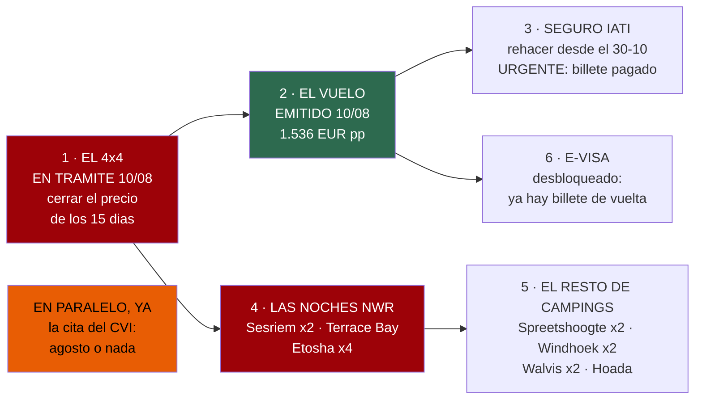

# 20 · Reservas — el cuaderno de llamadas

> **Namibia · 30 oct – 15 nov 2026 · la clásica del norte** — [← índice del dossier](README.md)
>
> Todas las reservas del viaje en un solo documento: qué se reserva, en qué orden, con qué contacto
> y de dónde sale cada dato. **El estado vivo —qué está ya cerrado— se lleva en el
> [README](README.md); los plazos de calendario, en `04`; el dinero, en `02`.**
>
> **~N$20 = €1** *(rango 19,5–20,5)* · **✅** fuente primaria · **◐** secundaria concordante ·
> **○** práctica común, sin fuente · **❌** sin verificar, dicho en blanco
>
> *Levantado el 09/08/2026. Al 10/08, el **vuelo está EMITIDO (€1.536 p.p.)** y la **reserva del
> coche EN TRÁMITE** — el resto sigue sin reservar. Los contactos que el
> dossier no tiene localizados se dicen en blanco: rellenar un teléfono plausible sería peor que
> dejar el hueco. Los marcados ◐ salieron de la búsqueda del 09/08/2026 sin poder abrir la ficha
> oficial: confírmalos al usarlos.*

---

## 🧭 El orden, de un vistazo

Reservar no es una lista plana: unas cosas abren la puerta de otras. **El coche va primero** —es lo
que se agota, no el vuelo (`04`)—, **el billete emitido es la llave del e-visa**, y las **seis
reservas de alojamiento que hacen el viaje** *(las del contador del README: Sesriem, Terrace Bay,
Okaukuejo, Halali, Namutoni y Spreetshoogte)* van en cuanto el coche esté firmado.

---

## 1 · 🚙 El 4×4 — Namibia2Go: reserva **EN TRÁMITE (10/08/2026)**

- **Qué**: 4x4 camping equipped double cab —**Budget** o **Comfort**—, **15 días, aeropuerto →
  aeropuerto: 31 oct ~11:00 → 14 nov ~18:00** *(decidido el 07/08 — `02` §2)*. **La reserva se
  abrió el 10/08 con la entrega y recogida EN el aeropuerto confirmadas** ✅.
- **Precio: PENDIENTE de cotización final** ❌. Referencia: Budget **N$35.100 (~€1.755)** los 13
  días cotizados ✅ + **~N$5.400 (~€270)** los 2 extra ◐ · Comfort **N$39.000 (~€1.950)** ✅ +
  ~N$6.000 (~€300) ◐. ⚠️ **El 31 de octubre cae fuera de su temporada baja — que venga
  desglosado.**
- **Contacto**: 📞 **+264 61 427 220** *(centralita — `06` §13)* ·
  [namibia2go.com — la ficha del coche](https://namibia2go.com/4x4-camping-equipped-double-cab)
  *(la ficha volvió a cargar el 10/08 y lista el equipo pieza a pieza — toallas y hornillo
  incluidos—; su tarifa publicada sigue caducando antes del viaje: manda la cotización en vivo,
  `02` §2)*.

**Al reservar, POR ESCRITO** *(el porqué de cada una: `02` §2, `06` y `18` §4–5)*:

- La **entrega y devolución EN el aeropuerto — CONFIRMADA al abrir la reserva (10/08)** ✅: que
  la confirmación escrita recoja **las horas de los dos sábados** *(recogida 31/10 ~11:00 ·
  devolución 14/11 ~18:00)* y si hay suplemento ❌.
- El **precio exacto del 31 de octubre** ❌ *(fuera de temporada baja)*.
- El **contrato estándar ya está leído** ✅ *(10/08 — enlace en `16` §8)* y deja una pregunta
  concreta: su **cláusula 10.2** permite cobrar el daño **sin contacto físico con otro vehículo,
  animal, objeto o persona «al margen de los waivers»** — **cómo tratan en la práctica la salida
  de vía o el vuelco a solas** ❌ *(su matriz Gondwana lo dice en claro en sus T&C generales: «el
  accidente de un solo vehículo a menudo se considera negligencia… al margen de las condiciones
  de franquicia» ◐)*. Y las de siempre: *dune driving*/Sandwich Harbour y los
  **bajos en Damaraland** con el Premium Cover ❌ *(la referencia del sector los excluye — `06`)*.
- La **fianza en tarjeta**: la FAQ oficial confirma **«no deposit»** ✅ *(leída el 10/08)*; dos
  revendedores citan **N$2.500 (~€125)** de depósito de combustible ◐ — **que quede por escrito
  si retienen algo, y cuánto**.
- El **teléfono de emergencias 24 h** ❌ *(la centralita no lo es)* y la **tarifa de grúa/rescate** ❌.
- Del coche: **capacidad real del depósito** ❌ *(la aritmética del bucle de la costa la necesita,
  `07`)* · **con cuánto tanque lo entregan** ❌ · **segunda batería o corte por voltaje** para la
  nevera ❌ · **«2 spare tyres» en firme** ❌ *(la ficha hoy dice «1-2» ◐ y el `06` §14 cuenta con dos — que
  queden por escrito; ojo: el FCDO solo las exige en temporada de lluvias ene–abr, `06`)* · **que la
  confirmación liste el compresor** ❌ *(la ficha lo incluye ✅, pero su FAQ lo vende como extra
  ◐)* · qué trae de **recuperación y seguridad** ❌ —eslinga, cables de arranque, planchas de
  arena, pala, extintor, botiquín del coche y el **triángulo, obligatorio por ley** ✅
  *([reg. 233, GN 53/2001](http://www.lac.org.na/laws/annoREG/Road%20Traffic%20and%20Transport%20Act%2022%20of%201999-Regulations%202001-053.pdf))*— · **modelo de las tiendas de techo y su rating de viento** ❌ *(las rachas vespertinas de
  Etosha llegan a 37–66 km/h ✅ — `15`; la Comfort es de carcasa rígida, ¿y la Budget?)* · coste
  del **conductor adicional** ❌.
  *(El hornillo y el menaje pieza a pieza ya constan en la ficha desde el 10/08 ✅ — `18` §4.)*
- **Cancelación, del contrato estándar** ✅ *(10/08)*: reembolso íntegro a **más de 30 días** ·
  **15 %** a 14–30 días · **25 %** a 7–13 · **50 %** a menos de 7 días o no presentarse.
  **Conductores: 23 años cumplidos y 1 año de carnet.**
- **Cuándo se paga: NO publicado** ❌ — ni el contrato ni la FAQ fijan calendario *(su matriz
  Gondwana cobra el 100 % a las 72 h del resumen de reserva en los lodges, y 25 % al confirmar +
  resto a 60 días en su turoperador ◐)*: **pedir el calendario de pago por escrito al reservar**.
  Con su escala de cancelación, pagar por adelantado reservando en agosto apenas expone: sobre la
  recogida del 31/10, **hasta el ~30/09 se recupera el 100 %** · del ~1 al 17/10, el 85 % · del
  18 al 24/10, el 75 % · desde el ~25/10, el 50 %. Tarjeta Visa/Mastercard por su pasarela;
  su moneda es el NAD y la fluctuación del cambio va a cuenta del cliente.

---

## 2 · ✈️ El vuelo — **EMITIDO el 10/08/2026** ✅

- **Qué**: Oporto → Windhoek ida y vuelta, **30 oct – 14 nov**, Lufthansa *(largo radio operado por
  Discover)* — una escala por sentido: Fráncfort a la ida, Múnich a la vuelta. **EMITIDO por
  €1.536 (~N$30.720) por persona** ✅ *(cotizado en €1.450 el 05/08: +€86 entre cotizar y
  comprar — `02` §8)*.
- **Repaso del localizador, ya pagado** *(las tres comprobaciones de `02` §8)*: que incluya
  **maleta facturada** *(nada de Economy Light)* · que sea **billete único** *(una conexión
  perdida pasa a ser problema de la aerolínea)* · que los **nombres calquen el pasaporte**.
- **Lo que arrastra el billete emitido**: **ya se puede pedir el e-visa** *(§6, exige billete de
  vuelta)* — y el **seguro tiene que rehacerse desde el 30/10** *(§3)*: es lo más urgente.

---

## 3 · 🩺 El seguro — IATI Estrella: moverlo, no solo pagarlo

- **Qué**: IATI **Estrella**, cotizado **€226,04 (~N$4.520) la pareja** para 31/10–15/11 ✅. Con el
  vuelo saliendo el 30 **y el billete ya emitido (10/08), rehacerla del 30/10 al 15/11 es lo más
  urgente del cuaderno** — el coste del día extra ❌ sin cotizar *(`02` §7–8)*.
- **Y las peticiones por escrito** *(las que de verdad importan en esta ruta)*: que cubra
  **evacuación aérea DENTRO del país** *(cerca de Sesriem no hay hospital)*; **añadir la opción de
  búsqueda y salvamento** — el Estrella la deja opcional y el Mochilero, más barato, la trae de
  serie; su coste ❌ sin cotizar — y, si al final viaja una cámara comprada *(`22`)*, **el límite
  por objeto** de los 4.000 € de equipaje ❌.
- **Contacto** ◐ *(web propia, vía búsqueda del 09/08)*:
  [iatiseguros.com](https://www.iatiseguros.com/soporte/contacto/) · 📞 **+34 93 201 49 43** ·
  info@iatiseguros.com. La póliza impresa con su **teléfono de asistencia 24 h** *(depende del
  respaldo de la póliza: ARAG +34 93 485 77 35 · AXA +34 93 214 22 08 ◐)* va en la maleta *(`17`)*.

---

## 4 · 🛏️ Las seis noches de NWR — una sola gestión, cinco reservas

Todas con **tarifa oficial 2026/2027 verificada** ✅
*([el tarifario, PDF](https://www.nwr.com.na/wp-content/uploads/2026/06/NWR-Rack-Rates-2026-2027.pdf) — leído columna a columna, `03`)*:

- **Sesriem Campsite — mar 3 y mié 4 nov (D3–D4), DENTRO de la puerta** — **N$1.340 (~€67)/noche
  los dos** ✅. **44 parcelas y son la hora de ventaja de Deadvlei: es LA reserva urgente.**
- **Terrace Bay — sáb 7 nov (D7)** — **habitación doble en media pensión, N$3.480 (~€174) los
  dos** ✅ *(no hay camping: la fila «Campsite» de su web no existe en el tarifario — error suyo)*.
  ⚠️ **Sin esta reserva confirmada no se cruza Ugabmund a pernoctar** —última entrada **15:00**— y
  el permiso de tránsito obliga a salir del parque el mismo día: **llevadla impresa** *(`11`)*.
- **Okaukuejo — lun 9 (D9)** · **Halali — mar 10 (D10)** · **Namutoni — mié 11 y jue 12
  (D11–D12)** — camping **N$920 (~€46)/noche los dos** ✅. *Capricho: el chalet del charco de
  Okaukuejo, N$4.760 (~€238) — vuela; decidir al reservar.*

**Canal y contacto**: la **central de reservas de NWR en Windhoek** ◐ *(localizada por búsqueda
el 09/08, ficha sin abrir — confírmala al escribir)*: 📧 **reservations@nwr.com.na** ·
📞 **+264 61 285 7200** · Gathemann Building, Independence Avenue
*([nwr.com.na/contact](https://www.nwr.com.na/contact/) ·
[nwrnamibia.com](https://www.nwrnamibia.com/contact-details.htm))*. Las fichas y el tarifario, en
[nwr.com.na](https://www.nwr.com.na) ✅; el otro teléfono verificado es la **recepción de
Okaukuejo, +264 67 229 800** *(`01` §D10)*. **Sesriem pide llevar reserva de efectivo** ✅
*([nwrnamibia.com](https://www.nwrnamibia.com/sesriem-cash-credit-cards.htm))*.

**En la misma gestión, pregunta** *(son las preguntas 7 del README y los flecos de `18` y `01`)*:

- Si las **3 salidas guiadas de mañana y el nocturno se pueden dejar cerrados desde España** — su
  tarifa avisa de que en temporada de lluvias no aceptan pre-reserva de actividades; si no, van en
  recepción *(§8)*.
- Los **horarios de desayuno/restaurante** de los campamentos ❌ *(importa para salir al alba)*.
  *(La pregunta del enchufe por parcela quedó cerrada el 11/08 ◐ — `18` §5: hay toma en los
  cuatro NWR de la ruta; en Sesriem, pedir al llegar una parcela con la toma que funcione ○.)*
- Que el **desvío obligatorio Okaukuejo–Halali** sigue en pie ◐ *(`01` §D10)*.

---

## 5 · 🏕️ El resto de campings — cuatro llamadas, tres sin contacto

- **Spreetshoogte ×2 — dom 1 y lun 2 nov (D1–D2)** — era el hueco doble de la lista maestra
  *(`15`)*; **el contacto apareció en la búsqueda del 09/08** ◐: 📧 **spreetshoogte@iway.na** ·
  📞 **+264 62 572 010** *([directorio de Visit
  Namibia](https://visitnamibia.com.na/directory/spreetshoogte_campsite/))* · ficha con formulario
  en [wheretostay](https://spreetshoogtecampsite.wheretostay.na/) *(un fragmento le atribuye
  además el móvil +264 81 292 8525 ○, sin poder abrir la ficha)*.
  - **✅ Resuelto (10/08): SÍ está abierto — el «Closed down» queda REFUTADO.** El aviso
    procedía de una ficha vieja de *([namibweb](https://www.namibweb.com/spreetshoogtefarm.htm))*.
    Lo contradicen tres señales convergentes de 2025–2026 ◐: TripAdvisor lo lista con
    *«Updated 2026 Prices & Campground Reviews»*
    *([ficha](https://www.tripadvisor.com/Hotel_Review-g2187009-d32863681-Reviews-Spreetshoogte_Campsite-Solitaire_Khomas_Region.html))*,
    una reseña de 2025 lo llama *«favorite campsite in Namibia»*, y el sitio describe
    **instalaciones recién construidas** *(«newly built facilities»)* en la **D1275**, a media
    bajada del mirador, con acceso 2WD/4WD. *(Aviso de método: el proxy de red bloqueó la
    descarga de las fichas primarias —barkhan.africa, tripadvisor, wheretostay, namibweb,
    visitnamibia—, así que esto se apoya en extractos de buscador ◐, no en la página descargada.)*
  - **Trampa de nombre resuelta ◐**: el camping «bueno» lo **opera Barkhan Dune Retreat**
    *([barkhan.africa](https://www.barkhan.africa/spreetshoogte-campsite.php); su fauna la
    documenta [Expert Africa](https://www.expertafrica.com/namibia/namib-naukluft-national-park/barkhan-dune-retreat))*
    — ambos comparten el paso de Spreetshoogte sobre la **D1275**. **Namibgrens Guest Farm** es
    el vecino distinto y hay un «Camp Gecko» aparte: confirma con cuál hablas. Instalaciones ◐:
    duchas comunales, agua caliente por sistema *donkey*, 2 parcelas VIP con baño propio, parcelas
    4 y 7 accesibles, sin electricidad en las parcelas *(solo luz solar en el bloque)*. Un canal
    de reserva alternativo por wheretostay figura con 📞 **+264 83 000 0008** / 📧
    **info@wheretostay.na** ◐.
  - **Tarifa: sigue sin verificar** ❌ — no se pudo descargar ninguna página de precios
    *(pistas que se contradicen: 150–300 ZAR/persona ○ del blog; fragmentos de ~N$120–150 ·
    ~€6–7,5/persona ○)*. Allí no consta tienda, restaurante ni datáfono ❌: se paga en efectivo
    *(`01` §D1)*.
- **Windhoek — sáb 31 oct (D0) y vie 13 nov (D13)** — candidatos con camping verificado *(`01`
  §D0)*: **Urban Camp** *(Schanzen Road; piscina, bar, wifi, cajero)* — 📧 booking@urbancamp.net ·
  WhatsApp **+264 81 162 0761** · reserva por
  [NightsBridge](https://www.nightsbridge.co.za/bridge/book?bbid=17894) ◐; su web dice que la
  tarifa **«varía por temporada» y no publica número** ✅
  *([urbancamp.net](https://www.urbancamp.net/contents/en-us/d15_RATES.html))* — la pista del
  agregador, ~N$660–700 (~€33–35) la noche los dos ○. Y **Arebbusch** — 📞 +264 81 950 5000 ·
  [arebbusch.com](https://www.arebbusch.com/windhoek-accommodation/rates-and-availability/) ◐. Al
  llegar el D13, pregunta el **check-out del D14 y si se puede volver por la tarde** ❌.
- **Walvis Bay ×2 — jue 5 y vie 6 nov (D5–D6)** — **Lagoon Chalets**, el único camping que aparece
  listado en la ciudad y el que usó el blog de referencia ◐ — 📞 **+264 64 217 900** /
  +264 81 128 7151 · 8th Road West, Meersig ·
  [lagoonchaletswb.com](https://lagoonchaletswb.com/contact/) ◐. Precio: un portal publica
  **camping «desde R700» ≈ N$700 (~€35) la noche para dos** ◐
  *([lekkeslaap](https://www.lekkeslaap.co.za/accommodation/lagoon-chalets/rates))* — coherente
  con el fragmento de N$600 · ~€30 ○ que ya había; para la ventana del viaje sigue **sin tarifa
  confirmada** ❌. *Plan B: Swakopmund, a 30 km, tiene más oferta de camping ○.*
- **Hoada Campsite — dom 8 nov (D8)** — campamento **comunitario** *(la caja se queda en la
  conservancy ◐ — `19`)*, el que el blog llama el más bonito de su viaje. **N$271–366/persona según
  temporada → N$542–732 (~€27–37) los dos** ◐ *(la temporada de noviembre sin fijar — `02` §3)*.
  **Reservas: Journeys Namibia** *(la gestora, con Grootberg Lodge)* ◐: 📧 res4@journeysnamibia.com ·
  📞 +264 61 228 104 *([grootberg.com/contact](http://www.grootberg.com/contact) ·
  [journeysnamibia.com](https://journeysnamibia.com/en/lodges/hoada-campsite-tented-camp))*.

---

## 6 · 🛂 El e-visa y las citas — ventanilla, no proveedor

*(El detalle, los plazos y las fuentes, en `04` — aquí solo el contacto y el orden.)*

- **e-visa — N$1.600 (~€80)/persona** ✅: **solo** en **https://eservices.mhaiss.gov.na** — se pide
  con el **billete de vuelta emitido**, se imprime y se firma ante el oficial. ⚠️ `namibia-evisa.com`
  parece oficial y **no lo es**; y un aviso de certificado en el portal real es mala configuración
  suya: **verifica el dominio y sigue** *(`04`)*.
- **La cita del Centro de Vacunación Internacional — YA, en agosto**: Sanidad Exterior A Coruña,
  **Durán Lóriga 3, 5ª planta · 981 989 570 / 71 · 09:00–14:00** ✅. Para salir el 30/10, atendidos
  hacia el **19–26 de septiembre** — *la cita es el recurso escaso, no la vacuna* *(`04`)*.
- **El permiso internacional de conducir (DGT)** — cita previa en cualquier Jefatura o
  [sede electrónica](https://sede.dgt.gob.es/es/permisos-de-conducir/permiso-internacional/) ◐:
  **€10,51 (~N$210)**, vale 1 año, siempre junto al carnet *(`04`)*.
- **El viaje a Oporto — decidido (09/08): se va y se vuelve en coche propio** *(~270 km)*. Queda
  **cotizar para las fechas y reservar el aparcamiento de larga estancia** del aeropuerto Sá
  Carneiro *(17 días, 30 oct – 15 nov)* y los **peajes** ❌. Orden de magnitud, ganchos «desde» ◐:
  los low cost junto a la terminal rondan **€3,7–5/día** *(~€65–90 los 17 días —
  [parkingoporto.com](https://parkingoporto.com/) ·
  [ParkCare](https://parkcare.es/parking-aeropuerto-oporto) ·
  [Parkos](https://eu.parkos.com/porto-airport-parking/))* y el oficial del aeropuerto **desde
  ~€8/día** *(~€135+ —
  [aeropuertoporto.pt](https://www.aeropuertoporto.pt/es/opo/acceso-y-parking/para-mayor-comodidad/parking))*.
  *(El bus directo de ALSA / FlixBus, ~3 h 43 y ~€17 · ~N$340 por persona y trayecto ◐, queda
  archivado de plan B — `02` §8.)*

---

## 7 · 🚤 El capricho del D6, si cae — el día de mar de Walvis

**Va aparte del presupuesto** *(las actividades presupuestadas son las de Etosha y la lanzadera —
`02` §9)* y las fichas de los operadores devuelven 403: **cifras ◐ del índice del buscador y de
Viator, cruzadas entre operadores — confírmalas por email antes de reservar.**

- **Crucero de delfines y lobos** *(~3 h, y jun–nov es temporada de ballena jorobada ◐)* —
  **N$1.400–1.990 (~€70–100)/persona**: [Catamaran Charters](https://www.namibiancharters.com/activities/dolphin-seal-cruise) y
  [Sailnamibia](https://www.sailnamibia.com) marcan la banda baja;
  [Mola Mola](https://www.mola-namibia.com/marine-dolphin-cruise) la alta *(mín. 2; recogida
  +N$470 · ~€24)*.
- **Sandwich Harbour en 4x4** *(~4–5 h; con vuestro coche lo prohíbe el contrato de referencia —
  el tour es la forma correcta, `06`)* — **N$2.600–3.220 (~€130–161)/persona**:
  [Desert Compass](https://www.sandwichharbour-namibia.com) *(N$2.600; +N$300 · ~€15 recogida en
  Swakopmund)* · [Red Dune Safaris](https://www.reddunesafarisnamibia.com/sandwich-harbour-4x4)
  *(N$3.220 · ~€161)*.
- **El combo de día entero** *(~8,5 h, Mola Mola)* — **N$4.740 (~€237)/persona** ◐, sin la tasa de
  parque. *(En Viator: `d4467-105190P1` el crucero, `-105190P2` el combo, `-37950P1` Sandwich
  Harbour.)*
- ⚠️ **La marea manda**: el 6-nov la bajamar es a las **07:18** — **la salida de ~08:30 es la que
  baja por la playa**; la de ~12:30 cae casi en pleamar ◐
  *([tidetime.org](https://www.tidetime.org/africa/namibia/walvis-bay-calendar-nov.htm), `01` §D6)*.
  El operador planifica con su propia tabla: **confírmalo al reservar**.

**Otros opcionales con aviso previo**: **Otjitotongwe** *(guepardos, de camino el D9 — alimentación
~15:00; los no alojados **avisan antes** ◐, ~N$610 · ~€30/persona —
[namibweb](https://www.namibweb.com/otjitotongwe.htm))* · el **vuelo panorámico** *(Sossusvlei /
Skeleton Coast)*: existe y es la vía legal de la foto aérea, **precio ❌ sin cotizar** *(`11`)* ·
**Onguma y Okonjima** son otra liga *(~N$34.600 · ~€1.730 y ~N$12.700 · ~€630 por persona y noche ◐
— `01`, `11`)*.

---

## 8 · 🚪 Lo que NO se reserva desde casa

Para no gastar llamadas en lo que se cierra allí:

- **Los safaris guiados de Etosha** *(3 mañanas + nocturno = N$5.400 · ~€270 la pareja ✅)*: **en
  recepción al llegar a cada campamento** — la de Okaukuejo, nada más cruzar Andersson el D9; el
  nocturno, desde Namutoni. Horarios ❌ no publicados. *(La pregunta de si se puede cerrar desde
  España va en la gestión NWR — §4.)*
- **La lanzadera de Deadvlei** *(N$180 · ~€9/persona ✅)*: en Sesriem.
- **Las tasas de parque** *(~N$620 · ~€31 al día, pareja + coche ◐)*: en cada puerta, por cada 24 h.
- **Cape Cross** *(~N$350 · ~€18 los dos ◐)*: **en efectivo** en recepción — y vuestro día, el 7
  nov, **abre a las 10:00**, no a las 08:00 *(`01` §D7)*.
- **Twyfelfontein** *(N$270 · ~€13,5/persona ◐)*: visita guiada obligatoria, **solo efectivo**, se
  paga allí *(`11`)*.
- **El permiso de tránsito de Skeleton Coast**: **gratis, en la propia puerta** ◐ — lo que sí exige
  reserva previa es **pernoctar** *(Terrace Bay, §4)*, y Ugabmund cierra la entrada a las 15:00.
- **La mesa de Joe's Beerhouse** *(D0 o D13)*: conviene reservar, y se puede desde el móvil ese
  mismo día ○ — 📞 **+264 61 232 457** ◐ · [joesbeerhouse.com](https://joesbeerhouse.com/) ·
  también online vía [Dineplan](https://www.dineplan.com/restaurants/joes-beerhouse-namibia) ◐ ·
  160 Nelson Mandela Ave. Horario ❌ sin verificar.

---

## 9 · ✅ La lista para tachar

- [ ] **Recotizar el 4×4**: 15 días, aeropuerto → aeropuerto, el 31-oct por separado *(§1)*
- [ ] **Reservar el 4×4** — Budget o Comfort — con las preguntas por escrito respondidas *(§1)*
- [ ] **Cita del CVI pedida** *(§6 — agosto)*
- [ ] **Seguro recotizado desde el 30/10** + evacuación aérea interna y búsqueda y salvamento por
  escrito *(§3)*
- [ ] **Billete emitido** — con maleta, billete único *(§2)*
- [ ] **Sesriem ×2** *(3–4 nov, dentro de la puerta)* *(§4)*
- [ ] **Terrace Bay** *(7 nov — confirmación impresa)* *(§4)*
- [ ] **Okaukuejo · Halali · Namutoni ×2** *(9–12 nov)* *(§4)*
- [x] **Spreetshoogte ×2** *(1–2 nov)* — **abierto confirmado ◐** (2025–2026; «Closed down» refutado) y el homónimo aclarado: lo opera Barkhan Dune Retreat en la D1275 *(§5)*. Falta: cerrar la tarifa y la reserva
- [ ] **Windhoek D0 y D13** *(Urban Camp o Arebbusch)* *(§5)*
- [ ] **Walvis Bay ×2** *(Lagoon Chalets)* *(§5)*
- [ ] **Hoada** *(8 nov)* *(§5)*
- [ ] **e-visa** *(tras el billete — solo `eservices.mhaiss.gov.na`)* *(§6)*
- [ ] **Permiso internacional de conducir** *(DGT)* *(§6)*
- [ ] **Aparcamiento de larga estancia en Oporto** *(30 oct – 15 nov, en coche propio — §6)*
- [ ] *(Opcional)* **el día de mar del D6** — con la marea confirmada *(§7)*

---

*Precios en N$ y € · ~N$20 = €1 · Las tarifas namibias cambian: reconfirma antes de pagar*
