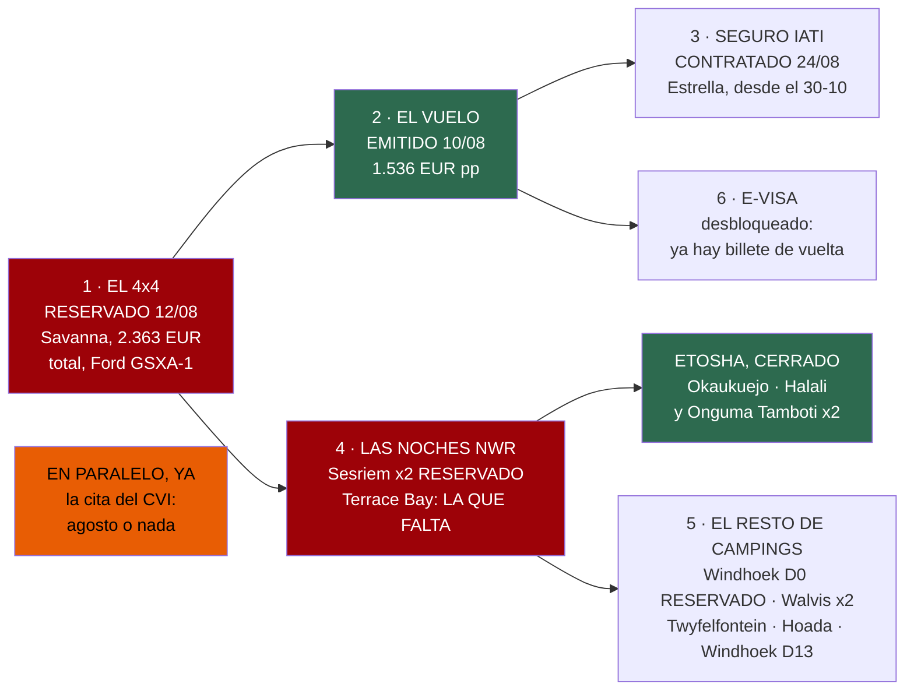

# 20 · Reservas — el cuaderno de llamadas

> **Namibia · 30 oct – 15 nov 2026 · la clásica del norte** — [← índice del dossier](README.md)
>
> Todas las reservas del viaje en un solo documento: qué se reserva, en qué orden, con qué contacto
> y de dónde sale cada dato. **El estado vivo —qué está ya cerrado— se lleva en el
> [README](README.md); los plazos de calendario, en `04`; el dinero, en `02`.**
>
> **~N$20 = €1** *(rango 19,5–20,5)* · **✅** fuente primaria · **◐** secundaria concordante ·
> **○** práctica común, sin fuente · **❌** sin verificar, dicho en blanco
>
> *Levantado el 09/08/2026. Al 24/08, el **vuelo está EMITIDO (€1.536 p.p.)**, el **coche
> RESERVADO con Savanna (€2.363 en total)** y **ocho de las catorce noches RESERVADAS** — Windhoek
> Urban Camp, Spreetshoogte, Sesriem ×2, Okaukuejo, Halali y **Onguma Tamboti ×2** (§4 y §5).
> **Namutoni se anuló** y **Terrace Bay es la única que queda con fecha dura sin reservar**. Los contactos que el
> dossier no tiene localizados se dicen en blanco: rellenar un teléfono plausible sería peor que
> dejar el hueco. Los marcados ◐ salieron de la búsqueda del 09/08/2026 sin poder abrir la ficha
> oficial: confírmalos al usarlos.*

---

## 🧭 El orden, de un vistazo

Reservar no es una lista plana: unas cosas abren la puerta de otras. **El coche va primero** —es lo
que se agota, no el vuelo (`04`)—, **el billete emitido es la llave del e-visa**, y las **reservas
de alojamiento que hacen el viaje** van en cuanto el coche esté firmado.

✅ **Al 24/08 casi todas están hechas**: **Windhoek Urban Camp** *(D0)*, **Spreetshoogte** *(D1, una
sola noche)*, **Sesriem ×2** *(D2–D3)*, **Okaukuejo** *(D9)*, **Halali** *(D10)* y **Onguma Tamboti
×2** *(D11–D12)* — **ocho noches de catorce**. **Namutoni se anuló**: su parcela se cambió por la
segunda de Onguma.

🔴 **Queda una sola con fecha dura: Terrace Bay (vie 6 nov)**, sin la cual no se cruza Ugabmund a
pernoctar. Y **cinco campings sin tarifa** que no necesitan reserva anticipada: Walvis Bay ×2,
**Twyfelfontein —la noche nueva del D7—**, Hoada y la vuelta a Windhoek del D13.

---

## 🕰️ ¿Con cuánta antelación reserva la gente? — y qué se puede dejar para allí

Pregunta razonable, porque **no todas las noches de este viaje pesan igual**. Lo que dicen las
fuentes, y coinciden entre sí ◐:

- **Solo dos sitios hay que tener sí o sí**: **Sesriem** y **los campamentos de Etosha**. Se
  agotan, y en temporada alta *(mayo–agosto)* **vuelan con meses**. Son los únicos que están
  **dentro** de un parque nacional, y ahí está el cuello de botella.
- **Todo lo demás, en general, no necesita antelación** ◐: **mucha gente viaja Namibia sin
  reservar nada** y no suele ser problema. La excepción que citan aparte es **Spitzkoppe**, que
  también se llena.
- **Y noviembre juega a favor**: es **temporada baja/hombro**, la de más holgura del año — la
  contraria de julio–octubre *(coherente con lo que ya decía `15`)*.
- **NWR acepta reserva por email, por teléfono y también a la llegada si queda sitio** ◐ — pero
  para los dos de arriba **eso es una lotería que no compensa**.

> ### 👉 Traducido a vuestro caso
> - ✅ **Los críticos ya están**: **Etosha** *(Okaukuejo y Halali)*, **Sesriem ×2** y las **dos
>   noches de Onguma** — más Spreetshoogte y el Urban Camp de Windhoek.
> - ⚠️ **Terrace Bay hay que reservarlo igual, pero por otro motivo**: no es que se llene, es que
>   **sin la confirmación no se entra a pernoctar** al Skeleton Coast *(§4)*. Es una llave, no una
>   plaza. **Es la única llamada que queda con fecha dura.**
> - 🟡 **Y el resto se puede dejar para más adelante, o incluso para allí**: **Walvis Bay ×2**,
>   **Hoada**, **Windhoek del D13** y **la noche nueva de Twyfelfontein (D7)**. Ninguno está dentro
>   de un parque y todos caen en temporada baja. **Conviene llamar el día antes** para no conducir
>   sin red, pero **no hace falta bloquearlos hoy**.
> - 🛟 **Y la de Twyfelfontein conviene dejarla suelta a propósito**: al quedarse Spreetshoogte en
>   una noche, **el viaje se quedó sin colchón de calendario**. La única noche sin reservar y sin
>   penalización es la del D7 — **es la que se sacrifica si el vuelo se retrasa** *(`24`)*.

*Esto es práctica documentada, no garantía: si una noche concreta es irrenunciable, resérvala.*

---

## 1 · 🚙 El 4×4 — Savanna: **RESERVADO ✅ (12/08/2026)**

- **Qué**: **grupo GSXA-1 Camping — Ford Ranger 2.2 o 2.0 D/Cab automático, modelo 2022–2025,
  118 kW/158 CV, 4x4 con bloqueo de diferencial** ✅. Aire acondicionado, radio/Bluetooth, cierre
  centralizado, ABS y airbags. Para 1–2 personas.
- **Fechas y horas** ✅: recogida **31/10, 11:00** *(llegada del vuelo, 09:25)*; devolución
  **14/11, 18:00** *(vuelo de las 20:45)*. 2 personas en las dos direcciones. **La devolución a
  las 18:00 amplía la política estándar de Savanna, que da 16:00 como límite** — que conste por
  escrito en la confirmación.
- **El depósito: 140 L** ✅ — **doble depósito, principal de 80 L + secundario de 60 L**,
  conectados por un solo tubo de llenado: se rellena primero el principal y el secundario empieza
  a llenarse solo. **El indicador de combustible solo mide el depósito principal**: marca «lleno»
  hasta que se vacía el principal, y solo entonces empieza a bajar — hay que avisarlo al repostar,
  o el surtidorista para antes de tiempo pensando que está lleno. Autonomía anunciada: **±1.000
  km**. Se entrega **sin depósito lleno** —no tienen surtidor propio— y se devuelve con el mismo
  nivel que se recibió.
- **Transfer de aeropuerto — NO es «coche en el aeropuerto»** ◐: Savanna no entrega ni recoge el
  vehículo en el aeropuerto — hay un **transfer gratuito entre el aeropuerto y su oficina de
  Windhoek** (80 Trift Street, Snyman Circle), incluido sin coste en alquileres de **14 días o
  más** *(el suyo son 15: entra de sobra)*, con **dos traslados gratuitos** — uno a la llegada,
  otro a la vuelta. El transfer gratuito solo corre **entre las 06:30 y las 17:20**: la llegada
  (09:25) cae dentro; **la salida (20:45) cae fuera** — fuera de esa ventana el transfer es de
  pago, N$550 (~€27,50) el trayecto hasta 4 personas. La confirmación de reserva marca «Airport Transfer:
  yes» para la vuelta, así que Savanna parece asumirlo de todos modos ◐ — **confírmalo por
  escrito, es la pieza que más falta por cerrar**.
- **Precio: CERRADO — €2.363 en total, ~€1.181,50 por persona** ✅ *(dicho directamente por
  Chema, 12/08)*. La tarifa por días da una base de **N$33.750 (~€1.687,50 — 15 días ×
  N$2.250/~€112,50) + N$40 (~€2) de contrato + N$300 (~€15) de limpieza**; sumando la Opción 4
  *(N$450/día ~€22,50 × 15 = N$6.750 ~€337,50)*, el satelital *(N$160/día ~€8 × 15 = N$2.400
  ~€120, más N$60 ~€3 por unidad usada)* y 2 sacos con almohada *(N$30/día ~€1,50 cada uno × 15 =
  N$900 ~€45)* la cuenta ronda **N$44.140 (~€2.150–2.260 según cambio)** — **no llega a
  cuadrar exactamente con los €2.363 pagados** ❌: la diferencia puede ser el tipo de cambio real
  de la tarjeta, cargos no listados en la tarifa genérica o el uso efectivo del satelital. No se
  fuerza el cuadre: el precio que manda es el pagado, €2.363.
- **Seguro: Opción 4 — franquicia CERO, con neumáticos, lunas Y bajos** ✅ *(«Option 4 Includes
  Insurance for Tyre and Windscreen as well as Undercarriage»)* — no solo tapa pinchazos y
  parabrisas, también los **bajos**, el riesgo real de la grava de Damaraland. Precio: N$450/día
  (~€22,50) sobre una franquicia estándar de N$35.000 (~€1.750) sin la opción. Retenida en tarjeta
  Visa/Mastercard.
- **Extras: teléfono satelital y 2 sacos de dormir con almohada — pagados y reservados, no
  gratis** ✅: son extras de pago añadidos a la reserva —N$160/día (~€8) el satelital, N$30/día
  (~€1,50) cada saco— y ya están dentro de los €2.363. No hace falta comprar ni alquilar nada aparte: ya está
  pagado y reservado con el coche.
- **Kit de recuperación y seguridad — CONFIRMADO de serie** ✅: 2ª rueda de repuesto y una
  adicional *(2 repuestos en la práctica)*, cuerda de remolque, herramientas básicas,
  **botiquín**, fusibles de repuesto, **triángulo de emergencia** *(el obligatorio por ley, [reg.
  233, GN 53/2001](http://www.lac.org.na/laws/annoREG/Road%20Traffic%20and%20Transport%20Act%2022%20of%201999-Regulations%202001-053.pdf))*, taco de madera para el gato, 2º gato, pinzas puente
  y **compresor eléctrico con manómetro**. Servicio de asistencia 24 h incluido
  *([savannacarhire.com/back-up-service](https://www.savannacarhire.com.na/back-up-service))*.
- **Kit de camping — CONFIRMADO** ✅ *(sección «Camping Equipment included for 1–2 pax»)*: **UNA
  tienda de techo** (1,3×2,4 m) con colchoneta y **una sábana bajera** *(sin edredón ni manta: de
  ahí los sacos de dormir de pago)*; **nevera Engel de 40 L con batería propia**, independiente
  de la del coche; mesa y 2 sillas; 2 bombonas de gas y 2 fuegos; parrilla de barbacoa; lámpara
  de 12V; garrafa de agua de 20 L; pala; caja de cocina completa *(tazas, tabla de cortar, bol de
  cereales, abrelatas, cuchillo de pan, cuchillos, cubertería, pelador, abrebotellas, utensilios,
  cuchara de madera, ollas grande/mediana/pequeña, vasos, platos, rasqueta, palangana, sartén,
  ensaladera, hervidor, paño y lavavajillas)*.
- **Modelo y rating de viento de la tienda de techo** ❌ sin especificar — las rachas vespertinas
  de Etosha llegan a 37–66 km/h ✅ (`15`); ninguna ficha da el fabricante de esta tienda.
- **⚠️ Zona sin cobertura del seguro que sí choca con la ruta: «antes del amanecer y después del
  atardecer»** ✅ *(hoja de condiciones firmada en la entrega — de su lista de zonas a riesgo
  propio, el resto —Khaudum, Kaokoveld, Sandwich Harbour, el Kunene al este de Epupa— no toca esta
  ruta y no hace falta ni mirarlo)*. La Opción 4 cubre UNA zona nombrada; la salida a Deadvlei sale
  a las ~05:10, antes del amanecer *(`01` §D3)*: **pedir por escrito, al firmar en la entrega, que
  la franja horaria de sunrise/sunset sea esa zona nombrada.**
- **Lo que ningún nivel de seguro cubre nunca, ni con Opción 4** ✅: daños de embrague *(N$15.000
  ~€750 de fianza inmediata para un coche de sustitución, N$25.000 ~€1.250 fuera de Namibia)*,
  llantas perdidas/robadas/dañadas, luces delanteras y traseras, daños por agua, ni el desgaste
  excesivo.
  **Y, firmado el 12/08, dos cargos aparte de cualquier franquicia**: N$850 (~€42,50) de gestión
  si hay cualquier daño *(cualquiera, no proporcional al importe)*, N$350 (~€17,50) si Savanna
  paga una multa por
  el cliente. Pérdida del GPS, satelital, mando del cabestrante o botiquín: a cargo del cliente.
- **Contradicción sin resolver en la propia hoja**: un párrafo dice que el seguro de neumáticos y
  luna de la Opción 4 cubre también en zona a riesgo propio; otro, más abajo, dice literalmente
  que **«Tyre & Windscreen insurance will only apply if the vehicle was NOT driven in the own
  risk areas»** — lo contrario. Se pregunta al firmar, no se adivina.
- **Cancelación y pago** ✅: depósito **25 % no reembolsable** para confirmar; el resto, **10 días
  antes por transferencia** o en efectivo/tarjeta el día de recogida. Cancelación: **30 %** a
  60–90 días · **50 %** a 31–59 · **75 %** a 16–30 · **100 %** con 15 días o menos.
- **Contacto**: oficina de Windhoek, 80 Trift Street, Snyman Circle — 📞 **+264 61 22 92 72** ·
  gestora Zironika Van Zyl. Horario: L–V 07:30–12:45 y 14:00–16:30 · sáb 08:30–12:00 *(con acuerdo
  previo para otra hora — la recogida a las 11:00 del sábado 31/10 entra en ese horario sin
  problema)* · dom/festivos, con acuerdo previo.

---

## 2 · ✈️ El vuelo — **EMITIDO el 10/08/2026** ✅

- **Qué**: Oporto → Windhoek ida y vuelta, **30 oct – 14 nov**, Lufthansa *(largo radio operado por
  Discover)* — una escala por sentido: Fráncfort a la ida, Múnich a la vuelta. **EMITIDO por
  €1.536 (~N$30.720) por persona** ✅ *(cotizado en €1.450 el 05/08: +€86 entre cotizar y
  comprar — `02` §8)*.
- **Repaso del localizador, ya pagado** *(las tres comprobaciones de `02` §8)*: que incluya
  **maleta facturada** *(nada de Economy Light)* · que sea **billete único** *(una conexión
  perdida pasa a ser problema de la aerolínea)* · que los **nombres calquen el pasaporte**.
- **Lo que arrastra el billete emitido**: **ya se puede pedir el e-visa** *(§6, exige billete de
  vuelta)*. *(Lo otro que arrastraba —que el seguro empezara el 30/10 y no el 31— quedó
  **contratado el 24/08**, §3.)*

---

## 3 · 🩺 El seguro — IATI Estrella: **CONTRATADO ✅ (24/08/2026)**

- **Qué**: **IATI Estrella, contratado y empezando el 30/10** ✅ *(dicho directamente por el
  viajero, 24/08 — misma vía por la que consta el precio del coche)*, **con el código de
  Chavetas**. Con esto se cierra de golpe **lo que era el frente más urgente del cuaderno**: la
  póliza cotizada arrancaba el 31 y el vuelo sale el 30, así que ese día de vuelo iba descubierto.
- ⚠️ **Lo que NO se sabe todavía: el importe real pagado** ❌. La cotización de referencia era
  **€226,04 (~N$4.520) la pareja / €113,02 (~N$2.260) por persona** para 31/10–15/11 ✅, y sobre
  ella actúan **dos cosas en sentidos contrarios y ninguna medida**: el **día extra** del 30/10
  *(❌ nunca cotizado)* lo sube, y el **descuento de afiliado de Chavetas** *(❌ porcentaje sin
  verificar)* lo baja. **`02` sigue presupuestando con los €113,02 sin descontar** hasta que
  aparezca la póliza: es la cifra conservadora. **Recupérala del correo de IATI y ciérrala.**
- ⚠️ **Y el fleco que la modalidad Estrella deja vivo**: **la búsqueda y salvamento es OPCIONAL en
  el Estrella** —el Mochilero, más barato, la trae de serie— así que **no entra sola por haber
  contratado el Estrella**: hay que haberla añadido. ❌ **Sin confirmar si se añadió**, y su coste
  tampoco se llegó a cotizar. Lo mismo con la petición de que cubra **evacuación aérea DENTRO del
  país** *(cerca de Sesriem no hay hospital)*: ❌ **sin confirmar que se pidiera por escrito**.
  **Las dos se comprueban leyendo la póliza; si no están, se piden ahora.**
- **Y si al final viaja una cámara comprada** *(equipo de fotografía, en el repo aparte)*: el
  **límite por objeto** dentro de los 4.000 € de equipaje sigue ❌ sin mirar.
- **Contacto** ◐ *(web propia, vía búsqueda del 09/08)*:
  [iatiseguros.com](https://www.iatiseguros.com/soporte/contacto/) · 📞 **+34 93 201 49 43** ·
  info@iatiseguros.com. La póliza impresa con su **teléfono de asistencia 24 h** *(depende del
  respaldo de la póliza: ARAG +34 93 485 77 35 · AXA +34 93 214 22 08 ◐)* va en la maleta *(`17`)*.

---

## 4 · 🛏️ Las noches de NWR — y las cuatro de Etosha, ya cerradas

Todas con **tarifa oficial 2026/2027 verificada** ✅
*([el tarifario, PDF](https://www.nwr.com.na/wp-content/uploads/2026/06/NWR-Rack-Rates-2026-2027.pdf) — leído columna a columna, `03`)*:

- **Sesriem Campsite — lun 2 y mar 3 nov (D2–D3), DENTRO de la puerta** — **N$1.340 (~€67)/noche
  los dos** ✅ — **RESERVADAS**. **44 parcelas y son la hora de ventaja de Deadvlei.** ⚠️ **Ojo a
  las fechas: bajaron un día el 24/08** *(eran el 3 y el 4)*, al quedarse Spreetshoogte en una sola
  noche.
- 🔴 **Terrace Bay — vie 6 nov (D6)** — **habitación doble en media pensión, N$3.480 (~€174) los
  dos** ✅ *(no hay camping: la fila «Campsite» de su web no existe en el tarifario — error suyo)*.
  **ES LA ÚNICA QUE QUEDA POR RESERVAR con fecha dura.**
  ⚠️ **Sin esta reserva confirmada no se cruza Ugabmund a pernoctar** —última entrada **15:00**— y
  el permiso de tránsito obliga a salir del parque el mismo día: **llevadla impresa** *(`11`)*.
  ⚠️ **También bajó un día** *(era el 7)*.
- **Okaukuejo — lun 9 (D9)** · **Halali — mar 10 (D10)** — camping
  **N$920 (~€46)/noche los dos** ✅ — **las dos RESERVADAS el 21/08**, y **sus fechas no se
  movieron**.
- ❌ **Namutoni — ANULADO (24/08).** Era la noche del D11 y **se cambió por una segunda noche en
  Onguma**. *(Lo que costó no es el alojamiento —N$320 · ~€16 más— sino que **las dos actividades
  de NWR que se compran durmiendo allí dejan de ser comprables**: el nocturno y la guiada de mañana
  de Namutoni, N$2.800 · ~€140 la pareja. Abajo, en «En la misma gestión, pregunta».)*

> ### 🔁 Y las DOS últimas noches de Etosha se salen del parque — Onguma Tamboti, mié 11 y jue 12 (D11–D12) ✅
> **[Onguma Tamboti](https://onguma.com/)**, el camping de la reserva privada que linda con la
> puerta de Von Lindequist, **3,4 km pasada la puerta** — **RESERVADO, dos noches**.
>
> - **Precio de rack, oficial 2027** ✅ *(vigente del 01/11/26 al 31/10/27, justo vuestras noches)*:
>   **N$540 (~€27) netos por adulto + N$80 (~€4) de tasa de conservación = N$620 (~€31) por
>   persona → N$1.240 (~€62) los dos y por noche → N$2.480 (~€124) las dos**, IVA y Social
>   Development Levy incluidos.
>   ❌ **El importe exacto de la reserva, por confirmar.**
> - 🔴 **Y LA PREGUNTA QUE MÁS FALTA DE TODO EL CUADERNO: sus condiciones de cancelación** ❌.
>   De ellas depende poder **cambiar la segunda noche por el [Cheetah Conservation
>   Fund](https://cheetah.org/)** si el guepardo no ha salido en Etosha — **una decisión que se toma
>   sobre el terreno, pero solo si esto está preguntado antes de salir de casa**
>   *([`24`](24-ruta-alternativa.md))*. Es un email: mándalo ya.
> - **Lo que hay que hacer con esta reserva, y nadie lo va a recordar por vosotros**: su tarifa
>   dice expresamente que **las comidas y las actividades se pre-reservan** ✅ — o al reservar, o
>   en recepción al llegar. Si queréis el **Sundowner Drive (3 h, N$980 · ~€49 pp)**, pedidlo ya.
> - **Y una pregunta que sigue abierta** ❌: **si hacen un night drive de verdad**. Su tarifa
>   oficial 2027 **no lo lista** —el que sale de noche es el sundowner— aunque agregadores
>   independientes lo citen ◐, sin precio ni horario.
>
> *Onguma por dentro, en [`21`](21-campamentos-de-etosha.md); su tarifa completa, en
> [`03`](03-alojamiento-y-tasas.md).*

> ### ⏱️ Las condiciones de NWR, verificadas — y una de ellas es un reloj de 48 horas
> *(De sus propias [condiciones de reserva](https://www.nwr.com.na/terms-and-conditions/) ✅,
> leídas el 24/08. **Esto es lo que no se mira hasta que es tarde.**)*
>
> - ⚠️ **Depósito del 20 %, NO reembolsable ni transferible, y hay que pagarlo en las 48 HORAS
>   siguientes a hacer la reserva** ✅ *(cliente individual; a los turoperadores les dan 30 días,
>   de ahí que circulen otras cifras)*. **Reservar el viernes por la tarde y despistarse el fin de
>   semana es perder la reserva.**
> - **Pago íntegro, a más tardar 30 días antes de la llegada** ✅. Para **Sesriem, que se llega el
>   2 de noviembre, eso es hacia el 3 de octubre**; para **Terrace Bay (6 nov), hacia el 7 de
>   octubre**. Lo no pagado **se cancela**.
> - **Escala de cancelación** ✅: **más de 30 días, sin penalización** *(pero el depósito se pierde
>   igual)* · **29–15 días, 30 %** · **14–7 días, 75 %** · **6–0 días y no-show, 100 %**.
> - 👉 **Lo que esto significa hoy**: **Sesriem ya está reservado**, así que su 20 % ya está
>   comprometido y **su pago íntegro vence hacia el 3 de octubre** — apúntalo en el calendario. Lo
>   que queda por arriesgar es el **20 % de Terrace Bay: ~N$696 (~€35)**, y **a partir del 7 de
>   octubre se arriesga el 100 %**.
> - ✅ **Y la vieja fecha límite de la variante del `24` ya no existe.** Cuando ese documento
>   proponía otra ruta entera, decidirlo tarde costaba dinero porque movía las fechas de Sesriem y
>   Terrace Bay. **Desde el 24/08 esas fechas ya son las definitivas** y lo que queda del `24` —el
>   cambio de la segunda noche de Onguma por el CCF— **no toca ninguna reserva de NWR**. Depende
>   solo de las condiciones de Onguma, arriba.
> - ⚠️ **Y el canal**: **su sistema de reservas online está caído** ◐ *(nwr.com.na avisa de que
>   está «currently unavailable» y remite a reservations@nwr.com.na; el portal
>   `nwr.cimsoweb.com` se queda en «Initializing…»)*. **Es email o teléfono, no pierdas la tarde
>   con el portal.**

**Canal y contacto**: la **central de reservas de NWR en Windhoek** ◐ *(localizada por búsqueda
el 09/08, ficha sin abrir — confírmala al escribir)*: 📧 **reservations@nwr.com.na** ·
📞 **+264 61 285 7200** · Gathemann Building, Independence Avenue
*([nwr.com.na/contact](https://www.nwr.com.na/contact/) ·
[nwrnamibia.com](https://www.nwrnamibia.com/contact-details.htm))*. Las fichas y el tarifario, en
[nwr.com.na](https://www.nwr.com.na) ✅; el otro teléfono verificado es la **recepción de
Okaukuejo, +264 67 229 800** *(`01` §D10)*. **Sesriem pide llevar reserva de efectivo** ✅
*([nwrnamibia.com](https://www.nwrnamibia.com/sesriem-cash-credit-cards.htm))*.

**En la misma gestión, pregunta** *(son las preguntas 7 del README y los flecos de `18` y `01`)*:

- Si las **2 salidas guiadas de mañana que quedan** *(Okaukuejo el D10 y Halali el D11)* **se
  pueden dejar cerradas desde España** — su tarifa avisa de que en temporada de lluvias no aceptan
  pre-reserva de actividades; si no, van en recepción *(§8)*.
- 🔴 **Y la pregunta nueva del 24/08, que vale N$2.800 (~€140): ¿venden el nocturno guiado y la
  guiada de mañana a quien NO duerme en el campamento?** ❌ Al anular Namutoni, **las dos últimas
  noches se duermen fuera del parque** y las dos actividades dejan de comprarse por la vía normal.
  Si la respuesta es que sí, vuelven al plan; si es que no, **lo que las sustituye lo vende Onguma**
  —Sundowner Drive con foco, N$980 (~€49) pp, y game drive guiado dentro de Etosha, N$1.930 (~€97)
  pp— *(`01` §D12)*.
- Los **horarios de desayuno/restaurante** de los campamentos ❌ *(importa para salir al alba)*.
  *(La pregunta del enchufe por parcela quedó cerrada el 11/08 ◐ — `18` §5: hay toma en los
  cuatro NWR de la ruta; en Sesriem, pedir al llegar una parcela con la toma que funcione ○.)*
- Que el **desvío obligatorio Okaukuejo–Halali** sigue en pie ◐ *(`01` §D10)*.

---

## 5 · 🏕️ El resto de campings — lo que queda suelto

- **Spreetshoogte — dom 1 nov (D1), UNA noche · RESERVADO ✅** — era el hueco doble de la lista maestra
  *(`15`)*; **el contacto apareció en la búsqueda del 09/08** ◐: 📧 **spreetshoogte@iway.na** ·
  📞 **+264 62 572 010** *([directorio de Visit
  Namibia](https://visitnamibia.com.na/directory/spreetshoogte_campsite/))* · ficha con formulario
  en [wheretostay](https://spreetshoogtecampsite.wheretostay.na/) *(un fragmento le atribuye
  además el móvil +264 81 292 8525 ○, sin poder abrir la ficha)*.
  - **✅ Resuelto (10/08): SÍ está abierto — el «Closed down» queda REFUTADO.** El aviso
    procedía de una ficha vieja de *([namibweb](https://www.namibweb.com/spreetshoogtefarm.htm))*.
    Lo contradicen tres señales convergentes de 2025–2026 ◐: TripAdvisor lo lista con
    *«Updated 2026 Prices & Campground Reviews»*
    *([ficha](https://www.tripadvisor.com/Hotel_Review-g2187009-d32863681-Reviews-Spreetshoogte_Campsite-Solitaire_Khomas_Region.html))*,
    una reseña de 2025 lo llama *«favorite campsite in Namibia»*, y el sitio describe
    **instalaciones recién construidas** *(«newly built facilities»)* en la **D1275**, a media
    bajada del mirador, con acceso 2WD/4WD. *(Aviso de método: el proxy de red bloqueó la
    descarga de las fichas primarias —barkhan.africa, tripadvisor, wheretostay, namibweb,
    visitnamibia—, así que esto se apoya en extractos de buscador ◐, no en la página descargada.)*
  - **Trampa de nombre resuelta ◐**: el camping «bueno» lo **opera Barkhan Dune Retreat**
    *([barkhan.africa](https://www.barkhan.africa/spreetshoogte-campsite.php); su fauna la
    documenta [Expert Africa](https://www.expertafrica.com/namibia/namib-naukluft-national-park/barkhan-dune-retreat))*
    — ambos comparten el paso de Spreetshoogte sobre la **D1275**. **Namibgrens Guest Farm** es
    el vecino distinto y hay un «Camp Gecko» aparte: confirma con cuál hablas. Instalaciones ◐:
    duchas comunales, agua caliente por sistema *donkey*, 2 parcelas VIP con baño propio, parcelas
    4 y 7 accesibles, sin electricidad en las parcelas *(solo luz solar en el bloque)*. Un canal
    de reserva alternativo por wheretostay figura con 📞 **+264 83 000 0008** / 📧
    **info@wheretostay.na** ◐.
  - **✅ TARIFA CERRADA (24/08) — del rack del propio operador.** El muro de `403` cedió: se abrió
    [barkhan.africa/rates.php](https://www.barkhan.africa/rates.php) y, con él, **su PDF de camping
    del año que de verdad aplica** *([«2026 RACK CAMPING»](https://www.barkhan.africa/2026%20RACK%20CAMPING.pdf),
    vigente **01 dic 2025 – 30 nov 2026**)*: **parcela estándar N$290 (~€14,50) por persona y
    noche** → **N$580 (~€29) la noche los dos**; la **VIP, con baño propio en la parcela,
    N$680 (~€34) pp** → **N$1.360 (~€68)**. Niño de 2 a 10 años, N$70 (~€3,50). Incluye **wifi
    gratis**, **máximo 4 adultos por parcela**, y va **«stand only»**. *(El **Farmhouse Campsite**,
    el de la boma del antiguo dique, es la opción barata: **N$225 · ~€11 pp**.)*
  - ⚠️ **La trampa del calendario, y por poco**: **el año tarifario de Barkhan va de DICIEMBRE a
    NOVIEMBRE**, no de noviembre a octubre como el de NWR. El PDF que se titula **«2027» empieza
    el 01/12/2026** — **dos semanas después de vuestra noche**, así que **no es el vuestro**:
    sus **N$300 (~€15)** estándar no aplican. *(De paso quedan refutadas las cifras de blog que
    arrastraba este cuaderno —150–300 ZAR/persona y ~**N$120–150 · ~€6–7,50**—: la buena es
    **N$290 · ~€14,50**.)*
  - **La leña, con precio por fin** ✅ *(cerraba un fleco de `15`)*: **fardo de 10 kg, N$55
    (~€2,75)**; **leña para el calentador *donkey*, N$30 (~€1,50)**. Y la caminata guiada al
    **Ubib Grotto** *(pinturas rupestres de >2.000 años, ~4 h)*, **N$660 (~€33)/persona**, mínimo
    3 y máximo 8.
  - **Canal de reserva y cancelación** ✅ *(mismo PDF)*: 📧 **bookings@barkhan.africa** ·
    📞 **+264 83 000 0008** — que resulta ser **el número del propio Barkhan**, no el intermediario
    que este cuaderno suponía. **Reserva por aquí, que es el canal al que corresponde la tarifa de
    arriba**; el `spreetshoogte@iway.na · +264 62 572 010` del directorio ◐ sigue sin poder
    cruzarse con este rack. **Pago íntegro ANTES de llegar**, provisional guardada **7 días**,
    confirmada con el **50 %**. Cancelación: **30–22 días 20 % · 21–15 días 50 % · 14–8 días
    75 % · 7–0 días y no-show, 100 %**. Allí no consta tienda, restaurante ni datáfono ❌: se paga
    en efectivo *(`01` §D1)*.
- **Windhoek — sáb 31 oct (D0), RESERVADO ✅ en el Urban Camp · y vie 13 nov (D13), por cerrar**
  *(`01` §D0)*: **Urban Camp** *(Schanzen Road; piscina, bar, wifi, cajero)* — 📧 booking@urbancamp.net ·
  WhatsApp **+264 81 162 0761** · reserva por
  [NightsBridge](https://www.nightsbridge.co.za/bridge/book?bbid=17894) ◐; su web dice que la
  tarifa **«varía por temporada» y no publica número** ✅
  *([urbancamp.net](https://www.urbancamp.net/contents/en-us/d15_RATES.html))* — la pista del
  agregador, ~N$660–700 (~€33–35) la noche los dos ○. **La del D0 ya está reservada ahí; falta
  pedirles el importe por escrito** ❌ y **cerrar la del D13**, que lo natural es repetir en el
  mismo sitio. Alternativa: **Arebbusch** — 📞 +264 81 950 5000 ·
  [arebbusch.com](https://www.arebbusch.com/windhoek-accommodation/rates-and-availability/) ◐. Al
  llegar el D13, pregunta el **check-out del D14 y si se puede volver por la tarde** ❌.
- **Walvis Bay ×2 — mié 4 y jue 5 nov (D4–D5)** — ⚠️ *fechas bajadas un día el 24/08* — **Lagoon Chalets**, el único camping que aparece
  listado en la ciudad y el que usó el blog de referencia ◐ — 📞 **+264 64 217 900** /
  +264 81 128 7151 · 8th Road West, Meersig ·
  [lagoonchaletswb.com](https://lagoonchaletswb.com/contact/) ◐. Precio: un portal publica
  **camping «desde R700» ≈ N$700 (~€35) la noche para dos** ◐
  *([lekkeslaap](https://www.lekkeslaap.co.za/accommodation/lagoon-chalets/rates))* — coherente
  con el fragmento de N$600 · ~€30 ○ que ya había; para la ventana del viaje sigue **sin tarifa
  confirmada** ❌. *Plan B: Swakopmund, a 30 km, tiene más oferta de camping ○.*
- 🆕 **Twyfelfontein — sáb 7 nov (D7), la noche NUEVA** — nace de dejar Spreetshoogte en una noche
  *(`24`)*. **Sin tarifa ❌ y los candidatos identificados son lodges, no campings**: **Twyfelfontein
  Country Lodge** *(un agregador da «desde ~$223 pp DBB» para may–oct 2026 ◐, sin cifra de
  noviembre — `15`)* y la zona de **Palmwag**, 50 km al norte, que además es base de rastreos.
  - 🛟 **Es la única noche del viaje que conviene NO reservar**: fuera de parque, temporada hombro,
    y **es el colchón que quedó** cuando la escarpa perdió su segunda noche — la que se sacrifica
    sin penalización si el vuelo se retrasa. **Pide precios igualmente**, para que el presupuesto no
    mienta *(`02` §3)*.
  - 🦏 **Y en la misma llamada, lo que la noche desbloquea**: el **rastreo de rinoceronte negro de
    Grootberg o Palmwag**, que con el itinerario de agosto no cabía. **Precio ❌ en los dos** —
    📧 **res4@journeysnamibia.com** · 📞 **+264 61 228 104**. Es el mejor argumento del cambio y
    sigue sin tarifa por escrito.
- **Hoada Campsite — dom 8 nov (D8)** — campamento **comunitario** *(la caja se queda en la
  conservancy ◐ — `19`)*, el que el blog llama el más bonito de su viaje. **N$271–366/persona según
  temporada → N$542–732 (~€27–37) los dos** ◐ *(la temporada de noviembre sin fijar — `02` §3)*.
  **Reservas: Journeys Namibia** *(la gestora, con Grootberg Lodge)* ◐: 📧 res4@journeysnamibia.com ·
  📞 +264 61 228 104 *([grootberg.com/contact](http://www.grootberg.com/contact) ·
  [journeysnamibia.com](https://journeysnamibia.com/en/lodges/hoada-campsite-tented-camp))*.

---

## 6 · 🛂 El e-visa y las citas — ventanilla, no proveedor

*(El detalle, los plazos y las fuentes, en `04` — aquí solo el contacto y el orden.)*

- **e-visa — N$1.600 (~€80)/persona** ✅: **solo** en **https://eservices.mhaiss.gov.na** — se pide
  con el **billete de vuelta emitido**, se imprime y se firma ante el oficial. ⚠️ `namibia-evisa.com`
  parece oficial y **no lo es**; y un aviso de certificado en el portal real es mala configuración
  suya: **verifica el dominio y sigue** *(`04`)*.
- **La cita del Centro de Vacunación Internacional — YA, en agosto**: Sanidad Exterior A Coruña,
  **Durán Lóriga 3, 5ª planta · 981 989 570 / 71 · 09:00–14:00** ✅. Para salir el 30/10, atendidos
  hacia el **19–26 de septiembre** — *la cita es el recurso escaso, no la vacuna* *(`04`)*.
- **El permiso internacional de conducir (DGT)** — cita previa en cualquier Jefatura o
  [sede electrónica](https://sede.dgt.gob.es/es/permisos-de-conducir/permiso-internacional/) ◐:
  **€10,51 (~N$210)**, vale 1 año, siempre junto al carnet *(`04`)*.
- **El viaje a Oporto — decidido (09/08): se va y se vuelve en coche propio** *(~270 km)*. Queda
  **cotizar para las fechas y reservar el aparcamiento de larga estancia** del aeropuerto Sá
  Carneiro *(17 días, 30 oct – 15 nov)* y los **peajes** ❌. Orden de magnitud, ganchos «desde» ◐:
  los low cost junto a la terminal rondan **€3,7–5/día** *(~€65–90 los 17 días —
  [parkingoporto.com](https://parkingoporto.com/) ·
  [ParkCare](https://parkcare.es/parking-aeropuerto-oporto) ·
  [Parkos](https://eu.parkos.com/porto-airport-parking/))* y el oficial del aeropuerto **desde
  ~€8/día** *(~€135+ —
  [aeropuertoporto.pt](https://www.aeropuertoporto.pt/es/opo/acceso-y-parking/para-mayor-comodidad/parking))*.
  *(El bus directo de ALSA / FlixBus, ~3 h 43 y ~€17 · ~N$340 por persona y trayecto ◐, queda
  archivado de plan B — `02` §8.)*

---

## 7 · 🚤 El día de mar de Walvis — **Sandwich Harbour en 4x4, DECIDIDO (24/08)**

**Va aparte del presupuesto** *(las actividades presupuestadas son las de Etosha y la lanzadera —
`02` §9)* y las fichas de los operadores devuelven 403: **cifras ◐ del índice del buscador y de
Viator, cruzadas entre operadores — confírmalas por email antes de reservar.**

- **Sandwich Harbour en 4x4** — **decidido (24/08)** *(~4–5 h; con vuestro coche lo prohíbe el
  contrato de referencia — el tour es la forma correcta, `06`)* — **N$2.600–3.220
  (~€130–161)/persona**: [Desert Compass](https://www.sandwichharbour-namibia.com) *(N$2.600;
  +N$300 · ~€15 recogida en Swakopmund)* · [Red Dune Safaris](https://www.reddunesafarisnamibia.com/sandwich-harbour-4x4)
  *(N$3.220 · ~€161)*.
- ⚠️ **La marea manda, y el día bajó al 5-nov**: esa fecha la bajamar es a las **06:37** —41 min
  antes que en la fecha anterior— así que **la salida de ~08:30 sigue siendo la que baja por la
  playa**; la de ~12:30 cae casi en pleamar *(que es a las 12:42)* ◐
  *([tidetime.org](https://www.tidetime.org/africa/namibia/walvis-bay-calendar-nov.htm), `01` §D5)*.
  El operador planifica con su propia tabla: **confírmalo al reservar**.
- **Crucero de delfines y lobos** *(~3 h, y jun–nov es temporada de ballena jorobada ◐)* — sigue
  abierto, sin decidir, como alternativa o complemento del mismo día — **N$1.400–1.990
  (~€70–100)/persona**: [Catamaran Charters](https://www.namibiancharters.com/activities/dolphin-seal-cruise) y
  [Sailnamibia](https://www.sailnamibia.com) marcan la banda baja;
  [Mola Mola](https://www.mola-namibia.com/marine-dolphin-cruise) la alta *(mín. 2; recogida
  +N$470 · ~€24)*.
- **El combo de día entero** *(~8,5 h, Mola Mola, hace las dos cosas)* — **N$4.740 (~€237)/persona**
  ◐, sin la tasa de parque. *(En Viator: `d4467-105190P1` el crucero, `-105190P2` el combo,
  `-37950P1` Sandwich Harbour.)*

**Otros opcionales con aviso previo**: **Otjitotongwe** *(guepardos, de camino el D9 — alimentación
~15:00; los no alojados **avisan antes** ◐, ~N$610 · ~€30/persona —
[namibweb](https://www.namibweb.com/otjitotongwe.htm))* ·
**Onguma y Okonjima** son otra liga — reservas privadas junto a Etosha con nocturno y tracking a pie
que el parque no permite: **Onguma** desde N$620 (~€31) en su camping hasta N$30.750 (~€1.538)
pp/noche todo incluido; **Okonjima** desde N$1.130 (~€57) en camping hasta N$22.350 (~€1.118)
pp/noche en su suite privada ✅ *(`01`, `11`)*.

**Descartado (24/08): el vuelo panorámico** *(Sossusvlei / Skeleton Coast)* — globo con
[Namib Sky](https://balloon-safaris.com/ballooning-namibia/) (N$9.920 · ~€496/persona) o avioneta
con [Sossusvlei Scenic Flights](https://sossusvleiscenicflights.com/sossusvlei-scenic-flights/rates/)
(N$6.900–17.500 · ~€345–875 según grupo) — precios reales, verificados, y **no se hace**: el
viajero decide no volar. Se queda documentado en [`11`](11-entradas-y-permisos.md) por si algún
día se reabre.

---

## 8 · 🚪 Lo que NO se reserva desde casa

Para no gastar llamadas en lo que se cierra allí:

- **Los safaris guiados de Etosha** *(2 mañanas = N$2.600 · ~€130 la pareja ✅)*: **en
  recepción al llegar a cada campamento** — la de Okaukuejo, nada más cruzar Andersson el D9, y la
  de Halali el D10. Horarios ❌ no publicados. ⚠️ **El nocturno y la guiada de Namutoni salieron de
  aquí el 24/08**: se compran durmiendo dentro, y las dos últimas noches ya se duermen en Onguma
  *(la pregunta de si los venden igual va en la gestión NWR — §4)*.
- **Las actividades de Onguma** *(Sundowner Drive N$980 · ~€49 pp ✅; paseo a pie N$980 · ~€49 pp ✅;
  game drive dentro de Etosha N$1.930 · ~€97 pp ✅)*: **al reservar o en recepción al llegar** — son
  lo que sustituye al nocturno de NWR *(§4)*.
- **La lanzadera de Deadvlei** *(N$180 · ~€9/persona ✅)*: en Sesriem.
- **Las tasas de parque** *(~N$620 · ~€31 al día, pareja + coche ◐)*: en cada puerta, por cada 24 h.
- **Cape Cross** *(~N$350 · ~€18 los dos ◐)*: **en efectivo** en recepción — y vuestro día, el 6
  nov, **abre a las 10:00**, no a las 08:00 *(la raya está en el 16 de noviembre, así que adelantar
  el día no cambia nada — `01` §D6)*.
- **Twyfelfontein** *(N$270 · ~€13,5/persona ◐)*: visita guiada obligatoria, **solo efectivo**, se
  paga allí *(`11`)*.
- **El permiso de tránsito de Skeleton Coast**: **gratis, en la propia puerta** ◐ — lo que sí exige
  reserva previa es **pernoctar** *(Terrace Bay, §4)*, y Ugabmund cierra la entrada a las 15:00.
- **La mesa de Joe's Beerhouse** *(D0 o D13)*: conviene reservar, y se puede desde el móvil ese
  mismo día ○ — 📞 **+264 61 232 457** ◐ · [joesbeerhouse.com](https://joesbeerhouse.com/) ·
  también online vía [Dineplan](https://www.dineplan.com/restaurants/joes-beerhouse-namibia) ◐ ·
  160 Nelson Mandela Ave. Horario ❌ sin verificar.

---

## 9 · ✅ La lista para tachar

- [x] **Reservar el 4×4** — Savanna, 12/08, €2.363 en total *(§1)*
- [ ] **En la entrega, pedir por escrito**: zona sunrise/sunset como zona cubierta de la Opción 4,
  teléfono de emergencias 24h, con cuánto tanque lo entregan, coste del conductor adicional *(§1)*
- [ ] **Cita del CVI pedida** *(§6 — agosto)*
- [x] **Seguro contratado desde el 30/10** — IATI **Estrella**, con el código de Chavetas, 24/08 *(§3)*
- [ ] **Del seguro, recuperar el importe real pagado** ❌ — hoy `02` va con la cotización *(§3)*
- [ ] **Comprobar en la póliza** que lleva **evacuación aérea dentro del país** y **búsqueda y
  salvamento** *(en el Estrella es OPCIONAL: no entra sola)*; si no están, pedirlas *(§3)*
- [x] **Billete emitido** — 10/08, €1.536 pp, con maleta, billete único *(§2)*
- [x] **Sesriem ×2 — RESERVADO** *(2–3 nov, dentro de la puerta)* *(§4)*
- [ ] 🔴 **Terrace Bay** *(6 nov — confirmación impresa)* — **la única que queda con fecha dura** *(§4)*
- [x] **Las 4 noches de Etosha — RESERVADAS** *(§4)*: Okaukuejo *(9–10)* · Halali
      *(10–11)* · **Onguma Tamboti ×2** *(11–13, ya fuera de la puerta)*. **Namutoni, anulado**
- [ ] 🔴 **Pedir a Onguma sus CONDICIONES DE CANCELACIÓN** ❌ — de ellas depende poder cambiar la
      segunda noche por el CCF sobre el terreno *(§4 y `24`)*
- [ ] **Confirmar el importe de la reserva de Onguma** *(el rack da N$1.240 · ~€62 por noche)* *(§4)*
- [ ] **Pre-reservar en Onguma la cena y, si se quiere, el Sundowner Drive** — y preguntar si hay
      night drive *(§4)*
- [ ] **Preguntar a NWR si venden el nocturno y la guiada de mañana a quien NO duerme dentro** ❌ —
      son N$2.800 (~€140) que hoy están fuera del presupuesto *(§4)*
- [ ] **Preguntar al CCF si tiene sitio el 12 de noviembre y cuánto cuesta** ❌ *(`24`)*
- [x] **Spreetshoogte — RESERVADO** *(1 nov, UNA noche)*: lo opera **Barkhan Dune Retreat** en la
      D1275 y la tarifa está cerrada ✅ — **N$290 pp/noche → N$580 (~€29) los dos** *(§5)*
- [x] **Windhoek D0 — RESERVADO** *(Urban Camp)* — falta pedirles el importe por escrito ❌ *(§5)*
- [ ] **Windhoek D13** *(repetir Urban Camp)* *(§5)*
- [ ] **Walvis Bay ×2** *(4–5 nov, Lagoon Chalets)* *(§5)*
- [ ] **Twyfelfontein** *(7 nov)* — **a propósito sin reservar: es el colchón del calendario**; pide
      precio igualmente, y de paso el **rastreo de Grootberg/Palmwag** ❌ *(§5)*
- [ ] **Hoada** *(8 nov)* *(§5)*
- [ ] **e-visa** *(tras el billete — solo `eservices.mhaiss.gov.na`)* *(§6)*
- [ ] **Permiso internacional de conducir** *(DGT)* *(§6)*
- [ ] **Aparcamiento de larga estancia en Oporto** *(30 oct – 15 nov, en coche propio — §6)*
- [ ] *(Opcional)* **el día de mar del D5** — con la marea confirmada *(§7)*

---

*Precios en N$ y € · ~N$20 = €1 · Las tarifas namibias cambian: reconfirma antes de pagar*
