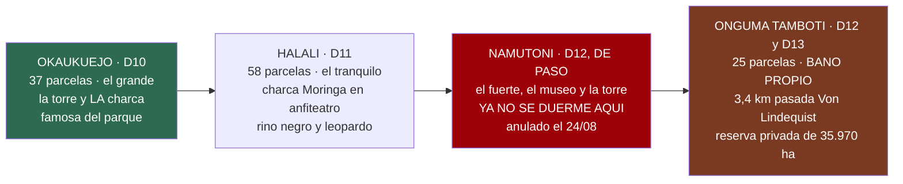

# 21 · Dónde se duerme en Etosha, por dentro

> **Namibia · 30 oct – 15 nov 2026 · la clásica del norte** — [← índice del dossier](README.md)
>
> Las cuatro noches de Etosha contadas como lo que son para este viaje: la parcela, la charca,
> los servicios de cada una — y lo que los viajeros recientes avisan de verdad. Tres son los
> campamentos del parque; la cuarta, desde el 21/08, es **Onguma Tamboti**, ya fuera de la puerta.
>
> **~N$20 = €1** *(rango 19,5–20,5)* · **✅** fuente primaria · **◐** secundaria concordante ·
> **○** práctica común, sin fuente · **❌** sin verificar, dicho en blanco
>
> *Investigado el 14/08/2026 — fichas oficiales de NWR, guías de Etosha y reseñas de viajeros
> 2023–2026; **ampliado el 21/08/2026 con Onguma Tamboti**, del tarifario oficial 2027 leído ese
> día, al reservarse ahí la cuarta noche. Cómo se vive del coche en cualquiera de ellos es el [`18`](18-manual-de-campamento.md);
> las tarifas, el [`03`](03-alojamiento-y-tasas.md); qué se ve en cada charca y a qué hora, el
> [`01`](01-itinerarios-dia-a-dia.md) y la guía de fauna.*

---

## Las cuatro noches, de un vistazo

**Dos dentro y dos fuera** *(cambio del 24/08)* — **Namutoni se anuló** y su noche se fue a una
**segunda de Onguma**. Lo que eso mueve, y no todo es a favor:

- **Se pierde una charca iluminada de las tres, y es la floja**: Okaukuejo el D10 y Moringa el D11
  siguen a un paseo de la parcela; **King Nehale ya no**. *(El campamento se visita igual el D12 —el
  fuerte, el museo, la torre del atardecer— pero de paso.)*
- ⚠️ **Y se pierden las dos actividades de NWR que dependían de dormir dentro**: el **nocturno
  guiado** *(N$750 · ~€38 pp)* y la **guiada de mañana de Namutoni** *(N$650 · ~€33 pp)*. Se venden
  a quien pernocta. **Lo que las sustituye lo vende Onguma** —Sundowner Drive con foco y campo a
  través, N$980 (~€49) pp— y **cuesta más** *(`01` §D13, `02` §9)*.
  ❌ *Si NWR las vende a quien no duerme allí, sin verificar: preguntado en el `20` §4.*
- **Aparece una hora de puerta el D12 Y el D13**: hay que estar fuera de Von Lindequist antes de
  las **19:10** ✅ *(tabla oficial del parque, 10–16 nov)*, dos días seguidos — y el D13 hay que
  volver a entrar por la mañana. Son **+30 km** entre los dos días *(`13` §5)*.
- **Y se gana media hora el D14**: durmiendo fuera no hay que esperar a que la puerta abra.
- 🐆 **La segunda noche de Onguma tiene salida**: si el guepardo no ha aparecido, se cancela y se
  baja al **Cheetah Conservation Fund** *(la decisión del D13, entera en
  [`24`](24-ruta-alternativa.md))*.

**Lo común a los campamentos de NWR** ✅ *(fichas de NWR: [Okaukuejo](https://www.nwr.com.na/resorts/okaukuejo-resort/) ·
[Halali](https://www.nwr.com.na/resorts/halali-resort/) · [Namutoni](https://www.nwr.com.na/resorts/namutoni-resort/))* —
*de los tres, ahora solo se duerme en los dos primeros*:
gasolinera, tienda, restaurante, bar, piscina y **charca iluminada de noche a un paseo de la
parcela**. Parcela de camping con braai y toma de 220 V ◐ *(el cierre camp a camp, en el
[`18`](18-manual-de-campamento.md) §5)*, máximo 8 personas, y bloque de aseos compartido. La
puerta del campamento funciona **del ocaso al amanecer** ◐, y las del parque no admiten entrada
tardía *(los horarios de vuestros días, calculados en el [`01`](01-itinerarios-dia-a-dia.md))*.
La tarifa de camping es la misma en los tres: **N$460 (~€23) por persona y noche** ✅ *(NWR
2026/27 — el desglose, en el [`03`](03-alojamiento-y-tasas.md))*.

---

## Okaukuejo — D10, el grande y su charca

El campamento más antiguo del parque y su centro administrativo: nació como puesto militar en
1901 y abrió como rest camp en octubre de 1957 ◐ *([namibweb](https://www.namibweb.com/okaukuejo.htm) ·
[kruger-2-kalahari](https://www.kruger-2-kalahari.com/okaukuejo.html))*. La **torre de piedra**,
el emblema, se añadió **en 1963 como mirador** sobre las llanuras ◐ *(namibweb; alguna fuente
menor la cuenta como resto de un fuerte de 1901 ○ — las fuentes discrepan y así queda dicho)*.
Está a **17 km (~20 min) de la puerta de Anderson** ◐
*([etoshanationalpark.com.na](https://etoshanationalpark.com.na/accommodation/inside-the-park/okaukuejo-camp/))*
— por la que entráis el D10 desde Outjo.

### La charca

Iluminada del ocaso al amanecer y **abierta las 24 h para quien duerme dentro** ◐; la guía del
parque la llama sin rodeos «the most reliable predator and megafauna viewing spot inside
Etosha», con el **pico de actividad entre las 19:00 y las 22:00 en estación seca** ◐ *(misma
ficha de etoshanationalpark.com.na)* — y vuestra noche del 9 al 10 de noviembre cae justo en
la cola de esa estación seca: en 4 de las 5 últimas temporadas, cuando estéis allí las lluvias
aún no habían empezado *([`14`](14-lluvias-historico.md))*. Las reseñas hablan de **hasta diez
rinocerontes en una misma noche**, elefante, león y algún leopardo ○
*([Expert Africa, reviews](https://www.expertafrica.com/namibia/etosha-national-park/okaukuejo-camp/reviews/1))*.
El protocolo de la plataforma —silencio y todo apagado— ya está en el [`18`](18-manual-de-campamento.md) §8.

### El camping y sus pegas

**37 parcelas** ✅ *(NWR)* — **RESERVADA una noche, N$920 (~€46) los dos** ✅ *(21/08)* —, con toma
de 220 V, grifo y braai ◐. Las pegas repetidas entre
viajeros ○ *([Tripadvisor](https://www.tripadvisor.com/Hotel_Review-g424916-d2441506-Reviews-Okaukuejo_Camp-Etosha_National_Park_Oshikoto_Region.html))*:
es el campamento **grande, turístico y ruidoso** de los tres — los grupos overlander acampan
pegados a los aseos y se nota —, y el estado de los baños oscila según la reseña entre «nuevos y
limpios» y «los más básicos del parque». **El chacal ronda de noche buscando comida** ○ — nada
comestible a la vista *(el protocolo, en el [`18`](18-manual-de-campamento.md) §7)*. Con dos
noches aquí, la parcela lejos del bloque de aseos compra silencio ○.

### Los servicios

Gasolinera, tienda, restaurante, bar y piscina ✅ *(NWR)*. El restaurante sirve desayuno, comida
de kiosko y cena — horario de verano orientativo: desayuno 6:00–10:00, comida 12:00–14:00, cena
19:00–22:00 ◐ *(Expert Africa)* — con fama de bufé irregular: llegar pronto ○. Hay oficina de
correos ◐; **wifi y cajero, sin dato** ❌.

---

## Halali — D11, el tranquilo del medio

A mitad de camino entre Okaukuejo y Namutoni, al pie del kopje **Tsumasa** —con un sendero corto
señalizado, solo de día ◐—, y **el más tranquilo de los tres**: «much quieter than Okaukuejo» es
la frase más repetida entre campistas ○
*([Tripadvisor](https://www.tripadvisor.com/Hotel_Review-g424916-d556474-Reviews-Halali_Resort-Etosha_National_Park_Oshikoto_Region.html))*.

### La charca Moringa

A un paseo corto del camping (~5 min ○), con **plataforma elevada sobre un anfiteatro de roca**
e iluminación nocturna ✅ *(NWR)*. Es la charca con fama de **rinoceronte negro y leopardo** de
noche: hay reseñas con diez rinocerontes en una sola espera — tres hembras con cría —, leopardo
y puercoespín ○ *([Expert Africa, reviews](https://www.expertafrica.com/namibia/etosha-national-park/halali-camp/reviews/1))*.
⚠️ Aviso práctico repetido ○: **el graderío es de roca irregular y de noche es traicionero** —
frontal en modo rojo para el camino y calzado cerrado, exactamente el kit de charca del
[`17`](17-lista-de-equipaje.md).

### El camping y el ladrón de la casa

**58 parcelas con braai, electricidad y agua, y 7 bloques de aseos — 2 de ellos con lavandería y
cocinita** ✅ *(NWR)*: el mejor equipado de los tres sobre el papel, y con más sombra de árbol
que Okaukuejo ◐. Horario de silencio 22:00–06:00, sin generadores ◐. Y aquí el ladrón nocturno
no es solo el chacal: **el tejón mielero abre neveras y cubos en segundos** ○ — está avisado por
más de un viajero *([senseearth](https://senseearth.co.uk/blog/the-honey-badger-and-my-steak/) ·
[roxannereid](https://www.roxannereid.co.za/blog/man-vs-ratel-at-etosha-national-park-namibia))*:
en Halali, la comida al coche **siempre**, no «un momento en la mesa».

### Los servicios

Gasolinera ✅, tienda mixta de comestibles y recuerdos ✅ *(NWR: «combination of groceries and
curios»; una fuente añade leña ◐)*, restaurante y bar ◐, y **piscina con toldos de sombra** ✅ —
la siesta del D11 está resuelta. Cobertura móvil irregular ○; wifi ❌.

**Precio**: **N$460 (~€23) por persona → N$920 (~€46) los dos** ✅ *(NWR 2026/27)* — **RESERVADO el
21/08**.

---

## Namutoni — D12, de paso: el fuerte, el museo y la torre *(ya no se duerme)*

El campamento con más carácter: se acampa **junto a un fuerte alemán encalado**. El primer
fuerte es de 1899 —puesto de control veterinario y militar—, fue **arrasado el 28 de enero de
1904 por unos 500 guerreros ovambo** en la batalla de Namutoni, se reconstruyó en 1905–06 con
sus cuatro torres, es **Monumento Nacional desde 1947** y abrió como rest camp en 1958 ◐
*([Wikipedia — Battle of Namutoni](https://en.wikipedia.org/wiki/Battle_of_Namutoni) ·
[Britannica](https://www.britannica.com/topic/Namutoni) ·
[namibian.org](https://namibian.org/blog/namutoni-from-cattle-post-to-battle-ground-and-tourist-attraction);
la web de NWR dice «built 1897» — la discrepancia queda anotada)*. Dentro hay un pequeño museo ✅
*(NWR)*, y **el atardecer se mira desde la torre** ◐ — la historia de la batalla, contada con su
contexto, está en el [`19`](19-cultura-de-namibia.md). Es el campamento más cercano a su puerta:
~8 km de Von Lindequist ◐ *(una sola fuente leída — por eso el ◐)*, la que cruzáis **el D12 por la
tarde** para ir a dormir a Onguma, y otra vez **el D13** en los dos sentidos.

> ⚠️ **Aquí se dormía hasta el 24/08, y ya no.** La parcela se cambió por una **segunda noche en
> Onguma**, así que este campamento pasa a ser **parada de tarde del D12**: el fuerte, el museo, la
> torre del atardecer y **Chudop a un paso**, que es lo que de verdad compensa aquí. **Contad el
> reloj hacia atrás desde las 19:10**, que es cuando cierra Von Lindequist.
>
> 🌙 **Y lo que se fue con la parcela es el nocturno guiado** *(N$750 · ~€38 pp)*: se compra
> durmiendo en el campamento. Era la única forma legal de circular por Etosha a oscuras. **Lo que
> queda es el Sundowner Drive de Onguma** —foco y campo a través, fuera del parque— *(`01` §D13)*.
> ❌ *Que NWR lo venda a quien no pernocta, sin verificar: está preguntado en el `20` §4.*

### La charca King Nehale

Al pie de las murallas, iluminada y con bancos ✅ *(NWR: «the romantic fort overlooks the
flood-lit King Nehale Waterhole»)*. La pega honesta de los viajeros ○: **desde los bancos solo
se ve parte de la lámina de agua** — el resto, a través de la valla. De noche atrae elefante y
kudú, y rinoceronte más bien a partir del invierno ◐; la mejor franja, 19:00–21:00 ◐
*([etoshanationalpark.com.na](https://etoshanationalpark.com.na/accommodation/inside-the-park/namutoni-camp/))*.
**Fischer's Pan está a 7 km** y se inunda con las lluvias de noviembre a abril ◐ — con vuestras
fechas lo probable es encontrarlo aún seco *([`14`](14-lluvias-historico.md))*: el bucle del D13
ya cuenta con ello *([`01`](01-itinerarios-dia-a-dia.md))*.

### El camping y su fama dividida

**25 parcelas** ✅ *(NWR)* — **RESERVADA una noche, N$920 (~€46) los dos** ✅ *(21/08; la segunda
que había aquí se cambió por Onguma)* — el pequeño y, para muchos, el más acogedor: parcelas de sabana con
sombra **y hierba** en vez del polvo habitual ◐/○ *([Wanderlog](https://app.wanderlog.com/place/details/771043/namutoni-camp-camping-area) ·
Tripadvisor)*. Electricidad, aseos y braai ◐. Es también **la ficha más dividida de los tres** ○:
conviven un «very dilapidated» con un «best camp in Etosha» de febrero de 2025 — el patrón que
queda al leerlas juntas: **el camping bien; los edificios y el restaurante, cansados**. Personal
descrito como seco en varias reseñas ○ — se llega con eso sabido y no estropea nada.

### Los servicios

Gasolinera, tienda, restaurante, bar y piscina ✅ *(NWR)*. El restaurante es el más criticado de
los tres ○ *(elección corta, comida fría en reseñas recientes)* — pero **ya no hay cena aquí**: el
D12 se sigue camino de Onguma. Lo que sí conviene es **hacer la compra del braai en la tienda de
Halali antes de salir** ○, porque el kiosco de Onguma es kiosco *(`08`)*.

---

## Onguma Tamboti — D12 y D13, fuera de la puerta y en reserva privada

**3,4 km pasada la puerta de Von Lindequist** ✅ *(enrutado propio sobre OSM)*, dentro de la
**Onguma Nature Reserve: 35.970 ha** ✅ pegadas al este de Etosha. No es un campamento de parque:
es el camping de una reserva privada, y eso cambia lo que se puede hacer al caer el sol.

### La parcela

**25 parcelas**, máximo **2 tiendas / 4 personas** por parcela ✅ *(tarifa oficial 2027)*. **Cada
una con su ducha, su wc y su enchufe** —lo que ningún campamento de NWR da—, **servicio de
limpieza diario**, **un lote de leña el día de llegada** y **wifi gratis en recepción** ✅. El
recinto está **vallado** ✅, pero es una reserva con fauna libre alrededor: **de noche no se pasea
fuera** ○.

Hay **kiosco** con lo básico, **hielo, leña y braai packs** ✅, y **restaurante à la carte**: su
propia tarifa avisa de que **la cena se reserva al llegar a recepción** ✅.

*La otra parcela de la reserva, **Leadwood**, cuesta exactamente lo mismo, tiene solo 6 parcelas y
usa las instalaciones de Onguma Bush Camp —bar techado, piscina, salón y comedor sobre una charca
grande— ✅. No es la reservada; se anota por si hubiera que cambiar.*

### Lo que compran las DOS últimas noches aquí

De su propia tarifa, literal: *«Four of the Big Five (lion, leopard, rhino and elephant) roam
free»* ✅; el guepardo lo añade su web ✅. **Es la única de la zona con leopardo Y guepardo
confirmados por escrito en fuente propia** *(la comparativa completa con Ongava, Okonjima y Etosha
Heights está en `aparte/reservas-privadas-vs-etosha.md`)*. Y sobre todo, **actividades que Etosha
no permite en ninguna circunstancia**, con precio oficial 2027 ✅ y añadibles a una reserva de
camping:

- **Sundowner Drive · 3 h · N$980 (~€49) pp** — sale al atardecer y **vuelve ya de noche**, con
  foco y campo a través
- **Sunrise Drive · 3 h · N$980 (~€49) pp**
- **Onkolo Hide, media mañana · 3 h · N$720 (~€36) pp** *(mín. 2, máx. 7 personas, 7+ años, se
  reserva con antelación)* — un hide a pie de charca
- **Paseo interpretativo · 1½ h · N$980 (~€49) pp** *(mínimo 16 años)* — **a pie**
- **Game drive guiado dentro de Etosha · 4 h · N$1.930 (~€97) pp** — caro frente a los N$650 de
  NWR, pero desde el 24/08 **es lo que hay**: al no dormir en Namutoni, la guiada de mañana de NWR
  ya no se puede comprar. Es el sustituto directo, y cuesta **casi el triple**
- Young Explorers Walk N$460 (~€23) · game drive privado N$10.680 (~€534)/vehículo · desayuno
  suelto N$320 (~€16)

> ⚖️ **El choque de horarios, dicho antes de que pase**: el sundowner sale al atardecer, así que
> **hacerlo obliga a salir del parque hacia las 17:00** y renunciar a la mejor hora de charcas del
> último día. Son **dos planes buenos y excluyentes**: decidid al reservar.
> ✅ **Pero con dos noches hay margen que antes no había**: el sundowner cabe **el D12**, que se
> llega desde Halali con la tarde ya gastada en el traslado, y así **el D13 queda entero para las
> charcas del este**. Es la ventaja discreta de la segunda noche.

> ⚠️ **El hueco honesto, y ahora pesa más: «night drive» NO figura en el tarifario oficial 2027**
> ❌ — y **el nocturno de NWR ya no está disponible**, así que esto es lo único que queda para ver
> fauna a oscuras. El que sale de noche es el **sundowner**. Dos agregadores independientes sí citan night drives en Onguma ◐
> *([safaribookings](https://www.safaribookings.com/onguma) ·
> [discoverafrica](https://www.discoverafrica.com/safaris/namibia/onguma-private-game-reserve/))*,
> pero **sin precio ni horario**. Se pregunta al reservar.

### El precio

**Rack oficial 2027, vigente del 1 de noviembre de 2026 al 31 de octubre de 2027** ✅ —el año
fiscal de Onguma va de noviembre a octubre, igual que el de NWR, así que vuestras noches caen justo
al principio de la ventana—: **N$540 (~€27) netos por adulto** + **tasa de conservación N$80 (~€4)
por persona y noche** = **N$620 (~€31) por persona**, IVA y Social Development Levy incluidos →
**N$1.240 (~€62) los dos y por noche → N$2.480 (~€124) las dos noches**. Son **N$320 (~€16) más
por noche que la parcela de Namutoni** que sustituye.

❌ **El importe exacto de la reserva y sus condiciones de cancelación, sin confirmar** — y
**decidido el 24/08 no perseguirlos**: la segunda noche se cambia por el Cheetah Conservation Fund
**sobre el terreno**, asumiendo la penalización que sea *([`24`](24-ruta-alternativa.md), `20` §4)*.

---

## ⚠️ La gasolina de los tres del parque, con letra grande

NWR mantiene que los tres surtidores funcionan «el 95 % del tiempo» ◐
*([nwrnamibia](https://www.nwrnamibia.com/etosha-food-eating-fuel.htm))*, pero hay **reportes de
2025–2026 de cortes prolongados de combustible en Okaukuejo, Halali y Namutoni** ◐
*([travelandtourworld, 2026](https://www.travelandtourworld.com/news/article/etosha-sossusvlei-namibia-highlights-fuel-challenges-reshaping-self-drive-safari-travel-in-2026/) ·
[Tripadvisor](https://www.tripadvisor.com/ShowTopic-g293820-i9680-k15422426-Fuel_planning_Etosha-Namibia.html))*
— la versión con fecha del «poco fiables» que ya decía el [`07`](07-logistica.md). El respaldo
estable está **fuera de la puerta de Anderson: Etosha Trading Post, a 6,5 km, con diésel 50 ppm
y gasolina 95** ◐ *([web](https://www.etosha-tradingpost.com/facilities.html))*. La regla que
sale de esto, y que el [`07`](07-logistica.md) ya aplica en general:

- **Entrar al parque el D10 con el depósito lleno de Outjo** ○ — los surtidores de dentro pasan a
  ser un bonus, no el plan
- **No fiar los 539 km del D14 a los surtidores del parque** ○: si en Halali o Namutoni hay
  diésel, se rellena al pasar; si no, el D14 arranca con lo que haya y reposta en **Tsumeb, a
  105 km de Onguma** ✅ *(enrutado propio)*. ⚠️ **Y desde el 24/08 hay que mirarlo dos veces**: se
  sale del parque **la tarde del D12** y se vuelve a entrar y salir **el D13**, así que **las dos
  últimas noches se pasan fuera, donde no hay surtidor** — **Onguma no tiene** ❌. El último de
  dentro es el de Namutoni, al pasar el D12.

---

## 🕳️ Lo que esta ficha no pudo cerrar

**El importe exacto de la reserva de Onguma** ❌ *(el rack da N$1.240 · ~€62; el dato recibido,
€132, era el de dos noches)* · **si Onguma hace night drive de verdad y a qué precio** ❌ *(su
tarifa 2027 solo lista el sundowner)* · **La distancia exacta parcela → charca en Okaukuejo** ❌
*(nadie la publica; «un paseo» en todas las reseñas)* · **wifi y cajeros en los tres del parque**
❌ *(NWR no lo publica; solo «cobertura irregular» en Halali ○ — Onguma sí anuncia wifi en
recepción ✅)* · **cuántos bloques de aseos tienen Okaukuejo y Namutoni** ❌ *(solo Halali lo
publica; en Onguma no hace falta: el baño va en la parcela)* · **horarios de tienda y gasolinera**
❌ — todo esto se pregunta en la recepción de cada uno al llegar, y ninguno cambia una reserva.

---

*Precios en N$ y € · ~N$20 = €1 · Investigado el 14/08/2026 y ampliado el 21/08/2026: fichas de
NWR leídas el primer día y rack oficial 2027 de Onguma el segundo; las reseñas citadas son de
2023–2026 y van marcadas ○ — son experiencia, no dato.*
