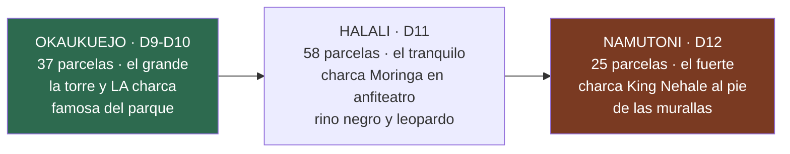

# 21 · Los tres campamentos de Etosha, por dentro

> **Namibia · 30 oct – 15 nov 2026 · la clásica del norte** — [← índice del dossier](README.md)
>
> Okaukuejo, Halali y Namutoni contados como lo que son para este viaje: la parcela, la charca,
> los servicios de cada uno — y lo que los viajeros recientes avisan de verdad.
>
> **~N$20 = €1** *(rango 19,5–20,5)* · **✅** fuente primaria · **◐** secundaria concordante ·
> **○** práctica común, sin fuente · **❌** sin verificar, dicho en blanco
>
> *Investigado el 14/08/2026 — fichas oficiales de NWR, guías de Etosha y reseñas de viajeros
> 2023–2026. Cómo se vive del coche en cualquiera de ellos es el [`18`](18-manual-de-campamento.md);
> las tarifas, el [`03`](03-alojamiento-y-tasas.md); qué se ve en cada charca y a qué hora, el
> [`01`](01-itinerarios-dia-a-dia.md) y la guía de fauna.*

---

## Los tres, de un vistazo

**Lo común a los tres** ✅ *(fichas de NWR: [Okaukuejo](https://www.nwr.com.na/resorts/okaukuejo-resort/) ·
[Halali](https://www.nwr.com.na/resorts/halali-resort/) · [Namutoni](https://www.nwr.com.na/resorts/namutoni-resort/))*:
gasolinera, tienda, restaurante, bar, piscina y **charca iluminada de noche a un paseo de la
parcela**. Parcela de camping con braai y toma de 220 V ◐ *(el cierre camp a camp, en el
[`18`](18-manual-de-campamento.md) §5)*, máximo 8 personas, y bloque de aseos compartido. La
puerta del campamento funciona **del ocaso al amanecer** ◐, y las del parque no admiten entrada
tardía *(los horarios de vuestros días, calculados en el [`01`](01-itinerarios-dia-a-dia.md))*.
La tarifa de camping es la misma en los tres: **N$460 (~€23) por persona y noche** ✅ *(NWR
2026/27 — el desglose, en el [`03`](03-alojamiento-y-tasas.md))*.

---

## Okaukuejo — D9 y D10, el grande y su charca

El campamento más antiguo del parque y su centro administrativo: nació como puesto militar en
1901 y abrió como rest camp en octubre de 1957 ◐ *([namibweb](https://www.namibweb.com/okaukuejo.htm) ·
[kruger-2-kalahari](https://www.kruger-2-kalahari.com/okaukuejo.html))*. La **torre de piedra**,
el emblema, se añadió **en 1963 como mirador** sobre las llanuras ◐ *(namibweb; alguna fuente
menor la cuenta como resto de un fuerte de 1901 ○ — las fuentes discrepan y así queda dicho)*.
Está a **17 km (~20 min) de la puerta de Anderson** ◐
*([etoshanationalpark.com.na](https://etoshanationalpark.com.na/accommodation/inside-the-park/okaukuejo-camp/))*
— por la que entráis el D9 desde Outjo.

### La charca

Iluminada del ocaso al amanecer y **abierta las 24 h para quien duerme dentro** ◐; la guía del
parque la llama sin rodeos «the most reliable predator and megafauna viewing spot inside
Etosha», con el **pico de actividad entre las 19:00 y las 22:00 en estación seca** ◐ *(misma
ficha de etoshanationalpark.com.na)* — y vuestras noches del 8 al 10 de noviembre caen justo en
la cola de esa estación seca: en 4 de las 5 últimas temporadas, cuando estéis allí las lluvias
aún no habían empezado *([`14`](14-lluvias-historico.md))*. Las reseñas hablan de **hasta diez
rinocerontes en una misma noche**, elefante, león y algún leopardo ○
*([Expert Africa, reviews](https://www.expertafrica.com/namibia/etosha-national-park/okaukuejo-camp/reviews/1))*.
El protocolo de la plataforma —silencio y todo apagado— ya está en el [`18`](18-manual-de-campamento.md) §8.

### El camping y sus pegas

**37 parcelas** ✅ *(NWR)*, con toma de 220 V, grifo y braai ◐. Las pegas repetidas entre
viajeros ○ *([Tripadvisor](https://www.tripadvisor.com/Hotel_Review-g424916-d2441506-Reviews-Okaukuejo_Camp-Etosha_National_Park_Oshikoto_Region.html))*:
es el campamento **grande, turístico y ruidoso** de los tres — los grupos overlander acampan
pegados a los aseos y se nota —, y el estado de los baños oscila según la reseña entre «nuevos y
limpios» y «los más básicos del parque». **El chacal ronda de noche buscando comida** ○ — nada
comestible a la vista *(el protocolo, en el [`18`](18-manual-de-campamento.md) §7)*. Con dos
noches aquí, la parcela lejos del bloque de aseos compra silencio ○.

### Los servicios

Gasolinera, tienda, restaurante, bar y piscina ✅ *(NWR)*. El restaurante sirve desayuno, comida
de kiosko y cena — horario de verano orientativo: desayuno 6:00–10:00, comida 12:00–14:00, cena
19:00–22:00 ◐ *(Expert Africa)* — con fama de bufé irregular: llegar pronto ○. Hay oficina de
correos ◐; **wifi y cajero, sin dato** ❌.

---

## Halali — D11, el tranquilo del medio

A mitad de camino entre Okaukuejo y Namutoni, al pie del kopje **Tsumasa** —con un sendero corto
señalizado, solo de día ◐—, y **el más tranquilo de los tres**: «much quieter than Okaukuejo» es
la frase más repetida entre campistas ○
*([Tripadvisor](https://www.tripadvisor.com/Hotel_Review-g424916-d556474-Reviews-Halali_Resort-Etosha_National_Park_Oshikoto_Region.html))*.

### La charca Moringa

A un paseo corto del camping (~5 min ○), con **plataforma elevada sobre un anfiteatro de roca**
e iluminación nocturna ✅ *(NWR)*. Es la charca con fama de **rinoceronte negro y leopardo** de
noche: hay reseñas con diez rinocerontes en una sola espera — tres hembras con cría —, leopardo
y puercoespín ○ *([Expert Africa, reviews](https://www.expertafrica.com/namibia/etosha-national-park/halali-camp/reviews/1))*.
⚠️ Aviso práctico repetido ○: **el graderío es de roca irregular y de noche es traicionero** —
frontal en modo rojo para el camino y calzado cerrado, exactamente el kit de charca del
[`17`](17-lista-de-equipaje.md).

### El camping y el ladrón de la casa

**58 parcelas con braai, electricidad y agua, y 7 bloques de aseos — 2 de ellos con lavandería y
cocinita** ✅ *(NWR)*: el mejor equipado de los tres sobre el papel, y con más sombra de árbol
que Okaukuejo ◐. Horario de silencio 22:00–06:00, sin generadores ◐. Y aquí el ladrón nocturno
no es solo el chacal: **el tejón mielero abre neveras y cubos en segundos** ○ — está avisado por
más de un viajero *([senseearth](https://senseearth.co.uk/blog/the-honey-badger-and-my-steak/) ·
[roxannereid](https://www.roxannereid.co.za/blog/man-vs-ratel-at-etosha-national-park-namibia))*:
en Halali, la comida al coche **siempre**, no «un momento en la mesa».

### Los servicios

Gasolinera ✅, tienda mixta de comestibles y recuerdos ✅ *(NWR: «combination of groceries and
curios»; una fuente añade leña ◐)*, restaurante y bar ◐, y **piscina con toldos de sombra** ✅ —
la siesta del D11 está resuelta. Cobertura móvil irregular ○; wifi ❌.

---

## Namutoni — D12, dormir junto a un fuerte

El campamento con más carácter: se acampa **junto a un fuerte alemán encalado**. El primer
fuerte es de 1899 —puesto de control veterinario y militar—, fue **arrasado el 28 de enero de
1904 por unos 500 guerreros ovambo** en la batalla de Namutoni, se reconstruyó en 1905–06 con
sus cuatro torres, es **Monumento Nacional desde 1947** y abrió como rest camp en 1958 ◐
*([Wikipedia — Battle of Namutoni](https://en.wikipedia.org/wiki/Battle_of_Namutoni) ·
[Britannica](https://www.britannica.com/topic/Namutoni) ·
[namibian.org](https://namibian.org/blog/namutoni-from-cattle-post-to-battle-ground-and-tourist-attraction);
la web de NWR dice «built 1897» — la discrepancia queda anotada)*. Dentro hay un pequeño museo ✅
*(NWR)*, y **el atardecer se mira desde la torre** ◐ — la historia de la batalla, contada con su
contexto, está en el [`19`](19-cultura-de-namibia.md). Es el campamento más cercano a su puerta:
~8 km de Von Lindequist ◐ *(una sola fuente leída — por eso el ◐)*, la de salida del D13.

### La charca King Nehale

Al pie de las murallas, iluminada y con bancos ✅ *(NWR: «the romantic fort overlooks the
flood-lit King Nehale Waterhole»)*. La pega honesta de los viajeros ○: **desde los bancos solo
se ve parte de la lámina de agua** — el resto, a través de la valla. De noche atrae elefante y
kudú, y rinoceronte más bien a partir del invierno ◐; la mejor franja, 19:00–21:00 ◐
*([etoshanationalpark.com.na](https://etoshanationalpark.com.na/accommodation/inside-the-park/namutoni-camp/))*.
**Fischer's Pan está a 7 km** y se inunda con las lluvias de noviembre a abril ◐ — con vuestras
fechas lo probable es encontrarlo aún seco *([`14`](14-lluvias-historico.md))*: el bucle del D12
ya cuenta con ello *([`01`](01-itinerarios-dia-a-dia.md))*.

### El camping y su fama dividida

**25 parcelas** ✅ *(NWR)* — el pequeño y, para muchos, el más acogedor: parcelas de sabana con
sombra **y hierba** en vez del polvo habitual ◐/○ *([Wanderlog](https://app.wanderlog.com/place/details/771043/namutoni-camp-camping-area) ·
Tripadvisor)*. Electricidad, aseos y braai ◐. Es también **la ficha más dividida de los tres** ○:
conviven un «very dilapidated» con un «best camp in Etosha» de febrero de 2025 — el patrón que
queda al leerlas juntas: **el camping bien; los edificios y el restaurante, cansados**. Personal
descrito como seco en varias reseñas ○ — se llega con eso sabido y no estropea nada.

### Los servicios

Gasolinera, tienda, restaurante, bar y piscina ✅ *(NWR)*. El restaurante es el más criticado de
los tres ○ *(elección corta, comida fría en reseñas recientes)* — la cena del D12 es mejor plan
al braai, con la compra hecha en la tienda o traída de Halali ○.

---

## ⚠️ La gasolina de los tres, con letra grande

NWR mantiene que los tres surtidores funcionan «el 95 % del tiempo» ◐
*([nwrnamibia](https://www.nwrnamibia.com/etosha-food-eating-fuel.htm))*, pero hay **reportes de
2025–2026 de cortes prolongados de combustible en Okaukuejo, Halali y Namutoni** ◐
*([travelandtourworld, 2026](https://www.travelandtourworld.com/news/article/etosha-sossusvlei-namibia-highlights-fuel-challenges-reshaping-self-drive-safari-travel-in-2026/) ·
[Tripadvisor](https://www.tripadvisor.com/ShowTopic-g293820-i9680-k15422426-Fuel_planning_Etosha-Namibia.html))*
— la versión con fecha del «poco fiables» que ya decía el [`07`](07-logistica.md). El respaldo
estable está **fuera de la puerta de Anderson: Etosha Trading Post, a 6,5 km, con diésel 50 ppm
y gasolina 95** ◐ *([web](https://www.etosha-tradingpost.com/facilities.html))*. La regla que
sale de esto, y que el [`07`](07-logistica.md) ya aplica en general:

- **Entrar al parque el D9 con el depósito lleno de Outjo** ○ — los surtidores de dentro pasan a
  ser un bonus, no el plan
- **No fiar los 550 km del D13 al surtidor de Namutoni** ○: si en Halali o Namutoni hay diésel,
  se rellena al pasar; si no, el D13 arranca con lo que haya y reposta en **Tsumeb (~110 km)** ◐

---

## 🕳️ Lo que esta ficha no pudo cerrar

**La distancia exacta parcela → charca en Okaukuejo** ❌ *(nadie la publica; «un paseo» en todas
las reseñas)* · **wifi y cajeros en los tres** ❌ *(NWR no lo publica; solo «cobertura irregular»
en Halali ○)* · **cuántos bloques de aseos tienen Okaukuejo y Namutoni** ❌ *(solo Halali lo
publica)* · **horarios de tienda y gasolinera** ❌ — todo esto se pregunta en la recepción de
cada uno al llegar, y ninguno cambia una reserva.

---

*Precios en N$ y € · ~N$20 = €1 · Investigado el 14/08/2026: fichas NWR leídas ese día; las
reseñas citadas son de 2023–2026 y van marcadas ○ — son experiencia, no dato.*
