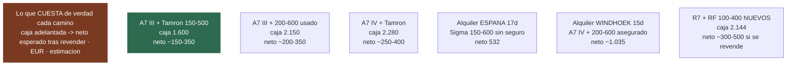

# 22 · La cámara de segunda mano — comprar, viajar, revender

> **Namibia · 30 oct – 15 nov 2026 · la clásica del norte** — [← índice del dossier](README.md)
>
> La pregunta del viajero: **¿compensa comprar de segunda mano —una A7 con un tele, u otra
> opción— y revenderla a los pocos meses de volver?** Aquí está la cuenta: precios reales de
> anuncios y tiendas vistos el 09/08/2026, lo que de verdad se recupera al revender, y contra qué
> compite *(las opciones de compra nueva y de alquiler viven en [`19`](19-fotografia.md))*.
>
> **~N$20 = €1** *(rango 19,5–20,5)* · **✅** fuente primaria · **◐** secundaria concordante ·
> **○** práctica común, sin fuente · **❌** sin verificar, dicho en blanco
>
> *Este documento es deliberación de compra: se queda en el repositorio y **no entra en el PDF**,
> como el `16`. Los precios de segunda mano son anuncios puntuales, no tarifas: caducan en días.*

---

## 📏 La regla del juego: lo que cuesta no es el precio, es el neto

- **Coste neto = lo que pagas − lo que recuperas al revender.** Un kit de €1.600 que se revende
  por €1.400 ha costado €200 — menos que alquilar. Esa es la cuenta entera de este documento.
- **La segunda mano madura casi no se deprecia en 4 meses** ○: una A7 III (2018) o un tele ya
  amortizado valen en enero más o menos lo que valían en agosto — quien compra a precio de mercado
  y revende a precio de mercado solo paga la fricción. Lo que SÍ se deprecia es lo recién
  estrenado comprado nuevo *(el IVA y el estreno los pierdes tú)*.
- ⚠️ **La reventa sensata es entre particulares, no a una tienda.** Al recomprar, MPB paga de
  media **~55 % (rango 44–62 %) de lo que ella misma pide** por el mismo equipo ◐
  *([hilo de DPReview con casos medidos](https://www.dpreview.com/forums/threads/keh-mpb-etc-in-usa-to-sell-not-buy-price-offered-vs-what-you-could-sell-it-for.4730744/))*.
  Comprar en tienda de segunda mano (con garantía) y **revender en Wallapop/Milanuncios** es la
  combinación que deja el neto pequeño; vender a la tienda lo duplica o triplica.

---

## 💶 Los precios vistos *(09/08/2026 — anuncios y tiendas, ◐ salvo marca)*

**Cuerpos:**

- **Sony A7 III** *(full frame 24 Mpx, 2018 — la veterana líquida)* — anuncios en España desde
  **~€750** *(cuerpo con 10.000 disparos,
  [Milanuncios](https://www.milanuncios.com/fotografia/camara-de-fotos-sony-a7-iii.htm) ·
  [Wallapop](https://es.wallapop.com/tv-audio-foto/camara-de-fotos-sony-a7-iii))* y **$779–1.139**
  en [MPB](https://www.mpb.com/en-us/product/sony-alpha-a7-iii) *(≈ €710–1.040, con garantía de
  tienda)*. Banda de trabajo: **~€750–950**.
- **Sony A7 IV** *(33 Mpx, 2021)* — mercado verificado **~€1.400–1.600**
  *([MPB](https://www.mpb.com/en-us/product/sony-alpha-a7-iv), $1.499–1.739)*; en España hay
  anuncios en ~€1.300 con letra pequeña *(uno, con fallo de obturador — el aviso de abajo)* y
  cuerpos con ~3.400 disparos a precio firme
  *([Milanuncios](https://www.milanuncios.com/camaras-digitales/sony-a7iv.htm) ·
  [Casanova Foto 2ª mano](https://www.casanovafoto.com/sony-alpha-a7-iv-2a-mano))*. Nueva:
  **desde ~€1.520** ◐ *([idealo](https://www.idealo.es/precios/201645208/sony-alpha-7-iv.html))*.
- **Canon R7** *(APS-C — el cuerpo del kit del `19`)* — segunda mano **~€899–1.210** en
  [Camaralia](https://www.camaralia.com/es/13466-canon-eos-r7-segunda-mano.html) *(con
  garantía)*; **nueva anda desde ~€990** ◐
  *([idealo](https://www.idealo.es/precios/201966088/canon-eos-r7.html))* — **la usada apenas
  ahorra**: aquí la segunda mano no es la jugada.
- **Sony RX10 IV** *(bridge, 2017)* — anuncios a **~€1.400–1.600** ◐
  *([Milanuncios](https://www.milanuncios.com/camaras-digitales/sony-rx10-rx-10.htm))*: una cámara
  de 2017 que no suelta el precio. **Descartada también de segunda mano.**

**Teleobjetivos montura E:**

- **Tamron 150-500 f/5-6.7** — anuncio visto: **€800** *(Málaga,
  [Wallapop](https://es.wallapop.com/tv-audio-foto/objetivo-tamron/malaga))*. ⚠️ **La trampa
  buena: NUEVO ha bajado a ~€825–975** ◐ *([idealo](https://www.idealo.es/precios/201231794/tamron-150-500mm-f5-6-7-di-iii-vc-vx-sony-e.html)
  · [MCZ](https://www.mczdirect.com/es/objetivos-tamron/-tamron-150-500mm-f-5-6-7-di-iii-vxd-sony-e--9690.html),
  de €1.499 de salida en 2021)* — a estos precios, **casi mejor nuevo con garantía**: la reventa
  vale lo mismo.
- **Sigma 100-400 DG DN** — anuncios **€700–850**
  *([Wallapop Valladolid](https://es.wallapop.com/item/sigma-100-400mm-dg-dn-os-sony-fe-1199201737)
  · [Sevilla](https://www.wallapop.com/item/sigma-100-400-dg-dn-sony---soporte-original-1041156331))*;
  nuevo **~€826–926** *([Casanova](https://www.casanovafoto.com/sigma-100-400-5-6-3-dg-dn-os-contemporary-p-sony-e)
  · [Fotocasión](https://www.fotocasion.es/catalogo/objetivo-sigma-af-100-4005-63-sony-e-dg-dn-os-contempory/51750/))*.
  Mismo caso que el Tamron — y en full frame **400 mm se queda corto para la charca** *(el recorte
  APS-C de la A7 III da 600 mm eq… a 10 Mpx ○)*.
- **Sony FE 200-600 G** *(el tele de safari por antonomasia)* — segunda mano **€1.300–1.450**
  *([Wallapop Alcalá](https://es.wallapop.com/item/objetivo-sony-fe-200-600mm-g-oss-1149438601) ·
  [PhotoTools](https://phototoolsweb.com/opticas-usadas-y-ex-demo/5173-sony-fe-200-60056-63-oss-g.html))*;
  nuevo **€1.995** ✅ *([Fotocasión](https://www.fotocasion.es/catalogo/objetivo-sony-af-fe-200-60056-63-oss-g/50103/))*.
  Aquí la segunda mano **sí ahorra ~€550–700**, y es de los objetivos **más buscados del
  mercado**: la reventa es rápida ○.

---

## 🧮 La cuenta, kit a kit

Neto estimado ○ = compra − reventa esperada entre particulares a los ~2–4 meses de volver
*(supuesto: se recupera ~85–92 % de lo pagado si se compró a precio de mercado; es razonamiento
sobre los precios de arriba, no un dato — por eso va en ○)*:

- 🏆 **A7 III (~€800) + Tamron 150-500 (~€800–830, casi da igual usado que nuevo)** —
  **~€1.600–1.630 de caja · neto esperado ~€150–350**. 500 mm reales f/6.7, 750 mm eq en modo
  APS-C (10 Mpx), ~2,4 kg el conjunto. **El neto mínimo con equipo serio.**
- **A7 III + Sony 200-600 usado (~€1.350)** — **~€2.150 de caja · neto ~€200–350**. Más caja
  retenida durante el viaje, pero **la mejor óptica de safari y la reventa más fácil**; 2,1 kg
  solo el objetivo — se dispara apoyado en la ventanilla, como manda el `19`.
- **A7 IV (~€1.450) + Tamron** — **~€2.280 de caja · neto ~€250–400**. La única razón: 33 Mpx
  para recortar (14 Mpx en APS-C) — o quedársela después, que es otra decisión.
- **R7 + RF 100-400** — de segunda mano **no mejora casi nada el nuevo** *(R7 usada ~€950 vs
  1.349 en oferta; el RF 100-400 nuevo €795 — `19`)*: si se elige este kit, **nuevo y con
  garantía**, y al revender se asume el estreno (~€300–500 ○).
- **RX10 IV / bridge** — la IV usada pide ~€1.400+ y la P1100 nueva (€936, `19`) tiene un mercado
  de reventa flojo ○: **ninguna de las dos es jugada de compra-reventa**.

---

## ⚠️ Lo que el neto no cuenta — y decide

- **El riesgo es asimétrico.** El neto de ~€200 supone que el equipo vuelve vivo. **Quince días de
  polvo y grava** (`06`, `19`): si el tele muere sin garantía, el «neto» pasa a ser la caja
  entera. Por eso, si segunda mano: **mejor tienda con garantía** *(Camaralia, Casanova, MPB —
  pagando algo más)* que un anuncio sin factura. Y pregunta a IATI **si los 4.000 € de equipaje
  del Estrella cubren una cámara de ~€1.600 y con qué límite por objeto ❌** *(la pregunta, con
  las otras dos, en [`21`](21-reservas.md) §3)*.
- **Al comprar a particular**: número de **disparos del obturador** verificado en persona, factura
  si existe *(sin factura, la garantía legal no viaja contigo ○)*, y probarlo **semanas antes** —
  la compra es de agosto–septiembre, no de la víspera *(el porqué del rodaje, en `19`)*.
- **El calendario de la reventa juega a favor, con un matiz** ○: se vuelve el **15 de noviembre**,
  justo antes de la ola de regalos — demanda alta —, pero el **Black Friday (finales de
  noviembre) abarata el equipo nuevo** y arrastra los anuncios. O se vende **rápido esa semana**, o
  se deja pasar la resaca y se vende en diciembre–enero. Semanas de anuncios, mensajes y envíos:
  la gestión no es gratis.
- **La liquidez manda sobre la marca**: A7 III, Tamron 150-500 y 200-600 se venden solos ○; una
  bridge de nicho o un cuerpo raro pueden pasarse meses anunciados.

---

## 🧭 El veredicto

- **¿La jugada más barata con equipo serio?** **A7 III + Tamron 150-500** *(~€1.600 de caja, neto
  esperado ~€150–350)* — y el Tamron, **a precio de hoy, casi mejor nuevo**: misma reventa y dos
  años de garantía. Si el presupuesto de caja lo admite, **el 200-600 usado** es más objetivo y
  más reventa.
- **¿El rival a batir?** El **alquiler**: Camaralia (~€532 los 17 días, sin seguro y con fianza) y
  ProHire en Windhoek (~€1.035, kit superior asegurado y sin facturarlo en el avión) — las
  condiciones, en [`19`](19-fotografia.md). **La compra-reventa gana en euros; el alquiler gana en
  riesgo cero y cero gestión.** Ésa es la elección de verdad.
- Y la de siempre *(`19`)*: si ya hay en casa una cámara con 400 mm equivalentes, **gastar cero**
  sigue siendo la mejor cuenta de todas.

---

*Anuncios y precios **vistos el 09/08/2026** en las URL enlazadas — un anuncio es un dato de un
día: reconfirma antes de mover un euro. Nada de esto entra en el presupuesto de
[`02`](02-presupuesto.md).*
