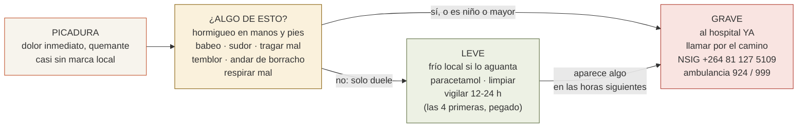

# 22 · Si te pica un escorpión

> **Namibia · 30 oct – 15 nov 2026 · la clásica del norte** — [← índice del dossier](README.md)
>
> El protocolo de la picadura, para leerlo **antes** y tenerlo a mano **después**: qué escorpión
> es, qué va a pasar, qué hacer y qué no, cuándo salir corriendo al hospital y a quién llamar.
> Catorce noches en tienda, trece de ellas en el suelo de un escorpión.
>
> **~N$20 = €1** *(rango 19,5–20,5)* · **✅** fuente primaria · **◐** secundaria concordante ·
> **○** práctica común, sin fuente · **❌** sin verificar, dicho en blanco
>
> *Investigado el 15/08/2026 con la revisión clínica de referencia del sur de África —Müller,
> Modler, Wium y Veale, «Scorpion sting in southern Africa», CME 2012, del fundador del centro
> toxicológico de Tygerberg— y el artículo namibio de 2025 del Namibian Snakebite Interest Group
> en Toxicon. Lo que no está en una fuente médica va con ○ y se dice.*

**Lo primero, en una frase:** casi todas las picaduras duelen muchísimo y **no pasan de ahí**; las
pocas que se complican lo hacen **por dentro y deprisa** —hormigueo, babeo, temblor, andar de
borracho, dificultad para respirar—, y entonces **no se espera a ver: se conduce al hospital y se
llama por el camino**. Y el detalle que engaña: **la picadura apenas deja marca** — poca hinchazón
no quiere decir poco veneno ✅.

---

## 1. Quién es quién — la regla de la cola

- **Cola gruesa y pinzas finas = peligroso.** Es la familia Buthidae y, aquí, el género
  ***Parabuthus***: «los escorpiones con cola gruesa y pinzas finas son más venenosos que los de
  cola fina y pinzas grandes; una regla útil para el clínico» ✅ *(Müller et al. 2012)*.
- **Pinzas gruesas y cola fina = dolor de avispa.** Los excavadores (*Opistophthalmus*) y los
  planos de las rocas (*Hadogenes*): «una picadura como la de una avispa o una abeja» y «gigantes
  amables, la picadura apenas se nota» ◐ *(African Snakebite Institute)*.
- **Los que tocan la ruta** ✅◐: Namibia tiene 17 especies de *Parabuthus* y el envenenamiento
  grave lo causan al menos **P. granulatus, P. villosus, P. kraepelini y P. schlechteri**
  *(Theart, Buys, Lagneau & Berg 2025, Toxicon — el NSIG)*.
  - ***P. villosus***, el **negro grande de la costa y del Namib de grava** — hasta 18 cm, en
    Namibia con las **patas amarillas**, y **el único que también anda de día**, con niebla o
    cielo cubierto ✅ *(Harington 1982: activo de día en las llanuras de grava del Namib, Henties
    Bay «con niebla», Uis, Damaraland; ausente de las dunas)*. Es el de la ficha de la guía de
    fauna. **El antiveneno no le hace efecto** ◐ *(ASI)*: su tratamiento es de soporte.
  - ***P. granulatus***, **el más venenoso del sur de África** ✅ — «tres veces más que
    *P. transvaalicus*» y «la mayoría de las muertes se le atribuyen a él» *(Müller 2012)*;
    excavador, extendido, y «a menudo cerca de donde vive la gente». GBIF lo registra en
    Sesriem/Sossusvlei, Terrace Bay, Hoada/Kamanjab y el sur de Etosha ◐ *(registros, no
    probabilidad)*. Para este **sí** hay antiveneno eficaz ✅.
- **Cifras honestas** ✅: en Sudáfrica, «4–5 picaduras mortales al año» entre *granulatus* y
  *transvaalicus* ◐ *(ASI)*; en la serie de 42 envenenamientos **graves** de Müller (1993),
  4 murieron; en Zimbabue, el 10 % de las picaduras de *P. transvaalicus* fueron graves y la
  letalidad, del 0,3 % *(Bergman 1997)*. **De Namibia no hay cifra publicada** ❌: el propio
  artículo del NSIG dice que la epidemiología «sigue siendo escasa».

## 2. Qué va a pasar — el cuadro, hora a hora ✅

Todo esto es Müller et al. 2012, la revisión clínica del sur de África:

- **Al momento:** dolor «quemante y de intensidad atroz», que dura «de horas a un día, y a veces
  más». La víctima típica va **descalza o en sandalias, después de la puesta de sol, fuera de
  casa** — es decir, en un campamento.
- **La marca engaña:** «la reacción local es leve y a menudo poco llamativa; en algunos casos
  cuesta hasta localizar el sitio de la picadura». **Poca hinchazón no descarta un cuadro grave.**
- **De 15 a 60 minutos:** en la mayoría de los casos ya se ve por dónde va a ir la cosa. Pero en
  adultos los signos sistémicos **pueden retrasarse hasta 8 horas** — de ahí la vigilancia.
- **De 1 a 4 horas, si se complica:** hormigueo en manos y pies, hipersensibilidad de la piel,
  dolores y calambres musculares, **babeo y dificultad para tragar**, temblores y movimientos
  involuntarios, sudor, **andar de borracho**, reflejos exagerados, tensión y temperatura altas.
- **Lo que mata:** el **fallo respiratorio**, «la causa primaria de muerte»; en niños puede llegar
  «en 1–2 horas». Los niños son el grupo de riesgo —«mortalidad cercana al 20 %» *de los casos
  graves*—; luego cuentan la especie, la masa corporal, la cantidad de veneno y la salud del
  picado. Dos adultos sanos están en el lado bueno de todas esas variables. **No en el seguro.**

## 3. Qué hacer — y qué no

**Sí:**

1. **Quieto y tranquilo.** Sentar al picado, quitarle el zapato, mirar la marca. Que la otra
   persona sea la que se mueve.
2. **Fijarse en el bicho** — sin tocarlo: foto con el móvil, o al bote con las pinzas si está a
   mano. Müller recomienda llevar el escorpión al hospital para identificarlo ✅; a falta de
   bicho, la regla de la cola y el color valen.
3. **Frío local si lo aguanta** — la **compresa fría instantánea del botiquín**
   ([`17`](17-lista-de-equipaje.md)): Müller advierte de que muchos no toleran el hielo por la
   hipersensibilidad ✅; si es así, fuera. **Limpiar** con agua y jabón ○.
4. **Paracetamol** ○◐ — los opiáceos «son relativamente ineficaces y aumentan el riesgo de
   depresión respiratoria» y los antiinflamatorios «también decepcionan» ✅; lo único que quita el
   dolor de verdad es la infiltración anestésica **en el hospital** ✅. El ibuprofeno no está
   contraindicado, pero no espera nada de él ◐.
5. **Vigilar 12–24 horas** ✅ *(Müller 1993: «observación estrecha durante 12–24 h»)*, **las
   cuatro primeras sin separarse** — es cuando aparece lo sistémico. De noche, en la tienda,
   uno de los dos despierto a ratos: mirar si babea, si suda, si tiembla, cómo respira.
6. **A la primera señal sistémica —o si el picado es niño o mayor—: hospital.** «Es una
   emergencia médica; el primer auxilio se centra en el soporte respiratorio y el traslado a un
   centro médico lo antes posible, **avisando por teléfono antes de llegar**» ✅. Y el aviso
   duro del mismo texto: «un número significativo de niños muere de camino al hospital por
   primeros auxilios inadecuados».

**No:**

- **Nada de torniquetes, cortar, chupar, ni pomadas** ◐ — no hay fuente primaria que lo
  enumere para escorpión, pero es lo que dicen todas las secundarias serias y lo mismo que el
  protocolo de serpiente del [`17`](17-lista-de-equipaje.md).
- **Nada de alcohol** ◐: enmascara los síntomas que precisamente hay que vigilar.
- **Nada de sedantes ni opiáceos** ✅ — «a los niños con inquietud no debe dárseles ningún
  depresor del sistema nervioso central, ni opioides ni benzodiacepinas»; en adultos, lo mismo por
  la respiración. Tampoco antihistamínicos ni corticoides «de rutina», ni atropina ✅.
- **No esperar al antiveneno.** Existe —el **SAVP Scorpion Antivenom**, suero equino fabricado
  con veneno de *P. transvaalicus*, «5–10 ml intravenosos, adultos y niños; tarda 2–6 horas en
  hacer efecto máximo, y por eso el soporte respiratorio salva la vida mientras tanto» ✅—, pero
  **solo se pone en hospital**, con *P. villosus* **no funciona** ◐, en 2025–2026 ha estado en
  **desabastecimiento** en Sudáfrica ◐ *(Daily Maverick, jun 2026)* y el NSIG habla sin rodeos
  de «falta de antiveneno eficaz y grandes distancias a los hospitales» en Namibia ✅. Es decir:
  **lo que os salva es un hospital con respirador, no una ampolla**. Se conduce.

## 4. A quién llamar y adónde ir

**Los teléfonos** *(en papel, en la guantera; el resto de emergencias, en el
[`07`](07-logistica.md))*:

- 🦂 **NSIG · Dr. Christo Buys — +264 81 127 5109** ✅ *(listado en 2026 por el African
  Snakebite Institute)* · **Dra. Esta Saaiman — +264 81 288 9157** ◐ *(scorpions.co.za, sin
  fecha)*. Médicos, namibios y de esto: la llamada mientras se conduce.
- ☎️ **Línea toxicológica de Sudáfrica, en formato internacional: +27 861 555 777** ✅ *(AfriTox;
  el «0861 555 777» a secas es marcación nacional sudafricana y no sirve desde Namibia)*. 24 h,
  la que atiende el centro de Tygerberg — el del propio Müller.
- 🚑 **E-Med Rescue 24: 924** (gratuito) / **+264 61 411 600** ✅ · **LifeLink: 999** /
  **+264 64 500 346** ✅ *(ambulancia aérea nacional)* · **Windhoek: 061 211 111** ✅.

**El hospital, etapa a etapa** *(detalle y fuentes en el [`07`](07-logistica.md))*:

- **D0 y D13, Windhoek** — Mediclinic Windhoek, urgencias **+264 61 433 1109** ✅ · Lady Pohamba,
  urgencias **+264 83 335 9036** ✅ · Roman Catholic, urgencias **+264 61 270 2443** ✅.
- **D1–D3, Spreetshoogte y Sesriem** — **no hay hospital cerca** ❌: Windhoek a ~320 km y Walvis
  Bay a ~270 km de grava, cuatro horas largas *(el `07` lo llama «la verdad incómoda»)*. Aquí
  la llamada al NSIG y la ambulancia aérea van **antes** que el volante: se llama, se describe,
  y se conduce hacia donde digan — o se espera al helicóptero donde digan.
- **D4–D5, Walvis Bay y Swakopmund** — Welwitschia Hospital, urgencias **+264 64 218 911** ✅
  *(«24/7»)* · Mediclinic Swakopmund, urgencias **+264 64 412 205** ✅.
- **D6, Terrace Bay** — nada al norte de Henties Bay: Swakopmund queda a más de 400 km de sal y
  grava. Es la noche del satelital y del 924/999. Y es, con Damaraland, la tierra de
  *P. villosus*: la que **no tiene antiveneno**.
- **D7 y D8, Twyfelfontein y Hoada** — Mediclinic Otjiwarongo **+264 67 303 734** ✅, por Kamanjab y
  Outjo; lejos. ⚠️ **Desde el 24/08 son DOS noches en Damaraland, no una** *(la del D7 es la nueva)*:
  las dos, en la tierra de *P. villosus* y las dos con el hospital a horas. Satelital a mano.
- **D9–D12, Etosha** — dentro del parque **no hay médico** ◐: Okaukuejo tiene «una clínica
  básica con dos enfermeras» y botiquín en recepción, y «en una emergencia se evacúa en avión a
  Windhoek»; desde Halali, «el médico u hospital más cercano está en Outjo, a unas dos horas»;
  y en la zona de Namutoni el de referencia es Tsumeb, «a unos 115 km» ◐ *(fichas de Expert Africa,
  2026; NWR no publica nada ❌)*. Los de referencia: **Mediclinic Otjiwarongo** (arriba) y **Tsumeb
  Private Hospital +264 67 221 001** ◐. Y el problema añadido: **las puertas del parque cierran del
  ocaso al amanecer** — de noche, la salida es con el personal del campamento y la llamada al
  924/999. Eso vale para **el D9 y el D10**, las dos noches de dentro *(Okaukuejo y Halali)*.
  ✅ **Y desde el 24/08 las DOS últimas noches quedan fuera**: el D11 y el D12 se duermen en
  **Onguma**, pasada la puerta de Von Lindequist, así que **no hay puerta echada por delante** —
  de Onguma a **Tsumeb** hay **105 km** ✅ *(enrutado propio)* y se pueden hacer a cualquier hora.
  **Es la mitad de las noches de Etosha con salida libre, no una.**
  Precisamente por eso las cuatro primeras horas de vigilancia importan tanto en Etosha.

## 5. Que no pase — la prevención, que es casi toda ✅◐

Müller describe a la víctima típica y basta con no serlo: **descalzo o en sandalias, después de
la puesta de sol, fuera de casa**. Los escorpiones son «sobre todo nocturnos y activos en los
meses de verano», y viven «en madrigueras someras al pie de arbustos, bajo piedras o troncos
caídos» — y *P. granulatus*, «a menudo cerca de donde vive la gente» ✅.

- **Botas cerradas desde el ocaso**, siempre; nunca descalzo ni en chanclas por la parcela de
  noche ✅. Y **sacudir las botas y la ropa** cada mañana antes de meter el pie ◐ *(Travel Namibia:
  «si dejas los zapatos fuera, comprueba que no hay un escorpión dentro»)*.
- **Linterna al baño** — la frontal del [`17`](17-lista-de-equipaje.md) — y mirar dónde se pisa
  ○. La **linterna UV opcional** del `17` tiene aquí su motivo: los escorpiones **fluorescen
  verdes** bajo ultravioleta y se ven a metros ◐ *(ASI; Travel Namibia)*.
- **Tienda cerrada siempre**, y el saco de dormir **cerrado o enrollado** mientras se está en el
  fuego ◐ *(Travel Namibia: «nunca dejes el saco abierto sentado junto al fuego»)*.
- **Ni piedras ni leña con la mano desnuda**: guantes de trabajo para el braai
  ([`17`](17-lista-de-equipaje.md)) y una patada primero ○ — debajo de la piedra es donde
  duermen ✅.
- **En la costa y el Namib de grava, también de día si hay niebla**: el negro de patas amarillas
  es *P. villosus* y **anda de día** con cielo cubierto ✅ *(Harington 1982)*. Si cruza la pista,
  se deja pasar.
- **Nada de meterle la mano ni el palo** ○ — ni para la foto ni para «apartarlo»: como con las
  serpientes de la guía de fauna, quieto y hacia atrás.

---

## Fuentes

- ✅ **Müller GJ, Modler H, Wium CA, Veale DJH.** «Scorpion sting in southern Africa: diagnosis and
  management». *Continuing Medical Education* (SAMA) 2012;30(10):356-361 —
  [PDF alojado por el African Snakebite Institute](https://www.africansnakebiteinstitute.com/wp-content/uploads/2025/02/Scorpion-sting-in-southern-Africa-diagnosis-and-management-Muller-et-al.pdf).
  Es la fuente de las secciones 2 y 3: la regla de la cola, el cuadro clínico, el «no» a
  opiáceos, sedantes, antihistamínicos, corticoides y atropina, el antiveneno SAVP y su dosis.
- ✅ **Müller GJ.** «Scorpionism in South Africa. A report of 42 serious scorpion envenomations».
  *S Afr Med J* 1993;83(6):405-11 — [PubMed 8211457](https://pubmed.ncbi.nlm.nih.gov/8211457/):
  42 graves, 4 muertes; síntomas sistémicos en <4 h; observación 12–24 h.
- ✅ **Bergman NJ.** «Clinical description of Parabuthus transvaalicus scorpionism in Zimbabwe».
  *Toxicon* 1997;35(5):759-71 — [PubMed 9203301](https://pubmed.ncbi.nlm.nih.gov/9203301/):
  10 % graves, letalidad 0,3 %.
- ✅ **Theart F, Buys C, Lagneau S, Berg P.** «Scorpion envenoming by Parabuthus is a public health
  concern in Namibia». *Toxicon* 2026;270:108934 (epub 28/11/2025) —
  [PubMed 41319814](https://pubmed.ncbi.nlm.nih.gov/41319814/): 17 especies de *Parabuthus* en
  Namibia; graves *P. granulatus, villosus, kraepelini, schlechteri*; «falta de antiveneno eficaz
  y grandes distancias a los hospitales». Solo el resumen: el texto completo devuelve 403.
- ✅ **Harington A.** «Diurnalism in Parabuthus villosus». *J Arachnol* 1982;10:85-86 —
  [PDF](https://www.americanarachnology.org/journal-joa/joa-all-articles/article/download/JoA_v10_p85.pdf/?no_cache=1):
  activo de día en el Namib de grava, ausente de las dunas.
- ◐ **African Snakebite Institute** — [cómo reconocer un escorpión peligroso](https://www.africansnakebiteinstitute.com/articles/how-to-identify-a-potentially-dangerous-scorpion/)
  · [P. villosus](https://www.africansnakebiteinstitute.com/scorpion/hairy-thicktail-scorpion/) *(«el
  antiveneno no es eficaz»)* · [P. granulatus](https://www.africansnakebiteinstitute.com/scorpion/rough-thicktail-scorpion/)
  · [teléfonos, con el del Dr. Buys](https://www.africansnakebiteinstitute.com/snakebite/).
- ◐ **scorpions.co.za** (Jonathan Leeming) — [helplines](https://scorpions.co.za/helplines/) *(la Dra.
  Saaiman)* · [el antiveneno SAVP](https://scorpions.co.za/savp-scorpion-antivenom/). La web del
  fabricante (savp.co.za) no responde ❌.
- ✅ **Línea toxicológica sudafricana:** [UCT, Poisons Information Centre](https://health.uct.ac.za/department-paediatrics/clinical-services-medical-services/poisons-information-centre)
  y [AfriTox](https://www.afritox.co.za/) *(+27 861 555 777, 24 h)*.
- ✅ **Ambulancias:** [E-Med Rescue 24](https://www.emedrescue.com/) · [LifeLink](https://lifelink.pro/) ·
  [City of Windhoek](https://www.windhoekcc.org.na/ambulance-fire-and-rescue-response-services/).
  **Hospitales:** [Mediclinic — urgencias](https://www.mediclinic.co.za/en/corporate/hospitals/emergency-centres.html)
  · [Welwitschia Hospital](https://welwitschiahospital.com/emergency/) · [Lady Pohamba](https://www.lpph.com.na/contact-us/)
  · [Roman Catholic Hospital](https://www.rchnam.com/).
- ◐ **Etosha por dentro:** fichas de Expert Africa de [Okaukuejo](https://www.expertafrica.com/namibia/etosha-national-park/okaukuejo-camp),
  Halali y Namutoni *(clínica básica, dos horas a Outjo, 115 km a Tsumeb)*.
- ◐ **Prevención:** [Travel Namibia, «Namibia's fascinating world of scorpions»](https://travelnam.com/namibias-fascinating-world-of-scorpions/)
  (Dirk Heinrich, 2024).
- ◐ **Desabastecimiento del antiveneno:** [Daily Maverick, 5/06/2026](https://www.dailymaverick.co.za/article/2026-06-05-sas-antivenom-crisis-deepens-as-major-stockouts-are-set-to-last-until-july/).
