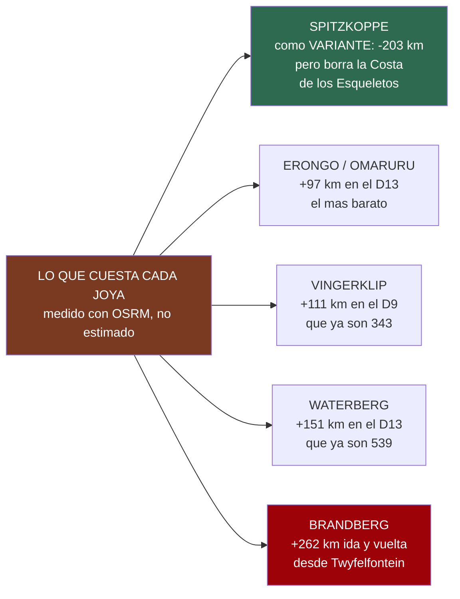

# 23 · Los desvíos que valen la pena

> **Namibia · 30 oct – 15 nov 2026 · la clásica del norte** — [← índice del dossier](README.md)
>
> Las joyas que están **fuera** de la ruta y qué costaría de verdad ir a por ellas: kilómetros
> medidos con el enrutado propio, la noche que habría que sacrificar y el veredicto. El `10`
> cataloga lo que cae **dentro**; esto es lo de fuera, con el precio en la mano.
>
> **~N$20 = €1** *(rango 19,5–20,5)* · **✅** fuente primaria · **◐** secundaria concordante ·
> **○** práctica común, sin fuente · **❌** sin verificar, dicho en blanco
>
> *Medido el 24/08/2026. **Los kilómetros no son de blog**: cada desvío se ha enrutado con el
> mismo OSRM sobre OpenStreetMap que dibuja el mapa del dossier, y los puntos se han geocodificado
> contra OSM en vez de escribirse a mano — el método de `13`, aplicado a lo que no está en la
> ruta.*

---

## ⚖️ La regla que decide: no hay ninguna noche libre

Antes de enamorarse de nada. La ruta son **15 días y 14 noches exactos**, medidos contra las horas
del vuelo el 08/08 *(`16`)*: se aterriza el 31 a las 09:25 y se despega el 14 a las 20:45. **No
sobra un día.** Así que cualquier joya de este documento se paga de una de estas tres maneras:

- **Con kilómetros del propio día** — y los días ya están calculados a **80 km/h en grava**, que es
  el límite del contrato, con la regla de **estar en el campamento a las 18:00** *(`06`)*. Un
  desvío de +150 km son casi **dos horas** que salen del final de la tarde, que es justo cuando la
  fauna se echa a los arcenes.
- **Quitando una noche a otro sitio** — y solo hay **una** que no está reservada ni es
  imprescindible: el **D2**, el día entero en la escarpa de Spreetshoogte. Pero ese día es
  **el colchón del viaje**: es lo que se sacrifica si el vuelo o las maletas se retrasan, **sin
  tocar ni una reserva** *(`01` §D2)*. Gastarlo en un desvío es quedarse sin red.
- **Cambiando un tramo por otro** — que es el único caso en que un desvío puede salir **gratis o a
  favor**, y abajo hay uno que lo hace.

---

## 🗻 Spitzkoppe — el único que puede salir a favor, y es el plan B de Terrace Bay

**Qué es.** El grupo de inselbergs de granito que sale en todas las fotos de Namibia: bloques
rojos de 700 millones de años sobre la llanura, el **arco de roca** que es la postal, y
**Bushman's Paradise**, con pinturas rupestres. Duerme uno al pie de la piedra, sin vallas.

**Lo que cuesta la noche** — su campamento comunitario, con dos avisos de calendario:

- **N$300 (~€15) por adulto y noche** ✅ *(tarifa oficial **1 nov 2025 – 31 oct 2026**, IVA y tasa
  de conservación incluidos —
  [spitzkoppe.com/src](https://spitzkoppe.com/src))*. ⚠️ **Pero esa tarifa expira justo antes del
  viaje**: la noche caería en **noviembre de 2026**, ya en el año siguiente, y una secundaria da
  **N$320 (~€16) para nov–dic 2026** ◐
  *([nwrnamibia](https://www.nwrnamibia.com/spitzkoppe-community-campsite-prices.htm))*. **Es la
  misma trampa que Barkhan** *(`15` §Spreetshoogte)*: el rack publicado no es el vuestro por
  semanas. **Para dos: ~N$640 (~€32).**
- **La tasa de acceso al reserve va incluida** para quien acampa ✅ *(un permiso por vehículo)*.
  **Visitante de día: N$180 (~€9) por adulto** ✅.
- **Reservas: reservations@logufa.com** ✅. Hay **más de 50 parcelas** y **no se puede elegir
  parcela**: solo se confirma que habrá sitio.
- ⚠️ **Esto corrige un dato viejo del dossier**: `01` y `02` citaban «N$270/persona → N$540 la
  noche» ◐ como ancla del extremo bajo de la estimación de campings. **El número real es N$300–320,
  no N$270** — la banda de `02` §3 no se mueve *(sigue dentro de los €25–45)*, pero el ancla queda
  corregida.

**Lo que cuesta llegar, medido.** Aquí está lo interesante, y no es lo que uno espera:

- **Como excursión de un día desde Walvis en el D6** *(el día de descanso)*: **192 km por sentido,
  383 km ida y vuelta** ✅ *(OSRM)*. A velocidad de planificación son **~5 horas de coche**.
  **Se carga el único día sin conducir del viaje.** ❌ No.
- **Como variante que sustituye a la costa**: **Walvis → Spitzkoppe → Twyfelfontein son 413 km**,
  contra los **616 km** de Walvis → Terrace Bay → Twyfelfontein ✅ *(OSRM, mismos extremos)*. Es
  decir, **la línea interior es ~200 km MÁS CORTA** que la de la costa.

> ### 👉 El veredicto útil: Spitzkoppe es el plan B de Terrace Bay, no un capricho
> Tal y como está la ruta, Spitzkoppe **no entra**: metería piedra donde hay Costa de los
> Esqueletos, y eso significa borrar **Cape Cross, la puerta de Ugabmund, la noche dentro del
> parque y el delta del Uniab** *(`10`)* — cuatro cosas por una.
>
> **Pero si Terrace Bay no tiene sitio** —que es la reserva binaria del viaje: sin ella no se
> entra a pernoctar *(`20` §4)`*— entonces **Spitzkoppe es exactamente el recambio**: la noche
> existe y se reserva por email, es **~200 km más corta**, cuesta **N$640 (~€32) en vez de los
> N$3.480 (~€174)** de Terrace Bay, y el D7 dejaría de tener la hora límite de las 15:00 de
> Ugabmund. **Anótalo antes de llamar a NWR, no después.**

---

## 🎨 Brandberg y la Dama Blanca — solo si ya se va por dentro

**Qué es.** La **montaña más alta de Namibia** *(el Königstein, 2.573 m)* y, en su falda, la
**Dama Blanca**: la pintura rupestre más famosa del país, a unos **45 minutos a pie** del
aparcamiento, con **guía local obligatorio** ◐.

- **Entrada: N$270 (~€13,50) para extranjeros** ◐ *(namibio N$80, SADC N$100)*, más el **guía,
  ~N$50–100 (~€2,50–5)** ◐ — cifras de 2023, así que **pueden haber subido** ❌.
  Fuentes ◐: [Wikivoyage — Brandberg](https://en.wikivoyage.org/wiki/Brandberg) ·
  [namibweb](http://www.namibweb.com/brandg.htm).
- **Una norma que sorprende y conviene saber**: hay que **dejar las bebidas abajo**. Hubo turistas
  que echaban agua y refresco sobre la pintura para que contrastara en las fotos ◐.
- **Dónde cae**: a ~36 km al noroeste de **Uis**, que está en la **C35, a mitad de camino entre
  Henties Bay y Khorixas** ◐.

**Lo que cuesta, medido**: desde **Twyfelfontein son 131 km por sentido — 262 km ida y vuelta** ✅
*(OSRM)*. El D8 ya son **367 km** con Twyfelfontein dentro: sumarle 262 lo pone en **629 km de
pista**, imposible con la regla de las 18:00.

> **Veredicto: no entra por sí solo — pero va de camino en la variante interior.** Uis está en la
> C35, que es justo el eje que se usaría si Terrace Bay cae y se baja por dentro. En ese
> escenario Brandberg deja de ser un desvío y pasa a ser **una parada**. Fuera de él, no.

---

## 🪨 Vingerklip — el que cabe casi, y ya estaba anotado

**Qué es.** El «dedo de Dios»: un monolito de **35 m** en las terrazas del Ugab. `10` ya lo tenía
apuntado como *«solo encaja cambiando el D9 a la variante Khorixas–Outjo»* — ahora ese cambio
tiene número.

- **Medido** ✅: el D9 por **Khorixas → Vingerklip → Outjo → Okaukuejo** son **454 km**, contra los
  **343 km** del D9 real por Kamanjab. **+111 km.**
- **Precio ○**: ~N$20 (~€1) *(`10`)*.
- ⚠️ **Y un dato del geocodificado que conviene mirar**: OSM etiqueta su acceso como **«4WD only»**
  ◐. El coche lo es, pero es pista, no atajo.

> **Veredicto: es el desvío más barato en kilómetros de los que añaden algo nuevo, y aun así
> cuesta ~1 h 20 min** sobre un día que ya son 343 km y termina **cruzando la puerta de Andersson**
> con horario. El D9 es además el día en que se entra en Etosha: llegar tarde a Okaukuejo es
> perder la primera charca iluminada. **Solo si se sale de Hoada muy pronto.**

---

## 🌄 Waterberg y el Erongo — los dos del día de vuelta

El **D13 (Onguma → Windhoek) son 539 km**, el día más largo del viaje. Los dos candidatos caen en
ese eje y compiten por el mismo hueco inexistente.

- **Waterberg Plateau** — la meseta roja de 200 m sobre la llanura, con su parque nacional y su
  historia *(`19`)*. **Medido: +151 km** sobre el trazado directo ✅. Entrada **N$280 (~€14)** por
  persona *(es parque premium, `15`)* y parcela NWR **N$430 (~€21,50)** ✅ *(`03`)*. **Ya está
  documentado en `11`.**
- **Omaruru / macizo del Erongo** — el desvío **más barato de todos: +97 km** ✅, y de paso el único
  que atraviesa un pueblo con algo que hacer.

> **Veredicto: los dos piden noche propia, no desvío.** Meterle 151 km a un día de 539 lo deja en
> 690 km — cinco o seis horas largas de conducción antes de devolver el coche al día siguiente.
> **Waterberg es un viaje aparte**, no la cola de éste. *(Si algún día se parte el D13 en dos
> —que es lo que también pedía el leopardo de Okonjima, `11`—, entonces los tres entran de golpe:
> Okonjima, Waterberg y el Erongo caen en el mismo eje.)*

---

## 🚫 Y las que ya estaban descartadas, para no volver a mirarlas

`10` §«Las que se quedan fuera» las tiene con su fuente; se repiten aquí solo para que este
documento sea la lista completa de lo de fuera:

- **Dragon's Breath** *(el mayor lago subterráneo no glaciar del mundo)* — **no es visitable**:
  granja privada, solo expediciones científicas. Su versión visitable, el **lago Otjikoto**, ya
  está **en la ruta** el D13.
- **Cráter de Messum** — desvío serio del D7, con permiso, líquenes frágiles y estado incierto:
  **ya desaconsejado en `11`**.

---

## 🧭 En una frase

**Solo uno de estos cinco puede entrar sin romper nada, y solo si algo falla:** si Terrace Bay se
queda sin sitio, la ruta baja por dentro y gana Spitzkoppe **y** Brandberg, ~200 km más corta y
mucho más barata — perdiendo a cambio la Costa de los Esqueletos entera. Los otros cuatro piden un
día que este viaje no tiene, y **el único día libre que existe, el D2, es el colchón**: gastarlo es
viajar sin red.

---

*Precios en N$ y € · ~N$20 = €1 · Kilómetros medidos con OSRM sobre OpenStreetMap el 24/08/2026,
puntos geocodificados contra OSM · Las tarifas namibias cambian: reconfirma antes de pagar*
