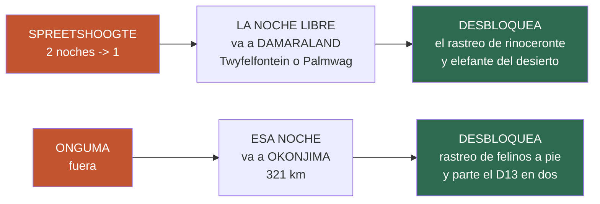

# 24 · La ruta alternativa — Spreetshoogte una noche, Etosha tres, sin Onguma

> **Namibia · 30 oct – 15 nov 2026 · la clásica del norte** — [← índice del dossier](README.md)
>
> La variante que pide el viajero: **una sola noche en Spreetshoogte**, **tres noches dentro de
> Etosha** y **fuera Onguma**. Aquí está entera, día a día y con los kilómetros medidos — con lo
> que se gana, lo que se pierde y **qué hay que reservar de forma distinta**.
>
> **~N$20 = €1** *(rango 19,5–20,5)* · **✅** fuente primaria · **◐** secundaria concordante ·
> **○** práctica común, sin fuente · **❌** sin verificar, dicho en blanco
>
> *Medido el 24/08/2026 con el mismo enrutado OSRM sobre OpenStreetMap que dibuja el mapa del
> dossier. **La ruta que sigue imprimiendo el resto del volumen es la de
> [`01`](01-itinerarios-dia-a-dia.md)**: pasar ésta a oficial obliga a rehacer mapas, lámina,
> presupuesto y cuaderno de reservas.*

---

> ## 🟢 La buena noticia de calendario: llegas a tiempo
>
> Esta variante **mueve las fechas de Sesriem, Terrace Bay y Spreetshoogte** — pero **las tres
> están todavía SIN RESERVAR**, así que no hay nada que rehacer: **se reservan directamente con
> las fechas nuevas**. Y las **tres noches de dentro de Etosha —9, 10 y 11— no se mueven ni un
> día**: la reserva del 21/08 sigue valiendo tal cual.
>
> **Lo único que hay que deshacer es Onguma** *(12–13 nov)*, que sí está reservada.
>
> 👉 **Decide antes de llamar y reservas bien a la primera.** NWR cobra **20 % no reembolsable a
> las 48 h** *(`20` §4)*: equivocarse de fecha hoy cuesta dinero.

---

## 🗺️ El itinerario alternativo, día a día

**~2.720 km** *(44 menos que la oficial)* · **15 días, 14 noches** · **el peor día baja de 539 a
412 km**.

- **D0 · sáb 31 oct — Windhoek** · 46 km — *igual que la oficial*
- **D1 · dom 1 nov — Windhoek → paso de Spreetshoogte** · **205 km** · 🛏️ **Spreetshoogte, UNA
  noche** ⬅️ *cambia*
- **D2 · lun 2 nov — Spreetshoogte → Solitaire → Sesriem** · **129 km** ✅ · 🛏️ Sesriem ⬅️ *un día
  antes*
- **D3 · mar 3 nov — Sossusvlei, Deadvlei y Duna 45** · 122 km · 🛏️ Sesriem *(2.ª — la que da el
  amanecer)*
- **D4 · mié 4 nov — Sesriem → Walvis Bay** · 316 km · 🛏️ Walvis Bay
- **D5 · jue 5 nov — Walvis: flamencos, Sandwich Harbour y descanso** · **0 km** · 🛏️ Walvis Bay
- **D6 · vie 6 nov — Walvis → Henties Bay → Cape Cross → Terrace Bay** · 412 km · 🛏️ **Terrace
  Bay** ⬅️ *un día antes* ⚠️ *Ugabmund cierra la entrada a las 15:00*
- **D7 · sáb 7 nov — Terrace Bay → Springbokwasser → Twyfelfontein** · **211 km** ✅ · 🛏️
  **Twyfelfontein o Palmwag** ⬅️ **la noche nueva**
- **D8 · dom 8 nov — Twyfelfontein → Palmwag → Hoada** · **158 km** ✅ *(107 + 51)* · 🛏️ Hoada
  — **con la mañana libre entera**
- **D9 · lun 9 nov — Hoada → Kamanjab → Outjo → Okaukuejo** · 343 km · 🛏️ **Okaukuejo ✅
  RESERVADO**
- **D10 · mar 10 nov — Safari Okaukuejo → Halali** · 108 km · 🛏️ **Halali ✅ RESERVADO**
- **D11 · mié 11 nov — Safari Halali → Namutoni** · 77 km · 🛏️ **Namutoni ✅ RESERVADO**
  *(y el nocturno guiado sale de aquí, sin cambios)*
- **D12 · jue 12 nov — Namutoni → Von Lindequist → Okonjima** · **321 km · ~4 h** ✅ · 🛏️
  **Okonjima** ⬅️ **en vez de Onguma**
- **D13 · vie 13 nov — Okonjima → Windhoek** · **226 km · ~2 h 50** ✅ · 🛏️ Windhoek
- **D14 · sáb 14 nov — Windhoek → aeropuerto** · 46 km · ✈️ 20:45

---

## ✅ Lo mejor — y no es poco

- 🦏 **Desbloquea el rastreo de Damaraland**, que hoy es imposible. El **rinoceronte negro y el
  elefante del desierto de Grootberg** —o el de **Palmwag**— piden el día entero, o vuelven a las
  15:00 con 343 km por delante *(`23`)*. Con la noche del D7 en Twyfelfontein/Palmwag, **el D8 son
  158 km y la mañana queda libre**: caben.
- 🐆 **Desbloquea el guepardo de primera hora.** Durmiendo en **Okonjima** entra el **rastreo de
  guepardo y leopardo a pie, con radiocollar, de las 06:00–06:30** ◐ — 220 km² de reserva de la
  fundación AfriCat. *(Alternativa: el **CCF**, 289 km, con el **Cheetah Run de las 08:00** ✅ — más
  seguro pero cautivo. La comparación honesta, en [`23`](23-desvios-que-valen-la-pena.md).)*
- 🚗 **Endereza los dos peores días del viaje**: el **D8 oficial de 367 km** se parte en **211 + 158**,
  y el **D13 de 539 km** en **321 + 226**. **El peor día del viaje baja de 539 a 412 km.**
- 📉 **La ruta encoge a ~2.720 km**, 44 menos.
- 🐾 **Cambia escarpa sin datos por Damaraland con datos**: en Spreetshoogte **no hay parte de
  avistamientos ni polígono GBIF** —es granja privada, la fauna está sin medir *(`01` §D1)*—;
  Damaraland sí está medido en la guía.

## ❌ Lo peor — y esto hay que mirarlo de frente

- 🛟 **Se pierde el colchón del viaje, y es el precio serio.** La segunda noche de Spreetshoogte
  **no era turismo: era la red**. Es el día que se sacrificaba si el vuelo o las maletas se
  retrasaban **sin tocar ni una reserva** *(`01` §D2)*. Sin él, **cualquier retraso en Fráncfort se
  come ya una reserva pagada** — y desde el 4 de octubre las de NWR se cancelan al 100 %.
  👉 **Mitigación, y es mejor de lo que parece**: la nueva noche del D7 *(Twyfelfontein/Palmwag)*
  **no hay por qué reservarla con antelación** — no está dentro de un parque y noviembre es
  temporada baja, donde **la práctica documentada es que fuera de Etosha y Sesriem no hace falta
  reservar** ◐ *(`20` §antelación)*. Es decir: **se puede dejar abierta y decidirla sobre la
  marcha**, y si el vuelo falla, **es la que se sacrifica sin perder un céntimo**. No es una red
  tan buena como un día entero, pero **es una red de verdad**.
- 🌇 **Se pierde el único día sin reloj**: amanecer en el mirador, la escarpa a pie y la segunda
  puesta de sol sobre el Namib mil metros abajo.
- 🦏 **Se pierde Onguma**: 35.970 ha privadas con **leopardo, guepardo y rinoceronte confirmados
  por escrito**, baño propio en la parcela, y **foco, campo a través y paseo a pie** — las dos
  cosas que el parque prohíbe *(`21`)*. Y se pierde el **D12 de 56 km**, que era la última tarde
  tranquila antes de volver.
- 💳 **Hay que CANCELAR Onguma**, que está reservada desde el 21/08, y **sus condiciones de
  cancelación no se han verificado** ❌ *(ni el importe exacto de la reserva — `20` §4)*.
  **Pregúntalas antes de mover nada.**
- 💶 **Cuesta dinero, no lo ahorra.** Sale una noche barata *(Spreetshoogte, **N$290 · ~€14,50**
  pp ✅)* y entran **dos sin tarifa cerrada**: la de Damaraland ❌ y **Okonjima, «desde N$1.130 ·
  ~€57»** ◐ frente a los **N$1.240 (~€62)** de Onguma que ya están ✅. Y los **rastreos de
  Grootberg y Palmwag no publican precio** ❌.
- 🎫 **Lo que NO cambia, para que nadie lo cuente como ahorro**: **las tasas de parque de Etosha
  siguen igual** —se entra el D9 y se sale el D12 en las dos rutas— y **las tres noches de dentro
  son las mismas**.

---

## 📋 Qué reservar, y en qué orden

1. ❗ **Primero, Onguma**: pedir **condiciones de cancelación** ❌ y cancelar *(`20` §4)*.
2. ❗ **Antes de llamar a NWR**, pedir por escrito el precio del **rastreo de Grootberg**
   *(res4@journeysnamibia.com · +264 61 228 104)* y el **alojamiento del D7** ❌: si el rastreo
   fuera caro o no hubiera sitio, **esta variante pierde su mejor argumento**.
3. **NWR** *(reservations@nwr.com.na · +264 61 285 7200 — su portal está caído)*:
   **Sesriem 2–3 nov** y **Terrace Bay 6 nov**. ⬅️ *fechas distintas de las del `01`*
4. **Barkhan**: **Spreetshoogte, solo el 1 de nov** *(bookings@barkhan.africa)*.
5. **Okonjima** *(12 nov)* y el alojamiento del **D7**, los dos ❌ sin tarifa: pídelos y compara.
6. **Windhoek D0 y D13** y **Hoada D8**, sin cambios respecto al `01`.

> ### 🧭 Una cosa que decidir tú, y la digo sin adornar
> Esta variante **cambia una red de seguridad por dos experiencias de fauna**. Con la fauna como
> prioridad declarada y con Etosha ya pagada, **el intercambio tiene sentido** — pero **el día que
> se quita es exactamente el que protegía todo lo demás**, y el vuelo lleva escala en Fráncfort.
> Si prefieres conservar la red, hay una versión intermedia: **quedarse solo con la condición 2**
> —tres noches de Etosha, sin Onguma, noche en Okonjima— que **no toca ninguna reserva pendiente,
> no mueve ninguna fecha, parte el D13 en dos y ya te da el guepardo de primera hora**.

---

*Precios en N$ y € · ~N$20 = €1 · Kilómetros medidos con OSRM sobre OpenStreetMap el 24/08/2026 ·
La ruta que imprime el resto del dossier sigue siendo la de [`01`](01-itinerarios-dia-a-dia.md)*
