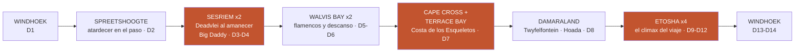
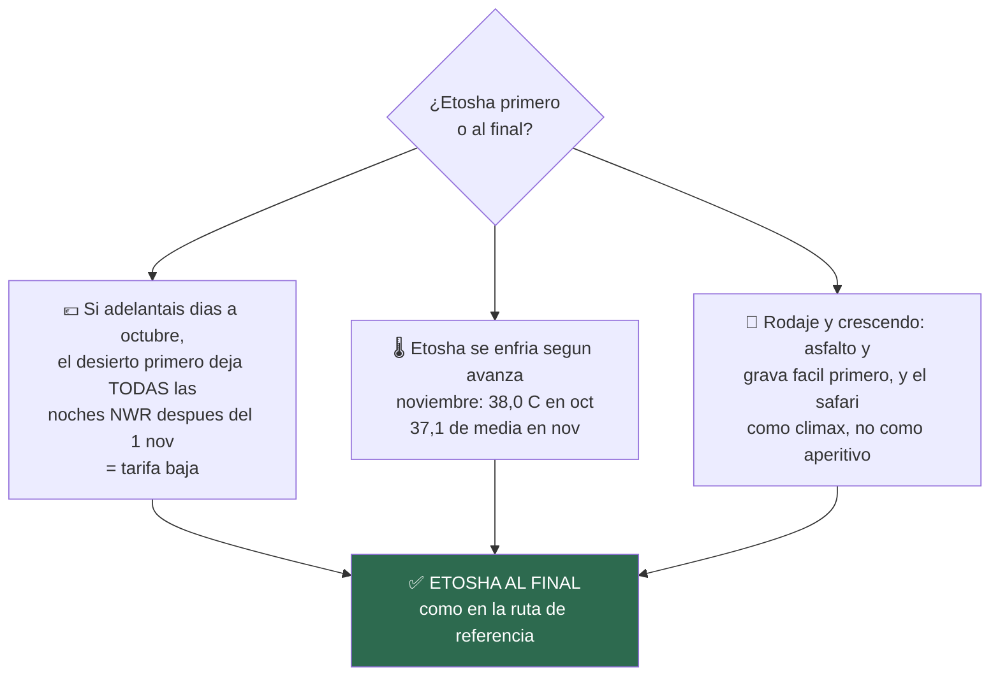
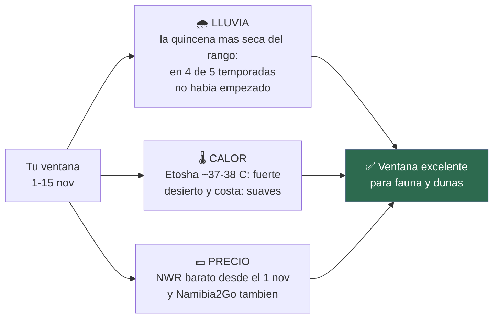
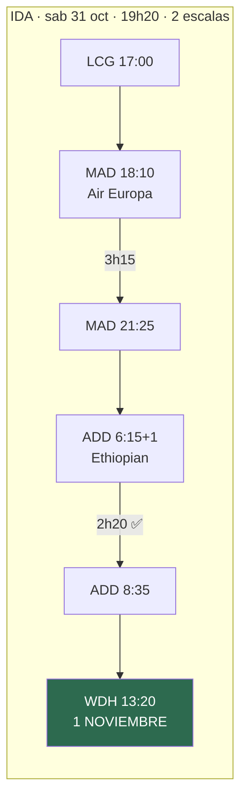
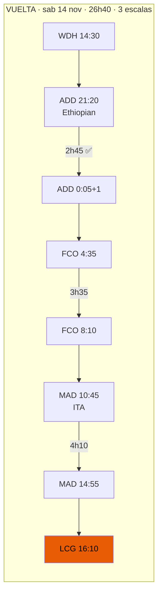
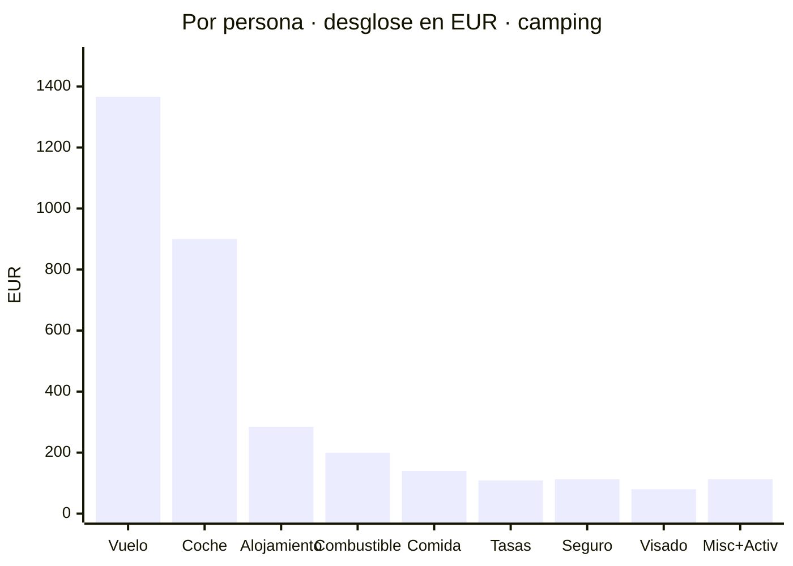
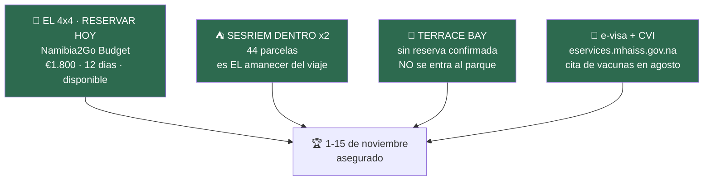
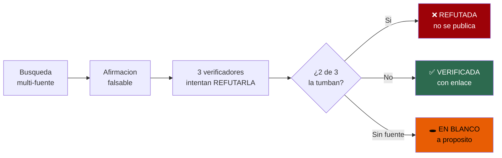

# 🇳🇦 NAMIBIA 2026

## El gran roadtrip del norte

**Dos personas · un 4x4 con tienda de techo · 14 días · primera quincena de noviembre**

*Las dunas más altas del mundo al amanecer · la Costa de los Esqueletos · rinocerontes
bebiendo de noche a diez metros · cuatro noches de safari en Etosha*

Todo verificado contra fuentes primarias. Precios en N$ y €. Actualizado 17·07·2026.

---

## ⭐ La ruta

> # La clásica del norte, a ritmo lento.
> ### Desierto → costa → Damaraland → Etosha. Sin prisas, sin el sur, sin días imposibles.

**~2.600 km · 13 días de coche · ningún día por encima de ~390 km · dos noches en Sesriem, dos en
la costa y CUATRO en Etosha.**

Es la ruta del clásico de dos semanas *(la misma familia que el itinerario de
[lugaresincertos.com](https://www.lugaresincertos.com/en/travel-inspiration/two-week-trip-to-namibia/)
que sirvió de referencia)*, montada con nuestros datos verificados. **El sur queda para otro
viaje**: está medido y documentado en el dossier por si algún día vuelve.

### ❓ ¿Etosha al principio o al final? → **Al final.** Tres razones con datos:

1. **El dinero.** Si adelantáis la salida a finales de octubre, con el desierto primero **todas las
   noches de NWR (Sesriem, Terrace Bay, Etosha) caen después del 1 de noviembre** — tarifa baja.
   Etosha primero + salida en octubre = pagar la tarifa vieja **y** pillar el parque en su pico de
   calor (38,0 °C de media de máximas en octubre).
2. **El termómetro.** Etosha se enfría según avanza noviembre (38,0 oct → 37,1 media nov): cada día
   que tardas en llegar, un poco más suave.
3. **El rodaje.** Los primeros días son asfalto y grava amable — llegas a Damaraland con oficio, y
   el safari es el clímax final, no el aperitivo.

*El único contra, dicho honesto: el riesgo de primeras tormentas sube mínimamente hacia el día 15
(en 2 de las últimas 5 temporadas cayó algún chubasco suelto en la primera quincena — aislado, no
la temporada asentada). Marginal frente a las tres razones de arriba.*

📖 **El día a día completo, con dónde dormir y precios** → [`11-itinerarios-dia-a-dia`](11-itinerarios-dia-a-dia.md)

---

## 🚨 Lo primero de todo: reserva la Budget hoy

> ### La Comfort no está libre. La Budget sí — y es €200 más barata.

- 🚙 **COMFORT** · €166,67/día → **€2.000** · ❌ **«Not Available — Contact Us»**
- 🚙 **BUDGET** · €150,00/día → **€1.800** · ✅ **«Rent this Car»**

**Cógela.** El coche es **el cuello de botella del viaje entero**, y tienes una disponible **y más
barata**. **No dejes que lo perfecto te quite lo disponible**: si la Budget también vuela, te quedas
sin ruta.

*Si te apetece, escribe a Namibia2Go en paralelo preguntando si el «Contact Us» de la Comfort es
falta de coches o simplemente que el año tarifario 2026/27 aún no está abierto a venta online. Pero
**reserva primero, pregunta después**.* 📞 **+264 61 427 220** · [namibia2go.com](https://namibia2go.com)

### ⛺ Lo que pierdes con la Budget: solo dos cosas

- **Tiendas** — 2 Tentco **de lona** *(la Comfort: carcasa rígida)*
- **Cocina** — **cajas de camping** *(la Comfort: compartimentos a medida)*

**Todo lo demás es idéntico**: el mismo Toyota Hilux Double Cab **2.8L GD-6 turbodiésel**,
automático, 4x4 permanente, **km ilimitados**, **Premium Insurance Cover** (franquicia cero),
**2 ruedas de repuesto** y nevera eléctrica.

La diferencia real: la lona tarda ~5 minutos en montarse en vez de ~1, y aguanta algo peor el polvo
y el viento. Son **~€18 por noche de tienda** de sobrecoste la Comfort. **Con la Budget ahorras €100
por persona** — y sigues durmiendo arriba las 11 noches.

> 🎥 Al ver el [vídeo del Hilux](https://www.youtube.com/watch?v=LPNZ-l8y3Pg): si las tiendas del
> techo son de **lona plegada**, ése es exactamente tu coche.

### 🛑 Y el orden importa: el coche antes que los vuelos

El vuelo de €1.366 p.p. (31 oct–14 nov) es **de referencia**, no emitido. **Confirma el coche
primero.** Este dossier lleva desde el primer día diciéndolo, y el «Not Available» de la Comfort es
justo la razón: **una ruta sin coche no es una ruta**.

---

## ✨ Los momentos que hacen este viaje

- 🌅 **El amanecer en Deadvlei que casi nadie consigue.** La puerta interior de Sesriem abre **1 hora
  antes** que la exterior — solo para quien duerme dentro (**N$1.340 · ~€67** los dos). Árboles
  negros de 900 años, la duna encendiéndose, y los demás todavía en la cola de la otra puerta. ✅
- 🏜️ **Big Daddy y Hidden Vlei.** Con dos noches en Sesriem hay día entero: la subida a la gran
  duna, la bajada corriendo hasta Deadvlei, y el vlei escondido sin gente. Duna 45 a la vuelta. ✅
- 🌇 **El atardecer del paso de Spreetshoogte** — el Namib mil metros bajo tus pies en una de las
  carreteras más empinadas del país. La primera noche de desierto, a dos horas de Windhoek. ◐
- 🦏 **La charca iluminada de Okaukuejo.** Rinocerontes negros, elefantes y jirafas bebiendo de noche
  con el parque cerrado y tú dentro. Camping **N$920 (~€46)**; el capricho del **chalet del charco**,
  **N$4.760 (~€238)** — en tu ventana, tarifa baja. ✅
- 🐘 **Cuatro noches de safari, todas DENTRO del parque.** Okaukuejo → Halali → Namutoni ×2
  (**N$920/noche los dos** ✅): sin horas de puerta, con las charcas iluminadas al lado y los
  amaneceres sin esperar a que abran. Y en seco: el parque estuvo así en **4 de las últimas 5
  temporadas** — la fauna concentrada en las charcas. ✅
- 🦭 **Cape Cross**: decenas de miles de lobos marinos *(pañuelo para la nariz — en serio)*. ✅
- 🌊 **Dormir en la Costa de los Esqueletos.** Noche en **Terrace Bay**, dentro del parque, con la
  niebla y el Atlántico rugiendo. Pocos lo hacen: exige reserva y entrar antes de las 15:00. ✅
- 🪨 **Twyfelfontein**, los grabados rupestres UNESCO, y la noche en **Hoada** — el campamento entre
  peñas de granito que la referencia llama el más bonito de su viaje. ◐
- 🦩 **Flamencos en Walvis Bay** al amanecer, ostras y paseo — **dos noches y un día entero de
  descanso** a mitad de viaje. La excursión a **Sandwich Harbour, en tour guiado** *(con tu coche
  está prohibida por contrato — y el tour es mejor plan)*. ✅
- 🥧 **La tarta de manzana de Solitaire** — dos veces, porque la ruta pasa dos veces. Y las dos se
  reposta: después hay **210 km sin nada**. ✅
- 🍺 **Joe's Beerhouse** en Windhoek, la primera y la última cena. N$200–400 (~€10–20). ✅

---

## 📅 Tu ventana: 1–15 de noviembre

- 🌧️ **Lluvia: la mejor noticia.** En las últimas 5 temporadas, el inicio real de las lluvias en
  Etosha cayó en **enero tres veces, diciembre una y noviembre una**. Tu quincena: charcas llenas
  de fauna y cielos limpios, con datos de estación — no de folletos.
- 🌡️ **Calor: Etosha aprieta, el resto acompaña.** El norte a **~37–38 °C** de máxima — el safari se
  hace al amanecer y al atardecer, con siesta y charca iluminada de noche, que es como se hace bien
  de todas formas. El desierto ~30–32 °C y la costa fresca (Benguela). Noches de 15–18 °C: **forro
  polar, no plumas**.
- 💶 **Precio: la frontera del 1 de noviembre, dos veces.** **NWR** entra en tramo barato el 1 de
  noviembre (Sesriem, Terrace Bay, Etosha), y **Namibia2Go también**. 👉 **¿Adelantar días a
  octubre? Hasta 2 días es gratis** — las primeras noches (Windhoek, Spreetshoogte) no son NWR.
- 🚗 **El coche: ✅ Namibia2Go Budget, €1.800 por 12 días** *(la Comfort no está disponible)*. Y aquí tu ventana acertó:
  **Namibia2Go entra en temporada baja el 1 de noviembre** *(Asco no lo hace hasta el 15)*, así que
  el presupuesto cae entero en su tarifa barata. Incluye **km ilimitados** y **Premium Insurance
  Cover** *(franquicia cero — matiz: decae con «negligencia probada» y excluye daños por agua;
  pregunta por escrito cómo trata los **bajos en Damaraland**, que el D8 pasa por ahí)*.

---

## ✈️ El vuelo — cerrado

> # €1.366 por persona · €2.732 la pareja
> ### A Coruña → Windhoek, ida y vuelta, turista *(Gotogate; Mytrip €1.390, Booking €1.391)*

### 🎉 Tres buenas noticias

**1 · Sin fiebre amarilla.** La regla es **>12 h de tránsito** por país de riesgo. Tus escalas en
Adís son de **2h20 (ida)** y **2h45 (vuelta)**, las dos *airside*: **muy por debajo del umbral**.
Era el punto que llevaba semanas abierto y que se decidía justo al comprar el billete — **este
itinerario lo resuelve solo**. Una escala larga, o la parada gratis en ciudad de Ethiopian, sí la
habrían disparado.

**2 · Las fechas caen clavadas en la ruta.** Aterrizas el **1 de noviembre a las 13:20** y despegas
el **14 a las 14:30**: **13 noches, 14 días** — exactamente la Variante E, con D1 el 1 y D14 el 14.

**3 · Y el calendario no podía salir mejor.** Sales el 31 de octubre pero **no duermes ni una noche
en Namibia en octubre**: todas tus noches NWR caen en el **tramo barato** desde la primera, y el
alquiler (1–14 nov, **13 días**) entra entero en la **temporada baja de Namibia2Go**.

### ⚠️ Dos cosas que confirmar antes de pagar

- **Que sea billete único.** La vuelta lleva **tres compañías** (Ethiopian + ITA + Air Europa). En
  un solo billete, una conexión perdida es problema de la aerolínea; en billetes separados, es tuyo.
- **Que incluya maleta facturada.** El tramo de Air Europa podría tener franquicia distinta a la de
  Ethiopian.

*La vuelta es dura, dicho sea: 26h40, salida de Adís a las 0:05 y 4h10 de espera en Madrid.*

---

## 🩺 El seguro — IATI Estrella

> ### €226,04 la pareja · **€113,02 por persona** *(31/10 – 15/11)*

### ✅ Las fechas ya llegan hasta el 15 — y costó €14,69

La primera simulación iba del **31/10 al 14/11** y **se quedaba un día corta**: sales de Windhoek el
14 a las 14:30, pero **despegas de Adís a las 00:05 del día 15** y aterrizas en A Coruña a las
**16:10 del 15**. Eran **16 horas de vuelta sin seguro**, justo el tramo más largo y con más
conexiones del viaje.

- Estrella · 31/10 – 14/11 *(con hueco)* — €211,35
- Estrella · **31/10 – 15/11** *(correcto)* — **€226,04** · **€113,02 p.p.**
- **Coste de cerrar el hueco: +€14,69** *(+€7,35 por persona)*

**Catorce euros y setenta céntimos por no volver a casa sin seguro.** *(Curiosidad: al Estándar el
día extra le sale gratis — mismo precio con y sin él.)*

### ✅ Cumple la condición de entrada

Namibia **exige** seguro médico con **repatriación sanitaria**. El Estrella la lleva al **100 %** —
requisito cumplido. *(Las tres modalidades de IATI la cubren, así que por el requisito legal
cualquiera valdría.)*

**Lo que sí compra el Estrella:** asistencia médica **ilimitada** *(Mochilero 1,5 M€ · Estándar
1 M€)*, regreso anticipado por cierre de fronteras y 4.000 € de equipaje. *En un país donde no hay
hospital cerca de Sesriem y la evacuación aérea es todo el argumento, «ilimitado» no es marketing.*

### ⚠️ Búsqueda y salvamento: el top lo deja opcional… y el Mochilero lo incluye

Curiosidad de la tabla que conviene mirar dos veces: **«Búsqueda y salvamento» viene INCLUIDO en el
Mochilero (15.000 €) pero es OPCIONAL en el Estrella.**

Y en **este** viaje importa: **Damaraland, el Namib y buena parte de la ruta no tienen cobertura
móvil**. Es exactamente el escenario para el que existe esa garantía.

> 👉 **Añádele la opción de búsqueda y salvamento al Estrella.** Si no, tienes el seguro más caro sin
> una cobertura que sí trae el más barato.

### 🔁 La franquicia de coche de alquiler te sobra

El Estrella cubre **1.000 € de franquicia del coche**. Pero tu **Namibia2Go lleva Premium Insurance
Cover = franquicia CERO**: **no hay franquicia que cubrir**. Es una garantía casi redundante en tu
caso — no la cuentes como valor. *(Único resquicio: la franquicia cero de N2Go «decae con
negligencia probada» — pero la negligencia suele estar excluida también en el seguro de viaje.)*

### ❓ La pregunta que decide: ¿evacuación aérea DENTRO del país?

La tabla dice **«Repatriación o transporte de enfermos: 100 %»**. **Repatriación** es traerte a
España. Lo que este viaje necesita es lo otro: **que te saquen en avión de una pista remota hasta
Windhoek**. Cerca de Sesriem **no hay hospital** *(Windhoek a ~320 km, Walvis Bay a ~270, ambos 4+ h
de grava)*. **La tabla no lo aclara.**

> 👉 **Pregúntaselo a IATI por escrito antes de contratar.** Es la cobertura que de verdad cambia
> algo aquí.

### Las tres, comparadas

- IATI **Estándar** — €117,41 *(€58,70 p.p.)*
- IATI **Mochilero** — €175,49 *(€87,75 p.p.)* · **incluye búsqueda y salvamento**
- 🏆 IATI **Estrella** — **€226,04** *(€113,02 p.p.)* · **médica ilimitada** · *búsqueda y salvamento opcional*

*Estrella vs Mochilero: **+€50,55** (+€25,27 por persona).*

---

## 💶 El presupuesto — por persona, partida a partida

> # ~€3.306 por persona · todo incluido
> ### Rango honesto: **€3.150–3.450**. El **79 %** ya está cerrado.

**Incluye:** vuelo · coche · **seguro de viaje** · combustible · tasas de parque · visado · las 13
noches · comida · actividades · imprevistos. **No queda nada fuera** salvo lo que compres allí por gusto.

*Vuelo y coche son el **69 %** del viaje. Todo lo demás junto son ~€1.030.*

### 👤 El desglose, por persona

- ✈️ **Vuelo** — **€1.366** ✅ *ida y vuelta LCG–WDH, turista*
- 🚙 **Coche** — **€900** ✅ *mitad de €1.800 · 12 días · Namibia2Go **Budget**, disponible*
- ⛺ **Alojamiento** — **~€285** *· mitad de ~€570 · 13 noches*
  - *6 noches NWR **verificadas**: **€159** ✅ (N$3.180 p.p.)*
  - *Hoada (D8) cerrado ◐: N$542–732/noche pareja (~€27–37)*
  - *4 campings sin precio + Terrace Bay + hotel del D13: **~€126** ○ — **con sesgo al alza**: Terrace
    Bay es un resort con media pensión (suelo ~€144–192 la pareja SÓLO esa noche), no un camping ◐*
- ⛽ **Combustible** — **~€200** ○ *· mitad de ~€400 · ~2.600 km*
- 🍖 **Comida** — **~€140** ○ *· supermercado y braai*
- 🎫 **Tasas de parque** — **~€109** ◐ *· mitad de ~€217 · 7 unidades de 24 h*
- 🩺 **Seguro** — **€113,02** ✅ *· IATI Estrella, 31/10–15/11*
- 🛂 **Visado** — **€80** ✅ *· e-visa, N$1.600*
- 🎯 **Actividades** — **~€38** ○ *· lanzadera Deadvlei + una*
- 🧷 **Misceláneos** — **~€75** ○ *· SIM, propinas, imprevistos*

> ### **TOTAL POR PERSONA: ~€3.306** *(~N$66.000)*
> ### **TOTAL LA PAREJA: ~€6.612** *(~N$132.000)*

### 🚙 El coche: **€1.800 cerrados y disponibles**

**Namibia2Go 4x4 BUDGET camping equipped double cab** — €150,00/día × 12 días *(1–13 nov)* =
**€1.800** con impuestos, ✅ **disponible**. Automático, diésel, **km ilimitados** y **Premium
Insurance Cover** (franquicia cero) incluidos.

*Y mi estimación se queda muy cerca: calculé €1.755 para la clase budget y el precio real es
**€1.800** — un 2,5 % de diferencia.* **Se acabó el rango «N2Go vs Asco»**: el coche es cifra
cerrada y el presupuesto se estrecha de golpe.

> ⚠️ **Ojo al calendario:** el coche son **12 días (1–13)** pero estás **13 noches (1–14)**. La
> noche del **13 en Windhoek te quedas sin coche** → hotel y traslado al aeropuerto.
> *Alternativa: añadir el día 13 (~€167) y devolverlo el 14 camino del aeropuerto — puede salir
> igual o más barato que hotel + dos traslados.*

### 🎥 El coche por dentro — y qué te da exactamente la Budget

▶️ **[Namibia2Go — «Experience The Fully Equipped Hilux»](https://www.youtube.com/watch?v=LPNZ-l8y3Pg)**
*· vídeo de la propia empresa*

**Es tu coche** —Toyota Hilux Double Cab camping equipped de Namibia2Go— pero **ojo al mirarlo**:
la web ofrece **dos versiones del mismo vehículo** y el vídeo no aclara cuál enseña. La diferencia
se ve a simple vista:

- 🏆 **Budget** — dos tiendas **blandas** Tentco + cajas de camping ← **la tuya** ✅ *(la Comfort salió «Not Available» para tus fechas)*
- **Comfort** — dos tiendas de **carcasa rígida** + cocina a medida *(no disponible)*

> 👉 **Al ver el vídeo, fíjate en el techo:** el tuyo es el **Budget**, así que espera **tiendas de
> lona plegada** *(no las de carcasa rígida tipo concha, que son de la Comfort)*.
>
> *La lona plegada se monta y desmonta a mano cada día — con **11 noches de tienda**, es la rutina de
> la tarde. Práctica en subir y bajar el toldo antes de salir.*

**Ficha verificada del vehículo** ✅ — 4x4 permanente · automático · **motor 2.8L GD-6 turbodiésel**
· 5 plazas con tiendas para 4 · km ilimitados · **2 ruedas de repuesto** y **nevera eléctrica** ·
2 tiendas de techo, mesa, 4 sillas, ropa de cama para 4 y menaje completo · *1 día = 24 h*.

🎉 **Las 2 ruedas de repuesto vienen de serie** — es justo lo que recomienda todo el que conduce
esas pistas.

> ### ⚠️ Una trampa que tu presupuesto ya esquiva
> Los precios «temporada baja» que publica la web caen en la banda **«01 Nov 2025 – 30 Jun 2026»**:
> **caduca antes de tu viaje**. La siguiente que publica es la alta de julio a octubre de 2026. **Tu
> ventana cae en el año tarifario siguiente, que no está en la web.**
>
> Tus **€150/día (€1.800 por 12 días) son una cotización en vivo para tus fechas reales**, no el
> precio caducado de la web. 👉 **Fíate de tu cotización, no del precio publicado.** *(Es exactamente
> la misma trampa que la tarifa de NWR.)*

*Fuente: [namibia2go.com · 4x4 camping equipped double cab](https://namibia2go.com/4x4-camping-equipped-double-cab)*

### ⛺ Sí se puede acampar dentro de Etosha — **11 de 13 noches en el coche**

**Okaukuejo, Halali y Namutoni tienen camping**: **N$460/persona = N$920 la pareja** ✅, verificado
en la tarifa oficial NWR 2026/2027. **Es justo lo que ya estaba presupuestado** — y son las noches
de la charca iluminada.

**Las únicas dos que no pueden ser tienda de techo:**
- 🌊 **D7 · Terrace Bay** — es **resort**, no camping. *(El camping de la zona es **Torra Bay**, y
  solo abre **diciembre–enero** ✅.)* Si no encaja, la variante fácil es dormir en **Henties Bay o
  Swakopmund** —donde sí hay camping— y cruzar el Skeleton Coast en tránsito al día siguiente.
- 🏙️ **D13 · Windhoek** — el coche ya está entregado → hotel.

### 🔬 Qué parte de este número es sólida

- **✅ Duro — €2.618 de los €3.306 (79 %)**: vuelo €1.366 · coche €900 · 6 noches NWR €159 ·
  seguro €113 · visado €80
- **◐ Corroborado**: tasas de parque (~€109) — el N$280/adulto lo confirman **dos páginas oficiales del
  MEFT** (PDF de tarifas + nota de prensa `news/199`, vigente 1/04/2026), varias secundarias y ya la
  **fuente legal primaria localizada** (*Government Gazette Nº 8877, Government Notice Nº 115, 1/04/2026*),
  pero ninguna se pudo abrir aquí (403), así que la extracción de la tabla queda ◐; los tres parques de
  la ruta son **premium**. **Confírmalo por email o abriendo la Gaceta 8877 desde fuera.**
- **○ Estimado — ~€578 p.p.**: 7 noches sin precio (~€126), combustible (~€200), comida (~€140),
  actividades (~€38), misceláneos (~€75). **Ese es el margen real: ±€145 por persona.**

---

## 🎯 Las reservas que hacen el viaje

1. **El 4x4 — RESÉRVALO HOY.** Namibia2Go **Budget**, €1.800 por 12 días con seguro y km
   ilimitados, ✅ **disponible**. *(La Comfort sale «Not Available».)* **Flota pequeña y noviembre
   competido: es el cuello de botella.** *Y decide si añadir el día 13 (~€150) para devolverlo
   camino del aeropuerto en vez de hotel + dos traslados.*
2. **Sesriem dentro de la puerta, dos noches.** Solo **44 parcelas**, y es la diferencia entre *ver*
   Deadvlei y *tenerlo para ti* al amanecer. *(Plan B: Sossus Oasis en la puerta — perdiendo la hora
   de ventaja, que es el motivo.)*
3. **Terrace Bay con reserva confirmada** — sin ella **no te dejan entrar** al Skeleton Coast para
   pernoctar (el permiso de tránsito obliga a salir el mismo día). Y las **4 noches DENTRO de
   Etosha** (Okaukuejo, Halali, Namutoni ×2 — N$920/noche ✅): en noviembre hay sitio, pero el
   chalet del charco vuela.
4. **Los papeles con calendario.** El **e-visa (N$1.600, ~€78)** se pide online y **se imprime y
   firma ante el oficial** — solo en `eservices.mhaiss.gov.na` ⚠️ *(`namibia-evisa.com` parece
   oficial y no lo es; el portal real puede dar un aviso de certificado — es mala configuración
   suya: verifica el dominio y sigue)*. La **cita del Centro de Vacunación** (A Coruña, Durán
   Lóriga 3 · **981 989 570**) se pide **en agosto**. Y el **permiso internacional de conducir**:
   con carnet español (que no está en inglés) **sí hace falta** — lo pide la ley namibia, el
   alquiler y el seguro. Se saca en la DGT por **~€10,51 (~N$210)**, vale **1 año** y va **siempre
   junto al carnet** *(detalle y evidencia en `03`)*.

**Y tres datos médicos que se resuelven en una tarde:** **malaria** — Etosha sí es zona (CDC), el
desierto y la costa no; a primeros de noviembre, antes de las lluvias, el riesgo está en su mínimo
estacional *(Malarone empieza 1–2 días antes; mefloquina, 2–3 semanas)* · **fiebre amarilla** —
escala corta y sin salir del aeropuerto en Adís = no hace falta; Doha, Fráncfort y Johannesburgo,
limpios · **seguro con repatriación** — es condición de entrada; pide por escrito que cubra
**evacuación aérea dentro del país** (cerca de Sesriem no hay hospital).

---

## 🧭 Conducir Namibia como un local

- **80 km/h en grava** — límite contractual (el legal es 100), registrado por caja negra. **Todos
  los tiempos de este repo ya van así**: cualquier itinerario de internet a 100 es un 20 % más
  optimista que tu realidad. Dentro de los parques, 60.
- **Nunca pases de largo una gasolinera.** Solitaire, Henties Bay, Kamanjab, Outjo, Otjiwarongo: se
  reposta en todas, marque lo que marque la aguja. Las tarjetas **sí** se aceptan *(el «solo
  efectivo» es un mito de mala traducción)*, pero lleva **~N$4.000 (~€200)** de reserva.
- **Llega a las 18:00.** Anochece ~19:15 y la fauna sale a los arcenes al atardecer. El día crítico
  es el D7: **Ugabmund cierra la entrada a las 15:00**.
- **El seguro y Damaraland**: el Super Cover de Asco **no cubre los bajos en Damaraland/Kaokoveld**
  — el tramo D8 pide suavidad en las piedras. Las pistas malditas **D3707/D3703 no están en esta
  ruta**. *Dune driving* y Sandwich Harbour, **prohibidos por contrato** — el tour guiado es el plan.

Extras: enchufes **tipo M** *(2 adaptadores online — el Schuko no entra)* · **SIM de MTC** en el
aeropuerto con pasaporte *(el kiosco cierra ~21:00)* · un **satelital con SOS** es buena compañía
donde no hay cobertura · la **Línea Roja**: la carne cruda no baja del norte — el braai se come en
Etosha · los **N$ sobrantes se cambian antes de volar**.

---

## 📚 El dossier completo

- ✅ [**`01-hallazgos-verificados`**](01-hallazgos-verificados.md) — alquiler, seguros, visado, tasas, y lo refutado
- ✅ [**`02-alojamiento-y-tasas`**](02-alojamiento-y-tasas.md) — tarifas oficiales NWR 2026/2027
- ✅ [**`03-guia-preparacion`**](03-guia-preparacion.md) — cuenta atrás, e-visa, vacunas, normas
- ✅ [**`04-itinerario`**](04-itinerario.md) — distancias, firme, tiempos y viabilidad *(incluye el análisis del sur, fuera de esta ruta)*
- ✅ [**`05-conduccion`**](05-conduccion.md) — contrato, presiones, arena, puertas de Sesriem
- ✅ [**`06-lista-google-maps`**](06-lista-google-maps.md) — tus 34 pines, medidos y triados
- ✅ [**`07-logistica`**](07-logistica.md) — combustible, distancias, dinero, cobertura
- ✅ [**`08-huecos-cerrados`**](08-huecos-cerrados.md) — temperaturas medidas, vuelos, tasas 2026
- ✅ [**`09-lluvias-historico`**](09-lluvias-historico.md) — 5 temporadas de lluvia, mm a mm
- ✅ [**`10-presupuesto`**](10-presupuesto.md) — el total del viaje reservado (Variante E), partida a partida, en N$ y €
- ⭐ [**`11-itinerarios-dia-a-dia`**](11-itinerarios-dia-a-dia.md) — **la VARIANTE E día a día** *(la ruta del viaje)* + D/A/B de referencia

### 🗺️ Tus 34 pines, en una línea

**En la ruta E**: Joe's Beerhouse · Solitaire · Namib-Naukluft · Sesriem Canyon · Duna 45 ·
Deadvlei · Walvis Bay · Swakopmund *(de paso)* · Cape Cross · Skeleton Coast · Twyfelfontein ·
Etosha *(4 noches dentro)*. **Opcionales**: **Onguma** *(tu pin — capricho fuera de la puerta este,
a cambio de no dormir dentro)* · Okonjima/AfriCat · Hoba · Waterberg *(los tres, de camino el D13)*. **Fuera esta vez**: todo el sur *(documentado en la Variante D por si vuelve)* · Spitzkoppe y
Brandberg *(tampoco están en la ruta de referencia)* · NamibRand · Messum · Bagatelle ·
Epupa/Opuwo · Tsumkwe · Harnas · Kgalagadi.
ℹ️ Twyfelfontein y Duna 45 salen en Google como cerrados: **fallo del listado, ambos funcionan**.

---

## 🔬 Por qué puedes fiarte de estos números

**Regla número uno: cero invenciones.** Cada dato viene de una fuente descargada y pasa por
verificadores independientes cuyo trabajo es tumbarlo. Por el camino cayeron perlas que circulan
por toda la web: las tasas de parque a N$150 *(son ~N$280 desde abril de 2026)*, la tarifa NWR de
los blogs *(caduca antes de aterrizar — factura por año tarifario nov–oct)*, el mito del «solo
efectivo» en gasolineras *(«credit» ahí significa «a cuenta», no «tarjeta»)*, y **todas** las
temperaturas de las webs de safaris — rehechas con datos de estación meteorológica.

> **Lo que no se pudo verificar está en blanco y dicho**: varios alojamientos por noche (Terrace
> Bay, Hoada, Spreetshoogte, Walvis) y las distancias de esta ruta, que se midieron para el
> recorrido del sur. Y las tasas de parque (~N$280) las respaldan ya **dos páginas oficiales del MEFT**
> (PDF + nota de prensa `news/199`), secundarias concordantes y ya el **Government Gazette Nº 8877 (GN
> Nº 115, 1/04/2026)** — la fuente legal numerada, **localizada el 23/07** — pero como ninguna se pudo
> **abrir** aquí (403), la extracción de la tabla fina queda en ◐: **confírmalas por email antes de cerrar presupuesto.**
>
> ✅ **Los vuelos ya no son un hueco** — y sirvieron para pillar un error nuestro: la estimación se
> había quedado ~1,7× corta. **Los números plausibles se acaban usando para pagar.**

---

**Tipo de cambio: ~N$20 = €1** *(rango N$19,5–20,5, a 17·07·2026)*
El NAD va ligado al rand: **el importe en N$ es el que se paga**, el euro es orientativo.

*Todos los precios en N$ y € · Las tarifas namibias cambian: reconfirma antes de pagar*

