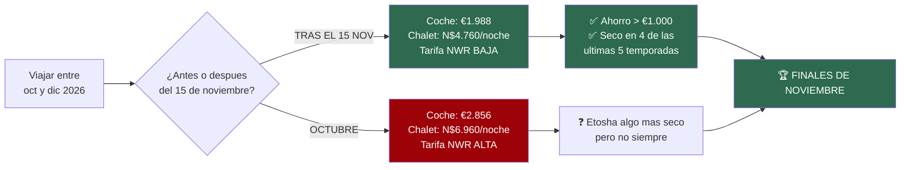
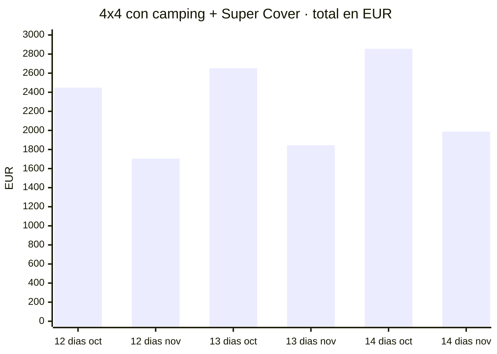
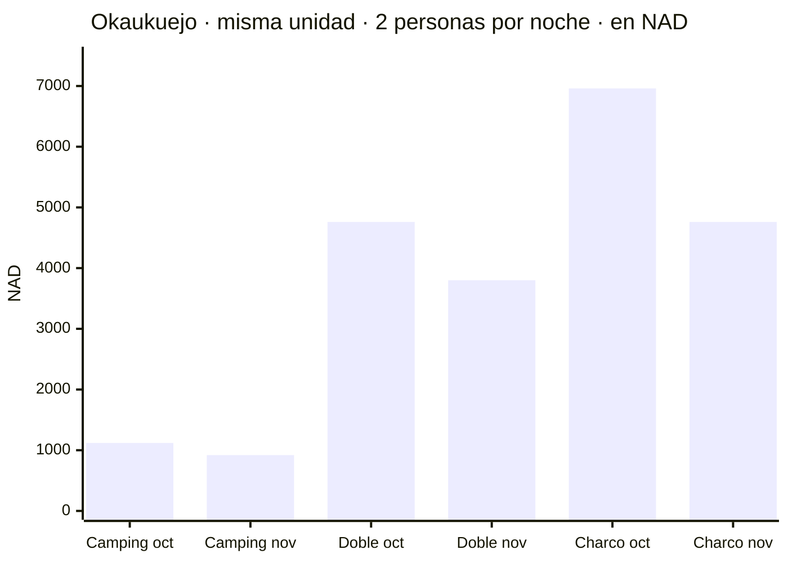
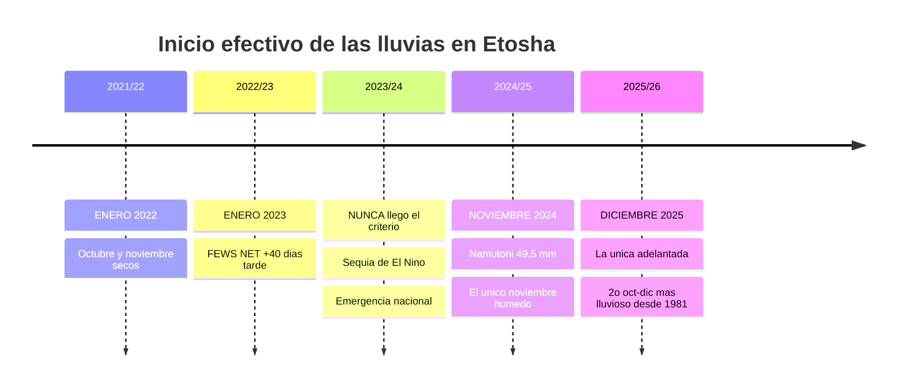
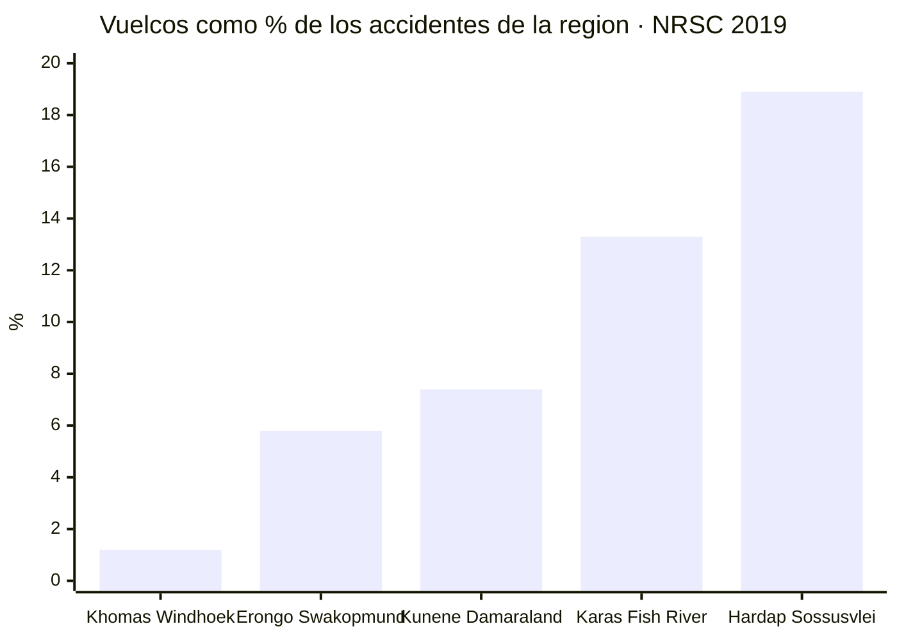
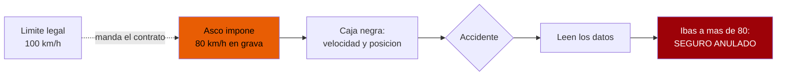
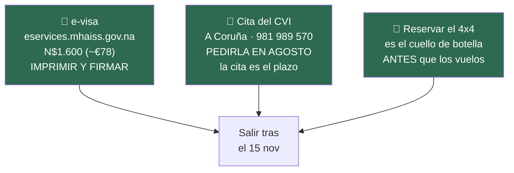
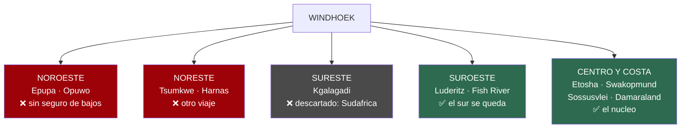
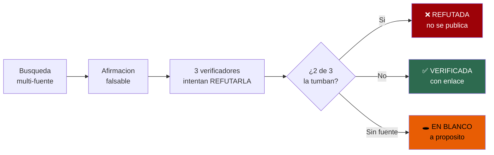

# 🇳🇦 Namibia 2026

### 4x4 por libre · dos personas · 14 días · desde A Coruña

**Etosha · Sossusvlei · Fish River Canyon · Damaraland · Costa de los Esqueletos**

*Investigación verificada contra fuentes primarias · Actualizado 17·07·2026*

---

## ⚖️ El veredicto

> # Salir después del 15 de noviembre.
> ### El dinero lo dice claro. Los años reales de lluvia lo confirman.

**Dos fronteras de temporada caen en la misma semana** y las dos empujan a lo mismo:

1. **El alquiler del 4x4** baja de **€179/día** a **€117/día** el **14/15 de noviembre**
2. **NWR** (campings y lodges estatales) factura por **año tarifario de noviembre a octubre**, así
   que el **1 de noviembre** cambia de tramo

**Juntas valen más de €1.000 (~N$20.000).** Y lo mejor: los datos de lluvia observados dicen que
**a finales de noviembre Etosha suele estar seco**. Diciembre es donde se tuerce.

---

## 💰 El precipicio de precio

El coche **no hace falta los 14 días** — los de vuelo se van en trayecto. Y la tarifa/día de Asco es
**idéntica en toda la banda de 6–15 días**, así que solo cambia el número de días:

- **12 días** → octubre **€2.448 (~N$48.960)** · **tras 15 nov €1.704 (~N$34.080)** · ahorro **€744**
- **13 días** → octubre **€2.652 (~N$53.040)** · **tras 15 nov €1.846 (~N$36.920)** · ahorro **€806**
- **14 días** → octubre **€2.856 (~N$57.120)** · **tras 15 nov €1.988 (~N$39.760)** · ahorro **€868**

> ℹ️ Totales = **cálculo propio** sobre las tarifas verificadas (€179/día hasta el 14 nov, €117/día
> desde el 15). El **Super Cover exige más de 10 días**: 12, 13 y 14 cumplen. Si el viaje **cruza**
> el 15 de noviembre, en Namibia es habitual **prorratear**.

### Y en alojamiento la bajada es aún mayor

**El chalet del charco de Okaukuejo baja N$2.200 (~€110) por noche.** En 14 días, cientos de euros.

---

## 🌧️ Cuándo llueve de verdad — año a año

> **Las medias mienten.** El Atlas de Namibia avisa: la lluvia es *"erratic"*, con *"a high degree of
> variation"*. Los ~25 mm de media de noviembre esconden años sin una gota hasta enero.
> Así que fuimos a los **datos observados** de las 5 últimas temporadas.

> ### 🎯 En **4 de las últimas 5 temporadas**, un viaje a finales de noviembre habría pillado Etosha seco.

**Y la dispersión es brutal:** en la misma temporada 2021/22, **Waterberg** tuvo su primera lluvia
útil el **20 de octubre** y **Khorixas** el **20 de enero** — tres meses, mismo país.

👉 Si llueve, será **local y disperso**, no un monzón. **Pon Etosha al principio del recorrido.**

📖 Detalle completo, mm mes a mes y los dos criterios de inicio → [`09-lluvias-histórico`](09-lluvias-historico.md)

---

## ⚠️ Lo que de verdad te puede hacer daño

### 🔄 El vuelco: el 37 % de los muertos con el 4,6 % de los accidentes

- **857 vuelcos (4,6 %)** → **152 muertos = 36,8 % del total del país**
- **17,7 muertos por cada 100 vuelcos**, frente a **0,64** del choque más común → **~28× más letal**
- **En Hardap (Sossusvlei), 1 de cada 5 accidentes es un vuelco.** En Windhoek, 1 de cada 80.

> **El peligro no es el tráfico de la capital: es la pista vacía, rápida y preciosa donde te sientes
> más seguro.**

### 🛡️ El seguro, no la tarifa

Todos los niveles **salvo el más alto** excluyen justo lo que se rompe en grava: **neumáticos,
cristales, bajos y accidentes sin terceros**.

- Un **vuelco sin terceros** expone a **~N$165.000 (~€8.250)** + rescate
- Savanna, literal: *"Also not when you tried to avoid hitting an animal crossing the road"*
- **Asco Super Cover** (€25/día) cubre bajos… **pero los excluye en Damaraland y Kaokoveld**
- **La franquicia NO limita el coste de rescate** (cláusula 10.5.7) — **ni con Super Cover**
- En las pistas **D3707 y D3703** pagas **todo** aunque tengas Super Cover
- 🚫 ***Dune driving* y Sandwich Harbour: estrictamente prohibidos.** Anulan la cobertura entera

### 📻 80 km/h en grava, con caja negra

👉 **Cualquier itinerario de internet calculado a 100 va ~20 % optimista.**

### 🏥 No hay hospital cerca de Sesriem

Windhoek a **~320 km**, Walvis Bay a **~270** — ambos **4+ horas** a 80 km/h. Un trauma grave allí es
**evacuación aérea o mucho tiempo**. Por eso el seguro con **repatriación** (que es condición de
entrada) debe cubrir **evacuación aérea dentro del país**, y por eso un **satelital con SOS** no es
lujo: sin cobertura móvil, es lo único que dispara el rescate.

📖 Todo el detalle → [`05-conducción`](05-conduccion.md) · [`07-logística`](07-logistica.md)

---

## 🎯 Los tres imprescindibles antes de reservar

> ### ⚠️ **`namibia-evisa.com` NO es el Gobierno.**
> Se anuncia como *"Official Electronic Travel Authorization"* y **te va a cobrar de más**.
> **Solo `.gov.na` es oficial.** Y espera que el sitio real parezca roto: sirve una cadena TLS
> incompleta. Un aviso de certificado **ahí** es mala configuración, no fraude — pero **verifica que
> el dominio pone exactamente `eservices.mhaiss.gov.na`** antes de teclear la tarjeta.

**Malaria:** ✅ **Etosha SÍ es zona de riesgo** (CDC: Kunene, Oshikoto, Oshana, Omusati,
Otjozondjupa). **El sur, no.** El fármaco marca la cuenta atrás: **Malarone** empieza 1–2 días antes;
**mefloquina, 2–3 semanas**.

**Fiebre amarilla:** una escala **corta y sin salir del aeropuerto** en Adís **no** la exige.
Pero la exención de la OMS es **conjuntiva** (<12 h **y** airside): la parada gratis en ciudad de
Ethiopian **pasa inmigración** y podría romperla.

📖 Cuenta atrás completa → [`03-guía-preparación`](03-guia-preparacion.md)

---

## 📚 Los documentos

```mermaid
flowchart TD
    R["README<br/>estas aqui"]
    R --> D1["01 · Hallazgos verificados<br/>alquiler · seguros · visado · tasas"]
    R --> D2["02 · Alojamiento y tasas<br/>tarifas NWR 2026/27"]
    R --> D3["03 · Guia de preparacion<br/>cuenta atras · normas"]
    R --> D5["05 · Conduccion<br/>vuelcos · contrato · presiones"]
    R --> D6["06 · Lista Google Maps<br/>34 pines triados"]
    R --> D7["07 · Logistica<br/>combustible · distancias · dinero"]
    R --> D9["09 · Lluvias historico<br/>5 temporadas observadas"]
    R -.-> D4["04 · Itinerario<br/>🔬 en curso"]
    R -.-> D8["08 · Huecos cerrados<br/>🔬 en curso"]
    R -.-> D10["10 · Presupuesto<br/>🔬 en curso"]
    style D1 fill:#2d6a4f,color:#fff
    style D2 fill:#2d6a4f,color:#fff
    style D3 fill:#2d6a4f,color:#fff
    style D5 fill:#2d6a4f,color:#fff
    style D6 fill:#2d6a4f,color:#fff
    style D7 fill:#2d6a4f,color:#fff
    style D9 fill:#2d6a4f,color:#fff
    style D4 fill:#e85d04,color:#000
    style D8 fill:#e85d04,color:#000
    style D10 fill:#e85d04,color:#000
```

- ✅ [**`01-hallazgos-verificados`**](01-hallazgos-verificados.md) — alquiler 4x4, niveles de seguro, visado, tasas de parques, y **lo refutado**
- ✅ [**`02-alojamiento-y-tasas`**](02-alojamiento-y-tasas.md) — tarifas oficiales NWR 2026/2027, la trampa del año tarifario
- ✅ [**`03-guia-preparacion`**](03-guia-preparacion.md) — cuenta atrás, e-visa, vacunas, Kolmanskop, normas
- 🔬 `04-itinerario` — ruta día a día y veredicto de viabilidad *(en curso)*
- ✅ [**`05-conduccion`**](05-conduccion.md) — vuelcos, cláusulas del contrato, presiones, puertas de Sesriem
- ✅ [**`06-lista-google-maps`**](06-lista-google-maps.md) — tus 34 pines, ordenados y triados
- ✅ [**`07-logistica`**](07-logistica.md) — combustible, distancias, Línea Roja, cobertura, dinero, emergencias
- 🔬 `08-huecos-cerrados` — temperaturas, vuelos, lodges, tasas oficiales *(en curso)*
- ✅ [**`09-lluvias-historico`**](09-lluvias-historico.md) — las 5 últimas temporadas, mm a mm
- 🔬 `10-presupuesto` — camping vs lodges *(en curso)*

---

## 🗺️ Tus 34 pines de Google Maps

> **La lista no cabe en 14 días.** Va de Epupa (frontera con Angola) a Lüderitz a Tsumkwe: **los
> extremos son direcciones opuestas** desde Windhoek. No es una crítica — es una lista excelente de
> **país entero**. Toca **triar**.

**Decisiones tomadas:** ✅ el sur se queda · ❌ no se cruza a Sudáfrica

**Encajan casi gratis** *(están de camino)*: Joe's Beerhouse · Solitaire · Sesriem Canyon ·
Duna 45 · Quiver Tree Forest · Canyon Roadhouse · Spitzkoppe · Okonjima

**Cuestan desvío asumible**: Cape Cross · Brandberg · Waterberg · Hoba Meteorite · NamibRand ·
Bagatelle

**Son otro viaje**: 🔴 Epupa + Opuwo *(y sin cobertura de bajos)* · Tsumkwe · Harnas

📖 Análisis completo → [`06-lista-google-maps`](06-lista-google-maps.md)

---

## 🔬 Cómo se ha hecho esto

> ## Regla número uno: **cero invenciones**

Cada dato se verifica contra su fuente primaria y pasa por verificadores independientes cuyo trabajo
es **refutarlo**. Hacen falta **2 de 3** para tumbarlo. Marcamos: ✅ **primaria** · ◐ **secundaria** ·
○ **práctica común sin fuente**.

**Han caído 9 de 25 y 12 de 76 afirmaciones** en distintas pasadas — varias repetidas por toda la
web y capaces de costar dinero real:

- ❌ Tasas de parques **N$150/día** → ✅ **~N$280 (~€14)** desde abril de 2026
- ❌ La tarifa NWR que citan todos los blogs → ✅ **caduca antes de que aterricemos**
- ❌ Hobas **N$510** → ✅ **N$480**; el 510 era de Olifantsrus, columna de al lado de un PDF
- ❌ *"Las gasolineras no aceptan tarjeta"* → ✅ **sí la aceptan**; *"credit"* ahí significa **a cuenta**
- ❌ El FCDO pide **2 repuestos** en grava → ✅ solo **en temporada de lluvias enero–abril**
- ❌ Todas las temperaturas de webs de safaris → ✅ **refutadas 0–3**, siguen sin fuente seria

> ### Lo que no se ha podido verificar **se deja en blanco a propósito**.
> Un hueco reconocido es mejor que un número plausible: **los números plausibles se acaban usando
> para pagar**.
>
> Y ojo: **que algo se refute no hace cierto lo contrario**. Cuando cayó la afirmación sobre la
> malaria, no significaba que Etosha estuviera libre — significaba que **no lo sabíamos**. Ahora sí:
> **lo es**.

---

### 🕳️ Lo que sigue faltando

**El itinerario con tiempos reales** · **Temperaturas con fuente meteorológica** · **Vuelos** · **Presupuesto**

*Tasas de parques: el ~N$280 se apoya solo en fuente secundaria — el MEFT sigue sirviendo la tabla
de 2021. **Confírmalo por email antes de cerrar presupuesto.***

---

**Tipo de cambio: ~N$20 = €1** *(rango observado N$19,5–20,5, a 17·07·2026)*
El NAD está vinculado al rand y fluctúa: **el importe en N$ es el que se paga**, el euro es orientativo.

*Todos los precios en N$ y € · Las tarifas namibias cambian: reconfirma antes de pagar*

