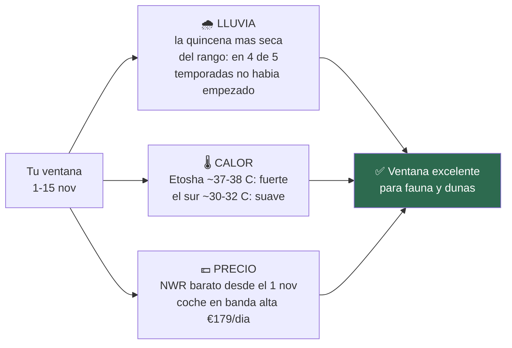
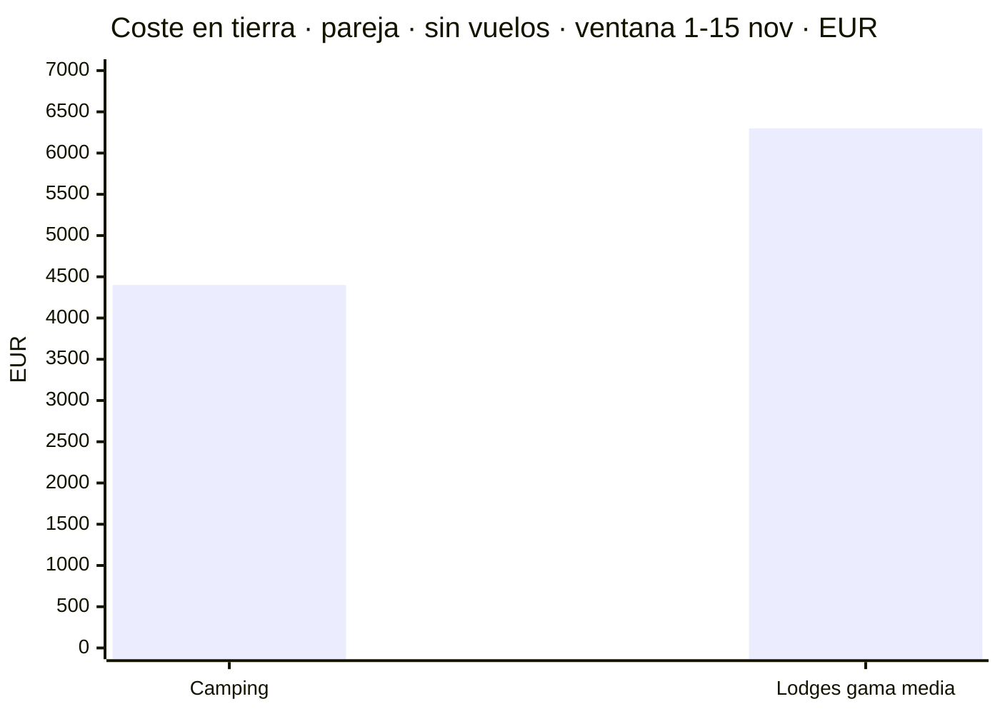
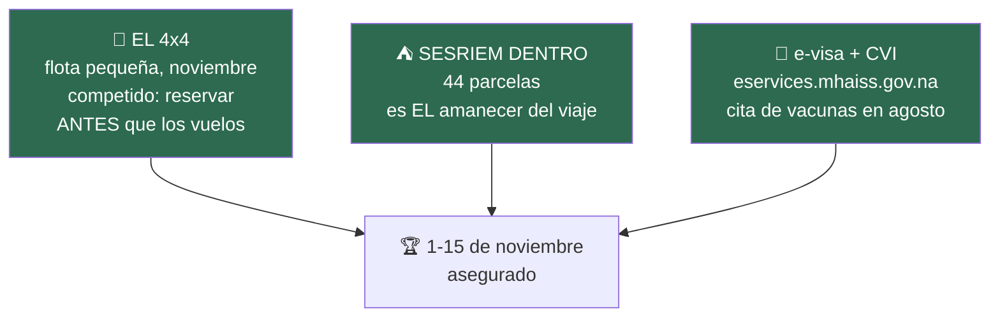
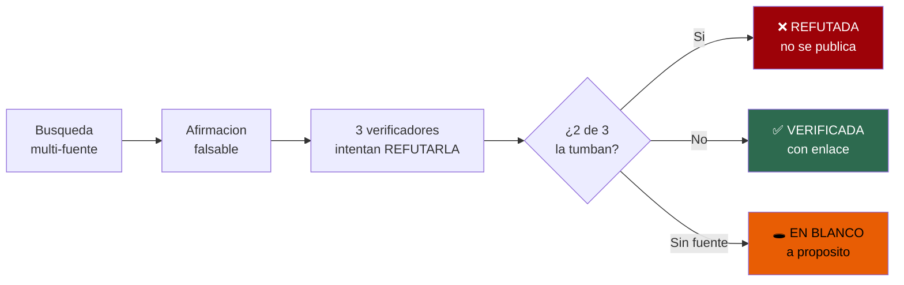

# 🇳🇦 NAMIBIA 2026

## El gran roadtrip

**Dos personas · un 4x4 con tienda de techo · 14 días · primera quincena de noviembre**

*Las dunas más altas del mundo al amanecer · un cañón de 550 metros · rinocerontes bebiendo
de noche a diez metros · la carretera más bonita de África*

Todo verificado contra fuentes primarias. Precios en N$ y €. Actualizado 17·07·2026.

---

## ⭐ La ruta del viaje

> # Sossusvlei y Etosha, en el mismo viaje. Y el cañón también.
> ### La Variante D: las dos coronas + Fish River, en 14 días que salen.

```mermaid
flowchart LR
    W["WINDHOEK<br/>D1"] --> K["KEETMANSHOOP<br/>kokerbooms · D2"]
    K --> F["FISH RIVER<br/>Hell's Bend · D3-D4"]
    F --> G["GARUB caballos<br/>+ D707 · D4-D5"]
    G --> S["SESRIEM<br/>Deadvlei amanecer · D5-D6"]
    S --> C["SWAKOPMUND<br/>costa y descanso · D7-D8"]
    C --> P["SPITZKOPPE<br/>estrellas · D9"]
    P --> E["ETOSHA<br/>3 dias de safari · D10-D12"]
    E --> W2["WINDHOEK<br/>D13-D14"]
    style S fill:#C2542F,color:#fff
    style E fill:#C2542F,color:#fff
    style F fill:#C2542F,color:#fff
```

**~3.100 km · 13 días de coche · 4 días de conducción fuerte (2 de ellos en cómodo asfalto)**

El circuito que lo quería *todo* pedía 16–18 días. Con **Sossusvlei y Etosha fijos**, la tijera se
aplicó al sur con criterio — y lo que queda es un viaje redondo:

### ✂️ Qué se quitó del sur, y por qué

- **Ai-Ais** *(ahorra ~½ día, pierdes casi nada)*: las fuentes termales del **fondo** del cañón —
  más calor que el borde, grava bacheada, y el sendero cerrado en noviembre de todas formas.
  **Los miradores, que son el espectáculo, están arriba y se quedan.**
- **Lüderitz y Kolmanskop** *(ahorra ~2 días: la tijera que cierra el círculo)*: Lüderitz es un
  fondo de saco de 334 km que hay que deshacer, y Kolmanskop merece un día entero. Esos ~2 días son
  exactamente los que necesita el safari de Etosha. **Es la renuncia dolorosa del viaje** — la
  ciudad fantasma queda para otra vez *(todo lo suyo está documentado en `03` por si el plan
  cambia)*.

### 🚫 Y qué se salvó, porque cuesta poco y vale mucho

**Los miradores del Fish River** · **los caballos salvajes de Garub** *(desvío corto desde Aus,
de camino)* · **la D707 entera** *(no es desvío: ES la carretera hacia Sesriem)* · **el bosque de
kokerbooms** *(14 km de Keetmanshoop, gratis en tiempo)*.

📖 **El día a día completo, con dónde dormir y precios** → [`11-itinerarios-dia-a-dia`](11-itinerarios-dia-a-dia.md)

---

## ✨ Los momentos que hacen este viaje

- 🌅 **El amanecer en Deadvlei que casi nadie consigue.** La puerta interior de Sesriem abre **1 hora
  antes** que la exterior — solo para quien duerme dentro (**N$1.340 · ~€67** los dos). Árboles
  negros de 900 años, la duna encendiéndose, y los demás todavía en la cola de la otra puerta. ✅
- 🦏 **La charca iluminada de Okaukuejo.** Rinocerontes negros, elefantes y jirafas bebiendo de noche
  con el parque cerrado y tú dentro. Camping **N$920 (~€46)**; el capricho del **chalet del charco**,
  **N$4.760 (~€238)** — en tu ventana, tarifa baja. ✅
- 🐘 **Safari en seco.** Primera quincena de noviembre: el parque estuvo **seco en 4 de las últimas
  5 temporadas** — la fauna concentrada en las charcas, que es exactamente lo que quieres. ✅
- 🏞️ **Hell's Bend al atardecer y al amanecer.** 160 km de cañón, 550 m de caída, y el sendero
  cerrado significa una cosa: **el borde para ti**. ✅
- 🛣️ **La D707**, 123 km entre las dunas del Namib y las montañas Tiras — con noche en las Tiras a
  mitad de camino, sin prisa. ◐
- 🐎 **Los caballos salvajes de Garub**, la única manada del desierto, junto a la B4. ✅
- 🌳 **Los kokerbooms al atardecer** — ~250 árboles aljaba y uno de los grandes cielos de astrofoto
  del país. Sale gratis: está de camino. ✅
- 🌌 **Las estrellas de Spitzkoppe.** Granito de 1.700 m, arcos de piedra, noche sin luna en el
  desierto. Pocas quedan así en el mundo. ◐
- 🥧 **La tarta de manzana de Solitaire** — la parada más famosa del desierto, y el repostaje que
  salva el día: después hay **210 km sin nada**. ✅
- 🦩 **Flamencos en Walvis Bay y ostras en Swakopmund** en el día de descanso — con **Cape Cross**
  (decenas de miles de lobos marinos) como excursión opcional por la costa. ✅
- 🍺 **Joe's Beerhouse** en Windhoek, la primera y la última cena. N$200–400 (~€10–20). ✅

---

## 📅 Tu ventana: 1–15 de noviembre

Las fechas vienen dadas — primera quincena de noviembre, con opción de adelantar unos días. Esto es
lo que significan, con datos:

- 🌧️ **Lluvia: la mejor noticia.** La primera quincena de noviembre es **aún más seca** que finales
  de mes: en las últimas 5 temporadas, el inicio real de las lluvias en Etosha cayó en **enero tres
  veces, diciembre una y noviembre una** *(y esa, en la segunda mitad)*. Charcas llenas de fauna,
  cielos limpios.
- 🌡️ **Calor: Etosha aprieta, el sur acompaña.** El norte estará a **~37–38 °C** de máxima — el
  safari se hace al amanecer y al atardecer, con siesta y charca iluminada de noche, que es como se
  hace bien de todas formas. El sur, a ~30–32 °C. Noches de 15–18 °C: **forro polar, no plumas**.
- 💶 **Precio: la frontera del 1 de noviembre.** NWR cambia a su **tramo barato el 1 de noviembre**:
  empezando ese día, todas las noches de Hobas, Sesriem y Etosha van en tarifa baja.
  👉 **¿Adelantar días a octubre? Hasta 2 días es gratis** — las primeras noches (Windhoek,
  Keetmanshoop) no son NWR y el sur está fresco en octubre. Más allá, cada noche NWR de octubre paga
  la tarifa vieja (+N$200 el camping, +N$2.200 el chalet del charco).
- 🚗 **El coche va en banda alta** (€179/día — la banda de €117 empieza el 15 de noviembre, fuera de
  tu ventana): **12 días €2.448 · 13 días €2.652 · 14 días €2.856**, Super Cover incluido.
  *(Dato, no reproche: la flexibilidad tras el 15 habría valido ~€800.)*

---

## 💶 El presupuesto

- 🏕️ **Camping** — **~€4.400 (~N$88.000)** la pareja · **~€2.200/persona** ○
- 🛖 **Lodges gama media** — **~€6.300 (~N$126.000)** la pareja · **~€3.150/persona** ○
- ✈️ **Vuelos** — ~€1.400–1.800 la pareja ❌ *sin verificar para tus fechas*

Partidas firmes dentro de eso: **alquiler 13 días + Super Cover €2.652** ✅ · noches NWR de la ruta
**N$6.400 (~€320)** ✅ · tasas de parque **~N$3.700–4.300 (~€185–215)** ◐ *(~N$620 los dos + coche,
por parque y día — el N$150 de internet es de 2021)* · combustible **~N$9.500–10.500 (~€475–525)** ○
· visado **N$3.200 (~€160)** ✅.

> ℹ️ Totales recalculados para tu ventana desde [`10-presupuesto`](10-presupuesto.md) *(que estaba
> hecho con el coche en banda baja)*; heredan sus partidas estimadas de comida y actividades.

---

## 🎯 Las tres reservas que hacen el viaje

1. **El 4x4 primero.** Los doble cabina con tienda de techo son una flota pequeña y noviembre está
   competido. **Una ruta sin coche no es una ruta**: resérvalo antes que los vuelos.
2. **Sesriem, dentro de la puerta — y las noches de Etosha.** Solo **44 parcelas** en Sesriem; es la
   diferencia entre *ver* Deadvlei y *tenerlo para ti*. Y los campamentos de Etosha para D10–D12.
3. **Los papeles con calendario.** El **e-visa (N$1.600, ~€78)** se pide online y **se imprime y
   firma ante el oficial** — solo en `eservices.mhaiss.gov.na` ⚠️ *(`namibia-evisa.com` parece
   oficial y no lo es; el portal real puede dar un aviso de certificado — es mala configuración
   suya: verifica el dominio y sigue)*. La **cita del Centro de Vacunación** (A Coruña, Durán
   Lóriga 3 · **981 989 570**) se pide **en agosto**: la cita es el recurso escaso.

**Y tres datos médicos que se resuelven en una tarde:**
- **Malaria**: Etosha **sí** es zona (CDC); el sur, **no** — y a primeros de noviembre, antes de las
  lluvias, el riesgo está en su mínimo estacional. Malarone empieza 1–2 días antes; mefloquina, 2–3
  semanas: el fármaco marca el calendario.
- **Fiebre amarilla**: escala corta y sin salir del aeropuerto en Adís = no hace falta. Doha,
  Fráncfort y Johannesburgo, limpios. *(La parada gratis en ciudad de Ethiopian pasa inmigración y
  puede romper la exención.)*
- **Seguro con repatriación**: es **condición de entrada**. Pide por escrito que cubra evacuación
  aérea dentro del país — cerca de Sesriem no hay hospital (Windhoek a ~320 km), y esa cláusula
  convierte cualquier percance en una anécdota.

---

## 🧭 Conducir Namibia como un local

El roadtrip **es** el viaje: pistas infinitas, horizontes de 60 km, polvo dorado al atardecer.
Cuatro reglas lo hacen redondo:

- **80 km/h en grava** — límite contractual (el legal es 100), registrado por caja negra. Con
  corrugado, la media real son 60–70. **Todos los tiempos de este repo ya van así**: cualquier
  itinerario de internet calculado a 100 es un 20 % más optimista que tu realidad.
- **Nunca pases de largo una gasolinera.** Solitaire, Khorixas, Kamanjab, Outjo, Otjiwarongo: se
  reposta en todas, marque lo que marque la aguja. Las tarjetas **sí** se aceptan *(el «solo
  efectivo» es un mito de mala traducción)*, pero lleva **~N$4.000 (~€200)** de reserva.
- **Llega a las 18:00.** Anochece ~19:15 y la fauna sale a los arcenes al atardecer. Los días de la
  ruta están diseñados para acabar con sol — y con tiempo para el sundowner.
- **Super Cover (€25/día) y sus dos letras pequeñas**: no cubre bajos en Damaraland/Kaokoveld, y en
  las pistas **D3707/D3703** pagas todo — **que no son la D707** de la ruta, cubierta como cualquier
  grava. *Dune driving* y Sandwich Harbour, **prohibidos por contrato**: Sandwich Harbour se hace en
  tour guiado, que además es mejor plan.

Extras que ahorran sorpresas: enchufes **tipo M** *(2 adaptadores online — el Schuko no entra)* ·
**SIM de MTC** en el aeropuerto con pasaporte *(el kiosco cierra ~21:00)* · zonas sin cobertura —
un **satelital con SOS** es buena compañía en el Namib · la **Línea Roja**: la carne cruda sube al
norte pero no baja — el braai se come en Etosha · los **N$ sobrantes se cambian antes de volar**.

---

## 📚 El dossier completo

- ✅ [**`01-hallazgos-verificados`**](01-hallazgos-verificados.md) — alquiler, seguros, visado, tasas, y lo refutado
- ✅ [**`02-alojamiento-y-tasas`**](02-alojamiento-y-tasas.md) — tarifas oficiales NWR 2026/2027
- ✅ [**`03-guia-preparacion`**](03-guia-preparacion.md) — cuenta atrás, e-visa, vacunas, normas
- ✅ [**`04-itinerario`**](04-itinerario.md) — distancias, firme, tiempos y viabilidad
- ✅ [**`05-conduccion`**](05-conduccion.md) — contrato, presiones, arena, puertas de Sesriem
- ✅ [**`06-lista-google-maps`**](06-lista-google-maps.md) — tus 34 pines, medidos y triados
- ✅ [**`07-logistica`**](07-logistica.md) — combustible, distancias, dinero, cobertura
- ✅ [**`08-huecos-cerrados`**](08-huecos-cerrados.md) — temperaturas medidas, vuelos, tasas 2026
- ✅ [**`09-lluvias-historico`**](09-lluvias-historico.md) — 5 temporadas de lluvia, mm a mm
- ✅ [**`10-presupuesto`**](10-presupuesto.md) — camping vs lodges, en N$ y €
- ⭐ [**`11-itinerarios-dia-a-dia`**](11-itinerarios-dia-a-dia.md) — **la Variante D día a día** + la tijera del sur + A/B de referencia

### 🗺️ Tus 34 pines, en una línea

**En la ruta D**: Joe's Beerhouse · kokerbooms · Fish River · Garub · D707 · Sesriem Canyon ·
Duna 45 · Deadvlei · Solitaire · Swakopmund · Walvis Bay · Spitzkoppe · Etosha.
**Opcionales de la D**: Cape Cross *(desde la costa)* · Twyfelfontein *(a cambio de un día de
safari)* · Okonjima o Waterberg *(de camino a la vuelta)*. **Fuera esta vez**: Kolmanskop y
Lüderitz *(la renuncia)* · Ai-Ais · Epupa/Opuwo · Tsumkwe · Harnas · Kgalagadi *(no se cruza a
Sudáfrica)* · Elizabeth Bay. ℹ️ Twyfelfontein y Duna 45 salen en Google como cerrados: **fallo del
listado, ambos funcionan**.

---

## 🔬 Por qué puedes fiarte de estos números

**Regla número uno: cero invenciones.** Cada dato viene de una fuente descargada y pasa por
verificadores independientes cuyo trabajo es tumbarlo. Por el camino cayeron perlas que circulan por
toda la web: las tasas de parque a N$150 *(son ~N$280 desde abril de 2026)*, la tarifa NWR de los
blogs *(caduca antes de aterrizar)*, el precio de Hobas *(N$480, no N$510)*, el mito del «solo
efectivo» en gasolineras, y **todas** las temperaturas de las webs de safaris — rehechas con datos
de estación meteorológica.

> **Lo que no se pudo verificar está en blanco y dicho**: los vuelos para tus fechas, los lodges
> privados por noche y seis etapas cuyos km esperan reconfirmación. Y las tasas de parque (~N$280)
> se apoyan aún en fuente secundaria: **confírmalas por email antes de cerrar presupuesto.**

---

**Tipo de cambio: ~N$20 = €1** *(rango N$19,5–20,5, a 17·07·2026)*
El NAD va ligado al rand: **el importe en N$ es el que se paga**, el euro es orientativo.

*Todos los precios en N$ y € · Las tarifas namibias cambian: reconfirma antes de pagar*

