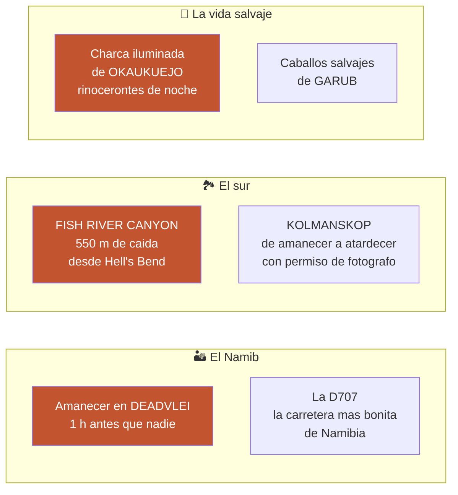
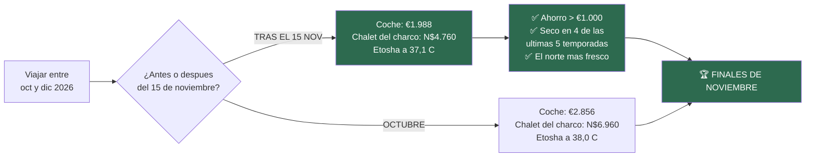
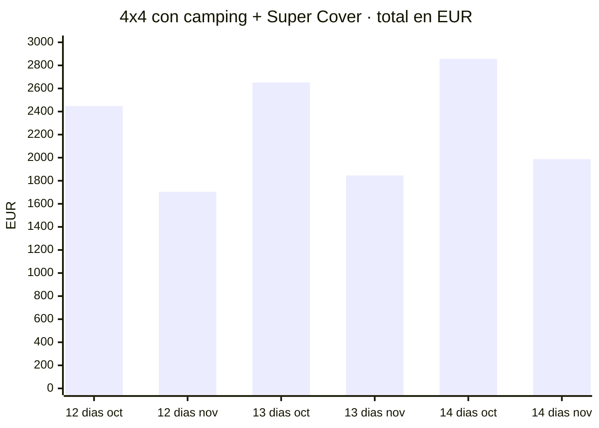
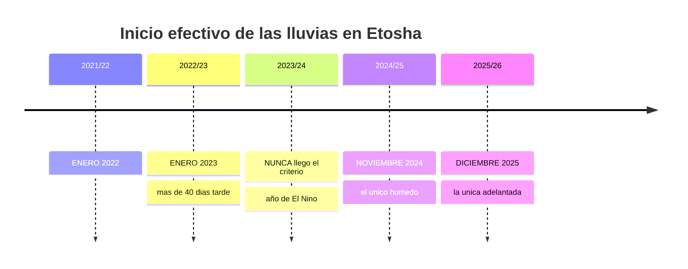
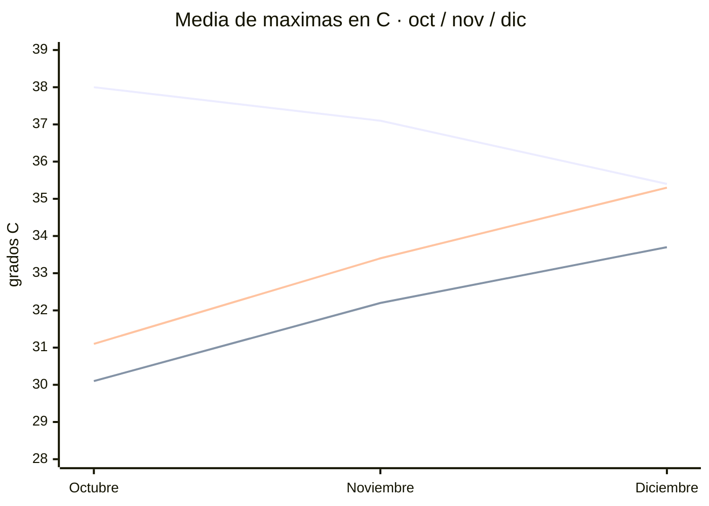
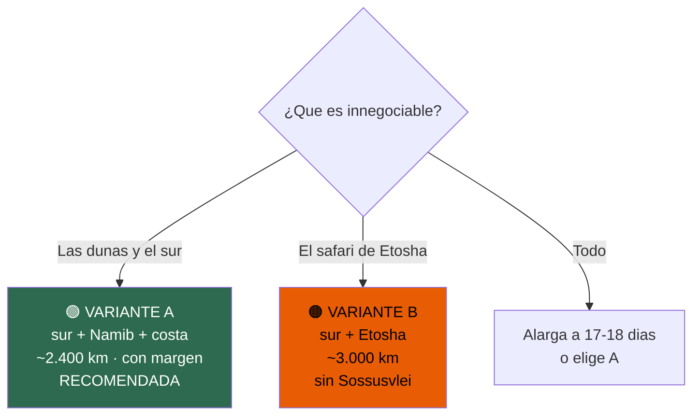
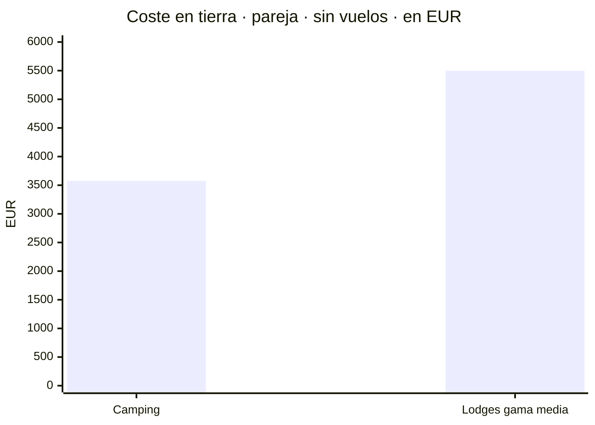
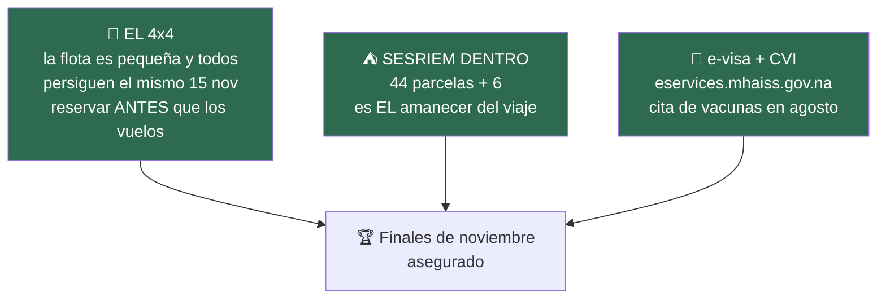
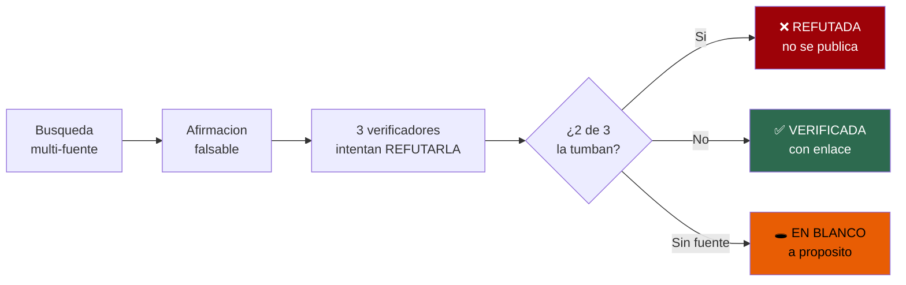

# 🇳🇦 NAMIBIA 2026

## El gran roadtrip

**Dos personas · un 4x4 con tienda de techo · 14 días · finales de noviembre**

*Las dunas más altas del mundo al amanecer · un cañón de 550 metros · una ciudad fantasma
tragada por la arena · las charcas de Etosha al anochecer · la carretera más bonita de África*

Todo verificado contra fuentes primarias. Precios en N$ y €. Actualizado 17·07·2026.

---

## ✨ Los momentos que hacen este viaje

- 🌅 **El amanecer en Deadvlei que casi nadie consigue.** La puerta interior de Sesriem abre **1 hora
  antes** que la exterior — pero **solo si duermes dentro** (Sesriem Campsite, **N$1.340 (~€67)** los
  dos). Los que duermen fuera llegan con el sol ya alto: son 60 km más la arena. Tú estarás solo
  entre los árboles negros de 900 años cuando la luz encienda la duna. ✅
- 📷 **Kolmanskop en tu propia luz.** El ticket normal (N$230, ~€11,50) te encierra en la franja del
  tour, a mediodía. El **permiso de fotógrafo — N$480 (~€24) — te da la ciudad fantasma de amanecer a
  atardecer**, con las habitaciones llenas de arena en luz rasante. Se compra la víspera en Lüderitz
  (Desert Deli). ✅
- 🦏 **La charca iluminada de Okaukuejo.** El espectáculo nocturno más famoso de África austral:
  rinocerontes negros, elefantes y jirafas bebiendo a diez metros, con el parque cerrado y tú dentro.
  El **chalet del charco** cuesta **N$4.760 (~€238)/noche** los dos en tus fechas — **N$2.200 menos
  que en octubre**. El camping, **N$920 (~€46)**. ✅
- 🛣️ **La D707.** 123 km de grava entre las dunas del Namib y las montañas Tiras. Muchos la llaman la
  carretera más bonita del país — y en la ruta recomendada te la comes entera, sin prisa. ◐
- 🐎 **Los caballos salvajes del Namib en Garub**, camino de Lüderitz por la B4. Parada obligada. ✅
- 🏞️ **Hell's Bend**: el meandro del Fish River Canyon desde el mirador principal. 160 km de largo,
  27 de ancho, 550 m de caída. En noviembre el sendero está cerrado — **el cañón es tuyo desde el
  borde, sin los senderistas**. ✅
- 🌳 **El bosque de kokerbooms al atardecer** — ~250 árboles aljaba a 14 km de Keetmanshoop. Con la
  Vía Láctea encima es uno de los sitios de astrofoto del país. **Sale gratis en tiempo**: está de
  camino. ✅
- 🌌 **Las estrellas de Spitzkoppe** — granito de 1.700 m, arcos de piedra y uno de los cielos más
  oscuros que verás nunca. Y **NamibRand** es reserva internacional de cielo oscuro. ◐
- 🦭 **Cape Cross**: decenas de miles de lobos marinos. Y la travesía de la **Costa de los
  Esqueletos** (Ugabmund → Springbokwasser) con **permiso de tránsito gratuito**, sin reserva. ✅
- 🥧 **La tarta de manzana de Solitaire** — la parada más famosa del desierto. Y de paso, el
  repostaje que te salva: después son **210 km sin nada** hasta la costa. ✅
- 🦩 **Flamencos y pelícanos en Walvis Bay**, ostras en Swakopmund, y un día entero de descanso en la
  ciudad más alemana de África. ✅
- 🍺 **Joe's Beerhouse** en Windhoek — la primera y la última cena del viaje. N$200–400 (~€10–20). ✅

---

## ⚖️ La jugada maestra: cuándo ir

> # Finales de noviembre.
> ### Más barato, más fresco en Etosha, y casi siempre seco. Las tres cosas a la vez.

**Dos fronteras de temporada caen en la misma semana**, y las dos juegan a tu favor:

1. **El alquiler del 4x4 se desploma el 14/15 de noviembre**: de €179/día a **€117/día**
2. **NWR cambia de año tarifario el 1 de noviembre**: el chalet del charco baja **N$2.200/noche**

**Juntas valen más de €1.000 (~N$20.000)** en un viaje de dos semanas.

### El coche, calculado a tu medida

El coche no hace falta los 14 días — los de vuelo se van en trayecto — y la tarifa/día es idéntica
en toda la banda de 6–15 días:

- **12 días** → **€1.704 (~N$34.080)** · ahorras €744 frente a octubre
- **13 días** → **€1.846 (~N$36.920)** · ahorras €806
- **14 días** → **€1.988 (~N$39.760)** · ahorras €868

> ℹ️ Totales = cálculo propio sobre tarifas verificadas de Asco (€179/€117 por día + Super Cover
> €25/día, que exige **más de 10 días** — 12, 13 y 14 cumplen). Si el viaje cruza el 15/11, es
> habitual prorratear. La tienda de techo, nevera, mesa, sillas y menaje **van incluidos**: el
> equipo de camping son €7/día de diferencia sobre el mismo coche desnudo.

### Y el clima lo confirma — con datos, no con folletos

**La lluvia, año a año** *(caja CHIRPS sobre Okaukuejo + datos del Servicio Meteorológico namibio)*:

> 🎯 **En 4 de las últimas 5 temporadas, un viaje a finales de noviembre habría pillado Etosha seco**
> — con la fauna todavía concentrada en las charcas. Y si llueve, será local y disperso, no un
> monzón: por eso la ruta pone **Etosha al principio**.

**El calor, medido sobre estaciones reales** *(NOAA GHCN-Daily + SASSCAL — las cifras de las webs de
safaris fueron todas refutadas y rehechas)*:

*Etosha (línea alta) **baja** hacia diciembre · Fish River y Keetmanshoop **suben**.*

> El famoso *"suicide month"* depende de la latitud: en Etosha el pico es **octubre** (38,0 °C); en
> el sur son **nov/dic**. **Noviembre es el compromiso perfecto: ni el pico del norte ni el del
> sur.** En el mirador del cañón te esperan ~32 °C de media — calor de desierto, no un horno.

---

## 🗺️ La ruta: tres formas de hacerlo

La geografía manda: el circuito que lo quiere todo son **~3.200 km de tránsito** — 11 días solo
moviéndote, más 4–5 días quietos para *vivir* los sitios. **16–18 días para hacerlo bien.** Tienes
14. Así que se elige, y se elige con números:

### 🟢 A — El sur completo, el Namib y la costa *(la recomendada)*

Keetmanshoop y los kokerbooms → miradores del Fish River → Lüderitz y Kolmanskop → **la D707
entera** con noche en las montañas Tiras → amanecer en Deadvlei → la C14 por los pasos de Gaub y
Kuiseb → Swakopmund y Walvis Bay → Spitzkoppe → Windhoek.

**~2.400 km, ningún día pasa de 300 km de grava, y un día de descanso de verdad en la costa.**
El truco que la hace redonda: la etapa larga Lüderitz–Sesriem se parte en dos jornadas de ~4 h — y
la mitad es la D707.

### 🟠 B — El sur y el safari de Etosha

Lo mismo hasta Lüderitz, y luego dos traslados de asfalto hacia el norte para **tres días de safari**:
charca de Okaukuejo de noche, las charcas de Halali a Namutoni (Goas, Chudop…), con parada opcional
en **Okonjima/AfriCat** (leopardos) o el Kalahari de **Bagatelle** a la ida.
**Pierdes Sossusvlei.** 🚧 Ojo: en 2026 hay obras Okaukuejo–Halali (desvío ~90 km lento — confirmar
con NWR).

### 🔴 C — Todo comprimido: no

La aritmética no sale (~16 días mínimo contra 12–13 útiles). Está documentada por honestidad.

> **La lectura:** si dudas, **A**. Sossusvlei y Deadvlei no tienen sustituto en ningún otro lugar del
> planeta; los safaris, sí. Pero **B es perfectamente defendible** si lo que os mueve es la fauna —
> y noviembre es buen mes para ella: parque seco y charcas llenas de animales.

📖 **Los tres, desarrollados día a día** con dónde dormir y precios → [`11-itinerarios-dia-a-dia`](11-itinerarios-dia-a-dia.md)

---

## 💶 El presupuesto

- 🏕️ **Camping** — **~€3.575 (~N$71.500)** la pareja · **~€1.790/persona**
- 🛖 **Lodges gama media** — **~€5.500 (~N$110.000)** la pareja · **~€2.750/persona**
- ✈️ **Vuelos** — ~€1.400–1.800 la pareja ❌ *sin verificar para tus fechas*
- 🎫 Tasas de parque: **~N$620 (~€31)/día** los dos + coche, por parque y por cada 24 h
  *(la cifra de N$150 que circula por internet es de 2021 — obsoleta)*
- ⛽ Combustible del circuito: **~N$9.000–10.500 (~€450–525)** *(estimación; el precio se revisa cada mes)*

📖 Partida a partida, con lo verificado separado de lo estimado → [`10-presupuesto`](10-presupuesto.md)

---

## 🎯 Las tres reservas que hacen el viaje

1. **El 4x4 primero.** Los doble cabina con tienda de techo son una flota pequeña, y todo el que
   persigue el precipicio del 15 de noviembre compite por los mismos coches la misma semana. **Una
   ruta sin coche no es una ruta**: resérvalo antes que los vuelos.
2. **Sesriem, dentro de la puerta.** Solo **44 parcelas**. Es la diferencia entre *ver* Deadvlei y
   *tenerlo para ti* al amanecer.
3. **Los papeles con calendario.** El **e-visa (N$1.600, ~€78)** se pide online y **se imprime y
   firma ante el oficial** — solo en `eservices.mhaiss.gov.na` ⚠️ *(`namibia-evisa.com` parece
   oficial y no lo es; y el portal real puede dar un aviso de certificado — es mala configuración
   suya, verifica el dominio y sigue)*. La **cita del Centro de Vacunación** (A Coruña, Durán
   Lóriga 3 · **981 989 570**) se pide **en agosto**: la cita es el recurso escaso, no la vacuna.

**Y tres datos médicos que se resuelven en una tarde:**
- **Malaria**: Etosha **sí** es zona (CDC); el sur, **no**. Malarone empieza 1–2 días antes;
  mefloquina, 2–3 semanas — el fármaco marca tu calendario.
- **Fiebre amarilla**: con escala corta y sin salir del aeropuerto en Adís, **no** hace falta. Doha,
  Fráncfort y Johannesburgo, limpios. *(La parada gratis en ciudad de Ethiopian pasa inmigración y
  puede romper la exención.)*
- **Seguro con repatriación**: es **condición de entrada**. Pide por escrito que cubra evacuación
  aérea dentro del país — cerca de Sesriem no hay hospital (Windhoek a ~320 km) y esa cláusula es la
  que convierte cualquier percance en una anécdota.

---

## 🧭 Conducir Namibia como un local

El roadtrip **es** el viaje: pistas de grava infinitas, horizontes de 60 km y polvo dorado al
atardecer. Cuatro reglas lo hacen redondo:

- **80 km/h en grava** — es tu límite contractual (el legal es 100) y el coche lo registra con caja
  negra. Con corrugado la media real son 60–70. **Todos los tiempos de este repo ya van así**:
  cualquier itinerario de internet calculado a 100 es un 20 % más optimista que la realidad.
- **Nunca pases de largo una gasolinera.** Solitaire, Khorixas, Kamanjab, Outjo, Otjiwarongo: se
  reposta en todas, marque lo que marque la aguja. Tras Solitaire hay **210 km de nada** hasta la
  costa. Las tarjetas **sí** se aceptan *(el "solo efectivo" es un mito por una mala traducción)*,
  pero lleva **~N$4.000 (~€200)** de reserva para los tramos remotos.
- **Llega a las 18:00.** Anochece ~19:15 y la fauna sale a los arcenes al atardecer. Los días están
  diseñados para acabar con luz — y con tiempo para la cerveza mirando el horizonte.
- **Súbete al Super Cover (€25/día) y conoce sus dos letras pequeñas**: no cubre bajos en
  Damaraland/Kaokoveld, y en las pistas **D3707/D3703** pagas todo — **que no son la D707** de la
  ruta, que sí está cubierta como cualquier grava. *Dune driving* y Sandwich Harbour van **prohibidos
  por contrato**: Sandwich Harbour se hace en tour guiado, que además es mejor plan.

Extras que te ahorran sorpresas: enchufes **tipo M** (compra 2 adaptadores online — el Schuko no
entra), **SIM de MTC** en el aeropuerto con pasaporte *(el kiosco cierra ~21:00)*, zonas enteras sin
cobertura *(un satelital con SOS es buena compañía en el Namib)*, la **Línea Roja** veterinaria *(la
carne cruda sube al norte pero no baja — el braai se come en Etosha)*, y los **N$ sobrantes se
cambian antes de volar**: fuera de Namibia no valen nada.

---

## 📚 El dossier completo

- ✅ [**`01-hallazgos-verificados`**](01-hallazgos-verificados.md) — alquiler, seguros, visado, tasas, y lo refutado
- ✅ [**`02-alojamiento-y-tasas`**](02-alojamiento-y-tasas.md) — tarifas oficiales NWR 2026/2027
- ✅ [**`03-guia-preparacion`**](03-guia-preparacion.md) — cuenta atrás, e-visa, vacunas, Kolmanskop
- ✅ [**`04-itinerario`**](04-itinerario.md) — distancias, firme, tiempos y viabilidad
- ✅ [**`05-conduccion`**](05-conduccion.md) — contrato, presiones, arena, puertas de Sesriem
- ✅ [**`06-lista-google-maps`**](06-lista-google-maps.md) — tus 34 pines, medidos y triados
- ✅ [**`07-logistica`**](07-logistica.md) — combustible, distancias, dinero, cobertura
- ✅ [**`08-huecos-cerrados`**](08-huecos-cerrados.md) — temperaturas medidas, vuelos, tasas 2026
- ✅ [**`09-lluvias-historico`**](09-lluvias-historico.md) — 5 temporadas de lluvia, mm a mm
- ✅ [**`10-presupuesto`**](10-presupuesto.md) — camping vs lodges, en N$ y €
- ✅ [**`11-itinerarios-dia-a-dia`**](11-itinerarios-dia-a-dia.md) — las tres rutas, día a día

### 🗺️ Tus 34 pines, en una línea

**Salen gratis** *(están de camino)*: Joe's Beerhouse · Solitaire · Sesriem Canyon · Duna 45 ·
kokerbooms · Canyon Roadhouse · Spitzkoppe · Okonjima. **Desvío que vale la pena**: Cape Cross ·
Brandberg · NamibRand · Skeleton Coast *(tránsito gratis; Torra Bay cierra en noviembre)*.
**Otro viaje**: Epupa/Opuwo · Tsumkwe · Harnas. **Descartado**: Kgalagadi *(no se cruza a
Sudáfrica)*. **Capricho caro**: Elizabeth Bay *(N$3.630/persona, permiso a 10 días — Kolmanskop da
más por 16 veces menos)*. ℹ️ Twyfelfontein y Duna 45 salen en Google como cerrados: **fallo del
listado, ambos funcionan**.

---

## 🔬 Por qué puedes fiarte de estos números

**Regla número uno: cero invenciones.** Cada dato viene de una fuente descargada y pasa por
verificadores independientes cuyo trabajo es tumbarlo. Por el camino cayeron perlas que circulan por
toda la web: las tasas de parque a N$150 *(son ~N$280 desde abril de 2026)*, la tarifa de NWR que
citan los blogs *(caduca antes de que aterrices)*, el precio de Hobas *(N$480, no N$510 — un PDF a
dos columnas mal leído)*, el mito del "solo efectivo" en gasolineras, y **todas** las temperaturas de
las webs de safaris — rehechas con datos de estación meteorológica.

> **Lo que no se pudo verificar está en blanco y dicho**: los vuelos para tus fechas, los lodges
> privados por noche y seis etapas cuyos km esperan reconfirmación. Un hueco reconocido vale más que
> un número plausible — los números plausibles se acaban usando para pagar.

---

**Tipo de cambio: ~N$20 = €1** *(rango N$19,5–20,5, a 17·07·2026)*
El NAD va ligado al rand: **el importe en N$ es el que se paga**, el euro es orientativo.

*Todos los precios en N$ y € · Las tarifas namibias cambian: reconfirma antes de pagar*

