

# 🇳🇦 Namibia 2026 — 4x4 por libre

**Dos personas · 14 días · Ida y vuelta desde A Coruña · Entre octubre y diciembre de 2026**

*Etosha · Sossusvlei · Fish River Canyon · Damaraland · Costa de los Esqueletos*

---

## 🎯 El hallazgo que decide el viaje

> ### Dos fronteras de temporada caen en la misma semana. Las dos empujan a viajar **después del 15 de noviembre**.

El alquiler del 4x4 baja de temporada alta a baja el **14/15 de noviembre**. Y NWR (los campings
y lodges estatales) factura por **año tarifario de noviembre a octubre**, así que el
**1 de noviembre** cambia de tarifa. Coinciden.

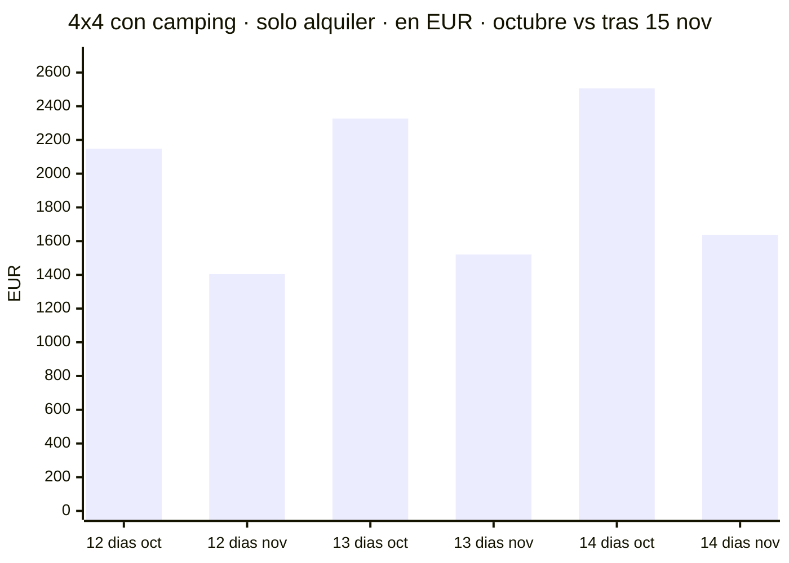

**Ahorro en el coche: ~€744–870 (~N$14.900–17.400)** según los días.

El viaje son 14 días, pero el coche no hace falta todos: los días de vuelo se van en trayecto.
Asco cobra la **misma tarifa/día en toda la banda de 6–15 días**, así que 12, 13 o 14 días
salen al mismo precio unitario — solo cambia el número de días.

**Alquiler + Super Cover** (€25/día, ~N$500/día — el único seguro que sirve, ver más abajo):

- **12 días** → octubre €2.448 (~N$48.960) · **tras 15 nov €1.704 (~N$34.080)** · ahorro €744
- **13 días** → octubre €2.652 (~N$53.040) · **tras 15 nov €1.846 (~N$36.920)** · ahorro €806
- **14 días** → octubre €2.856 (~N$57.120) · **tras 15 nov €1.988 (~N$39.760)** · ahorro €868

> ℹ️ Los totales por días son **cálculo nuestro** a partir de las tarifas verificadas de Asco
> (€179/día en la banda 15/08–14/11 y €117/día desde el 15/11), no cifras publicadas.
> El **Super Cover exige más de 10 días de alquiler**, así que 12, 13 y 14 cumplen.
> Ojo: si el viaje cruza el 15 de noviembre, en Namibia es habitual **prorratear** entre bandas.

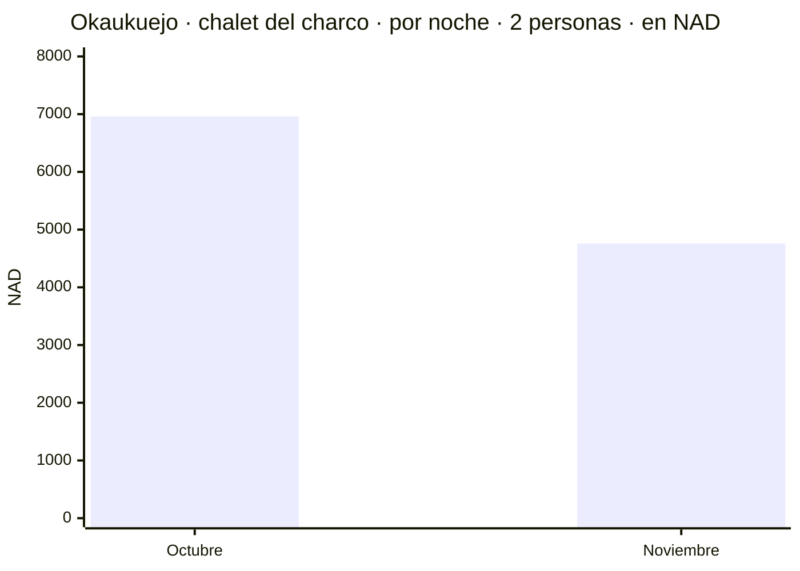

**Ahorro en alojamiento: N$2.200 (~€110) por noche.** En 14 días, cientos de euros más.

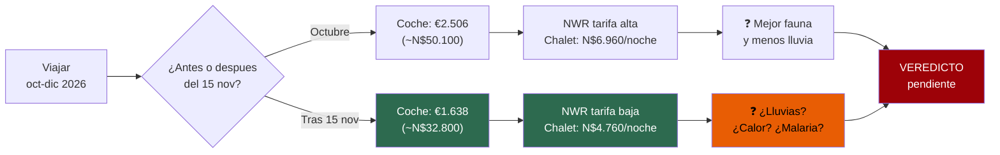

> ⚠️ **Lo que aún NO sabemos:** el calor (todas las temperaturas de webs de safaris fueron
> refutadas), la malaria en Etosha, y si la lluvia degrada de verdad los avistamientos — nadie lo
> cuantifica. Ese precipicio de precio existe **precisamente porque las condiciones cambian**
> esa semana.

---

## 🌧️ Cuándo empezó de verdad la temporada de lluvias, año a año

**Las medias mienten.** El Atlas de Namibia avisa de que la lluvia es *"erratic"*, con *"a high
degree of variation"*. La media de noviembre en Etosha (~25 mm) esconde años en que no llovió una
gota hasta enero. Así que fuimos a los **datos observados** de las últimas 5 temporadas.

> ⚠️ **No existe pluviómetro dentro de Etosha.** Lo mejor disponible es la **caja CHIRPS**
> (satélite + estación, 0,05°) centrada en Okaukuejo y Namutoni, más datos reales del **Servicio
> Meteorológico de Namibia**. No es un pluviómetro del parque: es lo que hay.

### El inicio real en Okaukuejo y Namutoni

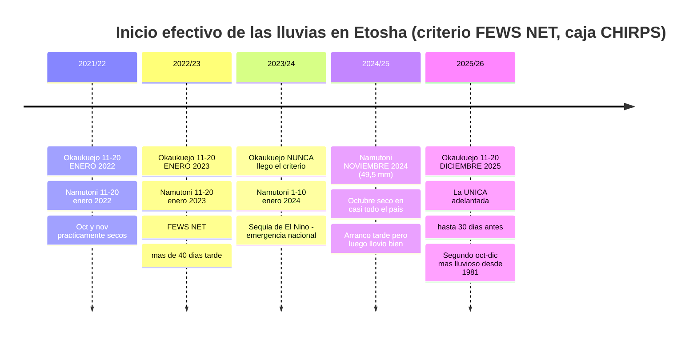

### Lluvia de noviembre en Okaukuejo, año a año

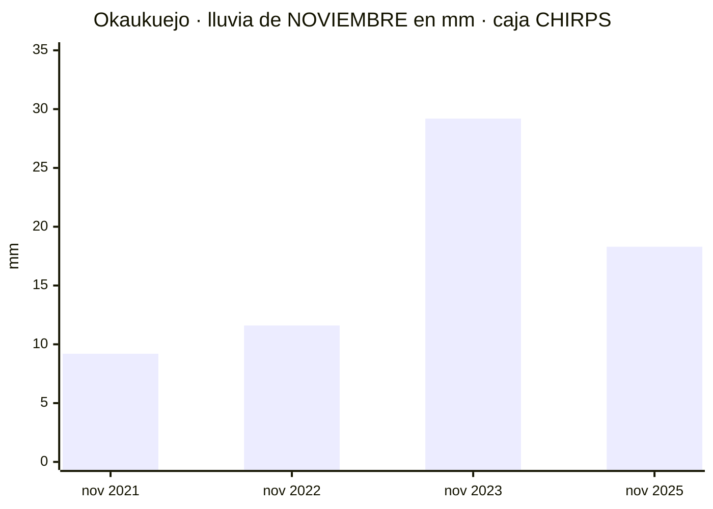

### 🎯 El titular: en 4 de las últimas 5 temporadas, en noviembre aún no había empezado

- **2021/22** — Okaukuejo: oct **0,0** mm · nov **9,2** mm · dic 15,6 · ene 62,6. Inicio: **enero**.
- **2022/23** — Okaukuejo: oct 7,0 · nov **11,6** · dic 19,7 · ene 72,4. Inicio: **enero**. FEWS NET
  documentó **más de 40 días de retraso** en el norte de Namibia.
- **2023/24** — Okaukuejo: oct **0,0** · nov 29,2 · dic 28,1. **El criterio de inicio no se cumplió
  en toda la temporada.** Fue la sequía de El Niño: estado de emergencia el 22/05/2024. La prensa
  namibia tituló *"First rains recorded for 2024"* el **6–7 de enero**.
- **2024/25** — **Namutoni registró 49,5 mm en noviembre de 2024**, el único noviembre con lluvia
  seria de los cinco. Octubre: sin lluvia en casi todo el país. FEWS NET: arrancó ≥30 días tarde,
  pero luego llovió por encima de la media.
- **2025/26** — **la excepción**: Okaukuejo arrancó el **11–20 de diciembre de 2025**, hasta **30
  días antes** de lo normal. Octubre–diciembre de 2025 fue el **segundo periodo más lluvioso desde
  1981**. Cierre de temporada: Grootfontein 828 mm (normal 521), Ondangwa 654 (normal 429).

> ### 👉 Esto refuerza el veredicto, no lo debilita
> El inicio efectivo en Etosha cayó en **enero** tres veces, **nunca** una, y en **diciembre** una.
> Solo un noviembre (2024) tuvo lluvia de verdad. **Un viaje a finales de noviembre habría pillado
> el parque seco en 4 de las últimas 5 temporadas.**

### La dispersión es brutal — y esa es la otra lección

En **la misma temporada 2021/22**, con estaciones SASSCAL reales:

- **Waterberg** (202 km al SE de Okaukuejo): primera lluvia ≥10 mm el **20 de octubre de 2021**
- **Khorixas** (166 km al SO, Damaraland): **20 de enero de 2022** — **tres meses más tarde**
- **Kaoko Otavi** (257 km al NO): **10 de febrero de 2022**

Y en 2025/26: Omatjenne **19 de octubre**, Mannheim **4 de noviembre**, Okashana **29 de enero**.
**Más de tres meses de diferencia dentro de la misma temporada y del mismo país.**

> **Conclusión honesta:** nadie puede decirte cuándo lloverá en noviembre de 2026. Lo que sí puedes
> decir es que **la probabilidad juega a tu favor** — y que si llueve, será **local y disperso**,
> no un monzón. Planifica Etosha **al principio** del recorrido por si acaso.

**Fuentes:** [Atlas of Namibia](https://atlasofnamibia.online/chapter-3/rainfall-patterns) ·
[SASSCAL WeatherNet](https://sasscalweathernet.org) · CHIRPS/FEWS NET ·
Servicio Meteorológico de Namibia vía *The Namibian*

⚠️ **Limitaciones:** la caja CHIRPS **no es** el pluviómetro de Okaukuejo (es satélite calibrado);
la serie de 2024/25 en CHIRPS fue **refutada parcialmente** en verificación, por eso arriba se usa
el dato real de estación de Namutoni; y GHCN-Daily **no tiene datos namibios de precipitación
posteriores a julio de 2025**.

---

## 📚 Los documentos

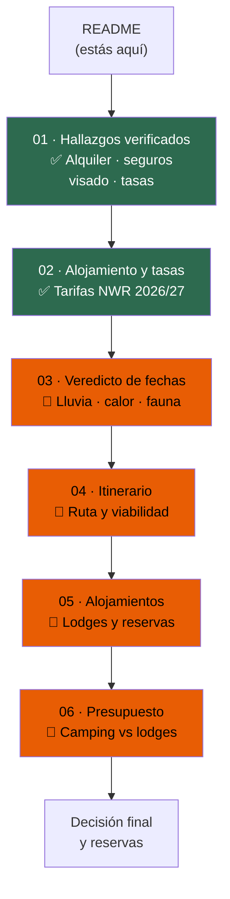

- ✅ [`01-hallazgos-verificados.md`](01-hallazgos-verificados.md) — alquiler 4x4, seguros, visado, tasas
- ✅ [`02-alojamiento-y-tasas.md`](02-alojamiento-y-tasas.md) — tarifas oficiales NWR 2026/2027
- ✅ [`03-guia-preparacion.md`](03-guia-preparacion.md) — **guía profunda**: cuenta atrás, conducción, logística, equipaje, normas
- 🔬 `04-itinerario.md` — ruta día a día + veredicto de viabilidad *(en curso)*
- 🔬 `05-alojamientos-y-reservas.md` — lodges privados y antelación *(en curso)*
- 🔬 `06-presupuesto.md` — presupuesto total *(en curso)*

### 🚨 Lo más urgente de la guía

- **El sendero del Fish River Canyon está CERRADO en noviembre** (temporada may–sep, y exige mínimo
  3 personas). En noviembre es un **mirador**. ✅ **Decidido: el sur se queda igualmente** — el
  cañón, Lüderitz, Kolmanskop y los kokerbooms siguen dentro. Falta medir el rodeo.
- **El vuelco es el 37 % de los muertos de Namibia con solo el 4,6 % de los accidentes** — y se
  concentra en Hardap (Sossusvlei): **1 de cada 5 accidentes allí es un vuelco**, contra 1 de cada 80
  en Windhoek.
- **Etosha SÍ es zona de malaria** (CDC: Kunene, Oshikoto, Oshana, Omusati, Otjozondjupa). El sur, no.
- **El portal del e-visa es `eservices.mhaiss.gov.na`.** `namibia-evisa.com` **no es el Gobierno**.
- **La cita del Centro de Vacunación es el plazo real**, no la vacuna: A Coruña, Durán Lóriga 3,
  981 989 570. Pídela en agosto.

---

## 💰 Precios de referencia (temporada nov/dic 2026)

**Tipo de cambio usado: ~N$20 = €1** (rango observado N$19,5–20,5 = €1, a 16/07/2026).
El NAD está vinculado al rand sudafricano y fluctúa: **el importe en N$ es el que se paga**,
el euro es orientativo.

### 🏕️ Camping NWR — por persona y noche

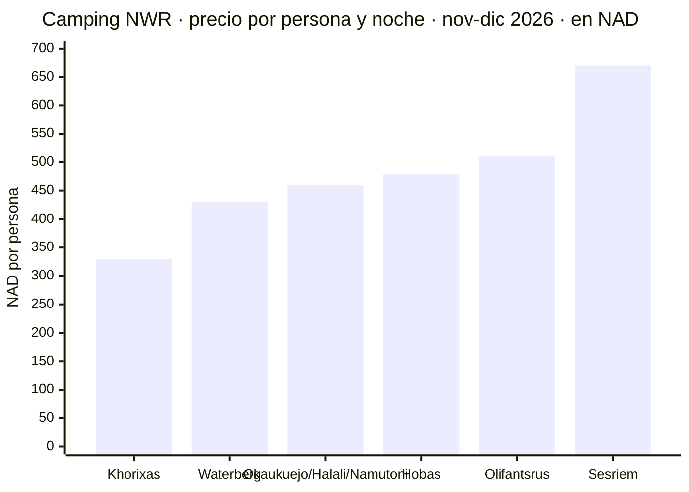

- **Okaukuejo · Halali · Namutoni** *(Etosha)* — N$460 (~€23) → **2 pax: N$920 (~€46)**
- **Olifantsrus** *(Etosha)* — N$510 (~€26) → 2 pax: N$1.020 (~€51)
- **Sesriem** *(Sossusvlei)* — N$670 (~€34) → **2 pax: N$1.340 (~€67)**
- **Hobas** *(Fish River Canyon)* — N$480 (~€24) → **2 pax: N$960 (~€48)**
- **Waterberg** — N$430 (~€22) → 2 pax: N$860 (~€43)
- **Khorixas** *(Damaraland)* — N$330 (~€17) → 2 pax: N$660 (~€33)

> Se paga **por persona**, aunque la parcela admita hasta 8. Dos personas pagan dos.

### 🛖 Chalets y habitaciones NWR — 2 personas, por noche, con desayuno

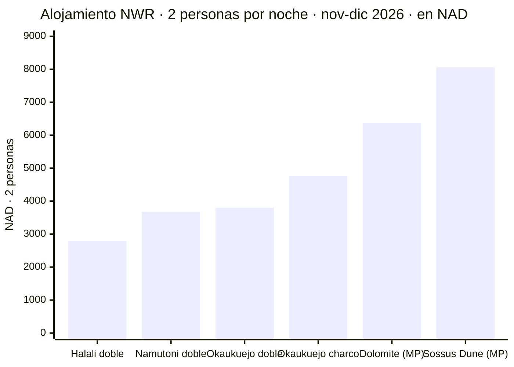

- **Halali**, habitación doble — N$1.400 (~€70)/persona → **N$2.800 (~€140)**
- **Namutoni**, habitación doble — N$1.840 (~€92)/persona → **N$3.680 (~€184)**
- **Okaukuejo**, habitación doble A/B — N$1.900 (~€95)/persona → **N$3.800 (~€190)**
- **Okaukuejo**, chalet del charco — N$2.380 (~€119)/persona → **N$4.760 (~€238)**
- **Dolomite Camp**, chalet *(media pensión)* — N$3.180 (~€159)/persona → N$6.360 (~€318)
- **Sossus Dune Lodge**, chalet *(media pensión)* — N$4.030 (~€202)/persona → N$8.060 (~€403)

> Las tarifas NWR son **por persona en habitación doble**: siempre hay que multiplicar por dos.
> Los campings de Etosha son con desayuno; Dolomite y Sossus Dune son **media pensión**, así que
> están menos lejos de lo que parece.

### 🎫 Tasas de parques

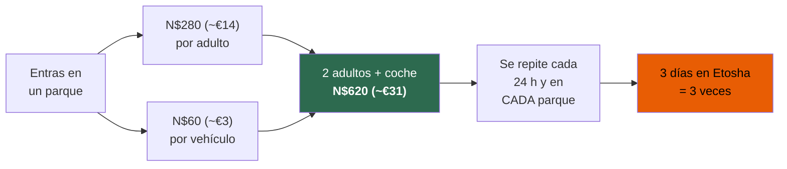

> **Subieron un 80–100 % el 1 de abril de 2026.** Presupuestar **~N$620 (~€31)/día** para dos
> adultos y coche, en Etosha, Sossusvlei y Fish River Canyon por separado.
>
> ❌ La cifra de **N$150** que aparece en casi todas las webs de viajes es la tarifa **obsoleta
> de 2021**. Refutada 0–3. No la uses.

---

## ⚠️ Lo que de verdad puede salir caro

### El seguro, no el precio del día

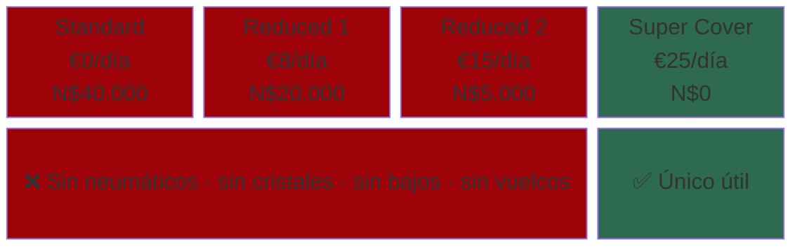

Todos los niveles **por debajo del más alto** excluyen exactamente lo que se rompe en Namibia:
**neumáticos, cristales, bajos y accidentes sin terceros**.

- Un vuelco sin terceros expone a **~N$165.000 (~€8.250)** más costes de rescate.
- Savanna lo dice literalmente: *"Also not when you tried to avoid hitting an animal crossing
  the road"* (tampoco si intentabas esquivar a un animal cruzando la carretera).
- **Asco Super Cover** (€25/día, ~N$500/día) cubre bajos… **pero los excluye en Damaraland y
  Kaokoveld** — justo por donde pasa la etapa de Twyfelfontein.
- Cubre **un solo neumático**. El segundo pinchazo, en 2.500–3.500 km de pista, lo pagas tú.

### 80 km/h en pista, con caja negra

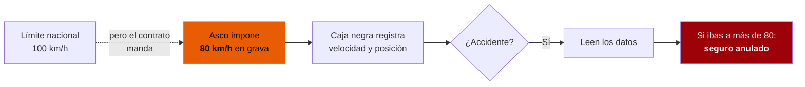

> 👉 **Consecuencia práctica:** cualquier itinerario de internet calculado a 100 km/h va
> ~20 % optimista. Todos nuestros tiempos van a 80.

### Visado obligatorio 🛂

Los españoles **necesitan visado desde el 1 de abril de 2025**: **N$1.600 (~€78)**,
e-visa online (~24 h). **Hay que imprimirlo y firmarlo delante del funcionario.**

También exigen: pasaporte válido **6 meses desde la vuelta** con **3 páginas en blanco**,
billete de vuelta, seguro médico **con repatriación**, prueba de alojamiento y de fondos
(referencia: N$1.200 (~€60)/día → ~N$33.600 (~€1.680) para dos y 14 días).

---

## 🔬 Cómo se ha hecho esto

**Regla número uno: cero invenciones.**

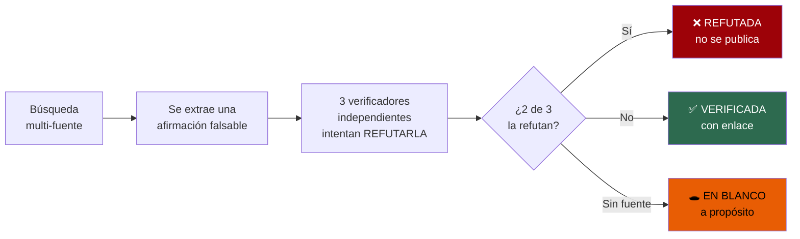

Cada cifra está verificada contra su fuente primaria, con enlace. En la primera pasada,
**9 de 25 afirmaciones murieron** en verificación — varias repetidas por toda la web y capaces
de costar dinero real:

- Las tasas de parques a N$150/día → **obsoletas desde abril de 2026**
- La tarifa NWR que citan todos los blogs → **caduca antes de que aterricemos**
- Hobas a N$510 → **es N$480**; el 510 era de Olifantsrus, en la columna de al lado de un PDF

Lo que no se ha podido verificar **se deja en blanco a propósito**. Un hueco reconocido es
mejor que un número plausible: los números plausibles se acaban usando.

Y ojo: **que algo se refute no significa que lo contrario sea cierto**. Que la afirmación sobre
la malaria cayera no dice que Etosha esté libre de malaria — dice que **no lo sabemos**, y hay
que averiguarlo antes de reservar.

---

*Última actualización: 16 de julio de 2026 · Todos los precios en N$ y €*

