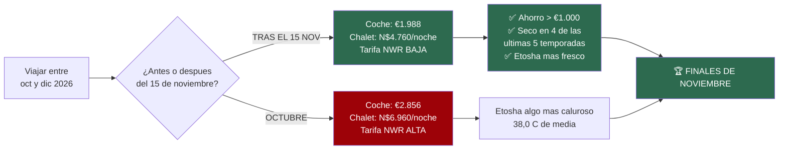
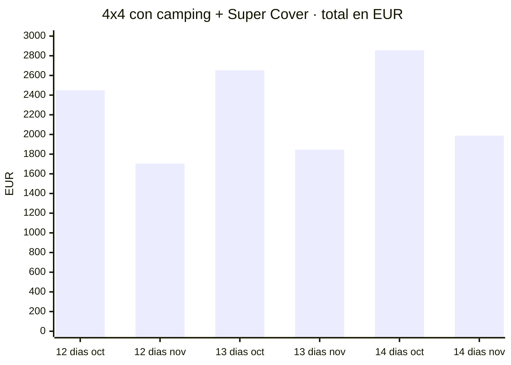
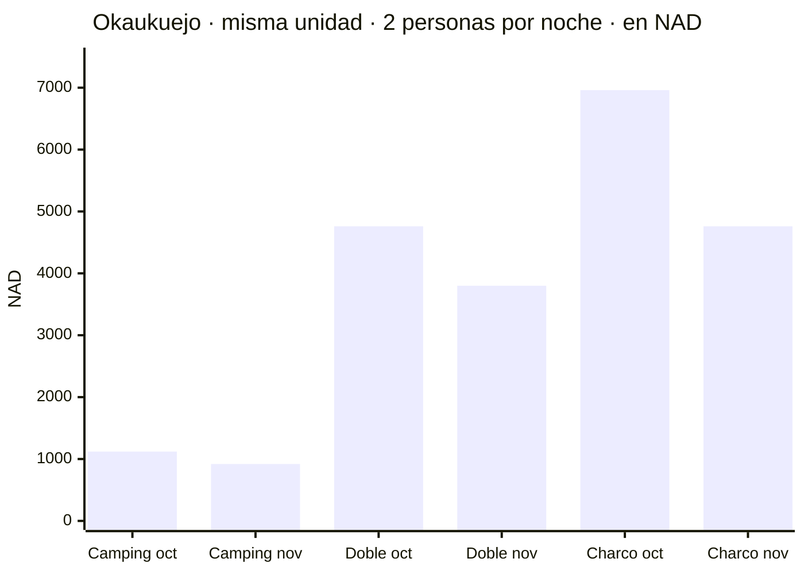
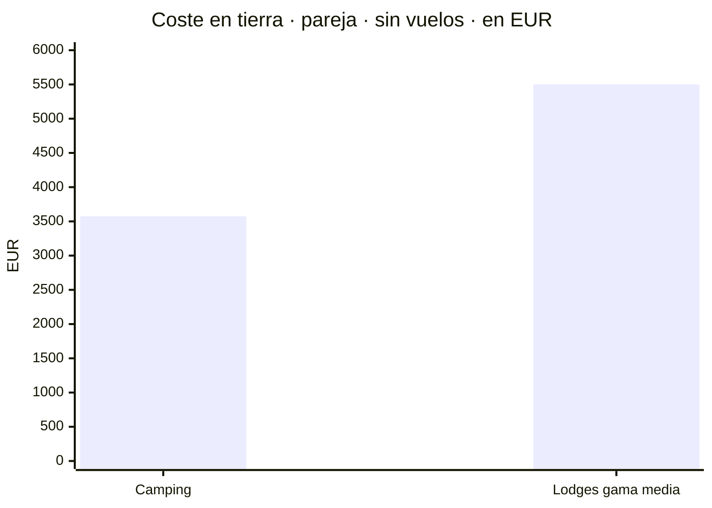
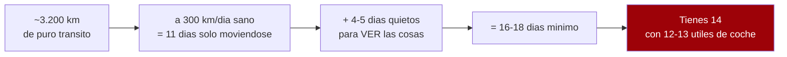
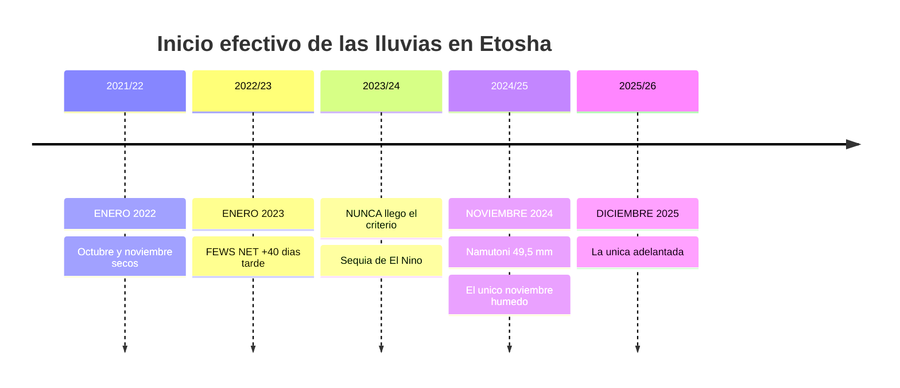
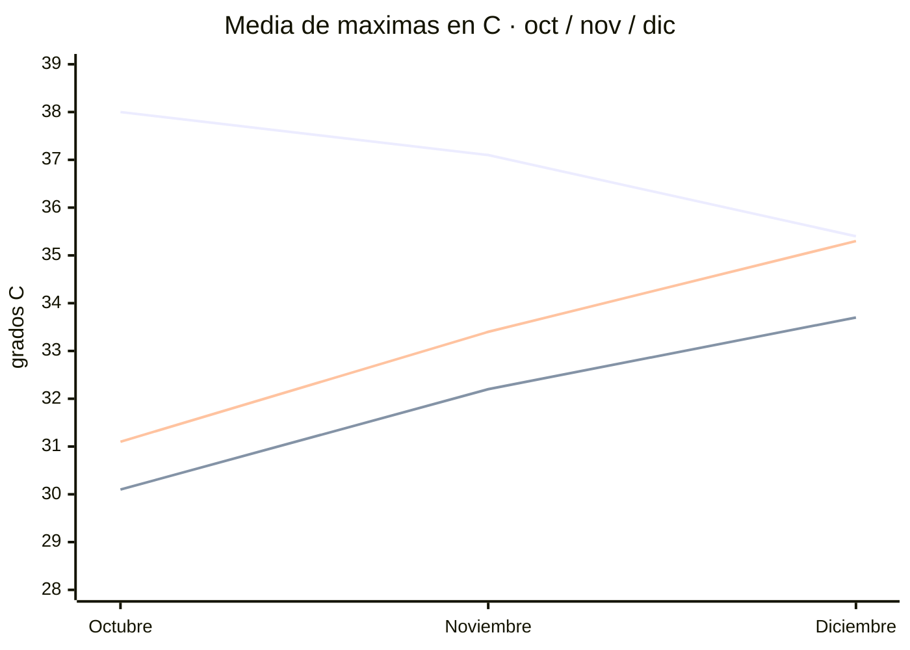
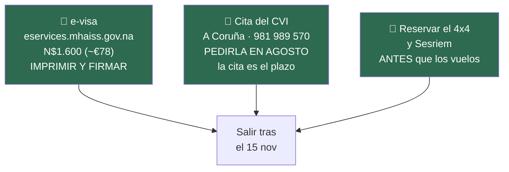
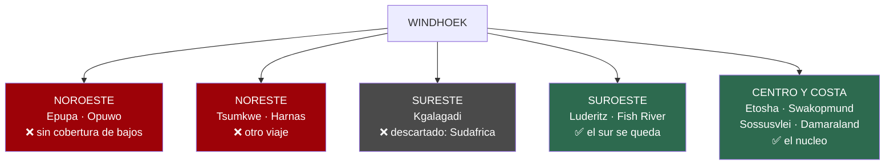
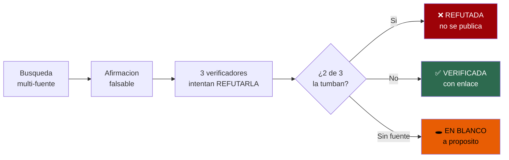

# 🇳🇦 Namibia 2026

### 4x4 por libre · dos personas · 14 días · desde A Coruña

**Etosha · Sossusvlei · Fish River Canyon · Damaraland · Costa de los Esqueletos**

*Investigación verificada contra fuentes primarias · Actualizado 17·07·2026*

---

## ⚖️ El veredicto de fechas

> # Salir después del 15 de noviembre.
> ### El dinero lo dice claro. Los años reales de lluvia lo confirman.

**Dos fronteras de temporada caen en la misma semana** y las dos empujan a lo mismo:

1. **El alquiler del 4x4** baja de **€179/día** a **€117/día** el **14/15 de noviembre**
2. **NWR** factura por **año tarifario de noviembre a octubre**: el **1 de noviembre** cambia de tramo

**Juntas valen más de €1.000 (~N$20.000).** Y las tres comprobaciones ambientales salieron a favor:
**suele estar seco**, **Etosha está más fresco que en octubre**, y **el sur aún no ha llegado a su
pico de calor**.

---

## 💰 El precipicio de precio

El coche **no hace falta los 14 días** — los de vuelo se van en trayecto. Y la tarifa/día de Asco es
**idéntica en toda la banda de 6–15 días**, así que solo cambia el número de días:

- **12 días** → octubre **€2.448 (~N$48.960)** · **tras 15 nov €1.704 (~N$34.080)** · ahorro **€744**
- **13 días** → octubre **€2.652 (~N$53.040)** · **tras 15 nov €1.846 (~N$36.920)** · ahorro **€806**
- **14 días** → octubre **€2.856 (~N$57.120)** · **tras 15 nov €1.988 (~N$39.760)** · ahorro **€868**

> ℹ️ Totales = **cálculo propio** sobre las tarifas verificadas. El **Super Cover exige más de 10
> días**: 12, 13 y 14 cumplen. Si el viaje **cruza** el 15/11, es habitual **prorratear**.

### Y en alojamiento la bajada es aún mayor

**El chalet del charco de Okaukuejo baja N$2.200 (~€110) por noche.**

---

## 💶 El presupuesto

- 🏕️ **Camping** — **~€3.575** (~N$71.500) la pareja · **~€1.790/persona**
- 🛖 **Lodges gama media** — **~€5.500** (~N$110.000) la pareja · **~€2.750/persona**
- ✈️ **Vuelos** — **~€1.400–1.800** la pareja ❌ **sin verificar para tus fechas**

📖 Desglose partida a partida, con qué está verificado y qué es estimación → [`10-presupuesto`](10-presupuesto.md)

---

## 🗺️ ¿Cabe todo en 14 días? No.

Con las vueltas dentro de los parques el circuito completo se va a **~3.900–4.100 km reales**.
La guía de operadores recomienda *«no further than 400 km per day»* y, mejor,
*«aim to drive no more than 4 to 6 hours per day»*.

### 🟢 Variante A — sur + Namib + costa, **sin Etosha** · *recomendada*
**~2.400 km.** Ningún día pasa de 300 km de grava. Parte la etapa dura Lüderitz–Sesriem en dos
jornadas de ~4 h por la **D707**, la carretera más bonita del país. Incluye **amanecer en Deadvlei**
y un día de descanso en la costa.

### 🟠 Variante B — sur + Etosha, **sin Sossusvlei**
**~3.000 km**, con dos traslados de asfalto de 550–570 km. Ganas las dos zonas de fauna.
**Pierdes Sossusvlei y Deadvlei.**

### 🔴 Variante C — todo comprimido
**No recomendada.** ~16 días mínimo contra 12–13 útiles. Documentada por honestidad.

> **La lectura honesta: la A.** **Sossusvlei y Deadvlei no tienen sustituto en ningún sitio del
> mundo**; la fauna africana sí se ve en otros parques y otros viajes. Y la A es la única que deja
> margen. **Pero B es defendible si lo vuestro es la fauna.**

📖 Las tres desarrolladas día a día, con dónde dormir y precios → [`11-itinerarios-dia-a-dia`](11-itinerarios-dia-a-dia.md)

---

## 🌧️ Cuándo llueve de verdad — año a año

> **Las medias mienten.** El Atlas de Namibia avisa: la lluvia es *"erratic"*, con *"a high degree of
> variation"*. Los ~25 mm de media de noviembre esconden años sin una gota hasta enero.

> ### 🎯 En **4 de las últimas 5 temporadas**, un viaje a finales de noviembre habría pillado Etosha seco.

**Y la dispersión es brutal:** en la misma temporada 2021/22, **Waterberg** tuvo su primera lluvia
útil el **20 de octubre** y **Khorixas** el **20 de enero** — tres meses, mismo país.

👉 Si llueve, será **local y disperso**, no un monzón. **Pon Etosha al principio del recorrido.**

📖 Las 5 temporadas, mm a mm → [`09-lluvias-historico`](09-lluvias-historico.md)

---

## 🌡️ El calor: depende de la latitud

*Okaukuejo (Etosha) **baja** de oct a dic · Fish River **sube** · Keetmanshoop **sube**.*

> ### El *"suicide month"* no es el mismo en todo el país — y las webs de safaris lo generalizan mal.

- **Etosha: octubre ES el pico** (38,0 °C) → noviembre 37,1 → diciembre 35,4
- **El sur: al revés.** Fish River 30,1 → **32,2** → 33,7 · Keetmanshoop 31,1 → **33,4** → 35,3

**👉 Noviembre es el compromiso: ni el pico del norte ni el del sur.**

Calculado sobre **ficheros de observación diaria descargados** (NOAA GHCN-Daily y SASSCAL), no de
webs de agencias — cuyas temperaturas **fueron todas refutadas 0–3**.

📖 Récords, series y por qué Ai-Ais se queda sin cifra → [`08-huecos-cerrados`](08-huecos-cerrados.md)

---

## 🎯 Los tres imprescindibles antes de reservar

> ### ⚠️ **`namibia-evisa.com` NO es el Gobierno.**
> Se anuncia como *"Official Electronic Travel Authorization"* y **te va a cobrar de más**.
> **Solo `.gov.na` es oficial.** Y espera que el sitio real **parezca roto**: sirve una cadena TLS
> incompleta. Un aviso de certificado **ahí** es mala configuración, no fraude — pero **verifica que
> el dominio pone exactamente `eservices.mhaiss.gov.na`** antes de teclear la tarjeta.

**Sesriem es el cuello de botella real:** **solo 44 parcelas + 6 de desbordamiento**, y dormir dentro
de la puerta es **la única forma** de ver el amanecer en Deadvlei — la interior abre **1 h antes** que
la exterior, y hay 60 km hasta allí.

**Malaria:** ✅ **Etosha SÍ es zona de riesgo** (CDC: Kunene, Oshikoto, Oshana, Omusati,
Otjozondjupa). **El sur, no.** El fármaco marca la cuenta atrás: **Malarone** empieza 1–2 días antes;
**mefloquina, 2–3 semanas**.

**Fiebre amarilla:** una escala **corta y sin salir del aeropuerto** en Adís **no** la exige. Pero la
exención de la OMS es **conjuntiva** (<12 h **y** *airside*): la parada gratis en ciudad de Ethiopian
**pasa inmigración** y podría romperla. **Doha, Fráncfort y Johannesburgo no la exigen.**

📖 Cuenta atrás completa → [`03-guía-preparación`](03-guia-preparacion.md)

---

## 🛡️ El seguro, no la tarifa

Todos los niveles **salvo el más alto** excluyen justo lo que se rompe en grava: **neumáticos,
cristales, bajos y daños sin terceros**.

- **Asco Super Cover** (€25/día) cubre bajos… **pero los excluye en Damaraland y Kaokoveld**
- **La franquicia NO limita el coste de rescate** (cláusula 10.5.7) — **ni con Super Cover**
- En las pistas **D3707 y D3703** pagas **todo** aunque tengas Super Cover
- 🚫 ***Dune driving* y Sandwich Harbour: estrictamente prohibidos.** Anulan la cobertura entera
- **80 km/h en grava** por contrato *(el límite legal es 100)*, **auditado por caja negra**

> 👉 **Cualquier itinerario de internet calculado a 100 va ~20 % optimista.** Todos los tiempos de
> este repo van a 80 en grava y 60 en parques.

**Y el seguro médico con repatriación es condición de entrada**, no papeleo: **no hay hospital cerca
de Sesriem** *(Windhoek a ~320 km, Walvis Bay a ~270)*. Confirma por escrito que cubre **evacuación
aérea dentro del país**.

📖 Cláusulas, presiones y todo el detalle → [`05-conducción`](05-conduccion.md) · [`07-logística`](07-logistica.md)

---

## 📚 Los documentos

- ✅ [**`01-hallazgos-verificados`**](01-hallazgos-verificados.md) — alquiler 4x4, niveles de seguro, visado, tasas, y **lo refutado**
- ✅ [**`02-alojamiento-y-tasas`**](02-alojamiento-y-tasas.md) — tarifas oficiales NWR 2026/2027 y la trampa del año tarifario
- ✅ [**`03-guia-preparacion`**](03-guia-preparacion.md) — cuenta atrás, e-visa, vacunas, Kolmanskop, normas
- ✅ [**`04-itinerario`**](04-itinerario.md) — distancias, firme, tiempos y el veredicto de viabilidad
- ✅ [**`05-conduccion`**](05-conduccion.md) — cláusulas del contrato, presiones, arena, puertas de Sesriem
- ✅ [**`06-lista-google-maps`**](06-lista-google-maps.md) — tus 34 pines, medidos y triados
- ✅ [**`07-logistica`**](07-logistica.md) — combustible, distancias, Línea Roja, cobertura, dinero
- ✅ [**`08-huecos-cerrados`**](08-huecos-cerrados.md) — temperaturas medidas, vuelos, tasas 2026
- ✅ [**`09-lluvias-historico`**](09-lluvias-historico.md) — las 5 últimas temporadas, mm a mm
- ✅ [**`10-presupuesto`**](10-presupuesto.md) — camping vs lodges, en N$ y €
- ✅ [**`11-itinerarios-dia-a-dia`**](11-itinerarios-dia-a-dia.md) — **las tres variantes, día a día**

---

## 🗺️ Tus 34 pines de Google Maps

> **La lista no cabe en 14 días.** Va de Epupa (frontera con Angola) a Lüderitz a Tsumkwe: **los
> extremos son direcciones opuestas**. No es una crítica — es una lista excelente de **país entero**.

**Decisiones tomadas:** ✅ el sur se queda · ❌ no se cruza a Sudáfrica

**Encajan casi gratis** *(están de camino)*: Joe's Beerhouse · Solitaire · Sesriem Canyon · Duna 45 ·
**Quiver Tree Forest** *(14 km de Keetmanshoop — el mejor coste/beneficio del sur)* · Canyon
Roadhouse · Spitzkoppe · Okonjima

**Cuestan desvío asumible**: Cape Cross · Brandberg · Waterberg · Hoba Meteorite · NamibRand ·
Bagatelle · **Skeleton Coast** *(la travesía Ugabmund–Springbokwasser: permiso de tránsito gratis,
sin reserva — pero **Torra Bay CIERRA en noviembre**, solo abre dic–ene)*

**Son otro viaje**: 🔴 Epupa + Opuwo · Tsumkwe · Harnas
**Caro y con permiso a 10 días**: 🟠 Elizabeth Bay — **N$3.630/persona (~€181)**, mínimo 4, y **no lo
gestiona el operador de Kolmanskop**. Es **16× el precio de Kolmanskop**. Se cierra desde España o no
existe.

ℹ️ **Twyfelfontein** y **Duna 45** aparecen en Google como cerrados: es un **fallo del listado**.

📖 Análisis completo → [`06-lista-google-maps`](06-lista-google-maps.md)

---

## 🔬 Cómo se ha hecho esto

> ## Regla número uno: **cero invenciones**

Cada dato se verifica contra su fuente primaria y pasa por verificadores independientes cuyo trabajo
es **refutarlo**. Hacen falta **2 de 3** para tumbarlo. Marcamos: ✅ **primaria** · ◐ **secundaria** ·
○ **práctica común sin fuente**.

**Han caído 9 de 25 y 12 de 76 afirmaciones** en distintas pasadas — varias repetidas por toda la web
y capaces de costar dinero real:

- ❌ Tasas de parques **N$150/día** → ✅ **~N$280 (~€14)** desde abril de 2026
- ❌ La tarifa NWR que citan todos los blogs → ✅ **caduca antes de que aterricemos**
- ❌ Hobas **N$510** → ✅ **N$480**; el 510 era de Olifantsrus, columna de al lado de un PDF
- ❌ *"Las gasolineras no aceptan tarjeta"* → ✅ **sí la aceptan**; *"credit"* ahí significa **a cuenta**
- ❌ Todas las temperaturas de webs de safaris → ✅ **refutadas 0–3**, rehechas con datos de estación

> ### Lo que no se ha podido verificar **se deja en blanco a propósito**.
> Un hueco reconocido es mejor que un número plausible: **los números plausibles se acaban usando
> para pagar**.
>
> Y ojo: **que algo se refute no hace cierto lo contrario**. Cuando cayó la afirmación sobre la
> malaria, no significaba que Etosha estuviera libre — significaba que **no lo sabíamos**. Ahora sí:
> **lo es**.

---

### 🕳️ Lo que sigue faltando

**Vuelos para tus fechas** · **Lodges privados por noche** · **Seis etapas con km sin verificar**

*Las tasas de parques: el ~N$280 se apoya solo en fuente secundaria — el MEFT sigue sirviendo la
tabla de 2021. **Confírmalo por email antes de cerrar presupuesto.***

---

**Tipo de cambio: ~N$20 = €1** *(rango observado N$19,5–20,5, a 17·07·2026)*
El NAD está vinculado al rand y fluctúa: **el importe en N$ es el que se paga**, el euro es orientativo.

*Todos los precios en N$ y € · Las tarifas namibias cambian: reconfirma antes de pagar*

