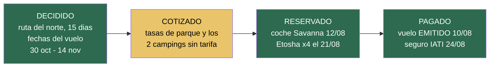
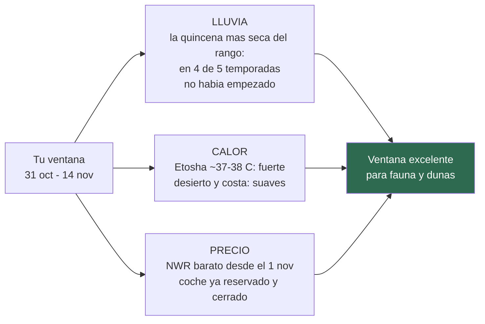
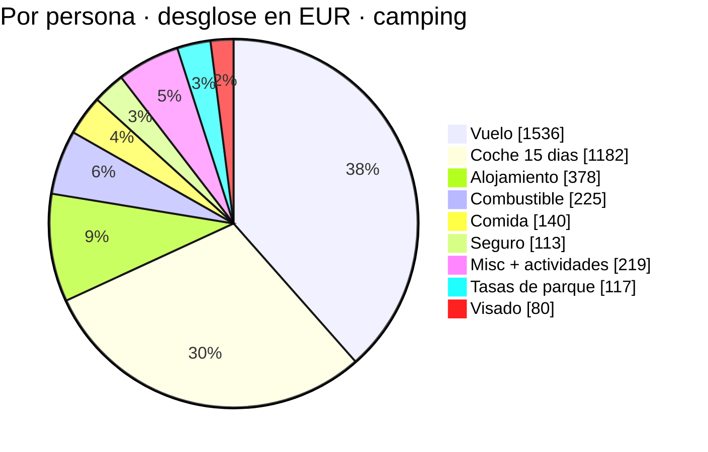
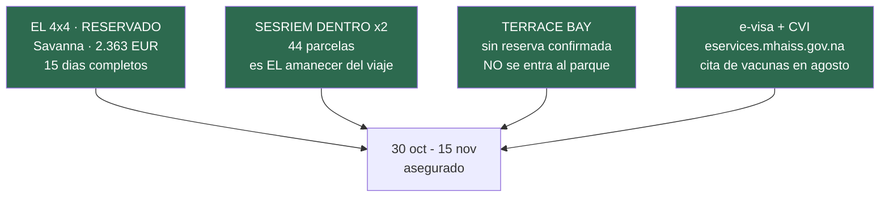
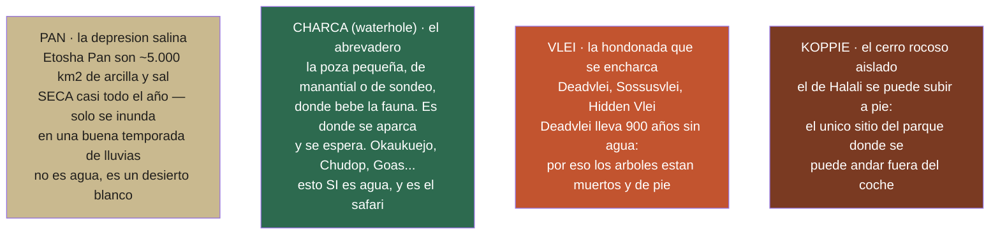
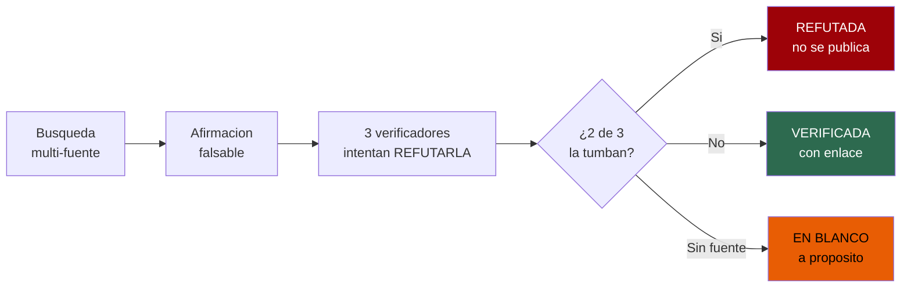

<div align="center">


# 🇳🇦 NAMIBIA 2026

### El gran roadtrip del norte

**Chema Morandeira** y **Miguel Rivera** · un 4×4 con tienda de techo
**30 de octubre – 15 de noviembre de 2026**

[](16-punto-de-decision.md)
[](04-guia-preparacion.md)
[](#-lo-que-toca-ahora-por-orden)
[](02-presupuesto.md)
[](dossier-namibia-2026.pdf)

*Las dunas más altas del mundo al amanecer · la Costa de los Esqueletos*
*rinocerontes bebiendo de noche a diez metros · cuatro noches de safari en Etosha*

  

</div>

---

<div align="center">

## 📍 Estado del viaje

**24 de agosto de 2026**

</div>


```mermaid
flowchart LR
    D["DECIDIDO<br/>ruta del norte, 15 dias<br/>fechas del vuelo<br/>30 oct - 14 nov"] --> C["COTIZADO<br/>tasas de parque y los<br/>2 campings sin tarifa"]
    C --> R["RESERVADO<br/>coche Savanna 12/08<br/>Etosha x4 el 21/08"]
    R --> P["PAGADO<br/>vuelo EMITIDO 10/08<br/>seguro IATI 24/08"]
    style D fill:#2d6a4f,color:#fff
    style C fill:#e9c46a,color:#000
    style R fill:#2d6a4f,color:#fff
    style P fill:#2d6a4f,color:#fff
```

> [!NOTE]
> **Cerrado y no se rediscute.** La **ruta del norte, 15 días de suelo (14 noches), con Etosha y sin el sur** — decisión
> del viajero, 06/08/2026. Las **fechas son las del vuelo de Lufthansa** —**EMITIDO el 10/08 por €1.536 p.p.**—: 30 de octubre
> a 14 de noviembre, llegada a Windhoek el **31 a las 09:25** y vuelta el **14 a las 20:45**, en casa el 15.
> El sentido de la marcha, **desierto → costa → Damaraland → Etosha al final**. El coche,
> **Savanna, con transfer aeropuerto ↔ oficina** — se recoge el **31 al aterrizar** y se devuelve
> el **14 camino del embarque** *(decisión del viajero, 07/08/2026)*: **ni hoteles en Windhoek ni
> traslados** — esas noches también se duerme arriba. Y el **08/08**, la auditoría del calendario:
> la ruta cabe exacta, **Spreetshoogte pasa de una a dos noches (dom 1 y lun 2 — la del domingo,
> recuperada de la ciudad cerrada de Windhoek)** y los dos días punta
> llevan plan horario *(la facturación de la vuelta cierra a las **19:45** ◐)*. Y los **safaris de
> Etosha, GUIADOS** *(08/08: tres mañanas + el nocturno, ~N$5.400 · ~€270 la pareja — «el safari
> es un 90 % un buen guía»)*. Lo que se comparó antes queda archivado en
> [`16`](16-punto-de-decision.md).

### ✅ Cerrado de verdad

- ✈️ **Vuelo — EMITIDO el 10/08 por €1.536 (~N$30.720) por persona** ✅ *(cotizado en €1.450 el
  05/08: +€86 entre cotizar y comprar)*. **Con el billete, el e-visa queda desbloqueado.**
- 🚙 **Coche — RESERVADO con Savanna (12/08): €2.363 en total, 15 días completos, Opción 4 con
  franquicia cero** ✅ *(el detalle completo, en [`20`](20-reservas.md) §1)*
- 🩺 **Seguro IATI Estrella — CONTRATADO, y ya desde el 30/10** ✅ *(dicho por el viajero el 24/08,
  con el código de Chavetas)*. Era lo más urgente del cuaderno y deja de serlo. ⚠️ **El importe
  real pagado, ❌ sin recuperar todavía**: el presupuesto sigue contando la cotización de
  **€113,02 p.p.** —sin descuento— hasta que aparezca la póliza *(`20` §3)*.

### 🟡 Cotizado con precio real, pero sin cerrar

- 🛂 **e-visa — N$1.600 (~€80)** ✅
- 🎫 **Tasas de parque — ~N$620 (~€31)/día** la pareja ◐

> [!WARNING]
> **Con el coche ya reservado, hay una cláusula del seguro que pedir por escrito EN LA ENTREGA**:
> Savanna deja **«antes del amanecer y después del atardecer»** como zona sin cobertura salvo que
> se nombre como la única zona cubierta por la Opción 4 — y la salida a Deadvlei del D4 sale a las
> ~05:10 *(`20` §1, `06` §6)*. *(El otro frente urgente, que el seguro empezara el 30/10 y no el
> 31, quedó **resuelto el 24/08**: está contratado.)*

### 🔴 Lo que toca ahora, por orden

1. **En la entrega del coche, pedir por escrito**: que la franja de sunrise/sunset sea la zona
   cubierta por la Opción 4 *(por la salida a Deadvlei, `20` §1)* · el teléfono de emergencias
   24 h · con cuánto tanque lo entregan · el coste del conductor adicional.
2. **Del seguro, ya contratado, quedan dos flecos**: recuperar el **importe real pagado** ❌ *(para
   cerrar la partida de [`02`](02-presupuesto.md) — hoy va con la cotización)* y confirmar si se
   pidió por escrito la **evacuación aérea dentro del país** *(cerca de Sesriem no hay hospital)* y
   la **búsqueda y salvamento**; si no se pidieron, pedirlas ahora *(`20` §3)*.
3. **Pedir el e-visa** — el billete de vuelta ya existe *(emitido el 10/08)*: nada lo bloquea.
4. **Pedir cita en el Centro de Vacunación Internacional** *(A Coruña, Durán Lóriga 3 ·
   **981 989 570**)*. Para salir el 30/10 hay que ser atendidos hacia el **19–26 de septiembre**, y
   **la cita es el recurso escaso, no la vacuna**.
5. **Reservar Sesriem ×2 y Terrace Bay** — sin la de Terrace Bay **no se entra** al Skeleton Coast
   a pernoctar. **Y reservar Spreetshoogte ×2**, que desde el **24/08 ya no tiene ningún hueco
   delante**: **abierto confirmado ◐** *(el «closed down» quedó refutado el 10/08)*, lo opera
   **Barkhan Dune Retreat**, y la **tarifa está cerrada ✅ — N$290 (~€14,50) pp/noche, N$1.160
   (~€58) las dos noches los dos**, de su propio rack. Se reserva en **bookings@barkhan.africa**
   *(`20` §5)*.
   ✅ **Las cuatro noches de Etosha salieron de esta lista el 21/08: están RESERVADAS** —
   **Okaukuejo** *(9–10)*, **Halali** *(10–11)*, **Namutoni** *(11–12)* a N$920 (~€46) la noche los
   dos, y la cuarta, **[Onguma Tamboti](https://onguma.com/)** *(12–13)*, ya **fuera** de la puerta
   de Von Lindequist, en vez de la segunda noche de Namutoni. *(Al partirse esa doble en dos
   reservas, el contador pasa de **6 a 7**: cerradas **4**, quedan Sesriem, Terrace Bay y
   Spreetshoogte.)*
6. **Preguntar a NWR (+264 67 229 800)** si las 3 salidas guiadas de mañana y el nocturno se
   pueden dejar cerrados desde España — su tarifa avisa de que **en temporada de lluvias no
   aceptan pre-reserva de actividades**; si no, van en recepción al llegar. ⚠️ **El nocturno se
   pide para el D11**, no para el D12: esa noche ya se duerme en Onguma. Y **en Onguma,
   pre-reservar la cena** y, si se quiere, el **Sundowner Drive** *(N$980 ≈ €49 pp ✅)*.

📞 **El cuaderno completo de reservas** —cada una con su canal, su contacto verificado, lo que se
pide por escrito al cerrarla y lo que se deja para recepción— **está en
[`20-reservas`](20-reservas.md)**.

<details>
<summary><b>🕳️ Lo que sigue sin poder cerrarse</b></summary>

**Dos** campings sin tarifa publicada *(Windhoek y Walvis Bay — **contactos ya
localizados el 09/08, ver [`20`](20-reservas.md)**)*. **Spreetshoogte salió de esta lista el
24/08**: abierto ◐, operado por Barkhan Dune Retreat y con **tarifa cerrada ✅** de su propio rack ·
la zona horaria sin cobertura del seguro de Savanna, sin nombrar todavía por escrito *(la salida a
Deadvlei del D4, `20` §1)* ·
el sobrecoste **en tiempo** del **desvío obligatorio Okaukuejo–Halali** *(los km ya están: **+38**
sobre la pista directa, medidos el 09/08 con el enrutado OSRM propio)* · **si hay diésel en el bucle
Ugabmund–Springbokwasser** *(el surtidor de Terrace Bay, sin garantía — `07`)* · los horarios de
salida de los safaris guiados de NWR.
*(El D0 ya tiene plan —coche, compra y camping—, la franquicia quedó cerrada el 07/08 —1×23 kg por
persona— y el 08/08 quedaron medidos el calendario (15 días/14 noches exactos) y el D14: facturación
de Discover, cierra 19:45 ◐ — ver [`02`](02-presupuesto.md) §2 y §8.)*
**El inventario completo, en [`15`](15-huecos-cerrados.md).**

</details>

<div align="center">

### 📕 [**Descargar el dossier completo en PDF**](dossier-namibia-2026.pdf) · 158 páginas

*Todo esto en un solo documento maquetado, con fotos, **dos mapas propios** y los diagramas — para
leer del tirón, imprimir o llevar sin conexión.*
🦁 Y suelta, para la guantera: [**la guía de fauna**](guia-fauna-etosha.pdf) *(34 páginas, 148 especies con foto, **qué posibilidades hay de ver cada una** y cómo se hace un safari — y ni un animal que nadie haya visto: el corte del 09/08 dejó fuera al oricteropo, la suricata y la cebra de Hartmann; el barrido COMPLETO del 10/08 añadió las 14 que faltaban en Etosha, del águila rapaz al galápago que caza quéleas; el del 11/08, las 13 de las otras zonas — el delfín mular del crucero, el charrán que llega de Europa a decenas de miles, la rata dassie de Twyfelfontein—; y el del 15/08, **todas las rapaces y todos los felinos de la ruta** en dos secciones propias: 31 rapaces diurnas y nocturnas, del cernícalo ojiblanco que nadie había echado en falta al halconcito que vive dentro del pajar del tejedor, más el caracal y el gato de patas negras)* — va aparte **a propósito**: se usa en el coche, no en el sofá.

🗺️ Y para la pared, o para doblar en la guantera: [**la lámina de ruta**](mapa-ruta-namibia-2026.pdf) *(**una sola hoja A2**, 420×594 mm, vectorial: el recorrido entero a 384 mm de ancho, las quince etapas con sus kilómetros del enrutado propio y dónde se duerme cada noche, y abajo lo que manda —velocidades de planificación, la regla de las 18:00, los horarios de puerta de Etosha y los teléfonos de emergencia—. Se genera sola desde la misma geometría que el dossier: si cambia una noche, cambia la lámina. En una impresora de casa, «ajustar a página» a A3 o A4)*.

🛰️ Y para el GPS y el móvil: [**`ruta-namibia-2026.gpx`**](ruta-namibia-2026.gpx) y
[**`ruta-namibia-2026.kml`**](ruta-namibia-2026.kml) — **los 39 puntos de la ruta como waypoints**
*(con símbolo según sean parada, gasolinera obligatoria, puerta de parque o hito)* **y las 13
etapas con trazado como pistas separadas**, para encender y apagar los días uno a uno. Salen de la
**misma geometría** que el mapa y la lámina, así que cambiar una noche los actualiza solos.
⚠️ **Tracks4Africa no los importa** *(su planificador exporta GPX y KML, pero importar sigue
siendo función pendiente — «will be added over time», [su propio blog](https://blog.tracks4africa.co.za/the-tracks4africa-online-trip-planner-in-beta/); la app Overland tampoco admite GPX)*. Sí
entran en **Garmin, OsmAnd, Locus, Organic Maps, Gaia** y —el KML— en **Google My Maps y Earth**.

[](img/mapas/etosha.svg)

*Etosha, charca a charca — el mapa del dossier: en seca la fauna no está repartida por el parque,
está en el agua. [Verlo en grande](img/mapas/etosha.svg).*

</div>

---

<div align="center">

## ⭐ La ruta

### La clásica del norte, a ritmo lento

**Desierto → costa → Damaraland → Etosha.** Sin prisas, sin el sur, sin días imposibles.

[](img/mapas/ruta.svg)

*El trazado no está dibujado a mano: son las coordenadas reales de cada parada, enrutadas por
carretera con **OSRM** sobre OpenStreetMap. [Ver el mapa en grande](img/mapas/ruta.svg).*

**~2.764 km · 15 días de coche · dos noches en Spreetshoogte, dos en Sesriem, dos en la costa y CUATRO en Etosha** *(tres dentro del parque y la última en Onguma, a su puerta)*

</div>

Es la ruta del clásico de dos semanas *(la misma familia que el itinerario de
[lugaresincertos.com](https://www.lugaresincertos.com/en/travel-inspiration/two-week-trip-to-namibia/)
que sirvió de referencia)*, montada con nuestros datos verificados. **El sur queda para otro
viaje**: está medido y documentado en el historial de git por si algún día vuelve.

📖 **El día a día completo, con dónde dormir y precios** → [`01-itinerarios-dia-a-dia`](01-itinerarios-dia-a-dia.md)

---

<div align="center">

## 🚗 El coche

</div>

**Savanna, grupo GSXA-1 Camping — Ford Ranger 2.2 o 2.0 D/Cab automático — RESERVADO el
12/08/2026: €2.363 en total, 15 días completos, con transfer aeropuerto ↔ oficina.**

- 🛡️ **Opción 4 de seguro**: franquicia cero, con neumáticos, lunas y bajos incluidos.
- ⛽ **Depósito de 140 l** — doble depósito, 80 + 60 l.
- 🏕️ **Kit de camping**: una tienda de techo, nevera con batería propia, mesa, sillas, cocina de
  gas y menaje completo.
- 🛰️ **Teléfono satelital y 2 sacos de dormir**, reservados y pagados con el coche.

El detalle completo —fechas, horas, lo que cubre y lo que no, y lo que sigue por confirmar en la
entrega— está en [`20-reservas`](20-reservas.md) §1.

---

<div align="center">

## ✨ Los momentos que hacen este viaje

 

</div>

- 🌅 **El amanecer en Deadvlei que casi nadie consigue.** La puerta interior de Sesriem abre **1 hora
  antes** que la exterior — solo para quien duerme dentro (**N$1.340 · ~€67** los dos). Árboles
  negros de 900 años, la duna encendiéndose, y los demás todavía en la cola de la otra puerta. ✅
- 🏜️ **Big Daddy y Hidden Vlei.** Con dos noches en Sesriem hay día entero: la subida a la gran
  duna, la bajada corriendo hasta Deadvlei, y el vlei escondido sin gente. Duna 45 a la vuelta. ✅
- 🌇 **El atardecer del paso de Spreetshoogte** — el Namib mil metros bajo tus pies en una de las
  carreteras más empinadas del país. La primera noche de desierto, a dos horas de Windhoek. ◐
- 🦏 **La charca iluminada de Okaukuejo.** Rinocerontes negros, elefantes y jirafas bebiendo de noche
  con el parque cerrado y tú dentro. Camping **N$920 (~€46)** ✅ **RESERVADO**; el capricho del
  **chalet del charco**, **N$4.760 (~€238)** — en tu ventana, tarifa baja. ✅
- 🐘 **Cuatro noches de safari en Etosha — RESERVADAS el 21/08, tres de ellas DENTRO.**
  **Okaukuejo → Halali → Namutoni** (**N$920 ≈ €46/noche los dos** ✅), con las tres charcas
  iluminadas a un paseo de la parcela y el **nocturno guiado desde Namutoni el D11**; y la última,
  en **Onguma Tamboti** (**N$1.240 ≈ €62** ✅), el camping de una **reserva privada de 35.970 ha**
  con leopardo, guepardo y rinoceronte confirmados por escrito, **baño propio en la parcela** y
  salida al atardecer con foco y campo a través que el parque no permite. Y en seco: el parque
  estuvo así en **4 de las últimas 5 temporadas** — la fauna concentrada en las charcas. ✅
- 🦭 **Cape Cross**: decenas de miles de lobos marinos *(pañuelo para la nariz — en serio)*. ✅
- 🌊 **Dormir en la Costa de los Esqueletos.** Noche en **Terrace Bay**, dentro del parque, con la
  niebla y el Atlántico rugiendo. Pocos lo hacen: exige reserva y entrar antes de las 15:00. ✅
- 🪨 **Twyfelfontein**, los grabados rupestres UNESCO, y la noche en **Hoada** — el campamento entre
  peñas de granito que la referencia llama el más bonito de su viaje. ◐
- 🦩 **Flamencos en Walvis Bay** al amanecer, ostras y paseo — **dos noches y un día entero de
  descanso** a mitad de viaje. La excursión a **Sandwich Harbour, en tour guiado** *(con tu coche
  la prohíbe el contrato — el tour es mejor plan)*. ◐
- 🥧 **La tarta de manzana de Solitaire** — dos veces, porque la ruta pasa dos veces. Y las dos se
  reposta: después hay **~230 km sin nada** *(OSRM)*. ✅
- 🍺 **Joe's Beerhouse** en Windhoek — la opción de mesa del D0 y del D13, si el cuerpo no está
  para braai. N$200–400 (~€10–20). ✅

---

<div align="center">

## 📅 La ventana: 31 de octubre – 14 de noviembre

</div>


```mermaid
flowchart LR
    A["Tu ventana<br/>31 oct - 14 nov"] --> B["LLUVIA<br/>la quincena mas seca del rango:<br/>en 4 de 5 temporadas<br/>no habia empezado"]
    A --> C["CALOR<br/>Etosha ~37-38 C: fuerte<br/>desierto y costa: suaves"]
    A --> D["PRECIO<br/>NWR barato desde el 1 nov<br/>coche ya reservado y cerrado"]
    B --> E["Ventana excelente<br/>para fauna y dunas"]
    C --> E
    D --> E
    style E fill:#2d6a4f,color:#fff
```

- 🌧️ **Lluvia: la mejor noticia.** En las últimas 5 temporadas, el inicio real de las lluvias en
  Etosha cayó en **enero tres veces, diciembre una y noviembre una**. Tu quincena: charcas llenas
  de fauna y cielos limpios, con datos de estación — no de folletos.
- 🌡️ **Calor: Etosha aprieta, el resto acompaña.** El norte a **~37–38 °C** de máxima — el safari se
  hace al amanecer y al atardecer, con siesta y charca iluminada de noche, que es como se hace bien
  de todas formas. El desierto **Sesriem ~32,5 °C** y la costa fresca (Benguela):
  **Swakopmund/Walvis Bay ~25 °C** de máxima en noviembre. Etosha y la costa vienen de **estación
  NOAA**; los puntos sin estación —**Sesriem, Spreetshoogte (~31,5) y Hoada (~33,1)**— se cerraron con
  el **reanálisis ERA5**, validado a ±0,04 °C contra las estaciones *(ver [`15`](15-huecos-cerrados.md),
  secciones "La costa" y §ERA5)*. **Las noches, entre 12,7 °C (la costa) y 18,9 °C (Etosha)**:
  **forro polar, no plumas** — el porqué en [`05`](05-equipaje.md), la lista con casilla en
  [`17`](17-lista-de-equipaje.md), y la temperatura noche a noche en [`01`](01-itinerarios-dia-a-dia.md).
- 💶 **Precio: la frontera del 1 de noviembre.** **NWR** entra en tramo barato el 1 de noviembre
  (Sesriem, Terrace Bay, Etosha — la primera noche NWR del plan es el 3). La única noche de
  octubre —la del 31, Windhoek— no es NWR.

---

<div align="center">

## ✈️ El vuelo y 🩺 el seguro

### €1.536 por persona el vuelo — **EMITIDO** · €113,02 el seguro

**Oporto → Windhoek, 30 oct – 14 nov** · Lufthansa *(parcialmente Discover Airlines)*

</div>

> [!IMPORTANT]
> **Billete EMITIDO el 10·08·2026 por €1.536 p.p.** *(cotizado en €1.450 el 05/08: +€86 entre
> cotizar y comprar)*. Con el billete de vuelta, **el e-visa queda desbloqueado** — y el seguro
> tiene que rehacerse **desde el 30/10**.

- ✈️ **Ida** vie 30 oct, **una sola escala en Fráncfort**: 15h15 y **aterrizas el 31 de octubre a
  las 09:25**. **Vuelta** sáb 14 a las 20:45 por **Múnich** — 18h05, y en casa el día 15.
- 🎉 **La fiebre amarilla deja de ser un tema**: **Fráncfort y Múnich no son zona de riesgo**.
  **No hace falta vacunarse**, y no hay que calcular duraciones de escala.
- 💶 **La escalera del precio**: €1.341 anunciado → €1.450 cotizado *(05/08)* → **€1.536
  emitido** *(10/08)* — el anunciado nunca es el final *(desglose en [`02` §8](02-presupuesto.md))*.
- 🚗 **Sale de Oporto, a ~270 km — decidido (09/08): se va y se vuelve en coche propio.** Cotizado
  el **10/08** en **~€180–185 la pareja** ◐/❌: **parking de larga estancia** *(P6/P9 «Low Cost»
  ~€5,50/día → ~€88–94 los 16–17 días ◐)*, **peajes** *(AP-9 A Coruña–Tui €20,40/trayecto ◐; la A28
  portuguesa, gratis desde ene-2025)* y **combustible** *(~540 km, ~€50 ❌)* — el egress bloqueó abrir
  las webs, así que va sin verificar la extracción *(el bus directo, ~3h43 desde ~€17 por persona ◐,
  queda de plan B — `02` §8)*.
- ⚠️ **Ya pagado — tres cosas que repasar AHORA en el localizador**: que **incluya maleta
  facturada** *(Lufthansa vende Economy Light sin ella)*, que sea **billete único** *(una conexión
  perdida pasa a ser problema de la aerolínea)* y que los **nombres calquen el pasaporte**
  *(`02` §8)*.
- 🩺 **El seguro llega hasta el día 15**, no hasta el 14: son las horas de vuelta que sin eso irían
  sin cobertura, y cerrar ese hueco costó **€14,69**.
- 👉 **Dos cosas que pedirle a IATI por escrito**: que cubra **evacuación aérea DENTRO del país**
  *(cerca de Sesriem no hay hospital)* y **añadirle búsqueda y salvamento**, que en el Estrella es
  opcional y el Mochilero sí trae.

📖 **El detalle completo de los dos —el itinerario tramo a tramo, la comparativa de las tres
modalidades de IATI y por qué la franquicia de coche sobra— está en
[`02-presupuesto`](02-presupuesto.md).**

---

<div align="center">

## 💶 El presupuesto — por persona, partida a partida

### ~€3.990 por persona · todo incluido

Rango honesto: **€3.840–4.140**. El **~79 %** ya está cerrado con precio real, no estimado.

</div>

**Incluye:** vuelo · coche **15 días** · **seguro de viaje** · combustible · tasas de parque · visado ·
las 14 noches · comida · actividades · imprevistos. **No queda nada fuera** salvo el traslado a Oporto
*(cotizado el 10/08 en ~€180–185 la pareja ◐/❌ — abajo)*, el día extra de seguro *(❌ sin cotizar)* y
lo que compres allí por gusto.


```mermaid
pie showData
    title Por persona · desglose en EUR · camping
    "Vuelo" : 1536
    "Coche 15 dias" : 1182
    "Alojamiento" : 378
    "Combustible" : 225
    "Comida" : 140
    "Seguro" : 113
    "Misc + actividades" : 219
    "Tasas de parque" : 117
    "Visado" : 80
```

*Vuelo y coche son el **68 %** del viaje. Todo lo demás junto son ~€1.272.*

- ✈️ Vuelo **€1.536** ✅ *(EMITIDO el 10/08)* · 🚙 Coche **€1.181,50** ✅ *(RESERVADO con Savanna,
  15 días completos — `20` §1)* ·
  ⛺ Alojamiento **~€378** *(€283 verificado ✅)* · ⛽ Combustible **~€225** · 🍖 Comida **~€140** ·
  🩺 Seguro **€113** ✅ · 🎫 Tasas **~€117** ◐ · 🛂 Visado **€80** ✅ · 🎯 Actividades y varios **~€219** *(los safaris
  guiados de Etosha, decididos el 08/08, dentro)*
- **El ~80 % ya está cerrado** con precio real: vuelo *(emitido)*, el coche completo *(reservado)*,
  seguro, visado y **9 de las 14 noches** *(Sesriem ×2, las cuatro de Etosha, Terrace Bay y
  —desde el 24/08— Spreetshoogte ×2)*. Lo demás (~€800) son las **5 noches de
  camping sin precio** (más Hoada ◐), el paquete guiado de Etosha —3 mañanas + nocturno + lanzadera
  de Deadvlei— *(~€144, tarifa ✅ sin reservar)*, el
  combustible, la comida y los misceláneos: **ese es el margen honesto, ±€150 por persona**.
- ⚠️ **Lo que aún puede mover el número**: el día extra de seguro *(sin cotizar)* y el traslado a
  Oporto ida y vuelta *(ya cotizado, ~€180–185 la pareja ◐/❌)*.

> [!TIP]
> **Se duerme arriba casi todo el viaje.** **13 de las 14 noches en la tienda de techo**, campings
> incluidos los tres de dentro de Etosha *(N$920 ≈ €46 la pareja ✅)* y las de Windhoek con el
> coche del aeropuerto. La única que no puede ser: **Terrace Bay**, que solo tiene habitaciones.

📖 **El desglose completo, partida a partida, con qué está cerrado y qué es estimación —y qué pasa
si vais 3 o 4 en el mismo coche— está en [`02-presupuesto`](02-presupuesto.md).**

---

<div align="center">

## 🎯 Las reservas que hacen el viaje

</div>


```mermaid
flowchart TD
    A["EL 4x4 · RESERVADO<br/>Savanna · 2.363 EUR<br/>15 dias completos"]
    B["SESRIEM DENTRO x2<br/>44 parcelas<br/>es EL amanecer del viaje"]
    C["TERRACE BAY<br/>sin reserva confirmada<br/>NO se entra al parque"]
    D["e-visa + CVI<br/>eservices.mhaiss.gov.na<br/>cita de vacunas en agosto"]
    A --> E["30 oct - 15 nov<br/>asegurado"]
    B --> E
    C --> E
    D --> E
    style A fill:#2d6a4f,color:#fff
    style B fill:#2d6a4f,color:#fff
    style C fill:#2d6a4f,color:#fff
    style D fill:#2d6a4f,color:#fff
```

1. **El 4x4 — RESERVADO con Savanna (12/08): €2.363 en total, con transfer aeropuerto ↔
   oficina.** En la entrega, pedir por escrito la zona sunrise/sunset de la Opción 4 *(por
   Deadvlei, `20` §1)*.
2. **Sesriem dentro de la puerta, dos noches.** Solo **44 parcelas**, y es la diferencia entre *ver*
   Deadvlei y *tenerlo para ti* al amanecer. *(Plan B: Sossus Oasis en la puerta — perdiendo la hora
   de ventaja, que es el motivo.)*
3. **Terrace Bay con reserva confirmada** — sin ella **no te dejan entrar** al Skeleton Coast para
   pernoctar (el permiso de tránsito obliga a salir el mismo día). *(Las **4 noches de Etosha** ya
   están: Okaukuejo, Halali, Namutoni y Onguma Tamboti, cerradas el 21/08 ✅.)*
4. **Los papeles con calendario.** El **e-visa (N$1.600, ~€80)** se pide online y **se imprime y
   firma ante el oficial** — solo en `eservices.mhaiss.gov.na` ⚠️ *(`namibia-evisa.com` parece
   oficial y no lo es; el portal real puede dar un aviso de certificado — es mala configuración
   suya: verifica el dominio y sigue)*. La **cita del Centro de Vacunación** (A Coruña, Durán
   Lóriga 3 · **981 989 570**) se pide **en agosto**. Y el **permiso internacional de conducir**:
   con carnet español (que no está en inglés) **sí hace falta** — lo pide la ley namibia, el
   alquiler y el seguro. Se saca en la DGT por **~€10,51 (~N$210)**, vale **1 año** y va **siempre
   junto al carnet** *(detalle y evidencia en `04`)*.

**Y tres datos médicos que se resuelven en una tarde:** **malaria** — Etosha sí es zona (CDC), el
desierto y la costa no; a primeros de noviembre, antes de las lluvias, el riesgo está en su mínimo
estacional *(Malarone empieza 1–2 días antes; mefloquina, 2–3 semanas)* · **fiebre amarilla** —
con el vuelo elegido **no hace falta**, porque **Fráncfort y Múnich no son zona de riesgo**
*(Doha y Johannesburgo, también limpios)* · **seguro con repatriación** — es condición de entrada, y
**el IATI Estrella la lleva al 100 %: requisito cumplido, y contratado el 24/08**. *Lo que queda es
**leer la póliza**: que cubra **evacuación aérea dentro del país** (cerca de Sesriem no hay
hospital) y que lleve **búsqueda y salvamento**, que en el Estrella es **opcional** y no entra sola
❌.*

---

<div align="center">

## 🧭 Conducir Namibia como un local


</div>

- **80 km/h en grava** — límite contractual (el legal es 100), registrado por caja negra. **Todos
  los tiempos de este repo ya van así**: cualquier itinerario de internet a 100 es un 20 % más
  optimista que tu realidad. Dentro de los parques, 60.
- **Nunca pases de largo una gasolinera.** Solitaire, Henties Bay, Kamanjab, Outjo, Otjiwarongo: se
  reposta en todas, marque lo que marque la aguja. Las tarjetas **sí** se aceptan *(el «solo
  efectivo» es un mito de mala traducción)*, pero lleva **~N$4.000 (~€200)** de reserva.
- **Llega a las 18:00** (17:30 en las etapas largas de los primeros días). En tu ventana (1–15 nov)
  anochece **~19:03–19:16 en el interior** *(Windhoek y Etosha antes; Sesriem y Damaraland, ~19:15)*
  **y hasta ~19:20 en la costa** —algo antes que a fin de mes;
  ocaso recalculado en `15` y desglosado día a día en `01`— y la fauna sale a los arcenes al
  atardecer. El día crítico es el D7: **Ugabmund cierra la entrada a las 15:00**.
- **El seguro y Damaraland**: la Opción 4 de Savanna **sí cubre los bajos** — el tramo D8 pide
  suavidad en las piedras igualmente. Las pistas malditas **D3707/D3703 no están en esta ruta**.
  *Dune driving* y Sandwich Harbour, **prohibidos por contrato** — el tour guiado es el plan.

Extras: enchufes **tipo M** *(2 adaptadores online — el Schuko no entra)* · **SIM de MTC** en el
aeropuerto con pasaporte *(paquete turista «Leisure» N$349 ~€17 · 14 días · 10,1 GB ◐; el kiosco cierra ~21:00)* · un **satelital con SOS** es buena compañía
donde no hay cobertura · la **Línea Roja**: la carne cruda no baja del norte — el braai se come en
Etosha · los **N$ sobrantes se cambian antes de volar**.

---

<div align="center">

## 🗣️ Cuatro palabras que hay que entender antes de seguir

</div>

El paisaje namibio se nombra en **afrikáans**, y los mapas, los carteles del parque y este dossier
usan esas palabras. Tres de ellas se confunden entre sí constantemente:


```mermaid
flowchart TD
    P["PAN · la depresion salina<br/>Etosha Pan son ~5.000 km2 de arcilla y sal<br/>SECA casi todo el año — solo se inunda<br/>en una buena temporada de lluvias<br/>no es agua, es un desierto blanco"]
    C["CHARCA (waterhole) · el abrevadero<br/>la poza pequeña, de manantial o de sondeo,<br/>donde bebe la fauna. Es donde se aparca<br/>y se espera. Okaukuejo, Chudop, Goas...<br/>esto SI es agua, y es el safari"]
    V["VLEI · la hondonada que se encharca<br/>Deadvlei, Sossusvlei, Hidden Vlei<br/>Deadvlei lleva 900 años sin agua:<br/>por eso los arboles estan muertos y de pie"]
    K["KOPPIE · el cerro rocoso aislado<br/>el de Halali se puede subir a pie:<br/>el unico sitio del parque donde se<br/>puede andar fuera del coche"]
    style P fill:#c9b98f,color:#22201d
    style C fill:#2d6a4f,color:#fff
    style V fill:#C2542F,color:#fff
    style K fill:#7a3a22,color:#fff
```

> **El error que evita esto:** leer «hay agua en la depresión» y pensar en las charcas. Son cosas
> distintas y **no van juntas**: en tu quincena **la depresión está seca** —por eso no hay
> flamencos— y precisamente por eso **las charcas concentran a toda la fauna**. La depresión seca
> es la razón de que el safari funcione.

**Y las de la mesa**, que también salen en el dossier: **braai** *(la barbacoa, que es casi una
institución)* · **biltong** *(cecina curada)* · **boerewors** *(la salchicha del braai)* ·
**potjiekos** *(guiso de olla de tres patas)* · **kapana** *(tiras de vacuno a la brasa de los
mercados)*. Y dos bichos con nombre propio: **dassie** *(el damán)* y **shongololo** *(el milpiés)*.

---

<div align="center">

## 📚 El dossier completo

</div>

*Numerados por **el momento en que se usan**, no por el orden en que se investigaron.*

**🚗 La ruta y el dinero — para decidir y reservar**

1. ⭐ [**`01-itinerarios-dia-a-dia`**](01-itinerarios-dia-a-dia.md) — **la ruta día a día**: sol, temperatura, horarios, precios y qué se ve en cada charca. *El documento del viaje.*
2. 💶 [**`02-presupuesto`**](02-presupuesto.md) — el total partida a partida, lo cerrado y lo estimado, y qué cambia si vais 3 o 4
3. 🛏️ [**`03-alojamiento-y-tasas`**](03-alojamiento-y-tasas.md) — tarifas oficiales de NWR 2026/2027 y tasas de parque

**🧳 Preparar — antes de salir de casa**

4. 📅 [**`04-guia-preparacion`**](04-guia-preparacion.md) — la cuenta atrás, el e-visa, las vacunas y los plazos que vencen
5. 📞 [**`20-reservas`**](20-reservas.md) — **el cuaderno de llamadas**: cada reserva con su canal, su contacto y su fuente — y lo que se cierra en recepción
6. 🎒 [**`05-equipaje`**](05-equipaje.md) — el porqué del petate: las seis reglas, las temperaturas y qué trae ya el coche
7. ✅ [**`17-lista-de-equipaje`**](17-lista-de-equipaje.md) — **la lista de la víspera**, con cantidades y casilla: ropa, neceser, botiquín, electrónica y kits

**🧭 En ruta — lo que se consulta con el coche en marcha**

8. 🚙 [**`06-conduccion`**](06-conduccion.md) — el vuelco, el contrato, las presiones, la arena y las puertas de Sesriem
9. ⛺ [**`18-manual-de-campamento`**](18-manual-de-campamento.md) — **vivir del coche**: la rutina de la tarde, la tienda, el braai, la nevera y los vecinos del campamento
10. 🏕️ [**`21-campamentos-de-etosha`**](21-campamentos-de-etosha.md) — **las cuatro noches de Etosha por dentro** *(Okaukuejo, Halali, Namutoni y Onguma Tamboti)*: la parcela, la charca y los servicios de cada una, con los avisos de los viajeros recientes
11. 🦂 [**`22-picadura-de-escorpion`**](22-picadura-de-escorpion.md) — **si te pica un escorpión**: la regla de la cola, el cuadro hora a hora, qué hacer y qué no, a quién llamar y el hospital etapa a etapa
12. ⛽ [**`07-logistica`**](07-logistica.md) — gasolineras, dinero, cobertura y emergencias
13. 🛒 [**`08-comida-compras-y-regalos`**](08-comida-compras-y-regalos.md) — súper parada a parada, la ley del alcohol, dónde comer y la aduana
14. 🪘 [**`19-cultura-de-namibia`**](19-cultura-de-namibia.md) — los pueblos, las lenguas, la historia mínima y la etiqueta del trato, atado a los días de la ruta
15. 🦁 [**`09-fauna-etosha`**](09-fauna-etosha.md) — **guía de campo en PDF**: 148 especies con foto —felinos y rapaces en secciones propias—, qué posibilidades hay de ver cada una, dónde y cuándo, y cómo se hace un safari
16. 💎 [**`10-joyas-ocultas`**](10-joyas-ocultas.md) — los Lone Stone Men, la cascada del Uniab, los círculos de hadas
17. 🐆 [**`23-desvios-que-valen-la-pena`**](23-desvios-que-valen-la-pena.md) — **el guepardo, prioridad del viaje**: dónde se ve de verdad *(Namutoni 50 %, el CCF, Okonjima, Otjitotongwe)* y **de qué noche sale el día** · y las joyas de FUERA de la ruta —Spitzkoppe, Brandberg, Vingerklip, Waterberg— con los kilómetros medidos
18. 🔀 [**`24-ruta-alternativa`**](24-ruta-alternativa.md) — **la variante que pide el viajero**: Spreetshoogte una noche, tres dentro de Etosha y sin Onguma — el itinerario entero día a día, con lo que gana, lo que cuesta y qué reservar distinto
19. 🌍 [**`25-fauna-namibia-okavango-zambia`**](25-fauna-namibia-okavango-zambia.md) — **qué animales da cada sitio**: lo que solo tiene esta ruta, lo que habría que ir a buscar al Okavango o a Zambia, y lo que se solapa *(para no dejarse nada sin saber)*
20. 📍 [**`11-entradas-y-permisos`**](11-entradas-y-permisos.md) — lo que cuesta entrar en cada sitio, los permisos y la norma de drones

**🔬 El respaldo — por qué te puedes fiar de estos números**

21. ✅ [**`12-hallazgos-verificados`**](12-hallazgos-verificados.md) — lo que superó la verificación a tres votos, y lo que quedó refutado
22. 🗺️ [**`13-itinerario`**](13-itinerario.md) — distancias, firme y viabilidad, con el contraste de OSRM
23. 🌧️ [**`14-lluvias-historico`**](14-lluvias-historico.md) — cinco temporadas de lluvia, milímetro a milímetro
24. 🕳️ [**`15-huecos-cerrados`**](15-huecos-cerrados.md) — el cuaderno de bitácora, y **la lista maestra de lo que sigue abierto**
25. 🗄️ [**`16-punto-de-decision`**](16-punto-de-decision.md) — archivado: las variantes que se compararon antes de fijar la ruta del norte

📕 Y el PDF: [**`guia-fauna-etosha.pdf`**](guia-fauna-etosha.pdf) — la guía de campo, para imprimir.
Lleva **medidas** las posibilidades de ver cada bicho: los partes de avistamiento de los tres
campamentos *(elefante 96 %, rinoceronte negro 82 %, león 70 %, leopardo 12 %)* y, para las que
no tienen parte, el peso de la especie en los registros de GBIF de octubre y noviembre. Con su
muestra detrás y con los sesgos escritos, no en letra pequeña — **y con la regla del 09/08: lo
que nadie vio, no lleva ficha** *(el 0 % medido del oricteropo lo dejó fuera, con la suricata y
la cebra de Hartmann, que no caen en la ruta)*.

---

<div align="center">

## 🔬 Por qué puedes fiarte de estos números

</div>


```mermaid
flowchart LR
    A["Busqueda<br/>multi-fuente"] --> B["Afirmacion<br/>falsable"]
    B --> C["3 verificadores<br/>intentan REFUTARLA"]
    C --> D{"¿2 de 3<br/>la tumban?"}
    D -->|"Si"| E["REFUTADA<br/>no se publica"]
    D -->|"No"| F["VERIFICADA<br/>con enlace"]
    D -->|"Sin fuente"| G["EN BLANCO<br/>a proposito"]
    style E fill:#9d0208,color:#fff
    style F fill:#2d6a4f,color:#fff
    style G fill:#e85d04,color:#000
```

**Regla número uno: cero invenciones.** Cada dato viene de una fuente descargada y pasa por
verificadores independientes cuyo trabajo es tumbarlo. Por el camino cayeron perlas que circulan
por toda la web: las tasas de parque a N$150 *(son ~N$280 desde abril de 2026)*, la tarifa NWR de
los blogs *(caduca antes de aterrizar — factura por año tarifario nov–oct)*, el mito del «solo
efectivo» en gasolineras *(«credit» ahí significa «a cuenta», no «tarjeta»)*, y **todas** las
temperaturas de las webs de safaris — rehechas con datos de estación meteorológica.

<details>
<summary><b>Y lo que no se pudo verificar, dicho en blanco</b></summary>

La ficha propia de los lodges privados sigue en **`403`** (egress + anti-bot), pero **el año
tarifario del viaje —1 nov 2026 a 31 oct 2027— ya está publicado** *(el «sin publicar» de antes
caducó)* y en `15` hay **tarifas candidatas con URL** rescatadas del índice del buscador —Damara
Mopane ~N$2.970 pp B&B, Etosha Safari Camp ~N$2.220–3.550/noche— **en ◐ porque no se pudo abrir la
página para verificar la extracción** *(una pasada llegó a colar «N$445» de puro error)*: son
pistas, no precios cerrados; confírmalos por email.

Y las tasas de parque (~N$280 · ~€14) las respaldan ya **dos páginas oficiales del MEFT** (PDF + nota de
prensa `news/199`), secundarias concordantes y ya el **Government Gazette Nº 8877 (GN Nº 115,
1/04/2026)** — la fuente legal numerada, **localizada el 23/07** — pero como ninguna se pudo
**abrir** aquí (403), la extracción de la tabla fina queda en ◐: **confírmalas por email antes de
cerrar presupuesto.**

</details>

---

<div align="center">

## 🔄 Cómo se mantiene vivo este documento

</div>

Este README es **el estado del viaje**, no un folleto: se actualiza cada vez que algo cambia de
casilla. La regla es sencilla — **cuando algo pase de cotizado a reservado, o de reservado a
pagado, se mueve aquí arriba y se pone la fecha**.

- **Al reservar o pagar algo** → mover la línea del bloque 🟡 al bloque de cerrado, con importe real
  en **N$ y €**, y tacharla de «Lo que toca ahora». El detalle largo va a su documento *(`02` el
  dinero, `03` el alojamiento, `04` los plazos)*.
- **Al cerrar un hueco** → sale de «Lo que sigue sin poder cerrarse» y de la lista maestra de
  [`15`](15-huecos-cerrados.md), con la fuente y la fecha.
- **Al cambiar cualquier `.md`** → regenerar los PDF, que salen de estos mismos ficheros:
  ```
  cd fuente && make          # los dos PDF
  make comprueba             # imagenes, licencias, escala y que el README no mienta
  ```
  Las convenciones del build —el marcador `%% ancho`, las casillas `- [ ]`, por qué una URL larga
  puede encoger el PDF entero— están en [**`CLAUDE.md`**](CLAUDE.md), **versionado con el repo**
  para que viajen con él. Y **cada push repite estas comprobaciones solo, en GitHub Actions.**
  [](https://github.com/morandeirachema/namibia/actions/workflows/comprueba.yml)
- **Las marcas no se tocan**: **✅** fuente primaria · **◐** secundaria concordante · **○** práctica
  común, sin fuente · **❌** sin verificar, dicho en blanco. **Un hueco reconocido vale más que un
  número plausible.**

---

<div align="center">

## 💻 Clonar el repo y reconstruirlo entero

</div>

Los `.md` numerados son **la fuente de verdad**; los tres PDF, la lámina y los ficheros de GPS
**se generan desde ellos** y nada se escribe a mano en la salida. Para reconstruirlo todo desde
cero:

```bash
git clone https://github.com/morandeirachema/namibia.git
cd namibia
pip install -r fuente/requirements.txt
```

Además de Python 3 hacen falta **Google Chrome** *(el PDF lo imprime Chrome por CDP, para poder
numerar las páginas)* y **`poppler-utils`** *(medir y comprobar los PDF)*:

```bash
sudo apt install google-chrome-stable poppler-utils   # Debian/Ubuntu
brew install --cask google-chrome && brew install poppler   # macOS
```

Y a partir de ahí, todo se hace desde `fuente/`:

```bash
cd fuente
make            # los tres PDF: dossier, guía de fauna y lámina
make dossier    # solo el dossier            make fauna   # solo la guía de campo
make lamina     # solo la lámina A2          make gps     # el GPX y el KML
make comprueba  # las comprobaciones — que nada mienta
make todo       # de cero: imágenes, geometría, avistamientos, mapas y los tres PDF
```

> ⚠️ **`make todo` descarga de la red**: las ~197 imágenes con licencia libre, la geometría de
> OpenStreetMap, el enrutado de OSRM y los recuentos de GBIF. Tarda, y depende de que esos
> servicios respondan. **Para el uso normal basta `make`**, que trabaja con lo que ya está
> cacheado en `fuente/geo/` y en `img/`.

**Antes de dar por bueno cualquier cambio, `make comprueba`** — verifica las imágenes y sus
licencias, que la ruta esté completa, que ningún porcentaje de avistamiento se quede sin su muestra
detrás, que todo precio lleve su equivalente en euros, que el presupuesto cuadre consigo mismo y
que el README no mienta ni en las páginas ni en el índice. **Las mismas comprobaciones corren solas
en cada push** *(`.github/workflows/comprueba.yml`)*.

**Y lee [`CLAUDE.md`](CLAUDE.md) antes de tocar el build**: están ahí las convenciones que el
markdown no delata —por qué no hay ni una tabla, dónde va el `%% ancho` de los diagramas anchos, y
la trampa de la URL larga que encoge el PDF entero sin avisar—.

<div align="center">

**Tipo de cambio: ~N$20 = €1** *(rango N$19,5–20,5, a 17·07·2026)*
El NAD va ligado al rand: **el importe en N$ es el que se paga**, el euro es orientativo.

*Todos los precios en N$ y € · Las tarifas namibias cambian: reconfirma antes de pagar*

**Última actualización: 24 de agosto de 2026**

</div>
