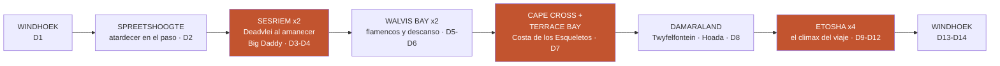
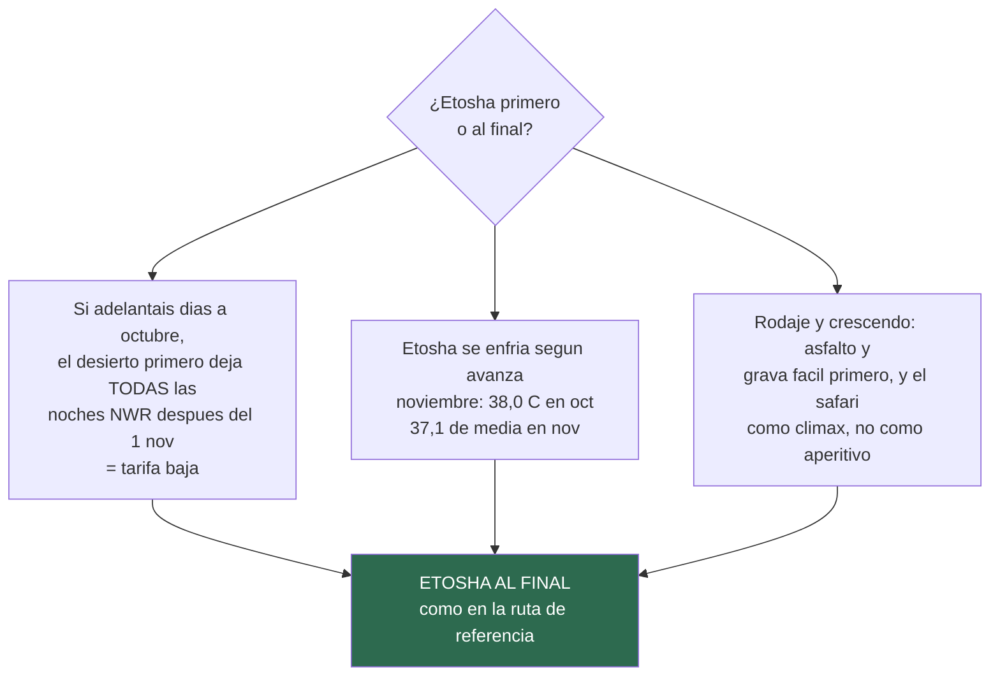
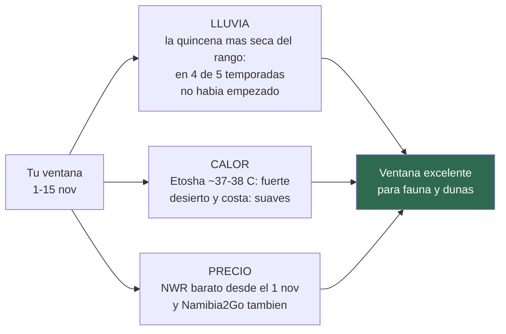
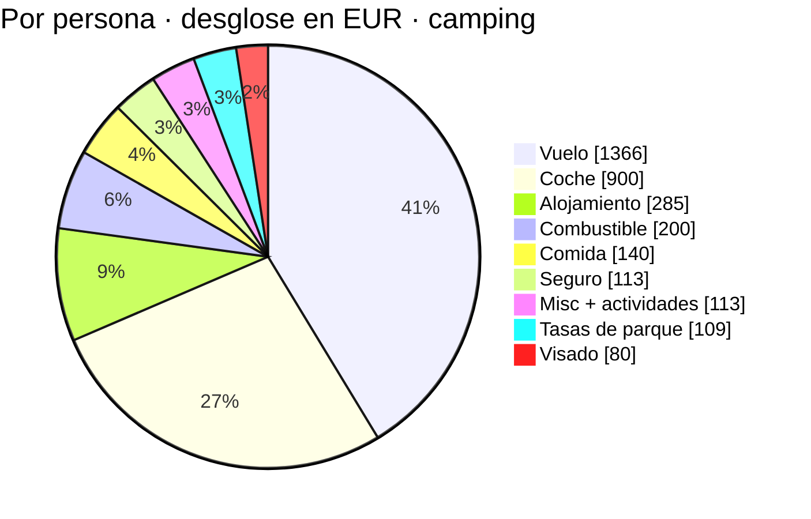
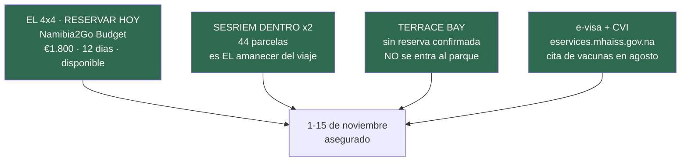
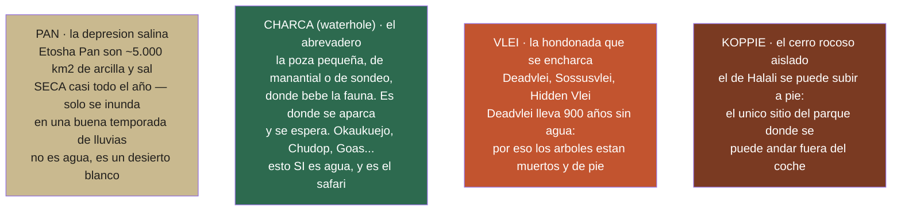
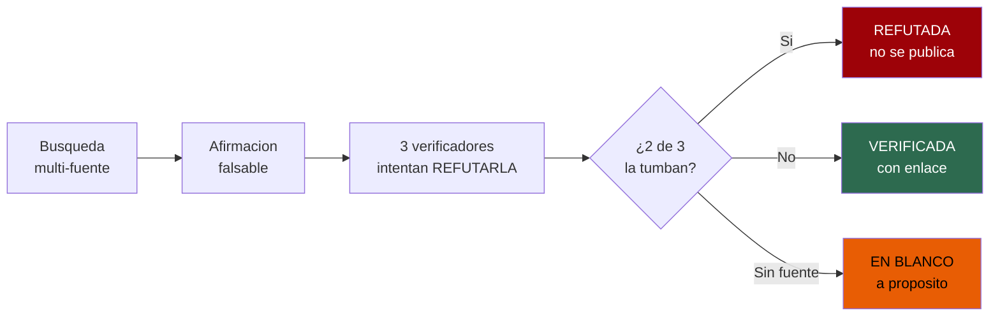

# 🇳🇦 NAMIBIA 2026

## El gran roadtrip del norte

**Dos personas · un 4x4 con tienda de techo · 14 días · primera quincena de noviembre**

*Las dunas más altas del mundo al amanecer · la Costa de los Esqueletos · rinocerontes
bebiendo de noche a diez metros · cuatro noches de safari en Etosha*

Todo verificado contra fuentes primarias. Precios en N$ y €. Actualizado 03·08·2026.

### 📕 [**Descargar el dossier completo en PDF**](dossier-namibia-2026.pdf) · 143 páginas

*Todo esto en un solo documento maquetado, con fotos y los 56 diagramas — para leer del tirón,
imprimir o llevar sin conexión.*
🦁 Y suelta, para la guantera: [**la guía de fauna**](guia-fauna-etosha.pdf) *(18 páginas, 83 especies con foto)*.

---

## ⭐ La ruta

> # La clásica del norte, a ritmo lento.
> ### Desierto → costa → Damaraland → Etosha. Sin prisas, sin el sur, sin días imposibles.

```mermaid
flowchart LR
    W["WINDHOEK<br/>D1"] --> SP["SPREETSHOOGTE<br/>atardecer en el paso · D2"]
    SP --> SE["SESRIEM x2<br/>Deadvlei al amanecer<br/>Big Daddy · D3-D4"]
    SE --> WB["WALVIS BAY x2<br/>flamencos y descanso · D5-D6"]
    WB --> SK["CAPE CROSS +<br/>TERRACE BAY<br/>Costa de los Esqueletos · D7"]
    SK --> DA["DAMARALAND<br/>Twyfelfontein · Hoada · D8"]
    DA --> ET["ETOSHA x4<br/>el climax del viaje · D9-D12"]
    ET --> W2["WINDHOEK<br/>D13-D14"]
    style SE fill:#C2542F,color:#fff
    style ET fill:#C2542F,color:#fff
    style SK fill:#C2542F,color:#fff
```

**~2.600 km · 13 días de coche · ningún día por encima de ~390 km · dos noches en Sesriem, dos en
la costa y CUATRO en Etosha.**

Es la ruta del clásico de dos semanas *(la misma familia que el itinerario de
[lugaresincertos.com](https://www.lugaresincertos.com/en/travel-inspiration/two-week-trip-to-namibia/)
que sirvió de referencia)*, montada con nuestros datos verificados. **El sur queda para otro
viaje**: está medido y documentado en el dossier por si algún día vuelve.

### ❓ ¿Etosha al principio o al final? → **Al final.** Tres razones con datos:

```mermaid
flowchart TD
    Q{"¿Etosha primero<br/>o al final?"}
    Q --> R1["Si adelantais dias a octubre,<br/>el desierto primero deja TODAS las<br/>noches NWR despues del 1 nov<br/>= tarifa baja"]
    Q --> R2["Etosha se enfria segun avanza<br/>noviembre: 38,0 C en oct<br/>37,1 de media en nov"]
    Q --> R3["Rodaje y crescendo: asfalto y<br/>grava facil primero, y el safari<br/>como climax, no como aperitivo"]
    R1 --> V["ETOSHA AL FINAL<br/>como en la ruta de referencia"]
    R2 --> V
    R3 --> V
    style V fill:#2d6a4f,color:#fff
```

1. **El dinero.** Si adelantáis la salida a finales de octubre, con el desierto primero **todas las
   noches de NWR (Sesriem, Terrace Bay, Etosha) caen después del 1 de noviembre** — tarifa baja.
   Etosha primero + salida en octubre = pagar la tarifa vieja **y** pillar el parque en su pico de
   calor (38,0 °C de media de máximas en octubre).
2. **El termómetro.** Etosha se enfría según avanza noviembre (38,0 oct → 37,1 media nov): cada día
   que tardas en llegar, un poco más suave.
3. **El rodaje.** Los primeros días son asfalto y grava amable — llegas a Damaraland con oficio, y
   el safari es el clímax final, no el aperitivo.

*El único contra, dicho honesto: el riesgo de primeras tormentas sube mínimamente hacia el día 15
(en 2 de las últimas 5 temporadas cayó algún chubasco suelto en la primera quincena — aislado, no
la temporada asentada). Marginal frente a las tres razones de arriba.*

📖 **El día a día completo, con dónde dormir y precios** → [`01-itinerarios-dia-a-dia`](01-itinerarios-dia-a-dia.md)

---

## 🚨 Lo primero de todo: reserva la Budget hoy

> ### La Comfort no está libre. La Budget sí — y es €200 más barata.

- 🚙 **COMFORT** · €166,67/día → **€2.000** · ❌ **«Not Available — Contact Us»**
- 🚙 **BUDGET** · €150,00/día → **€1.800** · ✅ **«Rent this Car»**

**Cógela.** El coche es **el cuello de botella del viaje entero**, y tienes una disponible **y más
barata**. **No dejes que lo perfecto te quite lo disponible**: si la Budget también vuela, te quedas
sin ruta.

*Si te apetece, escribe a Namibia2Go en paralelo preguntando si el «Contact Us» de la Comfort es
falta de coches o simplemente que el año tarifario 2026/27 aún no está abierto a venta online. Pero
**reserva primero, pregunta después**.* 📞 **+264 61 427 220** · [namibia2go.com](https://namibia2go.com)

### ⛺ Lo que pierdes con la Budget: solo dos cosas

- **Tiendas** — 2 Tentco **de lona** *(la Comfort: carcasa rígida)*
- **Cocina** — **cajas de camping** *(la Comfort: compartimentos a medida)*

**Todo lo demás es idéntico**: el mismo Toyota Hilux Double Cab **2.8L GD-6 turbodiésel**,
automático, 4x4 permanente, **km ilimitados**, **Premium Insurance Cover** (franquicia cero),
**2 ruedas de repuesto** y nevera eléctrica.

La diferencia real: la lona tarda ~5 minutos en montarse en vez de ~1, y aguanta algo peor el polvo
y el viento. Son **~€18 por noche de tienda** de sobrecoste la Comfort. **Con la Budget ahorras €100
por persona** — y sigues durmiendo arriba las 11 noches.

> 🎥 Al ver el [vídeo del Hilux](https://www.youtube.com/watch?v=LPNZ-l8y3Pg): si las tiendas del
> techo son de **lona plegada**, ése es exactamente tu coche.

### 🛑 Y el orden importa: el coche antes que los vuelos

El vuelo de €1.366 p.p. (31 oct–14 nov) es **de referencia**, no emitido. **Confirma el coche
primero.** Este dossier lleva desde el primer día diciéndolo, y el «Not Available» de la Comfort es
justo la razón: **una ruta sin coche no es una ruta**.

---

## ✨ Los momentos que hacen este viaje

- 🌅 **El amanecer en Deadvlei que casi nadie consigue.** La puerta interior de Sesriem abre **1 hora
  antes** que la exterior — solo para quien duerme dentro (**N$1.340 · ~€67** los dos). Árboles
  negros de 900 años, la duna encendiéndose, y los demás todavía en la cola de la otra puerta. ✅
- 🏜️ **Big Daddy y Hidden Vlei.** Con dos noches en Sesriem hay día entero: la subida a la gran
  duna, la bajada corriendo hasta Deadvlei, y el vlei escondido sin gente. Duna 45 a la vuelta. ✅
- 🌇 **El atardecer del paso de Spreetshoogte** — el Namib mil metros bajo tus pies en una de las
  carreteras más empinadas del país. La primera noche de desierto, a dos horas de Windhoek. ◐
- 🦏 **La charca iluminada de Okaukuejo.** Rinocerontes negros, elefantes y jirafas bebiendo de noche
  con el parque cerrado y tú dentro. Camping **N$920 (~€46)**; el capricho del **chalet del charco**,
  **N$4.760 (~€238)** — en tu ventana, tarifa baja. ✅
- 🐘 **Cuatro noches de safari, todas DENTRO del parque.** Okaukuejo → Halali → Namutoni ×2
  (**N$920/noche los dos** ✅): sin horas de puerta, con las charcas iluminadas al lado y los
  amaneceres sin esperar a que abran. Y en seco: el parque estuvo así en **4 de las últimas 5
  temporadas** — la fauna concentrada en las charcas. ✅
- 🦭 **Cape Cross**: decenas de miles de lobos marinos *(pañuelo para la nariz — en serio)*. ✅
- 🌊 **Dormir en la Costa de los Esqueletos.** Noche en **Terrace Bay**, dentro del parque, con la
  niebla y el Atlántico rugiendo. Pocos lo hacen: exige reserva y entrar antes de las 15:00. ✅
- 🪨 **Twyfelfontein**, los grabados rupestres UNESCO, y la noche en **Hoada** — el campamento entre
  peñas de granito que la referencia llama el más bonito de su viaje. ◐
- 🦩 **Flamencos en Walvis Bay** al amanecer, ostras y paseo — **dos noches y un día entero de
  descanso** a mitad de viaje. La excursión a **Sandwich Harbour, en tour guiado** *(con tu coche
  está prohibida por contrato — y el tour es mejor plan)*. ✅
- 🥧 **La tarta de manzana de Solitaire** — dos veces, porque la ruta pasa dos veces. Y las dos se
  reposta: después hay **210 km sin nada**. ✅
- 🍺 **Joe's Beerhouse** en Windhoek, la primera y la última cena. N$200–400 (~€10–20). ✅

---

## 📅 Tu ventana: 1–15 de noviembre

```mermaid
flowchart LR
    A["Tu ventana<br/>1-15 nov"] --> B["LLUVIA<br/>la quincena mas seca del rango:<br/>en 4 de 5 temporadas<br/>no habia empezado"]
    A --> C["CALOR<br/>Etosha ~37-38 C: fuerte<br/>desierto y costa: suaves"]
    A --> D["PRECIO<br/>NWR barato desde el 1 nov<br/>y Namibia2Go tambien"]
    B --> E["Ventana excelente<br/>para fauna y dunas"]
    C --> E
    D --> E
    style E fill:#2d6a4f,color:#fff
```

- 🌧️ **Lluvia: la mejor noticia.** En las últimas 5 temporadas, el inicio real de las lluvias en
  Etosha cayó en **enero tres veces, diciembre una y noviembre una**. Tu quincena: charcas llenas
  de fauna y cielos limpios, con datos de estación — no de folletos.
- 🌡️ **Calor: Etosha aprieta, el resto acompaña.** El norte a **~37–38 °C** de máxima — el safari se
  hace al amanecer y al atardecer, con siesta y charca iluminada de noche, que es como se hace bien
  de todas formas. El desierto **Sesriem ~32,5 °C** y la costa fresca (Benguela):
  **Swakopmund/Walvis Bay ~25 °C** de máxima en noviembre. Etosha y la costa vienen de **estación
  NOAA**; Sesriem no tiene estación y se cerró con el **reanálisis ERA5**, validado contra estaciones *(ver [`15`](15-huecos-cerrados.md),
  secciones "La costa" y §ERA5)*. **Las noches, entre 12,7 °C (la costa) y 18,9 °C (Etosha)**:
  **forro polar, no plumas** — la lista completa de equipaje, en [`05`](05-equipaje.md), y la
  temperatura noche a noche en [`01`](01-itinerarios-dia-a-dia.md).
- 💶 **Precio: la frontera del 1 de noviembre, dos veces.** **NWR** entra en tramo barato el 1 de
  noviembre (Sesriem, Terrace Bay, Etosha), y **Namibia2Go también**. 👉 **¿Adelantar días a
  octubre? Hasta 2 días es gratis** — las primeras noches (Windhoek, Spreetshoogte) no son NWR.
- 🚗 **El coche: ✅ Namibia2Go Budget, €1.800 por 12 días** *(la Comfort no está disponible)*. Y aquí tu ventana acertó:
  **Namibia2Go entra en temporada baja el 1 de noviembre** *(Asco no lo hace hasta el 15)*, así que
  el presupuesto cae entero en su tarifa barata. Incluye **km ilimitados** y **Premium Insurance
  Cover** *(franquicia cero — matiz: decae con «negligencia probada» y excluye daños por agua;
  pregunta por escrito cómo trata los **bajos en Damaraland**, que el D8 pasa por ahí)*.

---

## ✈️ El vuelo y 🩺 el seguro

> # €1.366 por persona el vuelo · €113,02 el seguro
> ### ⚠️ Con el precio cerrado — pero **confirma si el billete está emitido**: el dossier dice las dos cosas
> ### A Coruña → Windhoek 31 oct – 14 nov · IATI Estrella 31/10 – 15/11

- ✈️ **Ida** sáb 31 oct por Madrid y Adís, **aterrizas el 1 de noviembre a las 13:20**. **Vuelta**
  sáb 14 por Adís, Roma y Madrid — dura 26h40 y llegas a casa el día 15 a las 16:10.
- 🎉 **Y resuelve solo la fiebre amarilla**: las escalas en Adís son de 2h20 y 2h45, *airside*, muy
  por debajo del umbral de 12 h. **No hace falta vacunarse.**
- ⚠️ **Dos cosas antes de pagar**: que sea **billete único** *(la vuelta lleva tres compañías)* y
  que **incluya maleta facturada**.
- 🩺 **El seguro llega hasta el día 15**, no hasta el 14: son 16 horas de vuelta que sin eso irían
  sin cobertura, y cerrar ese hueco costó **€14,69**.
- 👉 **Dos cosas que pedirle a IATI por escrito**: que cubra **evacuación aérea DENTRO del país**
  *(cerca de Sesriem no hay hospital)* y **añadirle búsqueda y salvamento**, que en el Estrella es
  opcional y el Mochilero sí trae.

📖 **El detalle completo de los dos —el itinerario tramo a tramo, la comparativa de las tres
modalidades de IATI y por qué la franquicia de coche sobra— está en
[`02-presupuesto`](02-presupuesto.md).**

## 💶 El presupuesto — por persona, partida a partida

> # ~€3.306 por persona · todo incluido
> ### Rango honesto: **€3.150–3.450**. El **79 %** ya está cerrado.

**Incluye:** vuelo · coche · **seguro de viaje** · combustible · tasas de parque · visado · las 13
noches · comida · actividades · imprevistos. **No queda nada fuera** salvo lo que compres allí por gusto.

```mermaid
pie showData
    title Por persona · desglose en EUR · camping
    "Vuelo" : 1366
    "Coche" : 900
    "Alojamiento" : 285
    "Combustible" : 200
    "Comida" : 140
    "Seguro" : 113
    "Misc + actividades" : 113
    "Tasas de parque" : 109
    "Visado" : 80
```

*Vuelo y coche son el **69 %** del viaje. Todo lo demás junto son ~€1.030.*

### 👤 El desglose y el coche, en una línea

- ✈️ Vuelo **€1.366** ✅ · 🚙 Coche **€900** ✅ · ⛺ Alojamiento **~€285** · ⛽ Combustible **~€200** ·
  🍖 Comida **~€140** · 🩺 Seguro **€113** ✅ · 🎫 Tasas **~€109** ◐ · 🛂 Visado **€80** ✅ ·
  🎯 Actividades y varios **~€113**
- **El 79 % ya está cerrado** con precio real: vuelo, coche, seguro, visado y las 6 noches de NWR.
  Lo estimado (~€578) son las 7 noches sin precio, el combustible, la comida y los misceláneos.
- 🚙 **El coche**: Namibia2Go **Budget**, €150,00/día × 12 días (1–13 nov) = **€1.800** con
  impuestos, ✅ disponible, con **km ilimitados** y **Premium Insurance Cover**.
- ⚠️ **Ojo al calendario**: son **12 días de coche pero 13 noches**. La del 13 en Windhoek te quedas
  sin coche → hotel y traslado, o añadir el día (~€150) y devolverlo el 14 camino del aeropuerto.

📖 **El desglose completo, partida a partida, con qué está cerrado y qué es estimación —y qué pasa
si vais 3 o 4 en el mismo coche— está en [`02-presupuesto`](02-presupuesto.md).**

### 🎥 El coche por dentro — y qué te da exactamente la Budget

▶️ **[Namibia2Go — «Experience The Fully Equipped Hilux»](https://www.youtube.com/watch?v=LPNZ-l8y3Pg)**
*· vídeo de la propia empresa*

**Es tu coche** —Toyota Hilux Double Cab camping equipped de Namibia2Go— pero **ojo al mirarlo**:
la web ofrece **dos versiones del mismo vehículo** y el vídeo no aclara cuál enseña. La diferencia
se ve a simple vista:

- 🏆 **Budget** — dos tiendas **blandas** Tentco + cajas de camping ← **la tuya** ✅ *(la Comfort salió «Not Available» para tus fechas)*
- **Comfort** — dos tiendas de **carcasa rígida** + cocina a medida *(no disponible)*

> 👉 **Al ver el vídeo, fíjate en el techo:** el tuyo es el **Budget**, así que espera **tiendas de
> lona plegada** *(no las de carcasa rígida tipo concha, que son de la Comfort)*. Todo lo demás que
> enseña el vídeo —motor, nevera, mesa, menaje— es idéntico en la tuya.
>
> *La lona plegada se monta y desmonta a mano cada día — con **11 noches de tienda**, es la rutina de
> la tarde. Práctica en subir y bajar el toldo antes de salir.*

**Ficha verificada del vehículo** ✅ — 4x4 permanente · automático · **motor 2.8L GD-6 turbodiésel**
· 5 plazas con tiendas para 4 · km ilimitados · **2 ruedas de repuesto** y **nevera eléctrica** ·
2 tiendas de techo, mesa, 4 sillas, ropa de cama para 4 y menaje completo · *1 día = 24 h*.

🎉 **Las 2 ruedas de repuesto vienen de serie** — es justo lo que recomienda todo el que conduce
esas pistas.

> ### ⚠️ Una trampa que tu presupuesto ya esquiva
> Los precios «temporada baja» que publica la web caen en la banda **«01 Nov 2025 – 30 Jun 2026»**:
> **caduca antes de tu viaje**. La siguiente que publica es la alta de julio a octubre de 2026. **Tu
> ventana cae en el año tarifario siguiente, que no está en la web.**
>
> Tus **€150/día (€1.800 por 12 días) son una cotización en vivo para tus fechas reales**, no el
> precio caducado de la web. 👉 **Fíate de tu cotización, no del precio publicado.** *(Es exactamente
> la misma trampa que la tarifa de NWR.)*

*Fuente: [namibia2go.com · 4x4 camping equipped double cab](https://namibia2go.com/4x4-camping-equipped-double-cab)*

### ⛺ Sí se puede acampar dentro de Etosha — **11 de 13 noches en el coche**

**Okaukuejo, Halali y Namutoni tienen camping**: **N$460/persona = N$920 la pareja** ✅, verificado
en la tarifa oficial NWR 2026/2027. **Es justo lo que ya estaba presupuestado** — y son las noches
de la charca iluminada.

**Las únicas dos que no pueden ser tienda de techo:**
- 🌊 **D7 · Terrace Bay** — es **resort**, no camping. *(El camping de la zona es **Torra Bay**, y
  solo abre **diciembre–enero** ✅.)* Si no encaja, la variante fácil es dormir en **Henties Bay o
  Swakopmund** —donde sí hay camping— y cruzar el Skeleton Coast en tránsito al día siguiente.
- 🏙️ **D13 · Windhoek** — el coche ya está entregado → hotel.

### 🔬 Qué parte de este número es sólida

- **✅ Duro — €2.618 de los €3.306 (79 %)**: vuelo €1.366 · coche €900 · 6 noches NWR €159 ·
  seguro €113 · visado €80
- **◐ Corroborado**: tasas de parque (~€109) — el N$280/adulto lo confirman **dos páginas oficiales del
  MEFT** (PDF de tarifas + nota de prensa `news/199`, vigente 1/04/2026), varias secundarias y ya la
  **fuente legal primaria localizada** (*Government Gazette Nº 8877, Government Notice Nº 115, 1/04/2026*),
  pero ninguna se pudo abrir aquí (403), así que la extracción de la tabla queda ◐; los tres parques de
  la ruta son **premium**. **Confírmalo por email o abriendo la Gaceta 8877 desde fuera.**
- **○ Estimado — ~€578 p.p.**: 7 noches sin precio (~€126), combustible (~€200), comida (~€140),
  actividades (~€38), misceláneos (~€75). **Ese es el margen real: ±€145 por persona.**

---

## 🎯 Las reservas que hacen el viaje

```mermaid
flowchart TD
    A["EL 4x4 · RESERVAR HOY<br/>Namibia2Go Budget<br/>€1.800 · 12 dias · disponible"]
    B["SESRIEM DENTRO x2<br/>44 parcelas<br/>es EL amanecer del viaje"]
    C["TERRACE BAY<br/>sin reserva confirmada<br/>NO se entra al parque"]
    D["e-visa + CVI<br/>eservices.mhaiss.gov.na<br/>cita de vacunas en agosto"]
    A --> E["1-15 de noviembre<br/>asegurado"]
    B --> E
    C --> E
    D --> E
    style A fill:#2d6a4f,color:#fff
    style B fill:#2d6a4f,color:#fff
    style C fill:#2d6a4f,color:#fff
    style D fill:#2d6a4f,color:#fff
```

1. **El 4x4 — RESÉRVALO HOY.** Namibia2Go **Budget**, €1.800 por 12 días con seguro y km
   ilimitados, ✅ **disponible**. *(La Comfort sale «Not Available».)* **Flota pequeña y noviembre
   competido: es el cuello de botella.** *Y decide si añadir el día 13 (~€150) para devolverlo
   camino del aeropuerto en vez de hotel + dos traslados.*
2. **Sesriem dentro de la puerta, dos noches.** Solo **44 parcelas**, y es la diferencia entre *ver*
   Deadvlei y *tenerlo para ti* al amanecer. *(Plan B: Sossus Oasis en la puerta — perdiendo la hora
   de ventaja, que es el motivo.)*
3. **Terrace Bay con reserva confirmada** — sin ella **no te dejan entrar** al Skeleton Coast para
   pernoctar (el permiso de tránsito obliga a salir el mismo día). Y las **4 noches DENTRO de
   Etosha** (Okaukuejo, Halali, Namutoni ×2 — N$920/noche ✅): en noviembre hay sitio, pero el
   chalet del charco vuela.
4. **Los papeles con calendario.** El **e-visa (N$1.600, ~€78)** se pide online y **se imprime y
   firma ante el oficial** — solo en `eservices.mhaiss.gov.na` ⚠️ *(`namibia-evisa.com` parece
   oficial y no lo es; el portal real puede dar un aviso de certificado — es mala configuración
   suya: verifica el dominio y sigue)*. La **cita del Centro de Vacunación** (A Coruña, Durán
   Lóriga 3 · **981 989 570**) se pide **en agosto**. Y el **permiso internacional de conducir**:
   con carnet español (que no está en inglés) **sí hace falta** — lo pide la ley namibia, el
   alquiler y el seguro. Se saca en la DGT por **~€10,51 (~N$210)**, vale **1 año** y va **siempre
   junto al carnet** *(detalle y evidencia en `04`)*.

**Y tres datos médicos que se resuelven en una tarde:** **malaria** — Etosha sí es zona (CDC), el
desierto y la costa no; a primeros de noviembre, antes de las lluvias, el riesgo está en su mínimo
estacional *(Malarone empieza 1–2 días antes; mefloquina, 2–3 semanas)* · **fiebre amarilla** —
escala corta y sin salir del aeropuerto en Adís = no hace falta; Doha, Fráncfort y Johannesburgo,
limpios · **seguro con repatriación** — es condición de entrada; pide por escrito que cubra
**evacuación aérea dentro del país** (cerca de Sesriem no hay hospital).

---

## 🧭 Conducir Namibia como un local

- **80 km/h en grava** — límite contractual (el legal es 100), registrado por caja negra. **Todos
  los tiempos de este repo ya van así**: cualquier itinerario de internet a 100 es un 20 % más
  optimista que tu realidad. Dentro de los parques, 60.
- **Nunca pases de largo una gasolinera.** Solitaire, Henties Bay, Kamanjab, Outjo, Otjiwarongo: se
  reposta en todas, marque lo que marque la aguja. Las tarjetas **sí** se aceptan *(el «solo
  efectivo» es un mito de mala traducción)*, pero lleva **~N$4.000 (~€200)** de reserva.
- **Llega a las 18:00** (17:30 en las etapas largas de los primeros días). En tu ventana (1–15 nov)
  anochece **~19:03–19:12 en el interior y hasta ~19:20 en la costa** —algo antes que a fin de mes;
  ocaso recalculado en `15` y desglosado día a día en `01`— y la fauna sale a los arcenes al
  atardecer. El día crítico es el D7: **Ugabmund cierra la entrada a las 15:00**.
- **El seguro y Damaraland**: el Super Cover de Asco **no cubre los bajos en Damaraland/Kaokoveld**
  — el tramo D8 pide suavidad en las piedras. Las pistas malditas **D3707/D3703 no están en esta
  ruta**. *Dune driving* y Sandwich Harbour, **prohibidos por contrato** — el tour guiado es el plan.

Extras: enchufes **tipo M** *(2 adaptadores online — el Schuko no entra)* · **SIM de MTC** en el
aeropuerto con pasaporte *(el kiosco cierra ~21:00)* · un **satelital con SOS** es buena compañía
donde no hay cobertura · la **Línea Roja**: la carne cruda no baja del norte — el braai se come en
Etosha · los **N$ sobrantes se cambian antes de volar**.

---

## 🗣️ Cuatro palabras que hay que entender antes de seguir

El paisaje namibio se nombra en **afrikáans**, y los mapas, los carteles del parque y este dossier
usan esas palabras. Tres de ellas se confunden entre sí constantemente:

```mermaid
flowchart TD
    P["PAN · la depresion salina<br/>Etosha Pan son ~5.000 km2 de arcilla y sal<br/>SECA casi todo el año — solo se inunda<br/>en una buena temporada de lluvias<br/>no es agua, es un desierto blanco"]
    C["CHARCA (waterhole) · el abrevadero<br/>la poza pequeña, de manantial o de sondeo,<br/>donde bebe la fauna. Es donde se aparca<br/>y se espera. Okaukuejo, Chudop, Goas...<br/>esto SI es agua, y es el safari"]
    V["VLEI · la hondonada que se encharca<br/>Deadvlei, Sossusvlei, Hidden Vlei<br/>Deadvlei lleva 900 años sin agua:<br/>por eso los arboles estan muertos y de pie"]
    K["KOPPIE · el cerro rocoso aislado<br/>el de Halali se puede subir a pie:<br/>el unico sitio del parque donde se<br/>puede andar fuera del coche"]
    style P fill:#c9b98f,color:#22201d
    style C fill:#2d6a4f,color:#fff
    style V fill:#C2542F,color:#fff
    style K fill:#7a3a22,color:#fff
```

> **El error que evita esto:** leer «hay agua en la depresión» y pensar en las charcas. Son cosas
> distintas y **no van juntas**: en tu quincena **la depresión está seca** —por eso no hay
> flamencos— y precisamente por eso **las charcas concentran a toda la fauna**. La depresión seca
> es la razón de que el safari funcione.

**Y las de la mesa**, que también salen en el dossier: **braai** *(la barbacoa, que es casi una
institución)* · **biltong** *(cecina curada)* · **boerewors** *(la salchicha del braai)* ·
**potjiekos** *(guiso de olla de tres patas)* · **kapana** *(tiras de vacuno a la brasa de los
mercados)*. Y dos bichos con nombre propio: **dassie** *(el damán)* y **shongololo** *(el milpiés)*.

---

## 📚 El dossier completo

*Numerados por **el momento en que se usan**, no por el orden en que se investigaron.*

**🚗 La ruta y el dinero — para decidir y reservar**

1. ⭐ [**`01-itinerarios-dia-a-dia`**](01-itinerarios-dia-a-dia.md) — **la ruta día a día**: sol, temperatura, horarios, precios y qué se ve en cada charca. *El documento del viaje.*
2. 💶 [**`02-presupuesto`**](02-presupuesto.md) — el total partida a partida, lo cerrado y lo estimado, y qué cambia si vais 3 o 4
3. 🛏️ [**`03-alojamiento-y-tasas`**](03-alojamiento-y-tasas.md) — tarifas oficiales de NWR 2026/2027 y tasas de parque

**🧳 Preparar — antes de salir de casa**

4. 📅 [**`04-guia-preparacion`**](04-guia-preparacion.md) — la cuenta atrás, el e-visa, las vacunas y los plazos que vencen
5. 🎒 [**`05-equipaje`**](05-equipaje.md) — el petate que dictan los datos: qué llevar, qué dejar y los tres micro-kits

**🧭 En ruta — lo que se consulta con el coche en marcha**

6. 🚙 [**`06-conduccion`**](06-conduccion.md) — el vuelco, el contrato, las presiones, la arena y las puertas de Sesriem
7. ⛽ [**`07-logistica`**](07-logistica.md) — gasolineras, dinero, cobertura y emergencias
8. 🛒 [**`08-comida-compras-y-regalos`**](08-comida-compras-y-regalos.md) — súper parada a parada, la ley del alcohol, dónde comer y la aduana
9. 🦁 [**`09-fauna-etosha`**](09-fauna-etosha.md) — **guía de campo en PDF**: 83 especies con foto, y dónde y cuándo verlas
10. 💎 [**`10-joyas-ocultas`**](10-joyas-ocultas.md) — los Lone Stone Men, la cascada del Uniab, los círculos de hadas
11. 📍 [**`11-lista-google-maps`**](11-lista-google-maps.md) — tus 34 pines, medidos y triados

**🔬 El respaldo — por qué te puedes fiar de estos números**

12. ✅ [**`12-hallazgos-verificados`**](12-hallazgos-verificados.md) — lo que superó la verificación a tres votos, y lo que quedó refutado
13. 🗺️ [**`13-itinerario`**](13-itinerario.md) — distancias, firme y viabilidad *(incluye el análisis del sur, que quedó fuera)*
14. 🌧️ [**`14-lluvias-historico`**](14-lluvias-historico.md) — cinco temporadas de lluvia, milímetro a milímetro
15. 🕳️ [**`15-huecos-cerrados`**](15-huecos-cerrados.md) — el cuaderno de bitácora: temperaturas de estación *(GHCN, GSOD y ERA5)*, viento, luz, vuelos, tasas y lodges

📕 Y el PDF: [**`guia-fauna-etosha.pdf`**](guia-fauna-etosha.pdf) — la guía de campo, para imprimir.

### 🗺️ Tus 34 pines, en una línea

**En la ruta E**: Joe's Beerhouse · Solitaire · Namib-Naukluft · Sesriem Canyon · Duna 45 ·
Deadvlei · Walvis Bay · Swakopmund *(de paso)* · Cape Cross · Skeleton Coast · Twyfelfontein ·
Etosha *(4 noches dentro)*. **Opcionales**: **Onguma** *(tu pin — capricho fuera de la puerta este,
a cambio de no dormir dentro)* · Okonjima/AfriCat · Hoba · Waterberg *(los tres, de camino el D13)*. **Fuera esta vez**: todo el sur *(quedó fuera del dossier; está en el historial de git por si vuelve)* · Spitzkoppe y
Brandberg *(tampoco están en la ruta de referencia)* · NamibRand · Messum · Bagatelle ·
Epupa/Opuwo *(descartado con números en `11`: ~730 km hasta Opuwo + ~180-200 km de grava C43 hasta Epupa = desvío de ~2 días cada sentido, y dentro de la zona sin cobertura de bajos)* · Tsumkwe · Harnas · Kgalagadi.
ℹ️ Twyfelfontein y Duna 45 salen en Google como cerrados: **fallo del listado, ambos funcionan**.

---

## 🔬 Por qué puedes fiarte de estos números

```mermaid
flowchart LR
    A["Busqueda<br/>multi-fuente"] --> B["Afirmacion<br/>falsable"]
    B --> C["3 verificadores<br/>intentan REFUTARLA"]
    C --> D{"¿2 de 3<br/>la tumban?"}
    D -->|"Si"| E["REFUTADA<br/>no se publica"]
    D -->|"No"| F["VERIFICADA<br/>con enlace"]
    D -->|"Sin fuente"| G["EN BLANCO<br/>a proposito"]
    style E fill:#9d0208,color:#fff
    style F fill:#2d6a4f,color:#fff
    style G fill:#e85d04,color:#000
```

**Regla número uno: cero invenciones.** Cada dato viene de una fuente descargada y pasa por
verificadores independientes cuyo trabajo es tumbarlo. Por el camino cayeron perlas que circulan
por toda la web: las tasas de parque a N$150 *(son ~N$280 desde abril de 2026)*, la tarifa NWR de
los blogs *(caduca antes de aterrizar — factura por año tarifario nov–oct)*, el mito del «solo
efectivo» en gasolineras *(«credit» ahí significa «a cuenta», no «tarjeta»)*, y **todas** las
temperaturas de las webs de safaris — rehechas con datos de estación meteorológica.

> **Lo que no se pudo verificar está en blanco y dicho**: el **rack rate primario** de los lodges
> privados sigue bloqueado (egress + anti-bot), aunque su **nivel de precio ya está dimensionado con
> rangos de agregador** en `15` *(gama media ~€75–170/noche los 2; los rack que asoman caducan el
> 31/10/2026, así que noviembre es año tarifario nuevo sin publicar)*; y varios campings por noche
> (Spreetshoogte, Walvis, Quivertree) y las distancias de esta ruta, que se midieron para el
> recorrido del sur. Y las tasas de parque (~N$280) las respaldan ya **dos páginas oficiales del MEFT**
> (PDF + nota de prensa `news/199`), secundarias concordantes y ya el **Government Gazette Nº 8877 (GN
> Nº 115, 1/04/2026)** — la fuente legal numerada, **localizada el 23/07** — pero como ninguna se pudo
> **abrir** aquí (403), la extracción de la tabla fina queda en ◐: **confírmalas por email antes de cerrar presupuesto.**
>
> ✅ **Los vuelos ya no son un hueco** — y sirvieron para pillar un error nuestro: la estimación se
> había quedado ~1,7× corta. **Los números plausibles se acaban usando para pagar.**

---

**Tipo de cambio: ~N$20 = €1** *(rango N$19,5–20,5, a 17·07·2026)*
El NAD va ligado al rand: **el importe en N$ es el que se paga**, el euro es orientativo.

*Todos los precios en N$ y € · Las tarifas namibias cambian: reconfirma antes de pagar*

