<div align="center">

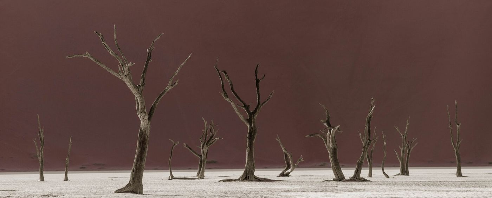

# 🇳🇦 NAMIBIA 2026

### El gran roadtrip del norte

**Chema Morandeira** y **Miguel Rivera** · un 4×4 con tienda de techo
**30 de octubre – 15 de noviembre de 2026**

[](16-punto-de-decision.md)
[](04-guia-preparacion.md)
[](#-lo-que-toca-ahora-por-orden)
[](02-presupuesto.md)
[](dossier-namibia-2026.pdf)

*Las dunas más altas del mundo al amanecer · la Costa de los Esqueletos*
*rinocerontes bebiendo de noche a diez metros · cuatro noches de safari en Etosha*

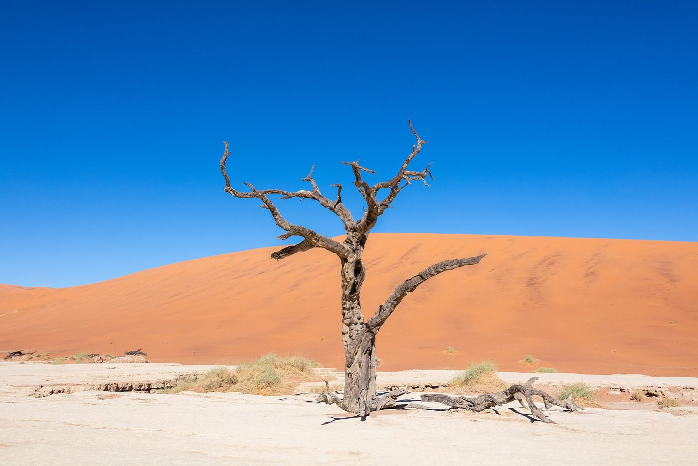 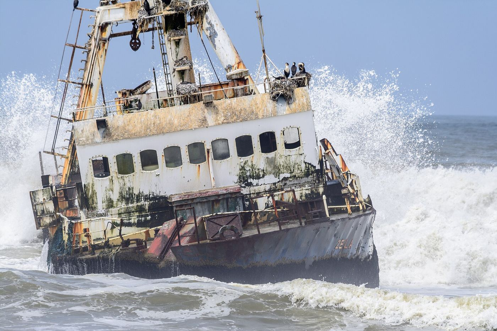 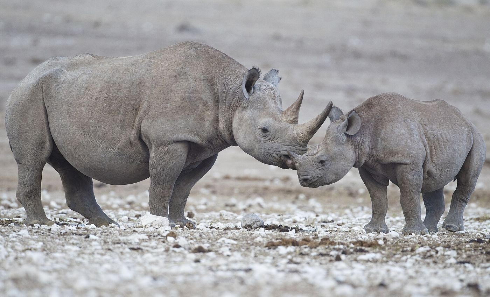

</div>

---

<div align="center">

## 📍 Estado del viaje

**10 de agosto de 2026**

</div>

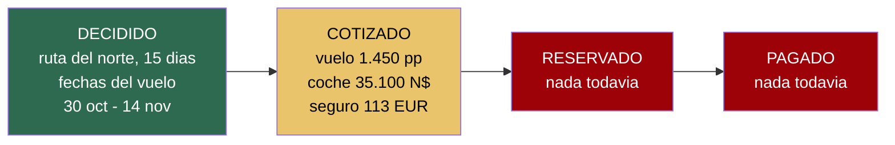
```mermaid
flowchart LR
    D["DECIDIDO<br/>ruta del norte, 15 dias<br/>fechas del vuelo<br/>30 oct - 14 nov"] --> C["COTIZADO<br/>vuelo 1.450 pp<br/>coche 35.100 N$<br/>seguro 113 EUR"]
    C --> R["RESERVADO<br/>nada todavia"]
    R --> P["PAGADO<br/>nada todavia"]
    style D fill:#2d6a4f,color:#fff
    style C fill:#e9c46a,color:#000
    style R fill:#9d0208,color:#fff
    style P fill:#9d0208,color:#fff
```

> [!NOTE]
> **Cerrado y no se rediscute.** La **ruta del norte, 15 días de suelo (14 noches), con Etosha y sin el sur** — decisión
> del viajero, 06/08/2026. Las **fechas son las del vuelo de Lufthansa** —cotizado, todavía sin emitir—: 30 de octubre
> a 14 de noviembre, llegada a Windhoek el **31 a las 09:25** y vuelta el **14 a las 20:45**, en casa el 15.
> El sentido de la marcha, **desierto → costa → Damaraland → Etosha al final**. El coche,
> **Namibia2Go, aeropuerto → aeropuerto** — se recoge el **31 al aterrizar** y se devuelve el
> **14 camino del embarque** *(decisión del viajero, 07/08/2026)*: **ni hoteles en Windhoek ni
> traslados** — esas noches también se duerme arriba. Y el **08/08**, la auditoría del calendario:
> la ruta cabe exacta, **Spreetshoogte pasa de una a dos noches (dom 1 y lun 2 — la del domingo,
> recuperada de la ciudad cerrada de Windhoek)** y los dos días punta
> llevan plan horario *(la facturación de la vuelta cierra a las **19:45** ◐)*. Y los **safaris de
> Etosha, GUIADOS** *(08/08: tres mañanas + el nocturno, ~N$5.400 · ~€270 la pareja — «el safari
> es un 90 % un buen guía»)*. Lo que se comparó antes queda archivado en
> [`16`](16-punto-de-decision.md).

### 🟡 Cotizado con precio real, pero sin cerrar

- ✈️ **Vuelo — €1.450 por persona** ✅ *(cotización propia cerrada; el buscador lo anuncia en €1.341 y sube al cerrar)*.
  **No consta emitido.** Sin billete no hay e-visa.
- 🚙 **Coche — Budget N$35.100 (~€1.755)** o **Comfort N$39.000 (~€1.950)**, las dos disponibles ✅
- 🩺 **Seguro IATI — €113,02 por persona** ✅ · 🛂 **e-visa — N$1.600 (~€80)** ✅
- 🎫 **Tasas de parque — ~N$620 (~€31)/día** la pareja ◐

> [!WARNING]
> **El calendario del coche ya está decidido; falta ejecutarlo.** La cotización vigente sigue
> siendo del **1 al 13 de noviembre**: hay que **recotizar a 15 días, aeropuerto → aeropuerto**
> *(+~N$5.400 · ~€270 la pareja ◐)*, con **el 31 de octubre pedido por separado** *(cae fuera de
> la temporada baja)* y **confirmando la entrega y devolución EN el aeropuerto y su posible
> suplemento** ❌. Y el **seguro tiene que empezar el 30/10**, no el 1 de noviembre.

### 🔴 Lo que toca ahora, por orden

1. **Recotizar el coche con las fechas decididas** *(31 oct 11:00 → 14 nov 18:00, aeropuerto →
   aeropuerto)*. Son **~N$5.400 (~€270)** más la pareja y se lleva por delante dos hoteles y tres
   traslados. ⚠️ El 31 de octubre cae **fuera** de la temporada baja: pídelo por separado, y
   **confirma la entrega en el aeropuerto** ❌.
2. **Reservar el 4×4.** Flota pequeña y noviembre competido: es **el cuello de botella real** del
   viaje. 📞 **+264 61 427 220** · [namibia2go.com](https://namibia2go.com)
3. **Pedir cita en el Centro de Vacunación Internacional** *(A Coruña, Durán Lóriga 3 ·
   **981 989 570**)*. Para salir el 30/10 hay que ser atendidos hacia el **19–26 de septiembre**, y
   **la cita es el recurso escaso, no la vacuna**.
4. **Emitir el vuelo** — y con él ya se puede pedir el e-visa.
5. **Reservar Sesriem ×2, Terrace Bay y las cuatro de Etosha** — sin la de Terrace Bay **no se
   entra** al Skeleton Coast a pernoctar. **Y localizar y reservar Spreetshoogte ×2**: sin tarifa
   ni contacto aún ❌, y con tres homónimos en el mismo paso *(`15`)*. *(Sesriem, Terrace Bay,
   Okaukuejo, Halali, Namutoni y Spreetshoogte: esas son las **6** del contador de arriba.)*
6. **Adelantar el seguro al 30/10** y pedir a IATI por escrito **evacuación aérea dentro del país**.
7. **Preguntar a NWR (+264 67 229 800)** si las 3 salidas guiadas de mañana y el nocturno se
   pueden dejar cerrados desde España — su tarifa avisa de que **en temporada de lluvias no
   aceptan pre-reserva de actividades**; si no, van en recepción al llegar.

📞 **El cuaderno completo de reservas** —cada una con su canal, su contacto verificado, lo que se
pide por escrito al cerrarla y lo que se deja para recepción— **está en
[`21-reservas`](21-reservas.md)**.

<details>
<summary><b>🕳️ Lo que sigue sin poder cerrarse</b></summary>

Tres campings sin tarifa publicada *(Windhoek, Walvis Bay y Spreetshoogte — **contactos ya
localizados el 09/08, ver [`21`](21-reservas.md)**; el de Spreetshoogte, con un aviso de «closed
down» por confirmar ◐)* ·
la fianza de Namibia2Go *(su FAQ, leída directa el 10/08, dice «no deposit»; dos revendedores citan
N$2.500 (~€125) — pregúntalo por escrito)* · la **entrega del coche en el aeropuerto** *(la FAQ:
oficina junto al aeropuerto con shuttle desde llegadas ◐; horario del sábado y suplemento, por
confirmar)* ·
el sobrecoste **en tiempo** del **desvío obligatorio Okaukuejo–Halali** *(los km ya están: **+38**
sobre la pista directa, medidos el 09/08 con el enrutado OSRM propio)* · **si hay diésel en el bucle
Ugabmund–Springbokwasser** *(el surtidor de Terrace Bay, sin garantía — `07`)* · la **capacidad real
del depósito del Hilux** *(la aritmética del bucle la necesita — `07`)* · los horarios de salida
de los safaris guiados de NWR · el precio del **31 de octubre** del coche *(fuera de temporada baja)*.
*(El D0 ya tiene plan —coche, compra y camping—, la franquicia quedó cerrada el 07/08 —1×23 kg por
persona— y el 08/08 quedaron medidos el calendario (15 días/14 noches exactos) y el D14: facturación
de Discover, cierra 19:45 ◐ — ver [`02`](02-presupuesto.md) §2 y §8.)*
**El inventario completo, en [`15`](15-huecos-cerrados.md).**

</details>

<div align="center">

### 📕 [**Descargar el dossier completo en PDF**](dossier-namibia-2026.pdf) · 116 páginas

*Todo esto en un solo documento maquetado, con fotos, **dos mapas propios** y los diagramas — para
leer del tirón, imprimir o llevar sin conexión.*
🦁 Y suelta, para la guantera: [**la guía de fauna**](guia-fauna-etosha.pdf) *(20 páginas, 88 especies con foto, **qué posibilidades hay de ver cada una** y cómo se hace un safari — y ni un animal que nadie haya visto: el corte del 09/08 dejó fuera al oricteropo, la suricata y la cebra de Hartmann)* — va aparte **a propósito**: se usa en el coche, no en el sofá.

[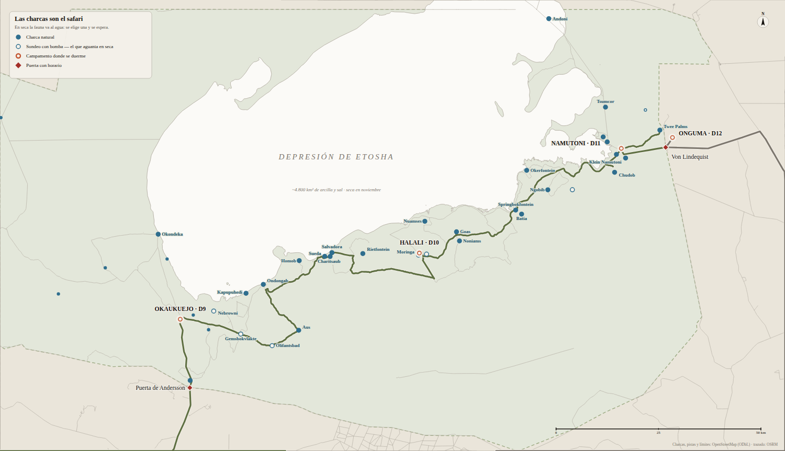](img/mapas/etosha.svg)

*Etosha, charca a charca — el mapa del dossier: en seca la fauna no está repartida por el parque,
está en el agua. [Verlo en grande](img/mapas/etosha.svg).*

</div>

---

<div align="center">

## ⭐ La ruta

### La clásica del norte, a ritmo lento

**Desierto → costa → Damaraland → Etosha.** Sin prisas, sin el sur, sin días imposibles.

[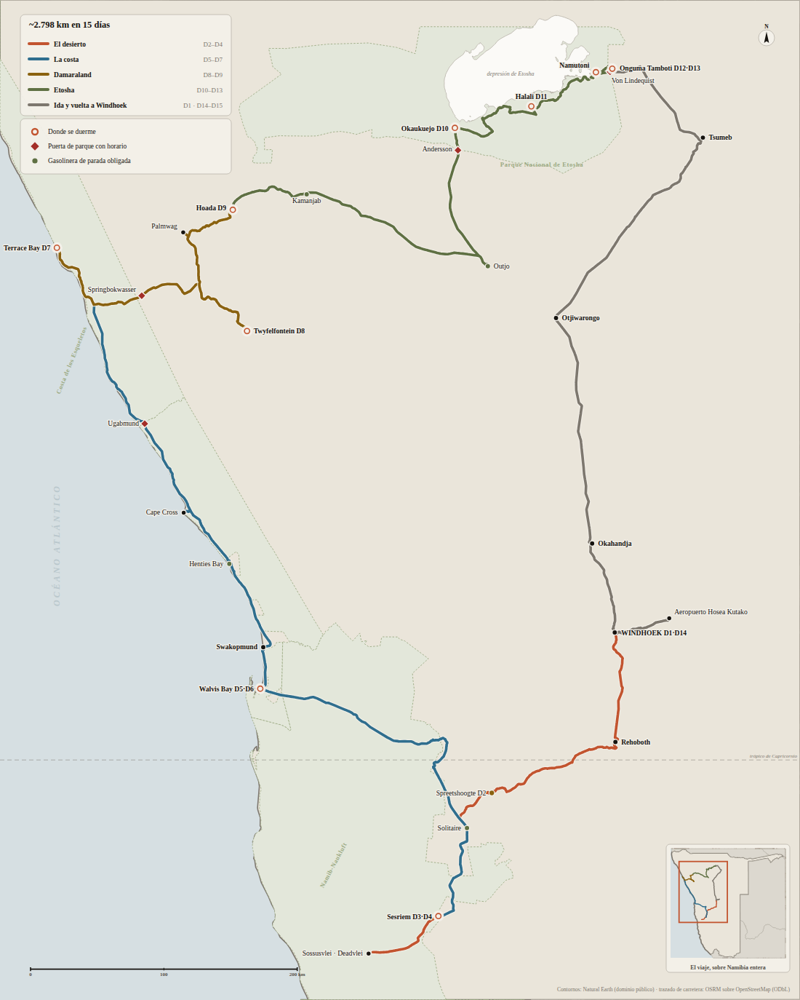](img/mapas/ruta.svg)

*El trazado no está dibujado a mano: son las coordenadas reales de cada parada, enrutadas por
carretera con **OSRM** sobre OpenStreetMap. [Ver el mapa en grande](img/mapas/ruta.svg).*

**~2.757 km · 15 días de coche · dos noches en Spreetshoogte, dos en Sesriem, dos en la costa y CUATRO en Etosha**

</div>

Es la ruta del clásico de dos semanas *(la misma familia que el itinerario de
[lugaresincertos.com](https://www.lugaresincertos.com/en/travel-inspiration/two-week-trip-to-namibia/)
que sirvió de referencia)*, montada con nuestros datos verificados. **El sur queda para otro
viaje**: está medido y documentado en el historial de git por si algún día vuelve.

### ❓ ¿Etosha al principio o al final? → **Al final**, por tres razones con datos

**El dinero** *(con el desierto primero, todas las noches de NWR caen después del 1 de noviembre, en
tarifa baja)*, **el termómetro** *(Etosha se enfría según avanza el mes: 37,8 °C de media en octubre,
37,1 en noviembre)* y **el crescendo** *(asfalto y grava amable primero; el safari como clímax, no
como aperitivo)*. El razonamiento completo, con el contra dicho honestamente, está en el itinerario.

📖 **El día a día completo, con dónde dormir y precios** → [`01-itinerarios-dia-a-dia`](01-itinerarios-dia-a-dia.md)

---

<div align="center">

## 🚗 El coche — el cuello de botella

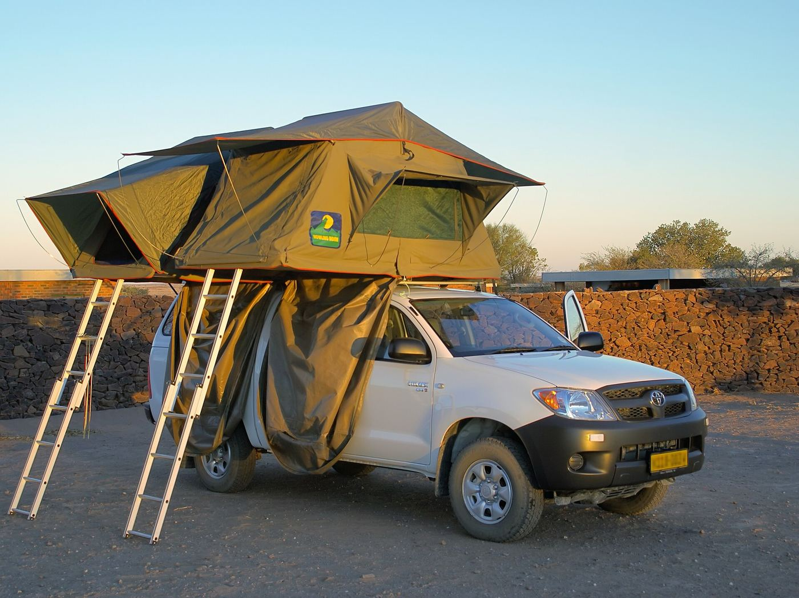

</div>

Las **dos** están disponibles y cotizadas por 13 días e impuestos incluidos — **y las fechas ya
están decididas (07/08): 15 días, aeropuerto → aeropuerto, pendiente de recotizar los 2 extra
(+~N$5.400 · ~€270 la pareja ◐)**:

- 🚙 **BUDGET** · **N$2.700/día** → **N$35.100 (~€1.755)** · ~€877,50 p.p. ✅
- 🚙 **COMFORT** · **N$3.000/día** → **N$39.000 (~€1.950)** · ~€975 p.p. ✅
- 💶 **Diferencia: N$3.900 (~€195) los dos — ~€97,50 por cabeza**

Ya no decides por disponibilidad, sino por si esos ~€97 por cabeza te compran las **tiendas de
carcasa rígida** *(montar en 1 minuto en vez de 5, y mejor con polvo y viento)* — son **13 noches
de tienda**.

<details>
<summary><b>⛺ Lo que pierdes con la Budget: solo dos cosas</b></summary>

- **Tiendas** — 2 Tentco **de lona** *(la Comfort: carcasa rígida)*
- **Cocina** — **cajas de camping** *(la Comfort: compartimentos a medida)*

**Todo lo demás es idéntico**: el mismo Toyota Hilux Double Cab **2.8L GD-6 turbodiésel**,
automático, 4x4 permanente, **km ilimitados**, **Premium Insurance Cover** (franquicia cero),
**2 ruedas de repuesto** y nevera eléctrica.

La diferencia real: la lona tarda ~5 minutos en montarse en vez de ~1, y aguanta algo peor el polvo
y el viento. Son **~€15 por noche de tienda** de sobrecoste la Comfort. **Con la Budget ahorras ~€97
por persona sobre los 13 días cotizados** *(a los 15 decididos, ~€112,50 — ver `02` §10)* — y
sigues durmiendo arriba las 13 noches.

> 🎥 Al ver el [vídeo del Hilux](https://www.youtube.com/watch?v=LPNZ-l8y3Pg): si las tiendas del
> techo son de **lona plegada**, ése es exactamente tu coche.

</details>

---

<div align="center">

## ✨ Los momentos que hacen este viaje

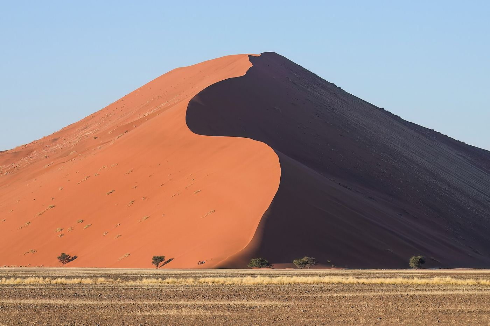 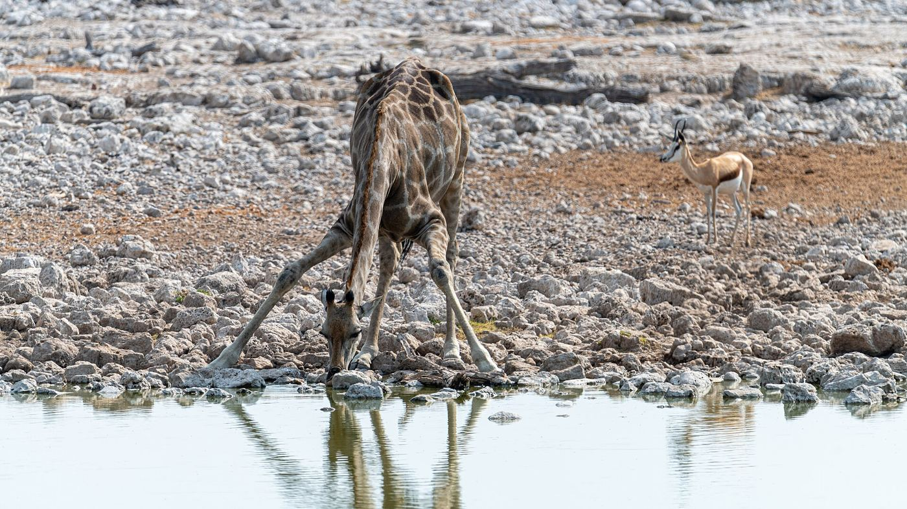

</div>

- 🌅 **El amanecer en Deadvlei que casi nadie consigue.** La puerta interior de Sesriem abre **1 hora
  antes** que la exterior — solo para quien duerme dentro (**N$1.340 · ~€67** los dos). Árboles
  negros de 900 años, la duna encendiéndose, y los demás todavía en la cola de la otra puerta. ✅
- 🏜️ **Big Daddy y Hidden Vlei.** Con dos noches en Sesriem hay día entero: la subida a la gran
  duna, la bajada corriendo hasta Deadvlei, y el vlei escondido sin gente. Duna 45 a la vuelta. ✅
- 🌇 **El atardecer del paso de Spreetshoogte** — el Namib mil metros bajo tus pies en una de las
  carreteras más empinadas del país. La primera noche de desierto, a dos horas de Windhoek. ◐
- 🦏 **La charca iluminada de Okaukuejo.** Rinocerontes negros, elefantes y jirafas bebiendo de noche
  con el parque cerrado y tú dentro. Camping **N$920 (~€46)**; el capricho del **chalet del charco**,
  **N$4.760 (~€238)** — en tu ventana, tarifa baja. ✅
- 🐘 **Cuatro noches de safari, todas DENTRO del parque.** Okaukuejo → Halali → Namutoni ×2
  (**N$920 ≈ €46/noche los dos** ✅): sin horas de puerta, con las charcas iluminadas al lado y los
  amaneceres sin esperar a que abran. Y en seco: el parque estuvo así en **4 de las últimas 5
  temporadas** — la fauna concentrada en las charcas. ✅
- 🦭 **Cape Cross**: decenas de miles de lobos marinos *(pañuelo para la nariz — en serio)*. ✅
- 🌊 **Dormir en la Costa de los Esqueletos.** Noche en **Terrace Bay**, dentro del parque, con la
  niebla y el Atlántico rugiendo. Pocos lo hacen: exige reserva y entrar antes de las 15:00. ✅
- 🪨 **Twyfelfontein**, los grabados rupestres UNESCO, y la noche en **Hoada** — el campamento entre
  peñas de granito que la referencia llama el más bonito de su viaje. ◐
- 🦩 **Flamencos en Walvis Bay** al amanecer, ostras y paseo — **dos noches y un día entero de
  descanso** a mitad de viaje. La excursión a **Sandwich Harbour, en tour guiado** *(con tu coche
  la prohíbe el contrato de referencia del sector — confírmalo en el de Namibia2Go, `06` — y el
  tour es mejor plan)*. ◐
- 🥧 **La tarta de manzana de Solitaire** — dos veces, porque la ruta pasa dos veces. Y las dos se
  reposta: después hay **~230 km sin nada** *(OSRM)*. ✅
- 🍺 **Joe's Beerhouse** en Windhoek — la opción de mesa del D0 y del D13, si el cuerpo no está
  para braai. N$200–400 (~€10–20). ✅

---

<div align="center">

## 📅 La ventana: 31 de octubre – 14 de noviembre

</div>

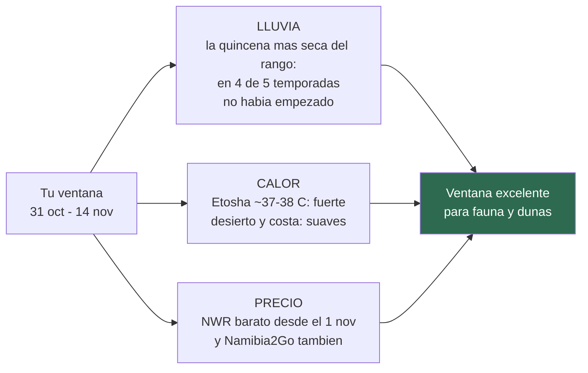
```mermaid
flowchart LR
    A["Tu ventana<br/>31 oct - 14 nov"] --> B["LLUVIA<br/>la quincena mas seca del rango:<br/>en 4 de 5 temporadas<br/>no habia empezado"]
    A --> C["CALOR<br/>Etosha ~37-38 C: fuerte<br/>desierto y costa: suaves"]
    A --> D["PRECIO<br/>NWR barato desde el 1 nov<br/>y Namibia2Go tambien"]
    B --> E["Ventana excelente<br/>para fauna y dunas"]
    C --> E
    D --> E
    style E fill:#2d6a4f,color:#fff
```

- 🌧️ **Lluvia: la mejor noticia.** En las últimas 5 temporadas, el inicio real de las lluvias en
  Etosha cayó en **enero tres veces, diciembre una y noviembre una**. Tu quincena: charcas llenas
  de fauna y cielos limpios, con datos de estación — no de folletos.
- 🌡️ **Calor: Etosha aprieta, el resto acompaña.** El norte a **~37–38 °C** de máxima — el safari se
  hace al amanecer y al atardecer, con siesta y charca iluminada de noche, que es como se hace bien
  de todas formas. El desierto **Sesriem ~32,5 °C** y la costa fresca (Benguela):
  **Swakopmund/Walvis Bay ~25 °C** de máxima en noviembre. Etosha y la costa vienen de **estación
  NOAA**; los puntos sin estación —**Sesriem, Spreetshoogte (~31,5) y Hoada (~33,1)**— se cerraron con
  el **reanálisis ERA5**, validado a ±0,04 °C contra las estaciones *(ver [`15`](15-huecos-cerrados.md),
  secciones "La costa" y §ERA5)*. **Las noches, entre 12,7 °C (la costa) y 18,9 °C (Etosha)**:
  **forro polar, no plumas** — el porqué en [`05`](05-equipaje.md), la lista con casilla en
  [`17`](17-lista-de-equipaje.md), y la temperatura noche a noche en [`01`](01-itinerarios-dia-a-dia.md).
- 💶 **Precio: la frontera del 1 de noviembre, dos veces.** **NWR** entra en tramo barato el 1 de
  noviembre (Sesriem, Terrace Bay, Etosha — la primera noche NWR del plan es el 3), y **Namibia2Go
  también**. La única noche de octubre —la del 31, Windhoek— no es NWR: **lo único que paga precio
  de octubre es el día 31 del coche**, que se pide aparte *(`02` §2)*.

---

<div align="center">

## ✈️ El vuelo y 🩺 el seguro

### €1.450 por persona el vuelo · €113,02 el seguro

**Oporto → Windhoek, 30 oct – 14 nov** · Lufthansa *(parcialmente Discover Airlines)*

</div>

> [!IMPORTANT]
> Precio cotizado el 05·08·2026 — **ningún billete está emitido todavía**, y sin billete no se puede
> pedir el e-visa.

- ✈️ **Ida** vie 30 oct, **una sola escala en Fráncfort**: 15h15 y **aterrizas el 31 de octubre a
  las 09:25**. **Vuelta** sáb 14 a las 20:45 por **Múnich** — 18h05, y en casa el día 15.
- 🎉 **La fiebre amarilla deja de ser un tema**: **Fráncfort y Múnich no son zona de riesgo**.
  **No hace falta vacunarse**, y no hay que calcular duraciones de escala.
- 💶 **El buscador lo anuncia en €1.341 y sube a €1.450 al cerrar**: el bueno es el segundo
  *(desglose en [`02` §8](02-presupuesto.md))*.
- 🚗 **Sale de Oporto, a ~270 km — decidido (09/08): se va y se vuelve en coche propio.** Por
  cotizar ❌: el aparcamiento de larga estancia del aeropuerto (30 oct – 15 nov) y los peajes
  *(el bus directo, ~3h43 desde ~€17 por persona ◐, queda de plan B — `02` §8)*.
- ⚠️ **Tres cosas antes de pagar**: que **incluya maleta facturada** *(Lufthansa vende Economy Light
  sin ella)*, que sea **billete único**, y **compara con el precio directo de Lufthansa** — lo vende
  eDreams. *(Y mira el de **€1.026**: sobre los €1.450 finales son hasta **€848 menos la pareja**
  — comparándolo también con equipaje incluido, `02` §8.)*
- 🩺 **El seguro llega hasta el día 15**, no hasta el 14: son las horas de vuelta que sin eso irían
  sin cobertura, y cerrar ese hueco costó **€14,69**.
- 👉 **Dos cosas que pedirle a IATI por escrito**: que cubra **evacuación aérea DENTRO del país**
  *(cerca de Sesriem no hay hospital)* y **añadirle búsqueda y salvamento**, que en el Estrella es
  opcional y el Mochilero sí trae.

📖 **El detalle completo de los dos —el itinerario tramo a tramo, la comparativa de las tres
modalidades de IATI y por qué la franquicia de coche sobra— está en
[`02-presupuesto`](02-presupuesto.md).**

---

<div align="center">

## 💶 El presupuesto — por persona, partida a partida

### ~€3.725 por persona · todo incluido

Rango honesto: **€3.575–3.875**. El **74 %** ya está cerrado.

</div>

**Incluye:** vuelo · coche **15 días** · **seguro de viaje** · combustible · tasas de parque · visado ·
las 14 noches · comida · actividades · imprevistos. **No queda nada fuera** salvo el traslado a Oporto
y el día extra de seguro *(❌ sin cotizar — abajo)* y lo que compres allí por gusto.

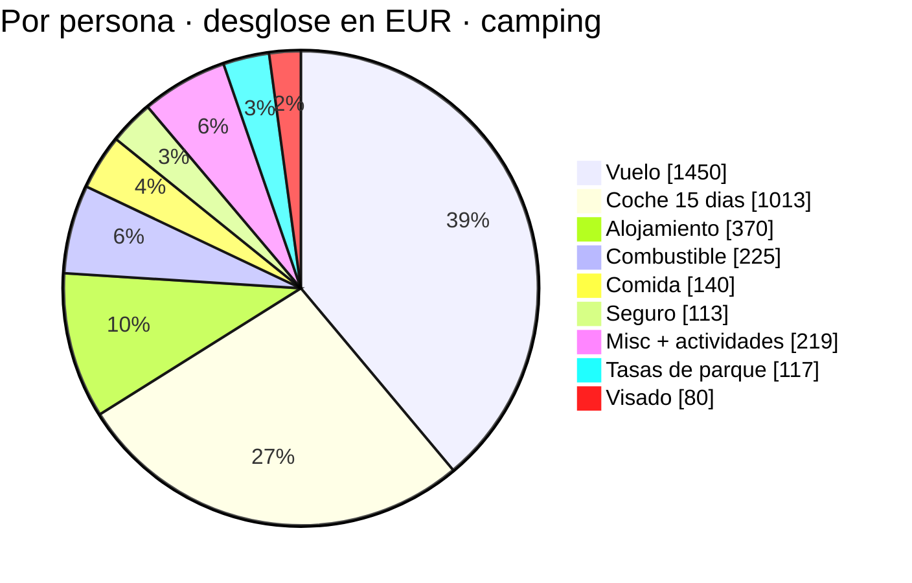
```mermaid
pie showData
    title Por persona · desglose en EUR · camping
    "Vuelo" : 1450
    "Coche 15 dias" : 1013
    "Alojamiento" : 370
    "Combustible" : 225
    "Comida" : 140
    "Seguro" : 113
    "Misc + actividades" : 219
    "Tasas de parque" : 117
    "Visado" : 80
```

*Vuelo y coche son el **66 %** del viaje. Todo lo demás junto son ~€1.260.*

- ✈️ Vuelo **€1.450** ✅ · 🚙 Coche **~€1.012,50** *(13 días cotizados ✅ + 2 estimados ◐)* ·
  ⛺ Alojamiento **~€370** *(€246 verificado ✅)* · ⛽ Combustible **~€225** · 🍖 Comida **~€140** ·
  🩺 Seguro **€113** ✅ · 🎫 Tasas **~€117** ◐ · 🛂 Visado **€80** ✅ · 🎯 Actividades y varios **~€219** *(los safaris
  guiados de Etosha, decididos el 08/08, dentro)*
- **El 74 % ya está cerrado** con precio real: vuelo, los 13 días cotizados del coche, seguro,
  visado, las 6 noches de NWR y Terrace Bay. Lo demás (~€960) son los 2 días extra de coche ◐, las 6 noches de
  camping sin precio (más Hoada ◐), el paquete guiado de Etosha —3 mañanas + nocturno + lanzadera
  de Deadvlei— *(~€144, tarifa ✅ sin reservar)*, el
  combustible, la comida y los misceláneos: **ese es el margen honesto, ±€150 por persona**.
- ⚠️ **Lo que aún puede mover el número**: el precio real del **31 de octubre** del coche *(fuera de
  temporada baja ❌)*, el traslado a Oporto ida y vuelta y el día extra de seguro — **sin cotizar**.

> [!TIP]
> **Se duerme arriba casi todo el viaje.** **13 de las 14 noches en la tienda de techo**, campings
> incluidos los tres de dentro de Etosha *(N$920 ≈ €46 la pareja ✅)* y las de Windhoek con el
> coche del aeropuerto. La única que no puede ser: **Terrace Bay**, que solo tiene habitaciones.

📖 **El desglose completo, partida a partida, con qué está cerrado y qué es estimación —y qué pasa
si vais 3 o 4 en el mismo coche— está en [`02-presupuesto`](02-presupuesto.md).**

---

<div align="center">

## 🎯 Las reservas que hacen el viaje

</div>

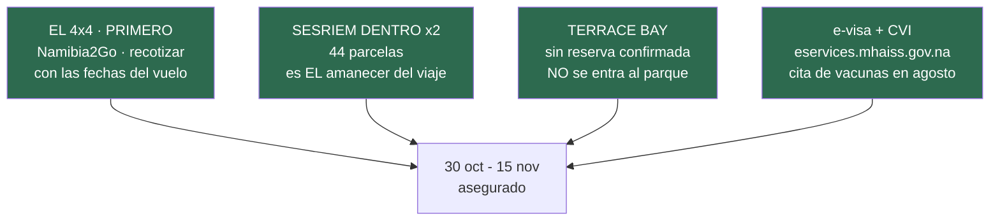
```mermaid
flowchart TD
    A["EL 4x4 · PRIMERO<br/>Namibia2Go · recotizar<br/>con las fechas del vuelo"]
    B["SESRIEM DENTRO x2<br/>44 parcelas<br/>es EL amanecer del viaje"]
    C["TERRACE BAY<br/>sin reserva confirmada<br/>NO se entra al parque"]
    D["e-visa + CVI<br/>eservices.mhaiss.gov.na<br/>cita de vacunas en agosto"]
    A --> E["30 oct - 15 nov<br/>asegurado"]
    B --> E
    C --> E
    D --> E
    style A fill:#2d6a4f,color:#fff
    style B fill:#2d6a4f,color:#fff
    style C fill:#2d6a4f,color:#fff
    style D fill:#2d6a4f,color:#fff
```

1. **El 4x4 — primero, y recotizado.** Namibia2Go con las fechas del vuelo: **flota pequeña y
   noviembre competido**. Decide de paso si añadir el día para devolverlo camino del aeropuerto en
   vez de hotel + dos traslados.
2. **Sesriem dentro de la puerta, dos noches.** Solo **44 parcelas**, y es la diferencia entre *ver*
   Deadvlei y *tenerlo para ti* al amanecer. *(Plan B: Sossus Oasis en la puerta — perdiendo la hora
   de ventaja, que es el motivo.)*
3. **Terrace Bay con reserva confirmada** — sin ella **no te dejan entrar** al Skeleton Coast para
   pernoctar (el permiso de tránsito obliga a salir el mismo día). Y las **4 noches DENTRO de
   Etosha** (Okaukuejo, Halali, Namutoni ×2 — N$920 ≈ €46/noche ✅): en noviembre hay sitio, pero el
   chalet del charco vuela.
4. **Los papeles con calendario.** El **e-visa (N$1.600, ~€80)** se pide online y **se imprime y
   firma ante el oficial** — solo en `eservices.mhaiss.gov.na` ⚠️ *(`namibia-evisa.com` parece
   oficial y no lo es; el portal real puede dar un aviso de certificado — es mala configuración
   suya: verifica el dominio y sigue)*. La **cita del Centro de Vacunación** (A Coruña, Durán
   Lóriga 3 · **981 989 570**) se pide **en agosto**. Y el **permiso internacional de conducir**:
   con carnet español (que no está en inglés) **sí hace falta** — lo pide la ley namibia, el
   alquiler y el seguro. Se saca en la DGT por **~€10,51 (~N$210)**, vale **1 año** y va **siempre
   junto al carnet** *(detalle y evidencia en `04`)*.

**Y tres datos médicos que se resuelven en una tarde:** **malaria** — Etosha sí es zona (CDC), el
desierto y la costa no; a primeros de noviembre, antes de las lluvias, el riesgo está en su mínimo
estacional *(Malarone empieza 1–2 días antes; mefloquina, 2–3 semanas)* · **fiebre amarilla** —
con el vuelo elegido **no hace falta**, porque **Fráncfort y Múnich no son zona de riesgo**
*(Doha y Johannesburgo, también limpios)* · **seguro con repatriación** — es condición de entrada; pide por escrito que cubra
**evacuación aérea dentro del país** (cerca de Sesriem no hay hospital) — *el coste de la opción
de búsqueda y salvamento sigue ❌ sin cotizar*.

---

<div align="center">

## 🧭 Conducir Namibia como un local

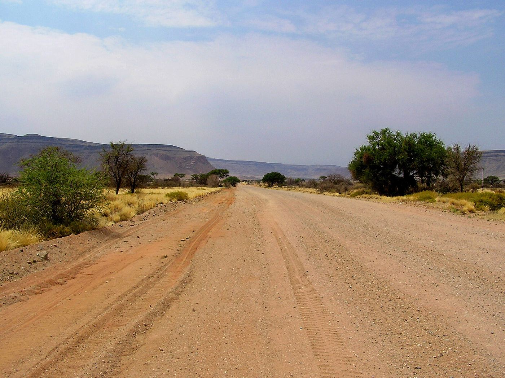

</div>

- **80 km/h en grava** — límite contractual (el legal es 100), registrado por caja negra. **Todos
  los tiempos de este repo ya van así**: cualquier itinerario de internet a 100 es un 20 % más
  optimista que tu realidad. Dentro de los parques, 60.
- **Nunca pases de largo una gasolinera.** Solitaire, Henties Bay, Kamanjab, Outjo, Otjiwarongo: se
  reposta en todas, marque lo que marque la aguja. Las tarjetas **sí** se aceptan *(el «solo
  efectivo» es un mito de mala traducción)*, pero lleva **~N$4.000 (~€200)** de reserva.
- **Llega a las 18:00** (17:30 en las etapas largas de los primeros días). En tu ventana (1–15 nov)
  anochece **~19:03–19:16 en el interior** *(Windhoek y Etosha antes; Sesriem y Damaraland, ~19:15)*
  **y hasta ~19:20 en la costa** —algo antes que a fin de mes;
  ocaso recalculado en `15` y desglosado día a día en `01`— y la fauna sale a los arcenes al
  atardecer. El día crítico es el D7: **Ugabmund cierra la entrada a las 15:00**.
- **El seguro y Damaraland**: los niveles bajos de un contrato de referencia del sector **no cubren
  los bajos en Damaraland/Kaokoveld** — el tramo D8 pide suavidad en las piedras. Las pistas
  malditas **D3707/D3703 no están en esta ruta**. *Dune driving* y Sandwich Harbour, **prohibidos
  por el contrato de referencia del sector** ◐ *(pide el de Namibia2Go por escrito)* — el tour
  guiado es el plan.

Extras: enchufes **tipo M** *(2 adaptadores online — el Schuko no entra)* · **SIM de MTC** en el
aeropuerto con pasaporte *(paquete turista «Leisure» N$349 ~€17 · 14 días · 10,1 GB ◐; el kiosco cierra ~21:00)* · un **satelital con SOS** es buena compañía
donde no hay cobertura · la **Línea Roja**: la carne cruda no baja del norte — el braai se come en
Etosha · los **N$ sobrantes se cambian antes de volar**.

---

<div align="center">

## 🗣️ Cuatro palabras que hay que entender antes de seguir

</div>

El paisaje namibio se nombra en **afrikáans**, y los mapas, los carteles del parque y este dossier
usan esas palabras. Tres de ellas se confunden entre sí constantemente:

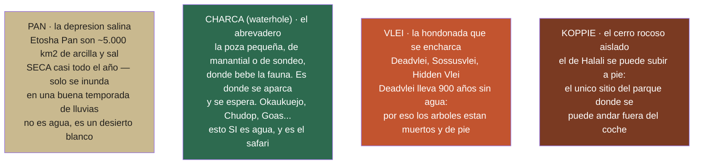
```mermaid
flowchart TD
    P["PAN · la depresion salina<br/>Etosha Pan son ~5.000 km2 de arcilla y sal<br/>SECA casi todo el año — solo se inunda<br/>en una buena temporada de lluvias<br/>no es agua, es un desierto blanco"]
    C["CHARCA (waterhole) · el abrevadero<br/>la poza pequeña, de manantial o de sondeo,<br/>donde bebe la fauna. Es donde se aparca<br/>y se espera. Okaukuejo, Chudop, Goas...<br/>esto SI es agua, y es el safari"]
    V["VLEI · la hondonada que se encharca<br/>Deadvlei, Sossusvlei, Hidden Vlei<br/>Deadvlei lleva 900 años sin agua:<br/>por eso los arboles estan muertos y de pie"]
    K["KOPPIE · el cerro rocoso aislado<br/>el de Halali se puede subir a pie:<br/>el unico sitio del parque donde se<br/>puede andar fuera del coche"]
    style P fill:#c9b98f,color:#22201d
    style C fill:#2d6a4f,color:#fff
    style V fill:#C2542F,color:#fff
    style K fill:#7a3a22,color:#fff
```

> **El error que evita esto:** leer «hay agua en la depresión» y pensar en las charcas. Son cosas
> distintas y **no van juntas**: en tu quincena **la depresión está seca** —por eso no hay
> flamencos— y precisamente por eso **las charcas concentran a toda la fauna**. La depresión seca
> es la razón de que el safari funcione.

**Y las de la mesa**, que también salen en el dossier: **braai** *(la barbacoa, que es casi una
institución)* · **biltong** *(cecina curada)* · **boerewors** *(la salchicha del braai)* ·
**potjiekos** *(guiso de olla de tres patas)* · **kapana** *(tiras de vacuno a la brasa de los
mercados)*. Y dos bichos con nombre propio: **dassie** *(el damán)* y **shongololo** *(el milpiés)*.

---

<div align="center">

## 📚 El dossier completo

</div>

*Numerados por **el momento en que se usan**, no por el orden en que se investigaron.*

**🚗 La ruta y el dinero — para decidir y reservar**

1. ⭐ [**`01-itinerarios-dia-a-dia`**](01-itinerarios-dia-a-dia.md) — **la ruta día a día**: sol, temperatura, horarios, precios y qué se ve en cada charca. *El documento del viaje.*
2. 💶 [**`02-presupuesto`**](02-presupuesto.md) — el total partida a partida, lo cerrado y lo estimado, y qué cambia si vais 3 o 4
3. 🛏️ [**`03-alojamiento-y-tasas`**](03-alojamiento-y-tasas.md) — tarifas oficiales de NWR 2026/2027 y tasas de parque

**🧳 Preparar — antes de salir de casa**

4. 📅 [**`04-guia-preparacion`**](04-guia-preparacion.md) — la cuenta atrás, el e-visa, las vacunas y los plazos que vencen
5. 📞 [**`21-reservas`**](21-reservas.md) — **el cuaderno de llamadas**: cada reserva con su canal, su contacto y su fuente — y lo que se cierra en recepción
6. 🎒 [**`05-equipaje`**](05-equipaje.md) — el porqué del petate: las seis reglas, las temperaturas y qué trae ya el coche
7. ✅ [**`17-lista-de-equipaje`**](17-lista-de-equipaje.md) — **la lista de la víspera**, con cantidades y casilla: ropa, neceser, botiquín, electrónica y kits
8. 📷 [**`19-fotografia`**](19-fotografia.md) — la cámara y el teleobjetivo: dos gamas con precio real de tienda, y la cuenta de comprar frente a alquilar — aquí o en Windhoek
9. ♻️ [**`22-camara-segunda-mano`**](22-camara-segunda-mano.md) — la segunda mano con reventa: precios vistos, el neto esperado tras revender y contra qué compite

**🧭 En ruta — lo que se consulta con el coche en marcha**

10. 🚙 [**`06-conduccion`**](06-conduccion.md) — el vuelco, el contrato, las presiones, la arena y las puertas de Sesriem
11. ⛺ [**`18-manual-de-campamento`**](18-manual-de-campamento.md) — **vivir del coche**: la rutina de la tarde, la tienda, el braai, la nevera y los vecinos del campamento
12. ⛽ [**`07-logistica`**](07-logistica.md) — gasolineras, dinero, cobertura y emergencias
13. 🛒 [**`08-comida-compras-y-regalos`**](08-comida-compras-y-regalos.md) — súper parada a parada, la ley del alcohol, dónde comer y la aduana
14. 🪘 [**`20-cultura-de-namibia`**](20-cultura-de-namibia.md) — los pueblos, las lenguas, la historia mínima y la etiqueta del trato, atado a los días de la ruta
15. 🦁 [**`09-fauna-etosha`**](09-fauna-etosha.md) — **guía de campo en PDF**: 88 especies con foto, qué posibilidades hay de ver cada una, dónde y cuándo, y cómo se hace un safari
16. 💎 [**`10-joyas-ocultas`**](10-joyas-ocultas.md) — los Lone Stone Men, la cascada del Uniab, los círculos de hadas
17. 📍 [**`11-entradas-y-permisos`**](11-entradas-y-permisos.md) — lo que cuesta entrar en cada sitio, los permisos y la norma de drones

**🔬 El respaldo — por qué te puedes fiar de estos números**

18. ✅ [**`12-hallazgos-verificados`**](12-hallazgos-verificados.md) — lo que superó la verificación a tres votos, y lo que quedó refutado
19. 🗺️ [**`13-itinerario`**](13-itinerario.md) — distancias, firme y viabilidad, con el contraste de OSRM
20. 🌧️ [**`14-lluvias-historico`**](14-lluvias-historico.md) — cinco temporadas de lluvia, milímetro a milímetro
21. 🕳️ [**`15-huecos-cerrados`**](15-huecos-cerrados.md) — el cuaderno de bitácora, y **la lista maestra de lo que sigue abierto**
22. 🗄️ [**`16-punto-de-decision`**](16-punto-de-decision.md) — archivado: las variantes que se compararon antes de fijar la ruta del norte

📕 Y el PDF: [**`guia-fauna-etosha.pdf`**](guia-fauna-etosha.pdf) — la guía de campo, para imprimir.
Lleva **medidas** las posibilidades de ver cada bicho: los partes de avistamiento de los tres
campamentos *(elefante 96 %, rinoceronte negro 82 %, león 70 %, leopardo 12 %)* y, para las que
no tienen parte, el peso de la especie en los registros de GBIF de octubre y noviembre. Con su
muestra detrás y con los sesgos escritos, no en letra pequeña — **y con la regla del 09/08: lo
que nadie vio, no lleva ficha** *(el 0 % medido del oricteropo lo dejó fuera, con la suricata y
la cebra de Hartmann, que no caen en la ruta)*.

---

<div align="center">

## 🔬 Por qué puedes fiarte de estos números

</div>

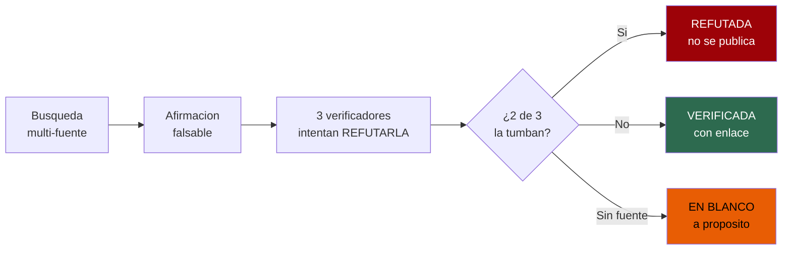
```mermaid
flowchart LR
    A["Busqueda<br/>multi-fuente"] --> B["Afirmacion<br/>falsable"]
    B --> C["3 verificadores<br/>intentan REFUTARLA"]
    C --> D{"¿2 de 3<br/>la tumban?"}
    D -->|"Si"| E["REFUTADA<br/>no se publica"]
    D -->|"No"| F["VERIFICADA<br/>con enlace"]
    D -->|"Sin fuente"| G["EN BLANCO<br/>a proposito"]
    style E fill:#9d0208,color:#fff
    style F fill:#2d6a4f,color:#fff
    style G fill:#e85d04,color:#000
```

**Regla número uno: cero invenciones.** Cada dato viene de una fuente descargada y pasa por
verificadores independientes cuyo trabajo es tumbarlo. Por el camino cayeron perlas que circulan
por toda la web: las tasas de parque a N$150 *(son ~N$280 desde abril de 2026)*, la tarifa NWR de
los blogs *(caduca antes de aterrizar — factura por año tarifario nov–oct)*, el mito del «solo
efectivo» en gasolineras *(«credit» ahí significa «a cuenta», no «tarjeta»)*, y **todas** las
temperaturas de las webs de safaris — rehechas con datos de estación meteorológica.

<details>
<summary><b>Y lo que no se pudo verificar, dicho en blanco</b></summary>

La ficha propia de los lodges privados sigue en **`403`** (egress + anti-bot), pero **el año
tarifario del viaje —1 nov 2026 a 31 oct 2027— ya está publicado** *(el «sin publicar» de antes
caducó)* y en `15` hay **tarifas candidatas con URL** rescatadas del índice del buscador —Damara
Mopane ~N$2.970 pp B&B, Etosha Safari Camp ~N$2.220–3.550/noche— **en ◐ porque no se pudo abrir la
página para verificar la extracción** *(una pasada llegó a colar «N$445» de puro error)*: son
pistas, no precios cerrados; confírmalos por email.

Y las tasas de parque (~N$280 · ~€14) las respaldan ya **dos páginas oficiales del MEFT** (PDF + nota de
prensa `news/199`), secundarias concordantes y ya el **Government Gazette Nº 8877 (GN Nº 115,
1/04/2026)** — la fuente legal numerada, **localizada el 23/07** — pero como ninguna se pudo
**abrir** aquí (403), la extracción de la tabla fina queda en ◐: **confírmalas por email antes de
cerrar presupuesto.**

</details>

---

<div align="center">

## 🔄 Cómo se mantiene vivo este documento

</div>

Este README es **el estado del viaje**, no un folleto: se actualiza cada vez que algo cambia de
casilla. La regla es sencilla — **cuando algo pase de cotizado a reservado, o de reservado a
pagado, se mueve aquí arriba y se pone la fecha**.

- **Al reservar o pagar algo** → mover la línea del bloque 🟡 al bloque de cerrado, con importe real
  en **N$ y €**, y tacharla de «Lo que toca ahora». El detalle largo va a su documento *(`02` el
  dinero, `03` el alojamiento, `04` los plazos)*.
- **Al cerrar un hueco** → sale de «Lo que sigue sin poder cerrarse» y de la lista maestra de
  [`15`](15-huecos-cerrados.md), con la fuente y la fecha.
- **Al cambiar cualquier `.md`** → regenerar los PDF, que salen de estos mismos ficheros:
  ```
  cd fuente && make          # los dos PDF
  make comprueba             # imagenes, licencias, escala y que el README no mienta
  ```
  Las convenciones del build —el marcador `%% ancho`, las casillas `- [ ]`, por qué una URL larga
  puede encoger el PDF entero— están en el `CLAUDE.md` del repo local *(no versionado)*. Y **cada
  push repite estas comprobaciones solo, en GitHub Actions.**
  [](https://github.com/morandeirachema/namibia/actions/workflows/comprueba.yml)
- **Las marcas no se tocan**: **✅** fuente primaria · **◐** secundaria concordante · **○** práctica
  común, sin fuente · **❌** sin verificar, dicho en blanco. **Un hueco reconocido vale más que un
  número plausible.**

<div align="center">

**Tipo de cambio: ~N$20 = €1** *(rango N$19,5–20,5, a 17·07·2026)*
El NAD va ligado al rand: **el importe en N$ es el que se paga**, el euro es orientativo.

*Todos los precios en N$ y € · Las tarifas namibias cambian: reconfirma antes de pagar*

**Última actualización: 10 de agosto de 2026**

</div>
