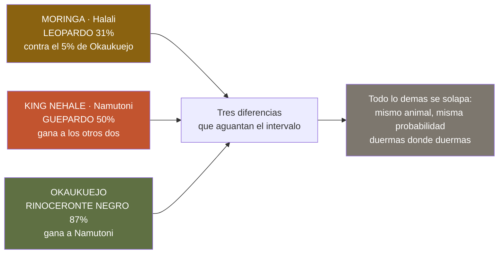

# Las charcas de los campamentos de Etosha — qué se ve en cada una, y qué no

> **Namibia · 30 oct – 15 nov 2026 · la clásica del norte** — [← índice del dossier](../README.md)
>
> Los **siete campamentos de Etosha que nombra este repo**, y lo que la evidencia dice de la charca
> de cada uno. **Tres tienen partes de avistamiento de verdad**; los otros cuatro no, y eso también
> se dice. Con cada porcentaje van **su muestra y su intervalo**, porque comparar a pelo tres
> campamentos con 149, 48 y 16 viajeros detrás **hace decir
> tonterías**.
>
> **✅** fuente primaria · **◐** secundaria concordante · **○** práctica común, sin fuente ·
> **❌** sin verificar, dicho en blanco
>
> *Este documento **no se escribe a mano**: lo genera `fuente/estudio_charcas.py` desde
> `fuente/geo/avistamientos.json` —el mismo cache que alimenta la guía de fauna—. Se rehace con
> `make charcas`.*

---

## ⚠️ Lo primero, porque cambia cómo se lee todo lo demás

**La unidad de estos números es la ESTANCIA, no la charca.** Expert Africa pregunta a sus viajeros
qué vieron **durante su estancia en el campamento** ✅ — y una estancia incluye los game drives que
salen de ahí, no solo el rato sentado frente al agua iluminada. Así que esto mide **lo que rinde una
noche con base en cada sitio**, que es la pregunta que de verdad se hace uno al reservar, pero **no
es «lo que se acercó a beber»**.

Nadie publica lo segundo. Si algún día apareciera, sería otro documento.

Y la segunda advertencia, de tamaño: **la estancia típica es de una o dos noches** ✅. Como en esta
ruta se duerme en dos de los tres *(Okaukuejo y Halali; Namutoni se cruza de día el D12 —
`../21-campamentos-de-etosha.md`)*, son **dos tiradas y media**, y la
posibilidad real en el conjunto del viaje es **más alta que cualquiera de estos números**. Cuánto
más, estos datos no lo dicen — así que no se dice.

---

## 🔬 Lo que de verdad separa a las tres charcas — y lo que es ruido

Puestos los intervalos del 95 %, de catorce especies **solo sobreviven tres diferencias**:

- 🐆 **El leopardo es de Moringa.** Halali **31 %** *(12/39)* contra el
  **5 %** de Okaukuejo *(6/111)*: los intervalos **no se tocan**
  *(19–46 frente a 3–11)*. Es **la única
  charca del parque con fama de leopardo que además la sostienen los números**, y encaja con lo que
  ya decía el [`09`](../09-fauna-etosha.md): «Halali y Goas para el leopardo».
- 🐆 **El guepardo es de Namutoni**, y esto confirma el **50 %** que el `01` y el `11`
  citan: *(7/14)*, intervalo **27–73**, y **por encima
  de los otros dos sin solaparse**. Con 14 partes el intervalo es ancho —hay que decirlo—,
  pero **aun así se separa**: la afirmación aguanta.
- 🦏 **El rinoceronte negro es de Okaukuejo.** **87 %** *(119/137)* contra el
  55 % de Namutoni: la charca iluminada del campamento grande **es la casilla del
  rinoceronte**, como dice su propia ficha *(`../21`)*.

**Y lo que NO se separa, que es casi todo**: León, Rinoceronte blanco, Hiena manchada, Hiena parda, Elefante africano de sabana, Jirafa angoleña, Cebra de Burchell, Órix o gemsbok, Ñu azul, Eland común, Oricteropo. Para estas, **la charca en la que
duermas no cambia tus posibilidades** — o si las cambia, estos datos no lo detectan. El caso que
más engaña es el **león**: parece que Halali gana, y no; los tres intervalos se pisan.

---

## 📊 El cuadro completo, especie a especie

*Porcentaje de estancias con al menos una observación · entre paréntesis, **partes que lo vieron /
partes totales** y el **intervalo del 95 %**.*

- 🐆 **Leopardo** — Okaukuejo **5 %** *(6/111 · 3–11)* · Halali **31 %** *(12/39 · 19–46)* · Namutoni **15 %** *(2/13 · 4–42)*
- 🐆 **Guepardo** — Okaukuejo **18 %** *(21/116 · 12–26)* · Halali **10 %** *(4/39 · 4–24)* · Namutoni **50 %** *(7/14 · 27–73)*
- 🦁 **León** — Okaukuejo **68 %** *(91/133 · 60–76)* · Halali **75 %** *(33/44 · 61–85)* · Namutoni **64 %** *(9/14 · 39–84)*
- 🦏 **Rinoceronte negro** — Okaukuejo **87 %** *(119/137 · 80–92)* · Halali **73 %** *(32/44 · 58–84)* · Namutoni **55 %** *(6/11 · 28–79)*
- 🦏 **Rinoceronte blanco** — Okaukuejo **40 %** *(49/122 · 32–49)* · Halali **38 %** *(15/40 · 24–53)* · Namutoni **31 %** *(4/13 · 13–58)*
- 🐕 **Hiena manchada** — Okaukuejo **54 %** *(64/118 · 45–63)* · Halali **56 %** *(25/45 · 41–69)* · Namutoni **62 %** *(8/13 · 36–82)*
- 🐕 **Hiena parda** — Okaukuejo **22 %** *(25/113 · 15–31)* · Halali **8 %** *(3/38 · 3–21)* · Namutoni **14 %** *(2/14 · 4–40)*
- 🐘 **Elefante africano de sabana** — Okaukuejo **97 %** *(138/143 · 92–98)* · Halali **93 %** *(43/46 · 82–98)* · Namutoni **94 %** *(15/16 · 72–99)*
- 🦒 **Jirafa angoleña** — Okaukuejo **99 %** *(144/146 · 95–100)* · Halali **93 %** *(43/46 · 82–98)* · Namutoni **100 %** *(16/16 · 81–100)*
- 🦓 **Cebra de Burchell** — Okaukuejo **97 %** *(142/146 · 93–99)* · Halali **98 %** *(45/46 · 89–100)* · Namutoni **100 %** *(16/16 · 81–100)*
- 🦌 **Órix o gemsbok** — Okaukuejo **97 %** *(139/144 · 92–99)* · Halali **93 %** *(42/45 · 82–98)* · Namutoni **100 %** *(14/14 · 78–100)*
- 🐃 **Ñu azul** — Okaukuejo **94 %** *(135/144 · 89–97)* · Halali **91 %** *(42/46 · 80–97)* · Namutoni **100 %** *(14/14 · 78–100)*
- 🦌 **Eland común** — Okaukuejo **47 %** *(58/124 · 38–56)* · Halali **33 %** *(13/40 · 20–48)* · Namutoni **73 %** *(8/11 · 43–90)*
- 🐖 **Oricteropo** — Okaukuejo **0 %** *(0/100 · 0–4)* · Halali **0 %** *(0/38 · 0–9)* · Namutoni **0 %** *(0/11 · 0–26)*

> 🐖 **El oricteropo merece su línea**: **0 de 100 partes** en Okaukuejo, intervalo
> **0–4 %**. No es que sea difícil: es que **en la ventana medida no lo
> vio nadie en ninguno de los tres**. Por eso salió del catálogo de la guía de fauna el 09/08, y
> este cuadro es la razón, no una impresión.

---

## 💧 Okaukuejo — la charca del rinoceronte

La del campamento más antiguo del
parque *(rest camp desde octubre de 1957 ◐)*: **iluminada del ocaso al amanecer y abierta las 24 h
para quien duerme dentro** ◐. La guía del parque la llama, sin rodeos, *«the most reliable predator
and megafauna viewing spot inside Etosha»*, con el **pico entre las 19:00 y las 22:00 en estación
seca** ◐ — y la noche del 9 al 10 de noviembre cae **en la cola de esa estación seca**: en 4 de las
5 últimas temporadas las lluvias aún no habían empezado *(`../14-lluvias-historico.md`)*.

Los números confirman su fama, y la afinan: **no es la charca de los felinos, es la del
rinoceronte**.

**Los partes: 149 viajeros desde May-2018** ✅
*([Expert Africa](https://www.expertafrica.com/namibia/etosha-national-park/okaukuejo-camp/reviews/1))*, de mayor a menor:

- 🦒 **Jirafa angoleña** — **99 %** *(144/146 · 95–100)*
- 🐘 **Elefante africano de sabana** — **97 %** *(138/143 · 92–98)*
- 🦓 **Cebra de Burchell** — **97 %** *(142/146 · 93–99)*
- 🦌 **Órix o gemsbok** — **97 %** *(139/144 · 92–99)*
- 🐃 **Ñu azul** — **94 %** *(135/144 · 89–97)*
- 🦏 **Rinoceronte negro** — **87 %** *(119/137 · 80–92)*
- 🦁 **León** — **68 %** *(91/133 · 60–76)*
- 🐕 **Hiena manchada** — **54 %** *(64/118 · 45–63)*
- 🦌 **Eland común** — **47 %** *(58/124 · 38–56)*
- 🦏 **Rinoceronte blanco** — **40 %** *(49/122 · 32–49)*
- 🐕 **Hiena parda** — **22 %** *(25/113 · 15–31)*
- 🐆 **Guepardo** — **18 %** *(21/116 · 12–26)*
- 🐆 **Leopardo** — **5 %** *(6/111 · 3–11)*
- 🐖 **Oricteropo** — **0 %** *(0/100 · 0–4)*

*Y lo que Expert Africa cuenta aparte, con el nombre que ella usa:* **Roan antelope** 19 % *(21/109 · 13–28)* · **Sable antelope** 14 % *(14/101 · 8–22)* · **Pangolin** 0 % *(0/106 · 0–3)*.

---

## 💧 Halali · Moringa — la charca del leopardo

A **~5 minutos a pie** del camping
○, con **plataforma elevada sobre un anfiteatro de roca** e iluminación nocturna ✅. Es la que tiene
fama de rinoceronte negro y leopardo de noche — y es **la única fama de leopardo del parque que los
partes sostienen**.

⚠️ **El graderío es de roca irregular y de noche es traicionero** ○: frontal en modo rojo y calzado
cerrado *(`../17-lista-de-equipaje.md`)*.

**Los partes: 48 viajeros desde Jun-2018** ✅
*([Expert Africa](https://www.expertafrica.com/namibia/etosha-national-park/halali-camp/reviews/1))*, de mayor a menor:

- 🦓 **Cebra de Burchell** — **98 %** *(45/46 · 89–100)*
- 🐘 **Elefante africano de sabana** — **93 %** *(43/46 · 82–98)*
- 🦒 **Jirafa angoleña** — **93 %** *(43/46 · 82–98)*
- 🦌 **Órix o gemsbok** — **93 %** *(42/45 · 82–98)*
- 🐃 **Ñu azul** — **91 %** *(42/46 · 80–97)*
- 🦁 **León** — **75 %** *(33/44 · 61–85)*
- 🦏 **Rinoceronte negro** — **73 %** *(32/44 · 58–84)*
- 🐕 **Hiena manchada** — **56 %** *(25/45 · 41–69)*
- 🦏 **Rinoceronte blanco** — **38 %** *(15/40 · 24–53)*
- 🦌 **Eland común** — **33 %** *(13/40 · 20–48)*
- 🐆 **Leopardo** — **31 %** *(12/39 · 19–46)*
- 🐆 **Guepardo** — **10 %** *(4/39 · 4–24)*
- 🐕 **Hiena parda** — **8 %** *(3/38 · 3–21)*
- 🐖 **Oricteropo** — **0 %** *(0/38 · 0–9)*

*Y lo que Expert Africa cuenta aparte, con el nombre que ella usa:* **Sable antelope** 3 % *(1/34 · 1–15)* · **Roan antelope** 3 % *(1/38 · 0–13)* · **Pangolin** 0 % *(0/40 · 0–9)*.

---

## 💧 Namutoni · King Nehale — la charca del guepardo, y la muestra más floja

⚠️ **Desde el 24/08 aquí ya no se duerme** —la noche se cambió por una segunda en Onguma—,
así que **esta charca iluminada se pierde**: Namutoni se cruza el D12 de paso, con la puerta de Von
Lindequist en el reloj. Lo que sigue vale para saber qué se deja atrás, y era la floja de las tres.

Al pie de las murallas del fuerte, **iluminada y con bancos** ✅. La pega honesta de los
viajeros ○: **desde los bancos solo se ve parte de la lámina de agua**; el resto, a través de la
valla. De noche atrae **elefante y kudú**, y rinoceronte más bien a partir del invierno ◐; la mejor
franja, **19:00–21:00** ◐.

**Aquí es donde hay que mirar la muestra.** Namutoni tiene el porcentaje de guepardo más alto de los
tres y **se sostiene** — pero todo lo demás que parece destacar aquí *(eland, hiena manchada, los
100 % de jirafa, cebra, órix y ñu)* descansa en **11 a 16 partes**: son intervalos anchísimos y
**no se separan de los otros dos campamentos**.

**Los partes: 16 viajeros desde Sep-2018** ✅
*([Expert Africa](https://www.expertafrica.com/namibia/etosha-national-park/namutoni-camp/reviews/1))*, de mayor a menor:

- 🦒 **Jirafa angoleña** — **100 %** *(16/16 · 81–100)*
- 🦓 **Cebra de Burchell** — **100 %** *(16/16 · 81–100)*
- 🦌 **Órix o gemsbok** — **100 %** *(14/14 · 78–100)*
- 🐃 **Ñu azul** — **100 %** *(14/14 · 78–100)*
- 🐘 **Elefante africano de sabana** — **94 %** *(15/16 · 72–99)*
- 🦌 **Eland común** — **73 %** *(8/11 · 43–90)*
- 🦁 **León** — **64 %** *(9/14 · 39–84)*
- 🐕 **Hiena manchada** — **62 %** *(8/13 · 36–82)*
- 🦏 **Rinoceronte negro** — **55 %** *(6/11 · 28–79)*
- 🐆 **Guepardo** — **50 %** *(7/14 · 27–73)*
- 🦏 **Rinoceronte blanco** — **31 %** *(4/13 · 13–58)*
- 🐆 **Leopardo** — **15 %** *(2/13 · 4–42)*
- 🐕 **Hiena parda** — **14 %** *(2/14 · 4–40)*
- 🐖 **Oricteropo** — **0 %** *(0/11 · 0–26)*

*Y lo que Expert Africa cuenta aparte, con el nombre que ella usa:* **Pangolin** 0 % *(0/10 · 0–28)* · **Roan antelope** 0 % *(0/11 · 0–26)* · **Sable antelope** 0 % *(0/11 · 0–26)*.

---

## 🏕️ Onguma Tamboti — las dos últimas noches, y las que NO tienen partes

Onguma **no aparece en los partes de Expert Africa** que usa este repo ❌: es reserva privada y su
charca no entra en la serie. Así que aquí **no hay porcentaje que dar**, y no se da.

Lo que sí hay es **lo que su propia tarifa afirma por escrito** ✅ *(`../21-campamentos-de-etosha.md`)*:
*«Four of the Big Five (lion, leopard, rhino and elephant) roam free»*, y el **guepardo** lo añade su
web. **Es la única de la zona con leopardo Y guepardo confirmados por escrito en fuente propia** —
pero eso es una declaración del alojamiento, **no una medida**, y no se puede poner al lado de un
31 % de Moringa como si fueran la misma clase de dato.

Y una cosa que ninguna charca de NWR puede dar: **el Onkolo Hide, un escondite a pie de agua**,
3 h por **N$720 (~€36) por persona** ✅ *(mínimo 2, máximo 7, desde 7 años, se reserva con
antelación)*. Más el **Sundowner Drive de 3 h, N$980 (~€49) pp** ✅, que sale al atardecer y **vuelve
ya de noche, con foco y campo a través** — las dos cosas que el parque prohíbe.

> ⚖️ **El choque de horarios sigue en pie** *(`../21`)*: el sundowner obliga a **salir del parque
> hacia las 17:00** y renunciar a la mejor hora de charcas del último día. Son **dos planes buenos y
> excluyentes**.

---

## 🗺️ Los tres campamentos de Etosha que el repo nombra pero no pisa

Ninguno tiene partes de avistamiento en el cache, así que **de sus charcas este estudio no puede
decir nada medido** ❌. Lo que el repo sí tiene de ellos:

- ⛺ **Olifantsrus** *(Etosha oeste)* — el único **solo camping** del parque, **N$510 (~€26) por
  persona → N$1.020 (~€51) los dos** ✅ *(`../03-alojamiento-y-tasas.md`)*. Su fama es justamente
  **el hide de dos plantas sobre la charca**, pero **no hay dato de avistamiento aquí** ❌.
- 🏨 **Dolomite Camp** *(Etosha oeste)* — bush chalet en **media pensión, N$3.180 (~€159) por
  persona → N$6.360 (~€318)** ✅. Su punto fuerte es el **acceso a un sector cerrado al self-drive**
  ◐, y está a **160–180 km de Okaukuejo** ◐ *([`reservas-privadas-vs-etosha.md`](reservas-privadas-vs-etosha.md))*: fuera
  de esta ruta por distancia, no por interés.
- 🏨 **Onkoshi Resort** *(sobre la depresión, al norte de Namutoni)* — **~40 km de desvío desde
  Namutoni** ◐, también en zona vetada al self-drive público. **Sin dato de charca** ❌.

> ⚠️ **Y un aviso de método sobre Dolomite**, que ya está registrado en
> [`auditoria-mat-travel.md`](auditoria-mat-travel.md): una agencia afirmaba
> «rinoceronte blanco *Medium-High* en Dolomite, grupos pastando con regularidad» y **el dato no se
> sostuvo**. Es exactamente el tipo de afirmación que este documento evita: **sin partes, sin
> porcentaje**.

---

## 🕳️ Lo que este estudio NO puede cerrar

- ❌ **Nadie publica «qué se acercó a la charca».** Todo lo de arriba es **por estancia**, con los
  game drives dentro. La pregunta literal del título **no tiene fuente**, y conviene saberlo.
- ❌ **Namutoni descansa en 11–16 partes.** Sus tres cifras interesantes —guepardo, eland, hiena
  manchada— tienen intervalos de 30 y 40 puntos de ancho. El guepardo **aun así se separa**; las
  otras dos, no.
- ❌ **Onguma, Olifantsrus, Dolomite y Onkoshi no tienen partes** en la serie. Del hide de
  Olifantsrus, que es lo que más se parecería a «una charca medida», **no hay ni un número**.
- ❌ **La ventana de los partes no es la del viaje.** Expert Africa da el acumulado de sus reseñas
  *(desde 2018)*, no un filtro de octubre-noviembre — al revés que los recuentos de GBIF, que sí van
  filtrados *(`../CLAUDE.md`)*. Para las especies residentes da igual; para las que se mueven con el
  agua, no.

---

*Generado desde `fuente/geo/avistamientos.json` con `fuente/estudio_charcas.py` · Porcentajes de
Expert Africa, intervalo de Wilson al 95 % · Precios en N$ y € · ~N$20 = €1*
