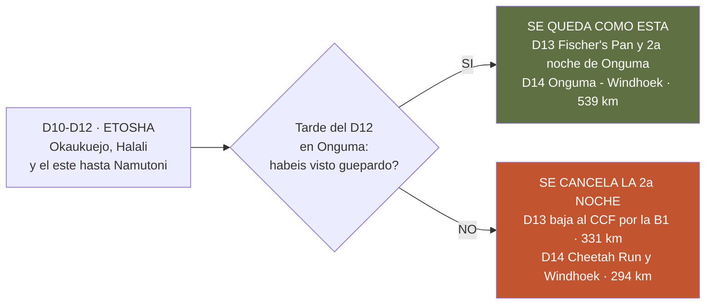

# ARCHIVADO · El desvío al Cheetah Conservation Fund, y por qué se descartó

*Documento de consulta aparte — **fuera del dossier impreso desde el 25/08** y **descartado como
plan el 26/08**. Se conserva por dos razones: porque aquí está escrito el argumento —todavía
vigente— de **quitarle la segunda noche a Spreetshoogte y llevarla a Damaraland**, que sí se hizo;
y porque un descarte razonado vale más que un hueco en la memoria.*

> ## ❌ DESCARTADO el 26/08 — no se baja al CCF
>
> **La segunda noche de Onguma es firme y no hay plan B.** La razón cabe en una línea: el guepardo
> **«caza de día, a plena luz»** ✅ *(su ficha en la guía de fauna)*, y el **D13 es el único día del
> viaje entero en el mejor terreno medido para eso, sin un solo kilómetro de traslado**. Bajar al
> CCF **se comía justo ese día** para cambiar un guepardo salvaje por uno cautivo.
>
> 👉 **Lo que hay que hacer ahora está en [el plan del guepardo](plan-del-guepardo.md)**, que
> reparte el esfuerzo en cinco ventanas diurnas en vez de en una red al final.
>
> *Lo que sigue se deja tal cual estaba escrito el 24–25/08, para que se vea qué se comparó.*

> **Namibia · 30 oct – 15 nov 2026 · la clásica del norte** — [← índice del dossier](../README.md)
>
> **Esto ya no es una ruta alternativa: es UNA decisión, y se toma dentro de Etosha.** Las dos
> noches de **Onguma Tamboti** *(11 y 12 de noviembre)* están reservadas. Si a la tarde del D12 el
> **guepardo no ha salido**, la segunda se cancela y se baja al **[Cheetah Conservation
> Fund](https://cheetah.org/)**. Aquí está ese final medido entero, con lo que gana, lo que cuesta y
> **cómo se resuelve sobre la marcha** — que es como se ha decidido hacerlo *(24/08)*.
>
> **~N$20 = €1** *(rango 19,5–20,5)* · **✅** fuente primaria · **◐** secundaria concordante ·
> **○** práctica común, sin fuente · **❌** sin verificar, dicho en blanco
>
> *Medido el 24/08/2026 con el mismo enrutado OSRM sobre OpenStreetMap que dibuja el mapa del
> dossier.*

---

> ## 🔄 Qué pasó el 24/08 con este documento
>
> Hasta el 24 de agosto esto describía **otra ruta entera**: Spreetshoogte una noche, tres dentro
> de Etosha y el CCF en vez de Onguma. **De esa variante, la mitad se hizo oficial y la otra mitad
> cambió de forma.**
>
> - ✅ **Spreetshoogte con UNA noche y la liberada en Damaraland: ADOPTADO.** Es la ruta del
>   [`01`](../01-itinerarios-dia-a-dia.md) desde el 24/08, y las reservas se hicieron con esas fechas.
>   La noche nueva de **Twyfelfontein (D8)** y la mañana libre del **D9** ya no son una propuesta:
>   están en el plan.
> - 🔄 **El final cambió de premisa.** No se quitó Onguma: **se quitó Namutoni**, y Onguma pasó a
>   **dos noches**. Así que el CCF ya no compite contra una ruta entera — **compite contra una sola
>   noche**, la segunda de Onguma, y se decide con lo que se haya visto en el parque.
>
> 👉 **La consecuencia buena: esto ya no hay que decidirlo en agosto.** No mueve ninguna fecha de
> NWR ni ninguna reserva anterior al D13 — **y el viajero ha decidido resolverlo sobre la marcha,
> sin preguntar nada por adelantado** *(24/08)*. Lo que eso acepta está abajo, dicho una vez.

---

## 🎯 La decisión, en tres líneas

**Por qué el D12 y no antes:** es la última tarde con datos. Para entonces ya se han hecho las dos
charcas iluminadas, las dos guiadas de mañana y **las llanuras del este de Namutoni, que son el
mejor sitio de guepardo del parque** *(50 % en los partes de viajeros, `01` §D12)*. Si el animal no
ha aparecido con eso hecho, no va a aparecer en el bucle de Fischer's Pan.

---

## 🗺️ El final por el CCF, día a día

**~2.814 km** *(**16 más** que la oficial)* ✅ · **15 días, 14 noches**. *(Medido sobre la misma
geometría que pinta el mapa de aquí abajo, `fuente/geo/ruta-alt.json`; el kilometraje de cada día es
el de OSRM, redondeado, y **los tiempos salen del desglose de firme de cada etapa a las velocidades
de planificación del [`13`](../13-itinerario.md)** —asfalto 100, grava 80, parque 60—, no del reloj
optimista de OSRM.)*

**Del D1 al D12 no cambia absolutamente nada**: son las mismas etapas, las mismas reservas y las
mismas horas que el [`01`](../01-itinerarios-dia-a-dia.md).

- **D1 · sáb 31 oct — Llegada, coche y compra en Windhoek** · 46 km — 🛏️ Urban Camp ✅
- **D2 · dom 1 nov — Windhoek → paso de Spreetshoogte** · 205 km — 🛏️ Spreetshoogte ✅
- **D3 · lun 2 nov — Spreetshoogte → Solitaire → Sesriem** · 129 km — 🛏️ Sesriem ✅
- **D4 · mar 3 nov — Sossusvlei, Deadvlei y Duna 45** · 122 km — 🛏️ Sesriem ✅
- **D5 · mié 4 nov — Sesriem → Walvis Bay** · 316 km — 🛏️ Walvis Bay
- **D6 · jue 5 nov — Walvis: flamencos, Sandwich Harbour y descanso** · 0 km — 🛏️ Walvis Bay
- **D7 · vie 6 nov — Walvis → Henties Bay → Cape Cross → Terrace Bay** · 412 km — 🛏️ Terrace Bay
  ⚠️ *Ugabmund cierra la entrada a las 15:00*
- **D8 · sáb 7 nov — Terrace Bay → Springbokwasser → Twyfelfontein** · 211 km — 🛏️ Twyfelfontein
- **D9 · dom 8 nov — Twyfelfontein → Palmwag → Hoada** · 159 km — 🛏️ Hoada, con la mañana libre
- **D10 · lun 9 nov — Hoada → Kamanjab → Outjo → Okaukuejo** · 343 km — 🛏️ **Okaukuejo ✅ RESERVADO**
- **D11 · mar 10 nov — Safari Okaukuejo → Halali** · 108 km — 🛏️ **Halali ✅ RESERVADO**
- **D12 · mié 11 nov — Safari Halali → Namutoni → Onguma** · 93 km — 🛏️ **Onguma ✅ RESERVADO**
  *(y aquí se decide)*

**Y aquí es donde se separa de la oficial:**

- **D13 · jue 12 nov — Onguma → Tsumeb → Otjiwarongo → CCF** · **331 km · mínimo ~3 h 26, realista
  ~4 h 05 con la parada de Otjiwarongo** ✅ *(284 km de asfalto por la C38 y la B1, y 47 de grava,
  los del ramal del CCF)* · 🛏️ **Cheetah Conservation Fund** ⬅️ **en vez de la 2.ª de Onguma**.
  **Durmiendo ya fuera del parque no hay que esperar a que Von Lindequist abra**: saliendo a las
  ~07:00 se llega **hacia las 11:05**, a tiempo de la **alimentación de las 14:00** —el 12 es
  jueves, horario de lunes a viernes ✅— más el **tour del centro** y el **Cheetah Drive**.
  ⚠️ **Va por la B1 a propósito**: OSRM enruta por defecto un **atajo con ~190 km de pista D**
  *(D3028, D2804, D2433 — «unpaved» en OSM ✅)*, que al convenio del `13` apenas ahorra minutos y
  con la grava a velocidad realista **sale perdiendo**. Por las reglas del
  [`06`](../06-conduccion.md) —el vuelco vive en la grava— **el asfalto gana**
- **D14 · vie 13 nov — Cheetah Run de las 08:00 y bajada a Windhoek** · **294 km · mínimo ~3 h 03,
  realista ~3 h 30** ✅ *(247 km de asfalto por la B1 y 47 de grava, los del ramal del CCF)* · 🛏️
  Windhoek. *El Run dura 30 min: saliendo a las 09:00 se está en Windhoek **hacia las 12:30**, con
  la tarde libre* — **frente a los 539 km del D14 oficial, que es el día más largo del viaje**
- **D15 · sáb 14 nov — Windhoek → aeropuerto** · 46 km · ✈️ 20:45

### 🧭 Las quince etapas, a escala de país

*Las **quince etapas con el final del CCF**, cada día del color de su tramo y con el trazado real de
carretera —**OSRM sobre OpenStreetMap**, los mismos datos que el mapa oficial del volumen—. El
**encuadre es idéntico al del mapa del `01`** a propósito: los dos se comparan poniéndolos uno al
lado del otro, y lo que se ve es que **la línea es la misma hasta Onguma**. El único cambio está en
el final: en vez de bajar de un tirón desde la puerta de Etosha, se parte en dos con noche en el
CCF. [Ver el mapa en grande](../img/mapas/ruta-alternativa.svg).*

---

## ✅ Lo que se gana

- 🐆 **Con UNA sola noche entra el programa entero del CCF.** Llegando a las ~11:05 caben el mismo
  día **la alimentación de las 14:00**, el **tour** y el **Cheetah Drive**; y a la mañana siguiente,
  el **Cheetah Run de las 08:00** ✅ —la actividad que en la ruta oficial es sencillamente imposible,
  porque a esa hora estarías a 280 km *(los desvíos, al lado)*—. **No hace falta una segunda noche**, así que **se
  conserva la noche de Windhoek** y el último día sigue siendo cómodo.
- 🚗 **Endereza el peor día del viaje.** Los dos últimos días dejan de ser **70 + 539** para ser
  **331 + 294**: el regreso baja de 539 a 294 km y **deja de ser la etapa más larga**. *(La peor pasa
  a ser el D7 de la costa, 412 km, que es igual en los dos finales.)*
- 🎓 **Es la organización de referencia mundial del guepardo**, no un recinto de carretera: la cuota
  de alojamiento **financia su trabajo** y da **15 % de descuento en todas las actividades** ✅.
  ⚠️ **Okonjima quedó descartado el 24/08 y conviene saber por qué**: **ya no tiene guepardo**
  —programa descontinuado en 2020, sus propios folletos no lo listan— *(los desvíos, §3)*. Sigue siendo
  magnífico para **leopardo, rinoceronte a pie y pangolín**, pero **eso ya no es este viaje**.
- 📉 **Y cuesta muy pocos kilómetros: +16**, hasta ~2.814. Casi nada, porque el rodeo al CCF se
  compensa con lo que se ahorra de no volver desde la puerta de Etosha.

## ❌ Lo que cuesta

- 🦁 **Se pierde el último día de Etosha, y es un día de safari entero.** El D13 oficial son
  **Fischer's Pan, Chudop y el Dik-dik Drive de Klein Namutoni** — la esquina que casi nadie hace
  *(`01` §D13)*. Cambiarlo por 331 km de B1 es cambiar safari por carretera.
- 🐆 **Y el intercambio de fondo, dicho sin adornar**: se cambia un guepardo **salvaje e improbable**
  por uno **prácticamente seguro pero cautivo**. Si lo que se busca es la foto y entender al animal,
  gana el CCF; si lo que se busca es el bicho suelto, Onguma tiene algo que el CCF no puede dar
  —35.970 ha con **leopardo, guepardo y rinoceronte confirmados por escrito** *(`21`)*—.
  **Por eso la decisión es condicional y no previa**: solo tiene sentido bajar si el parque ya falló.
- 🛏️ **La noche pasa de parcela a habitación**: **en el CCF no hay camping** para autocaravanistas
  —sus alojamientos son lodge, y el campamento que tienen es **educativo, de grupos escolares** ◐—.
  El viaje pasa de **13 noches de tienda sobre 14** a **12**.
- 💳 **Hay que CANCELAR una noche ya reservada**, y **sus condiciones de cancelación no se han
  verificado** ❌ *(ni el importe exacto de la reserva — `20` §4)*. **Se ha decidido asumirlo a
  ciegas** *(24/08)*: sobre N$1.240 (~€62), el techo del riesgo es pequeño.
- 💶 **Cuesta dinero, y probablemente bastante.** Sale una noche de **N$1.240 (~€62)** y entra una
  del **CCF**, que **no publica precios** ❌ y es **lodge con desayuno y cena incluidos** —así que
  casi con seguridad **por encima** de la de Onguma—. *(A favor: el alojamiento del CCF da **15 % de
  descuento en todas sus actividades** ✅ y lo recaudado financia su trabajo.)*
- ⛽ **Y suma un repostaje**: 331 km de B1 con el depósito que salga de Tsumeb *(`07`)*.

---

## 📞 Cómo se resuelve sobre la marcha — y qué se acepta al hacerlo así

**Decidido el 24/08: no se pregunta nada por adelantado.** La tarde del D12, en Onguma, se mira lo
que ha salido en Etosha y **se llama desde allí**. ✅ **Y desde allí se puede: Onguma anuncia wifi
gratis en recepción** *(su propia tarifa — `21`)*, que es justo lo que hace viable decidirlo sobre
el terreno. *(Dentro del parque no habría sido tan fácil: la cobertura de los campamentos de NWR es
«irregular en el mejor caso» ○, `07`.)* Estos son los dos teléfonos que hay que llevar apuntados:

1. **CCF — NightsBridge o 📞 +264 (0)67 306225** ✅. Se pregunta **si hay sitio para la noche del 12**
   y el precio ❌, que no publican.
2. **Onguma — recepción**, para anular la segunda noche una vez confirmado el CCF. **En ese orden**:
   primero se asegura la cama nueva, después se suelta la vieja.

**Y lo que decidirlo así acepta, dicho una vez y sin dramatizar:**

- 💳 **La penalización de cancelación de Onguma se asume sin conocerla** ❌. El techo es pequeño —la
  noche son **N$1.240 (~€62)**—, que es justo por lo que la decisión aguanta bien sin ese dato.
- 🛏️ **El CCF puede estar lleno**, y a última hora es más probable ○. **Si lo está, no pasa nada**:
  se queda la segunda noche de Onguma, que es un buen plan por sí mismo. **Ésa es la red, y es
  buena.**
- 🏃 ⚠️ **Pero el Cheetah Run SÍ exige reserva previa** ✅ — es la actividad que justifica todo el
  cambio. **Pídelo en la misma llamada**, no al llegar; si a esas alturas no queda hueco, el CCF
  pierde su mejor argumento y **conviene quedarse en Onguma**.
- 🛌 **Allí no hay camping**: sus alojamientos son el **Cheetah View Lodge** *(5 suites de piedra)* y
  la **Babson House**; el campamento que tienen es **educativo, para grupos escolares** ◐. Es noche
  de habitación, como Terrace Bay.
- 🍖 **La alimentación de las 14:00 es de lunes a viernes** ✅ y **el 12 es jueves**, así que cae
  dentro. Confírmalo igualmente en la llamada: es lo que hace que quepa todo el mismo día.

> ### 🧭 Cómo se decide, dicho en una frase
> **Si el guepardo ya salió en Etosha, quédate**: el D13 de Fischer's Pan y la segunda noche de
> Onguma son un buen día, y el guepardo salvaje ya está visto. **Si no salió, llama**: el CCF lo
> convierte en seguro, endereza el día más largo del viaje y solo cuesta 16 km. **Y si no hay sitio,
> te quedas donde estabas** — que es por lo que esta decisión se puede dejar para el último día sin
> arriesgar nada.

---

*Precios en N$ y € · ~N$20 = €1 · Kilómetros medidos con OSRM sobre OpenStreetMap el 24/08/2026 ·
La ruta que imprime el resto del dossier sigue siendo la de [`01`](../01-itinerarios-dia-a-dia.md)*
