# Desviación de itinerario — el nuestro contra el de chavetas.es (el blog de Isaac)

*Documento de consulta aparte — sin enlazar desde el README ni desde ninguno de los dos PDF.
Comparativa hecha el 14/08/2026 leyendo la [guía de Namibia de
viajes.chavetas.es](https://viajes.chavetas.es/guia/namibia/) etapa a etapa (el diario se publicó
entre abril y junio de 2023) y contrastándola con nuestra ruta cerrada de `01` y `13`.*

**Marcas**: ✅ lo dice el propio diario de chavetas (fuente primaria de *su* viaje) o un documento
nuestro con fuente primaria · ◐ secundaria concordante · ○ práctica común, sin fuente ·
❌ sin verificar. Precios en **N$ y €** a ~N$20 = €1.

---

## 0 · La diferencia que manda sobre todas: el formato

Antes de comparar kilómetros hay que decir lo que su diario cuenta de pasada: **el suyo fue un
tour organizado de 12 días con Mopane Safaris** (*«Viaje a Namibia en 12 días — Esencias de
Namibia»* ✅), con guía, remolque de apoyo y noches en lodges y hoteles. **El nuestro es un
self-drive de 15 días (31 oct – 14 nov 2026) en 4×4 alquilado con Savanna, durmiendo casi todo en
camping** (`20`). Eso explica la mayor parte de las desviaciones de ritmo: un tour con conductor
profesional puede permitirse un día de 600 km; nuestro contrato de alquiler (80 km/h contractuales
en grava, caja negra — `06`) y nuestra regla de «en el campamento a las 18:00» (`13` §1), no.

Volaron con **Ethiopian vía Addis** ✅; nosotros, con Lufthansa (billete emitido, `20` §2).

---

## 1 · Las dos rutas, de un vistazo

El esqueleto coincide más de lo que parece: **Windhoek → paso de Spreetshoogte → Solitaire →
Sossusvlei → paso del Kuiseb → costa → Cape Cross → Twyfelfontein → Kamanjab → Etosha** es
literalmente el mismo tronco en los dos viajes — hasta el paso de Spreetshoogte, que en muchas
guías ni sale, lo bajaron ellos también ✅. Las desviaciones de verdad son dos penínsulas: la
nuestra hacia el norte de la costa (Terrace Bay) y la suya hacia el este (Hoba, Tsumkwe,
Waterberg).

```mermaid
flowchart LR
    W0["Windhoek"] --> SP["paso de<br/>Spreetshoogte"] --> SS["Sossusvlei"] --> CO["costa<br/>Walvis / Swakop"] --> CC["Cape Cross"]
    CC -->|"nosotros: D7"| TB["Terrace Bay<br/>noche EN el parque"] --> TW["Twyfelfontein"]
    CC -->|"Isaac: mismo dia,<br/>giro tierra adentro"| TW
    TW --> KA["Kamanjab"] --> ET["Etosha"]
    ET -->|"nosotros: 4 noches DENTRO,<br/>salida por el este"| W1["Windhoek"]
    ET -->|"Isaac: 2 noches FUERA,<br/>salida por el norte"| HO["meteorito<br/>Hoba"] --> TS["Tsumkwe<br/>Nyae Nyae"] --> WB["Waterberg"] --> W1
    style TB fill:#0a9396,color:#fff
    style HO fill:#ee9b00,color:#000
    style TS fill:#ee9b00,color:#000
    style WB fill:#ee9b00,color:#000
```

---

## 2 · El tronco compartido, hito a hito — dónde nos desviamos aunque pisemos lo mismo

- **Windhoek.** Ellos le dedicaron **un día entero de ciudad** ✅ *(Christuskirche, museos,
  Katutura)*; nosotros solo la logística del D0 *(coche y compra)* y la noche de vuelta. Nuestra
  parte urbana está repartida en `08` y `19`, no en un día propio.
- **Windhoek → desierto.** Ellos lo hicieron **de una tirada: >300 km y ~5 h** hasta el Namib
  Desert Lodge ✅ *(C19, 60 km al norte de Sesriem)*, cruzando el paso de Spreetshoogte de camino
  *(«casi 1.000 m de bajada en 4 km» ✅ — concuerda con nuestro `13` §3)*. Nosotros partimos ese
  mismo trayecto en dos y **dormimos dos noches en el propio paso** *(Spreetshoogte Campsite,
  D1275)*: el D2 entero de escarpa es nuestro colchón de calendario (`13` §2). Misma carretera,
  filosofía opuesta: para ellos era tránsito, para nosotros es destino.
- **Sossusvlei.** Aquí está la desviación más rentable de todo el documento. Ellos durmieron
  **fuera**, a 60 km de Sesriem, y entraron **a las 7:00 con la puerta exterior — siendo el coche
  n.º 13 de unos 25** ✅. Nosotros dormimos **dentro de la puerta de Sesriem** *(reserva del D3–D4,
  `20` §4)* justo para lo contrario: salir a las ~05:10 con la puerta interior y pillar el amanecer
  en las dunas con una hora de ventaja sobre esa cola. **Su diario es la mejor confirmación de
  nuestra reserva**: la cola de 25 coches existe, y se le adelanta durmiendo dentro ◐.
- **La base de la costa.** Ellos, **2 noches de hotel boutique en Swakopmund** *(The Delight,
  ostras en el desayuno ✅)*; nosotros, **2 noches de camping en Walvis Bay** *(Lagoon Chalets,
  ~N$700 · ~€35/noche los dos ◐, `20` §5)*. De camino a la costa pararon en la **Welwitschia
  Plain y el Moon Landscape** ✅, que nosotros no tenemos en ruta *(ver §5)*.
- **El día de mar.** Ellos hicieron el combo entero: **catamarán a Pelican Point por la mañana y
  Sandwich Harbour en 4×4 por la tarde** ✅, con los flamencos incluidos. Nosotros tenemos los
  flamencos a pie (D6) y ese combo es exactamente el «capricho del D6, si cae» que está
  presupuestado sin decidir en `20` §7 — **su entusiasmo es un punto a favor de que caiga** ◐.
- **Costa de los Esqueletos.** Ellos llegaron **solo hasta Cape Cross** *(con el pecio del Zeila
  antes ✅)* y giraron tierra adentro **ese mismo día** hasta Twyfelfontein *(comida en el Country
  Lodge a las 14:30)* y el Damara Mopane Lodge de Khorixas ✅. **No entraron al parque de la Costa
  de los Esqueletos.** Nosotros metemos ahí nuestra península: por la puerta de Ugabmund hasta
  **Terrace Bay, noche dentro del parque (D7)**, y Twyfelfontein al día siguiente (D8) con noche
  en Hoada. Es decir: **su día 7 comprime en una jornada lo que nosotros repartimos en dos**, a
  cambio de no pisar el parque que le da nombre.
- **Kamanjab y la puerta de Etosha.** Su día 8: del lodge de Khorixas a una **aldea himba a 7 km
  de Kamanjab** *(Omusaona Traditional Himba Village; 120 km, 1 h 30 ✅)* y de ahí **180 km / 2 h
  hasta la puerta de Andersson** ✅. Nuestro D9 (Hoada → Kamanjab → Outjo → Okaukuejo, ~340 km)
  pasa por el mismo Kamanjab — la aldea está prácticamente en nuestra ruta *(ver §5)*.

---

## 3 · Etosha: la desviación de fondo — 2 noches fuera contra 4 dentro

Su Etosha ✅: **dos noches, las dos FUERA del parque** — Etosha Safari Camp *(10 km al sur de
Andersson, C38)* y Etosha King Nehale *(1 km fuera de la puerta norte)* — con **una travesía
sur → norte en un día** pasando por Okaukuejo, Halali, Goas y Namutoni, y salida por King Nehale.
Contaron **35 especies** ✅ *(leones, un leopardo, elefantes, hienas, dik-dik, hasta una mamba
negra)* en, en la práctica, un día y medio de safari.

El nuestro (`01`, `21`): **cuatro noches, las cuatro DENTRO** — Okaukuejo, Halali y Namutoni ×2 —
con la **luna nueva del 9–10 de noviembre clavada en esas noches** y las charcas iluminadas de los
campamentos como plato fuerte. Dormir fuera regala exactamente eso: **las puertas cierran al
ocaso, así que sus noches de charca no existieron**. Es la desviación más consciente de todas
—nuestro `16` y `21` la razonan— y su diario la confirma por el negativo: ni una línea de fauna
nocturna. Sus 35 especies en día y medio quedan, eso sí, como **listón de referencia** para
nuestros cuatro días con la guía de fauna en la mano ◐.

---

## 4 · Su cola del este — lo que nosotros no hacemos, y por qué no cabe

Después de Etosha, su ruta y la nuestra ya no comparten ni un kilómetro hasta Windhoek:

- **Día 10 ✅: King Nehale → meteorito Hoba (Grootfontein) → Tsumkwe: ~600 km y >7 h.**
- **Día 11 ✅: Nyae Nyae** — jornada con los san *(caza, arcos, fuego, danzas)*; N$250 (~€12,5) de
  comidas y N$1.200 (~€60) de artesanía ✅. Noche en el Tsumkwe Country Lodge.
- **Día 12 ✅: Tsumkwe → Waterberg, >400 km** — con avería del remolque al salir y **un pinchazo a
  mediodía**, llegando a las 17:30 justos para el safari de rinocerontes al atardecer.
- **Días 13–14: vuelta a Windhoek y vuelo.**

Contra nuestras reglas (`13` §1: techo de ~300–350 km/día, grava a 60–70 reales, en el campamento
a las 18:00), **los días 10 y 12 de su viaje están directamente prohibidos** — y su propio diario
nos da la evidencia: el pinchazo del día 12 les descolocó la jornada exactamente como el «+1 h que
no está en ninguna cifra» de nuestro `13` §2 avisa. En un tour con guía, ese riesgo lo absorbe el
operador; en self-drive lo absorbes tú a las cinco de la tarde en la grava. **Nyae Nyae y
Waterberg no son «recortes» de nuestra ruta: son otra media Namibia** *(el cuadrante este)* **que
nuestros 15 días, con el sur ya sacrificado, no tienen de dónde pagar.**

---

## 5 · Lo que sí se puede robar de su ruta — sin mover ni una reserva

- **La aldea himba de Kamanjab (Omusaona, a 7 km del pueblo ✅).** Nuestro D9 pasa por Kamanjab
  sí o sí. Desvío mínimo, sin coste de kilómetros. **Pero ojo**: `19` documenta el dilema de las
  «aldeas de demostración» a propósito **sin recomendar ni desaconsejar** — esta nota no cambia
  eso; solo deja dicho que, si el día 9 de noviembre apetece, está a un desvío de nada. Precio y
  horario sin verificar ❌.
- **Sandwich Harbour + catamarán (D6).** Ya está como capricho presupuestado sin decidir en `20`
  §7; su diario ✅ es el empujón a favor. Nada que cambiar, solo decidir.
- **El meteorito Hoba.** Ya es parada opcional de nuestro D13 *(variante por Grootfontein, B8 —
  `01` §D13 y `10`; entrada N$250 · ~€12,5 ◐)*. Ellos lo encajaron dentro de un día de 600 km;
  nosotros solo si el D13 va sobrado de hora — el D13 ya mide ~550 km.
- **Welwitschia Plain y Moon Landscape ✅.** Lo único de su tronco que nuestra ruta no contempla.
  El hueco natural sería la tarde del D6 *(día de descanso en Walvis)*: está a ~30–40 km de
  Swakopmund ○. Sin verificar permisos ni tasas del Welwitschia Drive ❌ *(sería una entrada de
  parque más — comprobar contra `11` antes de decidir)*.
- **Waterberg**: ya figura como desvío opcional del D13 desde Otjiwarongo *(`01` §D13; entrada
  N$280 · ~€14 ◐)* y ahí se queda: con ~550 km ese día, es un lujo de hora que casi seguro no hay.

---

## 6 · Y lo que su diario confirma de lo nuestro — concordancias que valen como fuente ◐

1. **Dormir dentro de Sesriem compra la hora que importa**: su cola de 25 coches a las 7:00 en la
   puerta exterior es el dato que a nuestra decisión le faltaba ver escrito.
2. **El paso de Spreetshoogte es bajable y merece la pena** *(«casi 1.000 m en 4 km»)* — concuerda
   con `13` §3, incluida la advertencia implícita de que es un descenso técnico.
3. **La regla del pinchazo (+1 h) y el techo de km/día no son paranoia**: a un tour profesional un
   pinchazo le rompió la tarde del día 12.
4. **Twyfelfontein como bisagra costa → Etosha funciona** — la misma bisagra en los dos viajes,
   con lodges distintos a cada lado.
5. **Etosha de sur a norte/este en el sentido del viaje** — ellos también lo dejaron para el final
   y lo cruzaron en el sentido de la marcha, no con idas y vueltas.

---

## 7 · Segunda pasada (15/08): el resto del blog — qué aprovecha y qué NO usar

Se revisó lo que la guía tiene además del diario: el resumen práctico *(«[Namibia en 20
preguntas](https://viajes.chavetas.es/guia/namibia/namibia-en-20-preguntas/)»)* y las **ocho
reseñas de alojamiento**. Balance honesto: **la capa práctica es de 2023 y el dossier la supera en
todo lo que importa** — pero tres cosas sí valen:

- **⚠️ El visado del blog está CADUCADO — no usar la guía para trámites.** Dice *«sin visado, solo
  pasaporte»* ✅ *(cierto en 2023)*, pero desde 2025 hay **e-visa obligatorio: N$1.600 (~€80) por
  persona**, solo en `eservices.mhaiss.gov.na` *(`20` §6)*. Lo mismo vale para su malaria («casi
  nadie se medica») y su mejor época («abril–septiembre»): son consejos de *su* ruta y *su*
  temporada, no de la nuestra — nuestra elección de noviembre está razonada en `14` y la
  profilaxis en `04`.
- **Sus reseñas son el ground truth de nuestros lodges de plan B.** Los candidatos de respaldo que
  `15` §Lodges tiene con tarifa 2026/27 en ◐ *(páginas de Gondwana en 403)* son justo donde Isaac
  durmió y escribió reseña de primera mano ✅:
  [Damara Mopane Lodge](https://viajes.chavetas.es/guia/namibia/damara-mopane-lodge-opinion/)
  *(plan B de la noche de Hoada, D8 — aún sin confirmar)* ·
  [Etosha Safari Camp](https://viajes.chavetas.es/guia/namibia/etosha-safari-camp-opinion/)
  *(plan B junto a Andersson si fallara una noche NWR del sur)* ·
  [The Delight Swakopmund](https://viajes.chavetas.es/guia/namibia/the-delight-swakopmund-opinion/)
  y [The Weinberg](https://viajes.chavetas.es/guia/namibia/the-weinberg-windhoek-opinion/)
  *(si cayera el camping de Walvis o el de Windhoek y apeteciera techo)*. Si un plan B se activa,
  su reseña es la referencia de qué se está comprando.
- **[Namib Desert Lodge](https://viajes.chavetas.es/guia/namibia/namib-desert-lodge-opinion/)
  (Gondwana, C19, 60 km al norte de Sesriem ✅) como plan B de Sesriem** — no estaba en la lista de
  `15`. Si las **44 parcelas** de Sesriem se agotaran antes de reservar, es la alternativa probada:
  se pierde la hora de la puerta interior *(su propia cola de 25 coches a las 7:00, §2)*, pero hay
  cama a 60 km. Tarifa sin verificar ❌ — pedirla a Gondwana con las demás.

El resto —presupuesto genérico, eSIM con código promocional, «se conduce por la izquierda», permiso
internacional *(ya resuelto en `04` con fuente)*— no añade nada al dossier.

---

## Fuentes — el diario, etapa a etapa

- Índice de la guía: https://viajes.chavetas.es/guia/namibia/
- Vuelo (Ethiopian): https://viajes.chavetas.es/guia/namibia/vuelo-a-namibia-ethiopian-opinion/
- Windhoek: https://viajes.chavetas.es/guia/namibia/que-ver-en-windhoek/
- Namib-Naukluft y Spreetshoogte: https://viajes.chavetas.es/guia/namibia/namib-naukluft-parque-nacional/
- Sossusvlei, Deadvlei y la cola de las 7:00: https://viajes.chavetas.es/guia/namibia/desierto-del-namib/
- Swakopmund, Welwitschia y Moon Landscape: https://viajes.chavetas.es/guia/namibia/que-ver-en-swakopmund/
- Walvis Bay y Sandwich Harbour (y el tour de Mopane Safaris): https://viajes.chavetas.es/guia/namibia/walvis-bay-sandwich-harbour/
- Costa de los Esqueletos y Twyfelfontein: https://viajes.chavetas.es/guia/namibia/costa-esqueletos-twyfelfontein/
- Aldea himba de Kamanjab: https://viajes.chavetas.es/guia/namibia/tribu-himba/
- Etosha (2 noches fuera, 35 especies): https://viajes.chavetas.es/guia/namibia/safari-parque-nacional-etosha/
- Hoba y los 600 km: https://viajes.chavetas.es/guia/namibia/meteorito-hoba-mas-grande/
- Nyae Nyae: https://viajes.chavetas.es/guia/namibia/nyae-nyae-etnia-san-bosquimanos/
- Waterberg y el pinchazo: https://viajes.chavetas.es/guia/namibia/parque-nacional-waterberg/
- Nuestra ruta: `01-itinerarios-dia-a-dia.md` y `13-itinerario.md` · reservas en `20-reservas.md` ·
  Etosha por dentro en `21-campamentos-de-etosha.md` · el dilema himba en `19-cultura-de-namibia.md`

*Escrito el 14/08/2026 · Precios en N$ y € · ~N$20 = €1*
