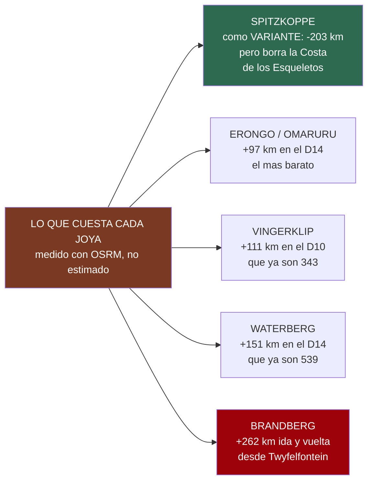
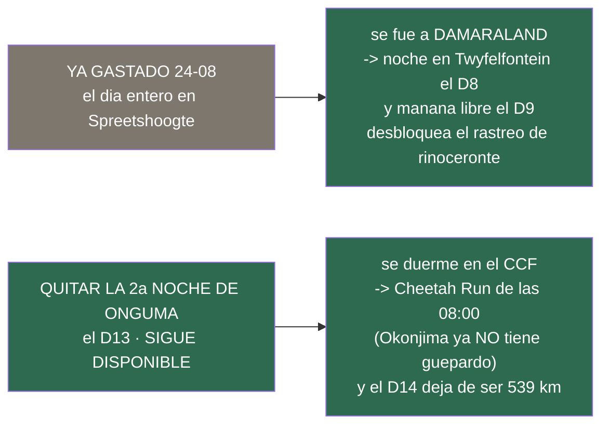

# Los desvíos que valen la pena

*Documento de consulta aparte — **fuera del dossier impreso desde el 25/08**. **Y desde el 26/08 no
queda viva ninguna de las alternativas que compara**: el desvío al CCF, la última que seguía en pie,
está descartado. Se conserva como el registro de qué se comparó y con qué números.*

> ## ❌ Descartado el 26/08 — no se baja al CCF
> El guepardo **«caza de día, a plena luz»** ✅, y el **D13 es el único día del viaje entero en el
> mejor terreno medido para eso, sin un solo kilómetro de traslado**: bajar al CCF se lo comía para
> cambiar un guepardo salvaje por uno cautivo. **Lo que se hace en su lugar está en
> [el plan del guepardo](plan-del-guepardo.md)**; el descarte razonado, en
> [el archivo del CCF](decision-del-ccf.md). Lo de abajo se deja tal cual, como comparación.

> **Namibia · 30 oct – 15 nov 2026 · la clásica del norte** — [← índice del dossier](../README.md)
>
> Las joyas que están **fuera** de la ruta y qué costaría de verdad ir a por ellas: kilómetros
> medidos con el enrutado propio, la noche que habría que sacrificar y el veredicto. El `10`
> cataloga lo que cae **dentro**; esto es lo de fuera, con el precio en la mano.
>
> **Y desde el 24/08 lleva delante lo que de verdad manda: el guepardo**, que el viajero pone como
> prioridad muy alta — con las cifras medidas de dónde se ve, los tres centros de la ruta y **de
> qué noche habría que sacar el día**.
>
> **~N$20 = €1** *(rango 19,5–20,5)* · **✅** fuente primaria · **◐** secundaria concordante ·
> **○** práctica común, sin fuente · **❌** sin verificar, dicho en blanco
>
> *Medido el 24/08/2026. **Los kilómetros no son de blog**: cada desvío se ha enrutado con el
> mismo OSRM sobre OpenStreetMap que dibuja el mapa del dossier, y los puntos se han geocodificado
> contra OSM en vez de escribirse a mano — el método de `13`, aplicado a lo que no está en la
> ruta.*

---

## ⚖️ La regla que decide: no hay ninguna noche libre

Antes de enamorarse de nada. La ruta son **15 días y 14 noches exactos**, medidos contra las horas
del vuelo el 08/08 *(`16`)*: se aterriza el 31 a las 09:25 y se despega el 14 a las 20:45. **No
sobra un día.** Así que cualquier joya de este documento se paga de una de estas tres maneras:

- **Con kilómetros del propio día** — y los días ya están calculados a **80 km/h en grava**, que es
  el límite del contrato, con la regla de **estar en el campamento a las 18:00** *(`06`)*. Un
  desvío de +150 km son casi **dos horas** que salen del final de la tarde, que es justo cuando la
  fauna se echa a los arcenes.
- **Quitando una noche a otro sitio** — y desde el **24/08 esto ya no está disponible**: la noche
  suelta que había *(la segunda de la escarpa de Spreetshoogte)* **ya se gastó**, y se gastó bien —
  se fue a **Damaraland**, a partir en dos el día más largo de grava del viaje y **desbloquear el
  rastreo de rinoceronte de Grootberg** *(la decisión del CCF, y el `11`)*. Lo que queda como colchón es **la noche del
  D8 en Twyfelfontein**, que a propósito no se reserva: es lo que se sacrifica si el vuelo se
  retrasa, sin perder un céntimo.
- **Cambiando un tramo por otro** — que es el único caso en que un desvío puede salir **gratis o a
  favor**, y abajo hay uno que lo hace.

---

## 🐆 GUEPARDO — prioridad alta del viajero, y aquí está lo que hay

*(Añadido el 24/08 a petición expresa: **ver guepardos es prioridad muy alta**. Esta sección manda
sobre el resto del documento.)*

**Lo primero, la distinción que lo decide todo, porque «ver un guepardo» son tres cosas
distintas:** el **salvaje** de un parque, que se busca y a veces no aparece; el **habituado** de
una reserva privada con radiocollar, que se rastrea y casi siempre aparece; y el **cautivo** de un
centro, que se ve seguro pero está detrás de una valla. Los tres cuentan como fotografía y **no
cuentan como lo mismo**. Este documento los separa a propósito.

### 1 · Lo que la ruta YA tiene, y está medido — el guepardo salvaje de Etosha

No hace falta desviarse para tener una opción real: el dossier ya lleva las cifras de avistamiento
de los partes de Expert Africa, campamento a campamento ✅ *(el método, en `09`)*:

- **Namutoni — 50 %** *(7 partes de 14)*. **Es la mejor cifra de guepardo del parque**, y tiene
  explicación: son **sus llanuras abiertas**. ⚠️ **Desde el 24/08 ya no se duerme allí** —la noche
  se cambió por una segunda en Onguma—, pero **el D12 y el D13 se pasan en esas mismas llanuras**:
  el D12 cruzándolas hasta la puerta y el D13 volviendo a entrar por ellas.
- **Okaukuejo — 18 %** *(21 de 116)* · **Halali — 10 %** *(4 de 39)* — el peor de los tres.
- Media del parque: **19 %**. Y GBIF da **132 registros** en el polígono, **28 en oct–nov** ✅.

> ⚠️ **Leer bien el 50 % de Namutoni**: son **14 partes**, una muestra pequeña — por eso la banda
> del `09` es honesta y no promete nada. Pero la dirección es clara: **el guepardo de este viaje se
> juega sobre todo en el D12**, y el sitio concreto es el eje **Salvadora–Sueda–Charitsaub**, que
> es llanura abierta *(`09`)*. **Si el guepardo es la prioridad, la salida guiada que hay que
> comprar sí o sí es la de la mañana... y ésa es justo la que se ha caído.** ⚠️ **Al no dormir en
> Namutoni, su guiada de mañana ya no se puede comprar** *(se venden a quien pernocta — `02` §9)*.
> Lo que queda para esas llanuras es **vuestro propio coche el D12 y el D13**, y el **game drive
> guiado dentro de Etosha que vende Onguma** *(4 h, N$1.930 · ~€97 pp ✅)*.

**Y el D12 y el D13, Onguma**, ya reservados, tienen **guepardo confirmado por escrito en su propia
web** ✅ — es **la única de la zona con leopardo Y guepardo confirmados** *(`21`)*.

### 2 · El que me dejé fuera: el Cheetah Conservation Fund (CCF) — y cae en la ruta

**Es la organización de referencia mundial del guepardo**, y está **a 44 km al este de
Otjiwarongo** ◐ — es decir, **pegada al eje del D14**, el día de vuelta a Windhoek. No estaba en
este dossier y debería.

- **Horarios, de su propia web** ✅
  *([cheetah.org — day visitors](https://cheetah.org/cheetah-ecolodge/day-visitors/))*:
  abierto **08:00–17:00**, **a diario** · **alimentación de lunes a viernes a las 14:00**
  *(sábados y domingos a las 12:00)*, ~30 min, **incluida con cualquier actividad** · **Cheetah
  Run diario a las 08:00**, 30 minutos, **con reserva previa obligatoria**.
- **Precios 2026 ◐** — su web sigue sin publicarlos ❌, pero info-namibia da la tabla de 2026:
  **tour del centro N$290 (~€14,5) · Cheetah Drive N$800 (~€40) · Cheetah Run N$800 (~€40)**,
  menores de 12 al 50 % *(actualizado el 27/08: las cifras anteriores —N$220 y N$605— eran de una
  guía vieja)*. **Confírmalo por teléfono: +264 (0)67 306225** ✅.
- **El desvío, medido** ✅: **+89 km** sobre el trazado directo del D14 *(OSRM)*.
- **⏰ Y aquí está el detalle que decide**, con los tiempos reales medidos:
  - **Onguma → CCF son 280 km, ~3 h 30** a velocidad de planificación. Saliendo a las 08:00 se
    llega sobre las **11:30** — **la alimentación de las 14:00 entra de sobra**, y el **D14 es
    viernes 13**, así que es el horario de lunes a viernes ✅.
  - **CCF → Windhoek, 294 km, ~3 h 40.** Saliendo a las 15:00 se llega hacia las **18:45**:
    pasada la regla de las 18:00, aunque es **B1 asfaltada entrando en ciudad**, no pista.
  - ❌ **El Cheetah Run de las 08:00 NO cabe en el D14**: a esa hora estarías a 280 km. **Es la
    actividad que obliga a dormir cerca** — y de ahí sale la sección siguiente.

### 3 · Okonjima / AfriCat — magnífico, pero ⚠️ **YA NO ES SITIO DE GUEPARDO**

> ### ❌ Corrección del 24/08, y es de las que importan
> Este documento afirmó en su primera versión que Okonjima tenía **guepardos sueltos y rastreo de
> guepardo a pie**. **Es falso**, y venía de un resumen de buscador que mezclaba material
> histórico de la fundación con lo que se ofrece hoy. Verificado en tres frentes:
>
> - **Los folletos de actividades de sus propios alojamientos** —el del **camping Omboroko** y el
>   del **Plains Camp**— listan sus actividades una a una y **no incluyen guepardo en ninguna**
>   ✅. En el del Plains Camp el guepardo solo sale en el texto **histórico** sobre la fundación,
>   no entre lo reservable.
> - **El motivo, y es interesante** ◐: de 2000 a 2020 AfriCat rehabilitó guepardo nacido en
>   libertad dentro de la reserva, pero **el programa se descontinuó** porque la presión de
>   **leopardo y hiena parda**, más la acacia espesa y el terreno rocoso, hacía que el guepardo
>   **no sobreviviera más de 18–24 meses tras la suelta**. **Sin rastreo de guepardo a pie desde
>   2020.**
> - ⚠️ **Y algo más reciente que también afecta**: el **Carnivore Care Centre cierra a finales de
>   2025** y **su experiencia se retira el 1 de enero de 2026**; las **visitas de día terminaron
>   el 1 de diciembre de 2025** ◐. **Para noviembre de 2026, eso ya no existe.**
>
> **Conclusión: para guepardo, el sitio es el CCF, no Okonjima.**

**Dicho eso, lo que sí ofrece es de primera** — y para leopardo es probablemente lo mejor del país.
De sus folletos oficiales ✅: **rastreo de leopardo con radiocollar**, **rastreo de rinoceronte a
pie** con el equipo antifurtivos, **rastreo de hiena parda**, **nocturna**, game/nature drive,
senderos y *Into AfriCat*. Y una rareza que casi nadie ofrece:

- 🦔 **Rastreo de PANGOLÍN a pie** ✅ — el animal más difícil de ver de África. **En verano va de
  22:00 a 06:00**, **máximo 6 personas** y ⚠️ **exige un mínimo de DOS noches**. *(Detalle con
  gracia: el pangolín es una de las especies que la guía de fauna **descartó** por 0 % de
  avistamiento en 149+48+16 partes de Etosha — `15`. Aquí lo rastrean.)*
- **El desvío, medido** ✅: **+34 km** sobre el D14. **Es el desvío más barato de todo este
  documento** — está prácticamente en la B1.
- **Tiene camping** ✅ *(N$880 + N$250 de tasa = N$1.130 · ~€56,5 por persona y noche, rack 2026 —
  `11`)*, así que puede ser noche, no solo parada.
- **Rastreo de leopardo N$1.600 (~€80) por adulto en temporada alta** ✅ *(corregido el 27/08: los
  N$880/970 que había aquí eran el game drive normal — el PDF oficial, por fin abierto, en `11`)*, y
  **«alrededor del 80 %» de éxito según su jefe de guías** ◐. **La versión que lo mete sin tocar el
  D13 —dormir el D14 aquí en vez de en Windhoek—, medida, en [el plan de felinos](plan-felinos.md).**
- **⏰ Su pega horaria**: las salidas son **06:00–06:30** *(vuelta 09:30–10:00)* o **15:30–16:00**
  *(vuelta 19:00–19:30)* ◐. La de la mañana pide haber dormido allí; la de la tarde termina a las
  19:30 y deja Windhoek de noche.
- ⚠️ **Y todo se reserva directamente al llegar al lodge**, sujeto a disponibilidad ◐ — el
  pangolín y la nocturna, **solo por reserva directa**.

### 4 · Otjitotongwe (D10) — el casi seguro, y el que hay que mirar con los ojos abiertos

Ya estaba en el dossier *(`11`)*: **C40, a 24 km de Kamanjab, de camino el D10** — **~N$610
(~€30)/persona** ◐. Aquí los guepardos **están habituados y se les da de comer a mano**: es la
opción que **casi garantiza** la foto, y es **la que menos se parece a ver un guepardo cazando**.

- ⚠️ **Dos cosas que confirmar antes de contar con ello**: la hora de la alimentación —el dossier
  tiene **~15:00** ◐ y una fuente reciente dice **16:00** ❌: **no coinciden**— y que **hay
  fuentes que lo dan cerrado los fines de semana** ◐. **Vuestro D10 es lunes 9 de noviembre**, así
  que ese punto no estorba, pero **los no alojados avisan por teléfono igualmente** ◐.

---

## 🗓️ ¿De dónde sale el día? Los dos donantes, que NO son equivalentes

Esta es la pregunta buena, y tiene una respuesta incómoda: **los dos días que se pueden sacrificar
sirven para cosas distintas, porque están en mitades distintas del viaje.** La clave es que **la
primera mitad no tiene nada reservado y la segunda sí**: Etosha está cerrada con fechas fijas
—9, 10, 11 y 12 de noviembre— desde el 21/08.

### Donante A · el día de la escarpa — **YA GASTADO, y en algo de este documento**

- **Qué pasó (24/08)**: Spreetshoogte se quedó en **una sola noche** y el día liberado se fue a
  **Damaraland**. No fue a Otjitotongwe: fue a **partir en dos el día de ~370 km de grava**, con
  **noche propia en Twyfelfontein el D8** y **la mañana del D9 libre entera** *(ver la decisión del CCF, al lado)*.
- **Y eso compra justo lo que este documento daba por imposible**: el **rastreo de rinoceronte
  negro de media jornada de Palmwag**, que además cae **en mitad del D9** *(`11`)*. Ahora cabe.
  ⚠️ *El de **día entero de Grootberg** sigue sin caber: saldría a primera hora y pediría conducir
  grava de noche.* ❌ *El precio de los dos sigue sin publicarse: pídelo —
  res4@journeysnamibia.com.*
- **Qué costó**: **el colchón**. Ya no hay ningún día que sacrificar si el vuelo se retrasa; la red
  que queda es **no reservar la noche del D8**, que es la única sin penalización.

### Donante B · quitar la SEGUNDA noche de Onguma (D13) — **el que sí compra el guepardo, y sigue vivo**

- **Cómo queda**: el **12 de noviembre**, en vez de la segunda noche de Onguma, se conduce hasta el
  **CCF (331 km desde Onguma, mínimo ~3 h 26)** y se duerme allí. El
  **13 por la mañana** entra lo que hoy es imposible: el **Cheetah Run de las 08:00**. Y después, a
  Windhoek: **294 km** — es decir, **el D14 deja de ser el monstruo de 539 km y se queda en media
  jornada**. *(Okonjima ya no es opción de guepardo — §3.)*
- ✅ **Y desde el 24/08 esto es mejor que un desvío: es una decisión con dos noches de margen.** Se
  duerme en Onguma el D12 **y** el D13, así que **la segunda se decide con el guepardo ya buscado**:
  si salió, se queda; si no, se cancela y se baja. El plan entero, en [la decisión del CCF](decision-del-ccf.md).
- **Qué cuesta**: Onguma es **reserva privada de 35.970 ha con leopardo, guepardo y
  rinoceronte confirmados por escrito**, con **baño propio en la parcela**, **salida al atardecer
  con foco y campo a través** y **paseo a pie**, las dos cosas que el parque prohíbe *(`21`)*. Se
  pierde además **el D13 de safari en Fischer's Pan**. Y **es una noche RESERVADA**: ❌ **sus
  condiciones de cancelación siguen sin pedirse**, y **se ha decidido asumirlas a ciegas** *(24/08)*
  — sobre N$1.240 (~€62), el techo del riesgo es pequeño.
- **El intercambio, dicho sin adornos**: se cambia un **guepardo salvaje improbable pero real**
  *(Onguma, reserva privada)* por un **guepardo casi seguro que no es salvaje** *(CCF)* o por uno
  **casi seguro pero cautivo** *(CCF)*. **Okonjima ya no es opción de guepardo** *(§3)*: lo suyo
  es leopardo, rinoceronte a pie y pangolín.

### Donante C · quitar Halali (D11) — el que los números señalan y la logística desaconseja

Los datos medidos dicen que **Halali es el más flojo de los tres para guepardo: 10 %**, la mitad
que Okaukuejo y la quinta parte que Namutoni. Tentador. **Pero está en mitad del bloque**: quitar
el 10 de noviembre deja un hueco que no se puede gastar en ningún sitio, porque el 11 hay que
estar en Onguma. Y Halali tiene **la charca de Moringa** y **el koppie, el único punto
del parque donde se puede andar fuera del coche** *(`21`)*. **Descartado salvo que se rehaga el
bloque entero.**

> ### 👉 La recomendación, actualizada al 24/08
> **El plan ya no obliga a elegir de antemano, y eso es lo mejor que le ha pasado.** Con **dos
> noches en Onguma**, el guepardo tiene **tres oportunidades sin mover nada**: las llanuras del
> este el **D12**, la reserva privada —que lo tiene confirmado por escrito— y el **D13 entero** de
> Fischer's Pan y Chudop.
> ❌ **Y si no sale, ya no hay recambio: el cambio por el CCF quedó descartado el 26/08** —se comía
> el D13, que es justo la mejor de las tres oportunidades de arriba—. Lo que queda como seguro
> barato es **Otjitotongwe el D10** *(§4)*, que no cuesta ni una noche ni un desvío.
> *(Okonjima sigue mereciendo la noche, pero por leopardo, rinoceronte a pie y pangolín: **guepardo
> ya no tiene** — §3.)*
>
> 👉 **El plan operativo —cinco ventanas diurnas, con sus horas— está en
> [el plan del guepardo](plan-del-guepardo.md)**; los números del desvío descartado, en
> [su archivo](decision-del-ccf.md).

---

## 🗻 Spitzkoppe — el único que puede salir a favor, y es el plan B de Terrace Bay

**Qué es.** El grupo de inselbergs de granito que sale en todas las fotos de Namibia: bloques
rojos de 700 millones de años sobre la llanura, el **arco de roca** que es la postal, y
**Bushman's Paradise**, con pinturas rupestres. Duerme uno al pie de la piedra, sin vallas.

**Lo que cuesta la noche** — su campamento comunitario, con dos avisos de calendario:

- **N$300 (~€15) por adulto y noche** ✅ *(tarifa oficial **1 nov 2025 – 31 oct 2026**, IVA y tasa
  de conservación incluidos —
  [spitzkoppe.com/src](https://spitzkoppe.com/src))*. ⚠️ **Pero esa tarifa expira justo antes del
  viaje**: la noche caería en **noviembre de 2026**, ya en el año siguiente, y una secundaria da
  **N$320 (~€16) para nov–dic 2026** ◐
  *([nwrnamibia](https://www.nwrnamibia.com/spitzkoppe-community-campsite-prices.htm))*. **Es la
  misma trampa que Barkhan** *(`15` §Spreetshoogte)*: el rack publicado no es el vuestro por
  semanas. **Para dos: ~N$640 (~€32).**
- **La tasa de acceso al reserve va incluida** para quien acampa ✅ *(un permiso por vehículo)*.
  **Visitante de día: N$180 (~€9) por adulto** ✅.
- **Reservas: reservations@logufa.com** ✅. Hay **más de 50 parcelas** y **no se puede elegir
  parcela**: solo se confirma que habrá sitio.
- ⚠️ **Esto corrige un dato viejo del dossier**: `01` y `02` citaban «N$270/persona → N$540 la
  noche» ◐ como ancla del extremo bajo de la estimación de campings. **El número real es N$300–320,
  no N$270** — la banda de `02` §3 no se mueve *(sigue dentro de los €25–45)*, pero el ancla queda
  corregida.

**Lo que cuesta llegar, medido.** Aquí está lo interesante, y no es lo que uno espera:

- **Como excursión de un día desde Walvis en el D7** *(el día de descanso)*: **192 km por sentido,
  383 km ida y vuelta** ✅ *(OSRM)*. A velocidad de planificación son **~5 horas de coche**.
  **Se carga el único día sin conducir del viaje.** ❌ No.
- **Como variante que sustituye a la costa**: **Walvis → Spitzkoppe → Twyfelfontein son 413 km**,
  contra los **616 km** de Walvis → Terrace Bay → Twyfelfontein ✅ *(OSRM, mismos extremos)*. Es
  decir, **la línea interior es ~200 km MÁS CORTA** que la de la costa.

> ### 👉 El veredicto útil: Spitzkoppe es el plan B de Terrace Bay, no un capricho
> Tal y como está la ruta, Spitzkoppe **no entra**: metería piedra donde hay Costa de los
> Esqueletos, y eso significa borrar **Cape Cross, la puerta de Ugabmund, la noche dentro del
> parque y el delta del Uniab** *(`10`)* — cuatro cosas por una.
>
> **Pero si Terrace Bay no tiene sitio** —que es la reserva binaria del viaje: sin ella no se
> entra a pernoctar *(`20` §4)`*— entonces **Spitzkoppe es exactamente el recambio**: la noche
> existe y se reserva por email, es **~200 km más corta**, cuesta **N$640 (~€32) en vez de los
> N$3.480 (~€174)** de Terrace Bay, y el D8 dejaría de tener la hora límite de las 15:00 de
> Ugabmund. **Anótalo antes de llamar a NWR, no después.**

---

## 🎨 Brandberg y la Dama Blanca — solo si ya se va por dentro

**Qué es.** La **montaña más alta de Namibia** *(el Königstein, 2.573 m)* y, en su falda, la
**Dama Blanca**: la pintura rupestre más famosa del país, a unos **45 minutos a pie** del
aparcamiento, con **guía local obligatorio** ◐.

- **Entrada: N$270 (~€13,50) para extranjeros** ◐ *(namibio N$80, SADC N$100)*, más el **guía,
  ~N$50–100 (~€2,50–5)** ◐ — cifras de 2023, así que **pueden haber subido** ❌.
  Fuentes ◐: [Wikivoyage — Brandberg](https://en.wikivoyage.org/wiki/Brandberg) ·
  [namibweb](http://www.namibweb.com/brandg.htm).
- **Una norma que sorprende y conviene saber**: hay que **dejar las bebidas abajo**. Hubo turistas
  que echaban agua y refresco sobre la pintura para que contrastara en las fotos ◐.
- **Dónde cae**: a ~36 km al noroeste de **Uis**, que está en la **C35, a mitad de camino entre
  Henties Bay y Khorixas** ◐.

**Lo que cuesta, medido**: desde **Twyfelfontein son 131 km por sentido — 262 km ida y vuelta** ✅
*(OSRM)*. El D9 ya son **367 km** con Twyfelfontein dentro: sumarle 262 lo pone en **629 km de
pista**, imposible con la regla de las 18:00.

> **Veredicto: no entra por sí solo — pero va de camino en la variante interior.** Uis está en la
> C35, que es justo el eje que se usaría si Terrace Bay cae y se baja por dentro. En ese
> escenario Brandberg deja de ser un desvío y pasa a ser **una parada**. Fuera de él, no.

---

## 🪨 Vingerklip — el que cabe casi, y ya estaba anotado

**Qué es.** El «dedo de Dios»: un monolito de **35 m** en las terrazas del Ugab. `10` ya lo tenía
apuntado como *«solo encaja cambiando el D10 a la variante Khorixas–Outjo»* — ahora ese cambio
tiene número.

- **Medido** ✅: el D10 por **Khorixas → Vingerklip → Outjo → Okaukuejo** son **454 km**, contra los
  **343 km** del D10 real por Kamanjab. **+111 km.**
- **Precio ○**: ~N$20 (~€1) *(`10`)*.
- ⚠️ **Y un dato del geocodificado que conviene mirar**: OSM etiqueta su acceso como **«4WD only»**
  ◐. El coche lo es, pero es pista, no atajo.

> **Veredicto: es el desvío más barato en kilómetros de los que añaden algo nuevo, y aun así
> cuesta ~1 h 20 min** sobre un día que ya son 343 km y termina **cruzando la puerta de Andersson**
> con horario. El D10 es además el día en que se entra en Etosha: llegar tarde a Okaukuejo es
> perder la primera charca iluminada. **Solo si se sale de Hoada muy pronto.**

---

## 🌄 Waterberg y el Erongo — los dos del día de vuelta

El **D14 (Onguma → Windhoek) son 539 km**, el día más largo del viaje. Los dos candidatos caen en
ese eje y compiten por el mismo hueco inexistente.

- **Waterberg Plateau** — la meseta roja de 200 m sobre la llanura, con su parque nacional y su
  historia *(`19`)*. **Medido: +151 km** sobre el trazado directo ✅. Entrada **N$280 (~€14)** por
  persona *(es parque premium, `15`)* y parcela NWR **N$430 (~€21,50)** ✅ *(`03`)*. **Ya está
  documentado en `11`.**
- **Omaruru / macizo del Erongo** — el desvío **más barato de todos: +97 km** ✅, y de paso el único
  que atraviesa un pueblo con algo que hacer.

> **Veredicto: los dos piden noche propia, no desvío.** Meterle 151 km a un día de 539 lo deja en
> 690 km — cinco o seis horas largas de conducción antes de devolver el coche al día siguiente.
> **Waterberg es un viaje aparte**, no la cola de éste. *(Si algún día se parte el D14 en dos
> —que es lo que también pedía el leopardo de Okonjima, `11`—, entonces los tres entran de golpe:
> Okonjima, Waterberg y el Erongo caen en el mismo eje.)*

---

## 🚫 Y las que ya estaban descartadas, para no volver a mirarlas

`10` §«Las que se quedan fuera» las tiene con su fuente; se repiten aquí solo para que este
documento sea la lista completa de lo de fuera:

- **Dragon's Breath** *(el mayor lago subterráneo no glaciar del mundo)* — **no es visitable**:
  granja privada, solo expediciones científicas. Su versión visitable, el **lago Otjikoto**, ya
  está **en la ruta** el D14.
- **Cráter de Messum** — desvío serio del D7, con permiso, líquenes frágiles y estado incierto:
  **ya desaconsejado en `11`**.

---

## 🧭 En dos frases

**Del guepardo**: el plan operativo —qué hacer y a qué hora— está aparte, en
[el plan del guepardo](plan-del-guepardo.md); aquí va solo de dónde salen los días. La ruta ya trae
tres oportunidades sin mover una sola noche —las **llanuras del
este el D12**, la mejor casilla medida del parque *(Namutoni, 50 %)*; **Onguma, con guepardo
confirmado por escrito, dos noches (D12–D13)**; y el **D13 entero** de Fischer's Pan y Chudop—.
Y si aun así no sale, **ya no hay recambio**: el cambio por el CCF se descartó el 26/08 porque
gastaba el D13, que es la mejor de las tres. El seguro barato es **Otjitotongwe el D10** *(§4)*.

**De lo demás**: solo uno de los cinco desvíos puede entrar sin romper nada, y solo si algo falla —
si **Terrace Bay** se queda sin sitio, la ruta baja por dentro y gana **Spitzkoppe y Brandberg**,
~200 km más corta y mucho más barata, perdiendo a cambio la Costa de los Esqueletos entera. Los
otros cuatro piden un día que este viaje no tiene.

---

*Precios en N$ y € · ~N$20 = €1 · Kilómetros medidos con OSRM sobre OpenStreetMap el 24/08/2026,
puntos geocodificados contra OSM · Las tarifas namibias cambian: reconfirma antes de pagar*
