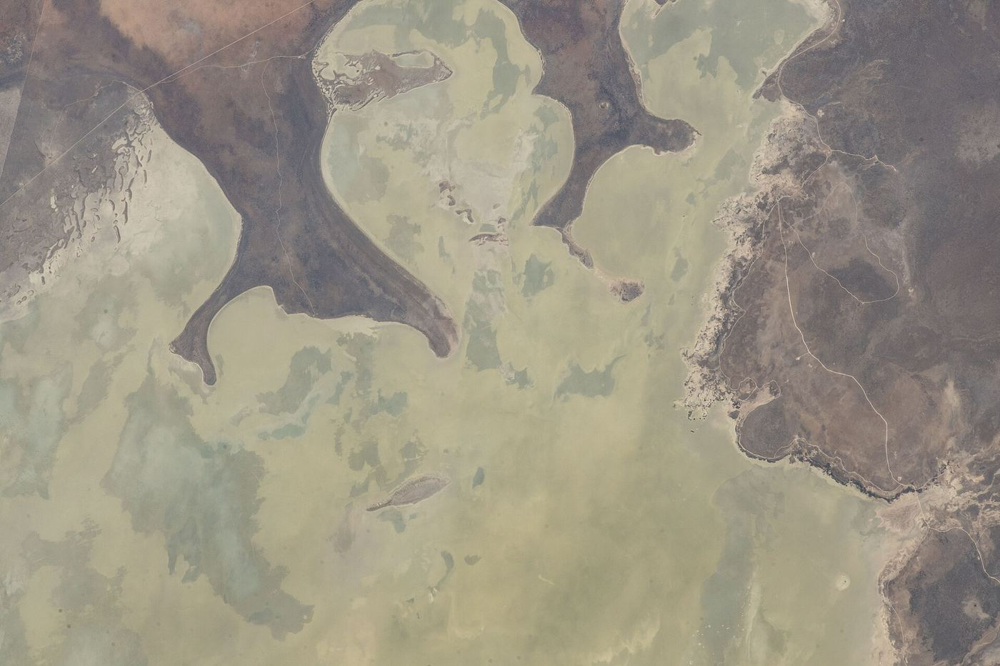

# Etosha: geología, historia y conservación

*Documento de consulta aparte — sin enlazar todavía desde el README ni desde ninguno de los dos
PDF. Investigación del 12/08/2026, con fuentes académicas y oficiales abiertas y leídas
directamente cuando fue posible — nunca de memoria.*

**Alcance**: esto es Etosha como lugar — cómo se formó, qué clima tiene, quién vivió allí antes del
parque y qué le pasó, cómo se gestiona hoy. **No es sobre qué fauna se ve ni dónde**: eso ya está
en [`09-fauna-namibia.md`](../09-fauna-namibia.md) y en `guia-fauna-namibia.pdf`, con su propio método y
sus propias fuentes.

Confianza: ✅ fuente primaria (paper académico leído completo, base de datos oficial, comunicado
gubernamental) · ◐ fuente secundaria concordante · ○ práctica común/cita repetida, sin fuente
primaria verificada · ❌ sin verificar o con fuentes contradictorias sin reconciliar.

*Foto: NASA, dominio público*

---

## 1 · Cómo se formó la depresión

**No hay una única teoría con consenso cerrado.** La tesis de referencia sobre el problema
([Hipondoka 2005](http://hdl.handle.net/11070/1784), Universidad de Würzburg) describe dos escuelas
enfrentadas:

- **Modelo "paleolago"** (años 1920, el clásico): Etosha fue un lago que quedó abandonado cuando el
  río Kunene, su principal aporte, fue capturado por otro sistema de drenaje — y sobrevivió sin él
  hasta hace unos 35.000 años.
- **Modelo "coalescencia de cubetas"** (años 1980-90): la depresión se formó por la fusión de
  muchas cubetas menores erosionadas por lluvia y viento, **sin que existiera nunca un lago
  permanente** desde el Cuaternario.

**La fecha de la desecación final no se pudo reconciliar entre fuentes** ❌ — cuatro cifras
distintas, ninguna las junta en una sola cronología:
- **~12 millones de años** (Mioceno) — [Mendelsohn et al. 2013](https://www.feow.org/ecoregions/details/553), captura del Kunene por elevación tectónica.
- **Plioceno-Pleistoceno temprano** (~5,3-0,8 Ma) — resumen del modelo clásico en Hipondoka 2005.
- **~4 millones de años** — [Miller, Pickford & Senut 2010](https://doi.org/10.2113/gssajg.113.3.307),
  *South African Journal of Geology*, con fósiles de esa edad (mamut *Mammuthus subplanifrons* —el
  esqueleto más completo conocido de la especie—, rinoceronte blanco, hipopótamo, cocodrilo).
- **Evidencia de lago perenne todavía en el Holoceno** (últimos ~11.700 años) — [Hipondoka et al. 2006](https://doi.org/10.10520/EJC96534), *South African Journal of Science*.

[Turner et al. 2022](https://doi.org/10.1016/j.gecco.2022.e02221) —el estudio de revisión más
reciente, con autoría del propio Instituto Ecológico de Etosha, base de todo este documento en
varios bloques— no toma partido: la llama *"the Etosha saline deflation pan, once a large
paleolake"*, mezclando vocabulario de las dos escuelas a propósito.

**Tamaño de la pan**: ✅ **4.812 km²** ([Turner et al. 2022](https://doi.org/10.1016/j.gecco.2022.e02221),
citando a Mendelsohn et al. 2013) — cifras alternativas de ~4.730-4.800 km² circulan en fuentes
turísticas sin fuente primaria propia.

**Por qué el suelo es blanco y salino**: costras evaporíticas por eflorescencia salina tras las
lluvias e inundaciones estacionales, que el viento fuerte de la seca rompe y expone como polvo fino
✅ ([Wallum et al. 2026](https://doi.org/10.1029/2026jf009216), *Journal of Geophysical Research:
Earth Surface*, acceso abierto, con teledetección Landsat validada contra difracción de rayos X de
muestras de campo). El desglose mineral exacto (halita/yeso/calcita) no se pudo verificar en fuente
académica ❌.

**Por qué solo se inunda parcialmente algunos años**: la lluvia directa aporta poco; el grueso del
agua llega en años muy lluviosos por los ríos Ekuma, Oshigambo y Omuramba Ovambo, alimentados desde
Angola por la red de canales *oshana/iishana* del Cuvelai — y **las grandes inundaciones solo
llegan una vez cada 7-10 años** ◐ ([FEOW.org](https://www.feow.org/ecoregions/details/553), citando
a Barnard 1998 y Mendelsohn et al. 2000; confirmado en su mecánica por
[Turner et al. 2022](https://doi.org/10.1016/j.gecco.2022.e02221) ✅). Un estudio de 2025 liga
además esa variabilidad a las fases de El Niño y del Dipolo del Océano Índico ✅
([Wallum et al. 2025](https://doi.org/10.1016/j.scitotenv.2025.180088), *Science of The Total
Environment*, acceso abierto).

---

## 2 · Clima

✅ Datos del Instituto Ecológico de Etosha en Okaukuejo, medidos 1954-2021
([Turner et al. 2022](https://doi.org/10.1016/j.gecco.2022.e02221), leído completo):

- **Lluvia media anual en el centro de Etosha (Okaukuejo): 358 ± 124 mm**, sobre todo entre enero
  y marzo. Muy variable, con fases plurianuales húmedas (1940s-mediados 1950s, mediados
  1960s-1970s, 2000-2012) y secas (mediados 1950s-1960s, 1980s-1990s, 2013-2020) — **sin tendencia
  significativa detectada** en la serie completa.
- **La lluvia aumenta de oeste a este** (168 pluviómetros, 1983-2020). Las pérdidas por evaporación
  multiplican la lluvia anual por 4-5 en el este y hasta por 10 en el oeste.
- **Temperatura**: entre 1975 y 2004 la máxima media subió 1,1 °C y la mínima 1,3 °C — más de
  3,2 °C/siglo de calentamiento regional. Proyección a fin de siglo: +4-6 °C más, 10-20 % menos de
  lluvia, temporada seca alargada de septiembre a noviembre.
- Cifras alternativas que circulan sin fuente meteorológica primaria namibia verificada ❌: lluvia
  anual 400-550 mm (probablemente para la ecorregión completa, más húmeda que Okaukuejo), y
  temperatura media anual ~24 °C.

**El mecanismo real de la concentración en charcas** —no es solo «hace calor»— ✅
([Turner et al. 2022](https://doi.org/10.1016/j.gecco.2022.e02221)): el calor obliga a más
refrigeración evaporativa, lo que sube el requerimiento de agua; el forraje pierde humedad
precisamente lejos del agua, así que el animal enfrenta un compromiso real entre calidad de pasto y
cercanía al agua; los movimientos de numerosas especies están documentados como condicionados por
la distribución de charcas; al concentrarse las presas se concentran los depredadores y se agregan
los parásitos; y la competencia por el acceso al agua se agudiza cuanto más avanza la seca — la
misma mecánica que ya usa este proyecto para recomendar «elegid una charca y esperad» (`17`, `18`).

---

## 3 · Las charcas: historia y una controversia científica real

**Cuántas hay**: ◐ **59 charcas artificiales**, más un número de manantiales naturales que no se
pudo fijar ([Patterson et al. 2025](https://www.sciencedirect.com/science/article/pii/S2351989425002823),
*Global Ecology and Conservation*, citando al Instituto Ecológico de Etosha). Cifras turísticas de
30-86 charcas circulan sin fuente primaria propia ○.

**Quién perforó y cuándo** — ✅ [Turner et al. 2022](https://doi.org/10.1016/j.gecco.2022.e02221):

- **La primera charca artificial fue el pozo de Andoni, perforado en 1923** — sin nombre de quién
  lo decidió ❌. El suministro no volvió a aumentar hasta 1948.
- **La mayor expansión fue en los años 60**, por cuatro motivos documentados: agua suplementaria en
  sequía, reducir el daño a la vegetación por concentración en los pocos manantiales naturales, más
  puntos de observación turística, y reducir el conflicto humano-fauna en la zona tapón (cita:
  Ebedes 1976, *Madoqua*). Antes de eso la fauna —sobre todo elefantes— dependía de las granjas al
  sur del parque para el agua estacional; **durante la construcción de la valla veterinaria, el
  agua del oeste se pensó explícitamente para mantener a los elefantes dentro** (cita: de la Bat
  1982, responsable de conservación de la administración survestafricana).

**La controversia** ✅ (misma fuente, leída completa): la expansión de los 60 concentró el
pastoreo y sobreexplotó pastizales al noreste y suroeste de la pan que antes se usaban solo
estacionalmente. **En 1964 aparecieron los primeros casos de ántrax** en esos pastizales; combinado
con lluvias altas de finales de los 60, Etosha sufrió **sus mayores brotes entre 1967 y 1974, con
más de 1.500 muertes registradas** (Ebedes 1976). Forzó una reevaluación de la política de agua: se
descontaminaron graveras y **se cerraron pozos en esos pastizales entre finales de los 70 y los
80**, lo que devolvió el uso estacional y redujo el ántrax. Los autores citan el mismo patrón en
Kruger (Sudáfrica): menos puntos de agua artificiales → más heterogeneidad de vegetación → menos
mortalidad de herbívoros por sequía.

**El ciclo se ha vuelto a abrir**: hoy hay de nuevo presión para añadir pozos —más abrevadero, más
avistamiento turístico— y **se han abierto cinco pozos nuevos desde 2020**, con el riesgo
reconocido explícitamente por los propios autores: cambios en las interacciones entre especies y
menor resiliencia del ecosistema.

**Elefantes y vegetación cerca del agua**: los elefantes redujeron la supervivencia de plantas
leñosas en un radio de 8 km alrededor de cada punto de agua — área que cubre **el 42 % de la
superficie de Etosha** ◐ (citado en Turner et al. 2022; estudios propios en
[de Beer et al. 2006](https://doi.org/10.1016/j.jaridenv.2005.06.015) y
[Franz et al. 2010](https://doi.org/10.1016/j.ecolmodel.2010.09.003)).

---

## 4 · Ecología de la vegetación

**La única evaluación de comunidades vegetales de todo el parque sigue siendo de los años 80** ✅
— [le Roux et al. 1988](https://doi.org/10.1016/S0254-6299(16)31355-2), *South African Journal of
Botany*: **31 comunidades vegetales** clasificadas por rasgos florísticos, edáficos y topográficos.

**Tipos de hábitat** ✅ ([Turner et al. 2022](https://doi.org/10.1016/j.gecco.2022.e02221)):
Kalahari occidental, tierras altas occidentales, matorral de mopane, cuenca del Cuvelai, karstveld,
pastizal y matorral enano bordeando la pan, bosque del Kalahari nororiental, matorral espinoso, y
la propia pan sin vegetación. Suelo arenoso y pobre en la mitad norte; leptosoles/regosoles/roca
más fértiles pero superficiales en la mitad sur.

**Cómo cambia la fauna entre hábitats**: los suelos más productivos están al suroeste de la pan y
sostienen alta densidad de pastadores en la húmeda. Los manantiales naturales se concentran en el
karstveld (sur/sureste), con agua relativamente dulce frente a la hipersalina del norte. **El
vallado desde 1961 cortó el acceso a las zonas de pasto más productivas al norte**, cambiando los
patrones de uso por especie.

**El fuego como factor estructurador**: política de quema guiada desde 1981; la supresión activa
entre 1997 y 2011 provocó episodios graves —**rinocerontes, elefantes y leones atrapados y muertos
en contraincendios en el este del parque en 2011**— lo que llevó a un sistema de «quema en
mosaico» desde 2016. El seguimiento fotográfico de vegetación (400 puntos fijos) corre desde 1984.

---

## 5 · Datos geográficos duros y cómo cambió el tamaño del parque

**Fundación**: ✅ **1907**, como «Game Reserve No. 2», bajo la administración colonial alemana —
concordante en MEFT, Turner et al. 2022 y Wikipedia. El nombre del gobernador (Friedrich von
Lindequist, según Wikipedia) no se pudo verificar contra fuente primaria ◐.

**La evolución del tamaño, con cifras exactas** ✅ ([Turner et al. 2022](https://doi.org/10.1016/j.gecco.2022.e02221),
cita textual): *"Etosha, proclaimed as Game Reserve Number 2 in 1907, initially covered
approximately 80,000 km² extending to the Skeleton Coast. Its boundaries were reconfigured several
times, with major alterations occurring in 1958 (to 55,000 km²) and 1970 (to its current size of
22,941 km²)."*

- **1907 → ~80.000 km²**, hasta la Costa de los Esqueletos. *(Nota de coherencia interna: la cifra
  "oficial" histórica que circulaba era 99.526 km², pero el propio biólogo del parque Berry —1997,
  *Madoqua*— remidió los mapas de 1907 y concluyó que esa cifra "appears to be an error": su
  corrección, ~80.000 km², es la misma que cita de forma independiente Turner et al. 2022 25 años
  después — dos fuentes que convergen sin citarse la una a la otra en el mismo número corregido.)*
- **1958 → 55.000 km²** (Ordenanza 18): se excluye la franja entre el Kunene y el Hoarusib, se
  incorpora la franja entre el Hoanib y el Ugab.
- **1967**: estatus de Parque Nacional por ley del Parlamento sudafricano.
- **1970 → tamaño actual**: aplicando la Comisión Odendaal (1963), el "plan" sudafricano de
  homelands/bantustanes para el África del Sudoeste. El entonces director de Conservación de la
  Naturaleza y Turismo lo resumió así: *"After Odendaal, Etosha resembled a plucked fowl"* (de la
  Bat 1982). Ese mismo 1970, el Ministerio sudafricano de Administración y Desarrollo Bantú rechazó
  explícitamente una propuesta conservacionista (Tinley 1971) de unir Etosha con el Kaokoveld y
  Kunene en un área contigua mayor.

**El tamaño de hoy — dos cifras bien sostenidas, sin reconciliar entre sí** ❌:
- **22.941 km²** — converge en **dos fuentes de máxima autoridad**: Turner et al. 2022 (citando a
  Mendelsohn et al. 2013 y Namibia Atlas Team 2022) y la propia
  [Protected Planet / World Database on Protected Areas](https://www.protectedplanet.net/884)
  (UNEP-WCMC + UICN, ficha oficial nº884). El MEFT namibio da 22.935 km², prácticamente idéntica
  (diferencia de redondeo o metodología).
- **22.270 km²** — la cifra que repiten Berry (1997, *Madoqua*, biólogo del propio parque) y
  Wikipedia, para el mismo recorte de 1970.

Ninguna fuente explica la diferencia entre las dos — no se fuerza una reconciliación que no existe
en ningún documento consultado. **Se recomienda usar 22.941 km²** por converger dos fuentes
independientes (un paper revisado por pares de 2022 y una base de datos oficial), citando 22.270
km² como cifra alternativa muy repetida.

Contexto ❌ *(cifras sin fuente propia verificada en este documento; la del Cuvelai en particular no
cuadra con el rango ~130.000–160.000 km² que dan las fuentes consultadas para esta comprobación,
según qué se cuente como parte de la cuenca)*: la zona tapón de 40 km alrededor de Etosha, con las
conservancies comunitarias, sumaría otros ~36.160 km²; la cuenca del Cuvelai —de la que Etosha es el
extremo sur— se cita a veces en ~175.870 km², entre el sur de Angola y el norte de Namibia.

**El papel de la administración sudafricana**: Sudáfrica ocupó el territorio en 1915 (fin del
dominio alemán) y lo administró —con mandato de la Sociedad de Naciones desde 1920— hasta la
independencia de Namibia el **21 de marzo de 1990**. En ese periodo: redesignó la reserva en 1958,
le dio estatus de parque nacional en 1967, y ejecutó el recorte Odendaal de 1970.

---

## 6 · Los Hai||om: antes del parque, y su desplazamiento

*Foto: Yathin S Krishnappa, CC BY-SA 3.0*

**Antes del parque**: los Hai||om (Hai//om, Hei//om), el mayor grupo san de Namibia, ocupaban la
franja sur de la pan —unas 700.000 ha dentro de los límites actuales— como cazadores-recolectores,
con asentamientos en los manantiales permanentes: Okaukuejo, Halali, Namutoni. La administración
alemana, al crear la reserva en 1907, **toleró y dio la bienvenida** a su presencia ✅
([Xoms |Omis](https://www.xoms-omis.org/knowledge-base/the-hai-om/history-in-etosha), proyecto de
patrimonio Hai||om dirigido por la antropóloga Ute Dieckmann). Censo de 1938 (solo Namutoni): 343
personas. Censo de 1952 (P. Schoeman, biólogo del parque): ~500 Hai||om en la reserva.

**La expulsión de 1954** ✅ — cuatro fuentes independientes coinciden en el año: Xoms|Omis, el
libro *Born in Etosha* (Dieckmann 2009, vía Wikipedia), y dos reportajes de *The Namibian*
(17/03/2022 y 05/03/2026, este último citando la demanda judicial actual). Se ordenó irse a
**todos** los Hai||om, salvo **12 familias** con miembros empleados en la reserva — lo que explica
por qué décadas después seguía habiendo Hai||om viviendo dentro de Etosha.

**Dos versiones del motivo, ninguna suavizada**:
- La fuente académica del propio parque (Berry 1997, biólogo del Instituto Ecológico de Etosha) da
  la justificación oficial de la época: *"considered necessary because they begged from tourists
  and disturbed game and tourists at water-holes"*.
- El [Legal Assistance Centre](https://www.lac.org.na/news/probono/ProBono_79-ETOSHA_CASE.pdf)
  namibio lo describe de forma más crítica: *"The South African Administration also saw the
  clearing of the Hai||om from Etosha as an ideal opportunity to promote Etosha as a premier
  tourist destination. The Hai||om were left destitute and landless... They were never
  compensated."*
- La demanda judicial de 2025-2026 añade una acusación **no zanjada judicialmente**: que la
  administración colonial alemana cometió genocidio contra los Hai||om y otros pueblos san, y que
  la administración sudafricana posterior los trató bajo políticas de apartheid — es una alegación
  de la demanda, no un hecho establecido por sentencia ❌.

**Después de 1954**: trabajaron como jornaleros agrícolas en granjas linderas, sosteniendo con su
mano de obra un sector agrícola blanco subvencionado. Desde 2004 existe una Autoridad Tradicional
Hai||om reconocida por el gobierno. Desde 2007-08 el gobierno compra granjas linderas para
reasentamiento —las cifras concretas varían entre fuentes sin un total actual fiable ❌—. Hacia
2010 aún quedaban Hai||om viviendo dentro de Etosha, en Okaukuejo; hubo amenaza de desalojo, el LAC
intervino, y el gobierno prometió apoyo a un reasentamiento voluntario que, según el propio LAC,
**no se llegó a cumplir**.

**El litigio, con su cronología completa**:

- **2015-2022, el caso Tsumib** — ocho Hai||om liderados por el anciano Jan Tsumib pidieron
  permiso para una acción representativa en nombre del pueblo, respaldados por escrito por ~2.500
  Hai||om. Vista en noviembre de 2018, **desestimada por el Tribunal Superior** *(discrepancia de
  fecha entre fuentes: The Namibian dice agosto de 2018, el propio LAC dice agosto de 2019 — dado
  que la vista fue en noviembre de 2018, un fallo de agosto de 2018 sería cronológicamente
  imposible, así que la fecha del LAC parece la correcta ◐)*. El gobierno **y la propia Autoridad
  Tradicional Hai||om** se opusieron, alegando que la ley reserva la representación legal a esa
  Autoridad. El **Tribunal Supremo desestimó la apelación el 16/03/2022** — pero discrepó de que
  solo la Autoridad Tradicional pudiera representar a la comunidad, y no impuso costas "porque se
  habían planteado cuestiones de importancia en la Namibia contemporánea". La derrota fue procesal,
  no un rechazo del fondo de la reclamación ancestral, que nunca ha sido juzgada.
- **2025-2026, la demanda actual, sobre el fondo — sigue abierta hoy**: siguiendo la vía que el
  propio Tribunal Supremo había sugerido, en julio de 2024 se constituyó la Hai||om Association.
  En 2025 esa asociación y 10 miembros —de nuevo con Jan Tsumib como presidente— presentaron una
  demanda civil (causa HC-MD-CIV-ACT-OTH-2025/04463) pidiendo la propiedad de Etosha (23.150 km²
  según la propia demanda, cifra que no coincide con las administrativas de la sección 5) y de 11
  granjas en Mangetti West —excluyendo los campamentos NWR—, o alternativamente tierra equivalente
  o una compensación de **N$2,8 billones** (≈€140.000 millones al ~N$20=€1 de este dossier —
  ~€136.600–143.600 millones según el rango 19,5-20,5 —, cambio no verificado para fechas
  concretas). El gobierno se opone; el **21/04/2026** pidió tachar partes de la demanda por
  "vagas y embarazosas" y sin causa de acción válida. **No hay noticia posterior confirmada**: el
  caso sigue en fase preliminar, sin vista sobre el fondo fijada ✅ *(verificado con dos medios
  namibios independientes:*
  *[The Namibian, 05/03/2026](https://www.namibian.com.na/haiom-association-sues-govt-for-n2-8-trillion-over-etosha-land/)
  y [Namibia News Digest, 21/04/2026](https://www.namibianewsdigest.com/government-challenges-haiom-etosha-land-claim-as-vague-and-embarrassing/))*.

---

## 7 · El vallado del parque

**Motivo original: sanidad animal, no gestión general de fauna** ✅ (Berry 1997, leído completo):
*"an epidemic of foot-and-mouth disease during 1961 sparked the erection of a game-proof fence as a
veterinary measure along the eastern and southern borders"* — 2,6 m de alto, 17 hilos de alambre
liso más 1,5 m de malla enterrada. Antes solo había vallas de granjeros aisladas, sin efecto real.

**Cerrado del todo en 1973, con cifra exacta**: 850 km de valla — insuficiente para jabalí
verrugoso, leones y elefantes, así que se reforzó después con 130 km de cable "a prueba de
elefantes" y, más tarde, tramos electrificados. Confirmado de forma independiente por
[Dieckmann, Sullivan & Lendelvo 2024](https://www.openbookpublishers.com/books/10.11647/obp.0402/chapters/10.11647/obp.0402.02)
(libro de acceso abierto).

**Efecto cuantificado sobre la fauna migratoria** ✅ (Berry 1997): entre el cercado y 1987 —el
declive se atribuye a la valla **junto con** otros factores (aguadas artificiales, enfermedad,
sequía de los 80)—: cebra de Burchell, de 22.000 (1969) a 5.000; ñu, de 25.000 (1954) a 2.600;
eland, de 3.000 (antes de 1960) a 250. Lo "porosa" que era en la práctica: una inspección aérea del
29/08/1984 sobre los 850 km contó **96 roturas completas y 134 parciales en un solo día**.

**Estado actual (2026)**: en plena rehabilitación — perímetro hoy cifrado en 824 km, de los que
solo 6,4 km de un plan de 180,4 km se han rehabilitado, con finalización prevista para 2030 y
participación de conservancies vecinas ◐ (fuente única, prensa namibia).

---

## 8 · Gestión de conservación reciente

**Furtivismo de rinoceronte, año a año** ◐ (cifras con variación entre fuentes según fecha de
corte, todas remitiéndose en última instancia al MEFT):
- 2019: 61 · 2020: 43-47 · 2021: 45-50 · 2022: 87-93 (Etosha sola: 46, más de la mitad del total
  nacional) · 2023: 39 en septiembre → 62 al cierre del año · 2024: 28 nacional a 1 de abril (19 en
  Etosha, 10 de ellos descubiertos durante las propias operaciones de descornado) → Etosha cerró el
  año con 46 (35 negros + 11 blancos) · **2025: 41 a nivel nacional, el nivel más bajo en más de
  una década, un 53 % menos que 2024** ✅ ([WWF](https://www.worldwildlife.org/news/stories/namibia-records-lowest-rhino-poaching-in-more-than-a-decade/)) — sin desglose de Etosha para 2025 ❌.

**Descornado (dehorning)**: programa en marcha desde 2014; campaña de 2023 con objetivo de 600
rinocerontes en 12 meses, cuernos con ADN registrado y almacenados en depósito nacional de valor no
revelado. Doble motivo real, no solo antifurtivismo: el ministro Pohamba Shifeta explicó que
también reduce peleas mortales entre rinocerontes negros. **Matiz científico honesto, no
propaganda**: un estudio conjunto namibio-estadounidense citado por el veterinario Dr. Conrad Brain
sugiere que descornar puede reducir la capacidad de las madres para defender a sus crías de
depredadores — el propio sector reconoce un coste ecológico del método.

**Otras medidas verificadas y fechadas**: unidad de patrulla a caballo desde septiembre de 2023 (13
caballos, 8 en Etosha); **prohibición total de drones en Etosha decretada en 2025** por riesgo de
uso para rastrear rinocerontes *(Etosha alberga, según fuente turística no primaria, el 72 % de la
población namibia de rinoceronte negro ◐)*; «Blue Rhino Task Force» interinstitucional (ejército,
policía, guardas, inteligencia); Estrategia Nacional de Gestión del Rinoceronte Negro 2021-2031 del
MEFT. Sobre elefantes: sin caso de furtivismo reportado en 2024 hasta el 1 de abril —dato parcial,
no cifra anual completa ❌.

**Gestión NWR/MEFT — reparto de funciones y dos tensiones actuales documentadas**: Namibia
Wildlife Resorts (NWR), empresa pública creada por ley en 1998, opera el alojamiento turístico
dentro de los parques (en Etosha: Okaukuejo, Halali, Namutoni, Dolomite, Olifantsrus, Onkoshi) bajo
tutela del MEFT. Financieramente, NWR declaró en 2023 un beneficio récord de N$46 M (≈€2,5 M) sobre
N$387 M (≈€20,8 M) de ingresos, +32 % frente a 2022 ◐ *(repetida por cinco medios namibios
independientes, todos remitiéndose aparentemente al mismo anuncio de NWR)*.

- **Agosto de 2026, muy reciente**: el MEFT restringe el acceso de vehículos de operadores
  turísticos privados **vacíos** a Etosha (solo para recoger/dejar clientes), invocando la
  Ordenanza de Conservación de la Naturaleza nº4 de 1975. Los operadores denuncian pérdida de
  ingresos; el MEFT responde que sin la restricción "el acceso sin límites de vehículos de
  observación vacíos será el precursor de convertir el turismo en Etosha en un caos" ✅ (con
  nombres y citas directas de ambas partes).
- **Agosto de 2025**: denuncias del grupo ciudadano "Spotlight Namibia", recogidas por un solo
  medio ◐, sobre alcantarillado sin tratar y vertederos abiertos en Halali y Okaukuejo —el MEFT
  interviene en al menos otro recurso (Ai-Ais) por un vertido similar.

---

## 9 · Cifras actuales del parque

**Visitantes: primera cifra oficial desglosada por parque, y muy reciente** ✅ — el *Tourist
Arrivals Statistical Report 2025* del MEFT (la propia ministra señaló que era la primera vez que
ese informe desglosaba por parque) da **387.663 visitantes a Etosha en 2025** (103.756 vehículos
registrados) — la cifra más alta de los 20 parques y reservas medidos, dentro de un total de
994.780 visitantes a todos los parques namibios ese año (943.408 en 2024, sin desglose por parque
disponible). *(Referencia histórica no comparable: en 1995 se registraban "más de 140.000
visitantes", pero sumando entradas repetidas en los 3 campamentos con un factor de sobreconteo de
hasta 3:1 — no es la misma métrica, no se calcula un multiplicador de crecimiento entre ambas.)*

**Empleados**: sin cifra fiable del total de NWR ni del personal del MEFT asignado a Etosha ❌. Un
único dato parcial: el campamento de Onkoshi tiene unos 25 empleados, según una visita ministerial.

**Presupuesto y aportación económica**: el turismo representa el 6,9 % del PIB namibio (cifra
nacional, no específica de Etosha) ◐. Entre 2009 y 2014, el Millennium Challenge Corporation
(agencia de ayuda al desarrollo de EE.UU.) invirtió **US$39,3 millones** específicamente en Etosha
—financió la puerta de Galton, viviendas de personal, el campamento de Olifantsrus, mantenimiento
de pistas y equipo de traslocación de fauna— dentro de un Compact Namibia de US$257 millones. La
propia evaluación oficial es honesta sobre los límites del impacto: *"park entries increased
somewhat, but it is not possible to conclusively attribute this to the project"* y las reformas de
gestión previstas *"largely failed to take hold in practice"* ✅. Los ingresos de NWR no se
desglosan por parque — razonable suponer que Etosha, el más visitado con diferencia, es su mayor
fuente, pero no hay cifra que lo confirme ❌.

---

## Huecos reconocidos, todos juntos

- Fecha exacta de la desecación final del lago/desvío del Kunene: cuatro cifras sin reconciliar
  (~12 Ma, Plioceno-Pleistoceno, ~4 Ma, lago perenne en el Holoceno).
- Desglose mineral exacto de la sal de la pan (halita/yeso/calcita).
- Número de manantiales naturales dentro de las 59+ charcas.
- Quién decidió perforar el primer pozo (Andoni, 1923) — sin nombre, a diferencia de la política
  de los años 60-70, que sí lo tiene (de la Bat, Ebedes).
- Nombre del gobernador que proclamó el parque en 1907 (circula como von Lindequist, sin
  verificación contra fuente primaria).
- Datos meteorológicos del Servicio Meteorológico namibio para Etosha: no localizado un portal de
  datos abiertos propio; toda la climatología dura viene del Instituto Ecológico de Etosha.
- Discrepancia entre 22.941 km² (Turner 2022 + Protected Planet) y 22.270 km² (Berry 1997 +
  Wikipedia) para el tamaño actual: ninguna fuente explica la diferencia.
- Total actual de granjas de reasentamiento Hai||om compradas desde 2007-08.
- Resultado final de la demanda Hai||om 2025-2026: sigue abierta, sin vista sobre el fondo.
- Cifra de furtivismo de elefante para un año completo (2024 o 2025).
- Empleados totales de NWR o del MEFT en Etosha.
- Ingresos económicos específicos de Etosha, más allá de la cifra de NWR a nivel de toda la
  empresa (opera en 8 parques) o del turismo a nivel nacional.

---

*Fuentes académicas principales: Turner et al. 2022 (*Global Ecology and Conservation*, DOI
[10.1016/j.gecco.2022.e02221](https://doi.org/10.1016/j.gecco.2022.e02221)) · Berry 1997 (*Madoqua*
20(1):3-12) · le Roux et al. 1988 (*South African Journal of Botany*) · Dieckmann, Sullivan &
Lendelvo 2024 (*Etosha Pan to the Skeleton Coast*, Open Book Publishers, acceso abierto). Fuentes
institucionales: MEFT, Protected Planet/WDPA, Legal Assistance Centre de Namibia. Prensa: The
Namibian, Namibia News Digest, WWF, VOA. Investigación del 12/08/2026 — precios y cifras sujetos a
cambio, reconfirmar antes de citar en otro contexto.*
