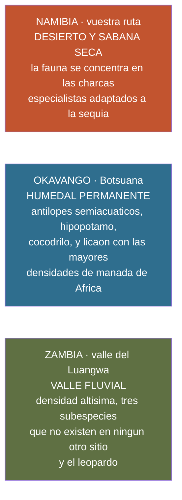

# Qué fauna da cada sitio — Namibia, el Okavango y Zambia

> **Namibia · 30 oct – 15 nov 2026 · la clásica del norte** — [← índice del dossier](../README.md)
>
> Para saber **qué animales se ve uno de verdad en este viaje y cuáles necesitarían otro**. No es
> un ranking de destinos: es el reparto honesto de quién tiene qué, y por qué — porque **casi todo
> se explica con una sola variable: el agua**.
>
> **✅** fuente primaria · **◐** secundaria concordante · **○** práctica común, sin fuente ·
> **❌** sin verificar, dicho en blanco
>
> *Investigado el 24/08/2026. Las cifras de **vuestra** ruta salen de la guía de fauna del repo
> —GBIF y los partes de avistamiento de Expert Africa, `09` y `15`—; las de Botsuana y Zambia son
> **secundarias ◐**: no se han medido aquí y sirven para decidir, no para presumir.*

---

## 💧 La regla que lo explica casi todo

Los tres sitios no compiten: **son ecosistemas distintos y por eso tienen animales distintos.**

**En seco, la fauna no está repartida: está en el agua** — que es justo lo que hace que Etosha
funcione en vuestra ventana *(`09`)*. En el Okavango pasa lo contrario: **hay agua por todas
partes**, así que la fauna se dispersa, pero aparecen especies que **necesitan** esa agua y que en
un desierto no pueden existir.

---

## 🇳🇦 Lo que SOLO da esta ruta — y que en el Okavango o Zambia no verías

Esto es lo que estáis comprando, y varias cosas **no se ven prácticamente en ningún otro sitio
del mundo**:

- 🐘 **El elefante del desierto y el rinoceronte negro de Damaraland** — poblaciones adaptadas a
  vivir sin agua permanente. Damaraland sostiene la **mayor población de rinoceronte negro en
  libertad fuera de un parque nacional** ◐, rastreable a pie con los equipos de Save the Rhino
  Trust y de Grootberg *(`aparte/desvios`)*. **Esto no existe en el Okavango ni en Zambia.**
- 🦌 **Dos endemismos del noroeste que ya llevan ficha en vuestra guía** ✅: el **impala de cara
  negra** *(Aepyceros melampus petersi)* —Etosha es su bastión— y el **dik-dik de Damara**
  *(Madoqua damarensis)* *(`09`)*.
- 🦓 **La cebra de montaña de Hartmann**, endémica del escarpe namibio-angoleño ◐ *(y ojo: la guía
  la dejó FUERA a propósito porque **no cae en vuestro eje** — vive en las lomas de dolomita,
  `09` §126. Si la queréis, hay que buscarla, no aparece sola.)*
- 🦭 **Cape Cross**: decenas de miles de **lobos marinos de El Cabo** ✅. Es fauna de **corriente
  fría** — el Okavango y el Luangwa están a mil kilómetros del mar.
- 🐾 **La «pequeña cinco» del Namib y los especialistas de duna** ✅: el gecko palmado, la víbora
  *sidewinder*, el lagarto de nariz de cuña, el gecko diurno del Namib… todos en la guía, todos
  imposibles fuera de un desierto de niebla.
- 🦁 **Y el safari de charca en seco**, que es una forma de ver fauna que el Okavango no puede
  ofrecer: **elefante 96 %, rinoceronte negro 82 %, león 70 %** en los partes de vuestros
  campamentos ✅ *(`09`)*. En un humedal la fauna no tiene por qué ir a beber a ningún sitio
  concreto.

---

## 🇧🇼 Lo que el Okavango tiene y vuestra ruta NO

Y aquí va el matiz que más importa, porque cambia la conclusión:

> ### ⚠️ Casi todo esto **sí está en Namibia** — pero en la otra punta
> El **Zambezi/Caprivi**, la franja húmeda del noreste namibio, tiene **lechwe rojo, sitatunga,
> hipopótamo, cocodrilo, búfalo y licaón** ◐. **No os los perdéis por ir a Namibia: os los perdéis
> por hacer la ruta del norte-oeste**, que es desierto y sabana seca. Son ~1.200 km de la ruta
> actual, otro viaje entero.

- 🦌 **Lechwe rojo y sitatunga** ◐ — antílopes **semiacuáticos**. En África austral el lechwe rojo
  solo está en los pantanos del Okavango y en los del **Linyanti, en el Caprivi**. Vuestra ruta no
  pasa por ninguno.
- 🐕 **Licaón** ◐ — el Okavango tiene **una de las mayores densidades de manada de África**.
  **Etosha ya no tiene licaón**: hubo un intento de reintroducción en los años 80 que no cuajó ◐,
  y el barrido del repo lo confirmó con números — **1 solo registro GBIF en todo el polígono**
  *(`15`)*. **Dadlo por imposible en este viaje.**
- 🐃 **Búfalo** — y este es de los mejores datos del dossier: **no falta por casualidad, está
  excluido a propósito**. Etosha tiene **cuatro de los Big Five, no cinco**: nunca se reintrodujo
  por **fiebre aftosa y tuberculosis bovina**, y la política veterinaria lo mantiene fuera para
  proteger el estatus exportador de Namibia ✅ *(Turner et al. 2022, con el Etosha Ecological
  Institute entre los autores — `15`)*.
- 🦛 **Hipopótamo y cocodrilo en número** ◐ — nada de eso en el eje desierto-costa-Etosha.
- 🛶 **Y una forma de verlo que no existe aquí**: el **mokoro**, la canoa de balancín.

---

## 🇿🇲 Lo que Zambia tiene y no está en ningún otro sitio

- 🦒 **Tres subespecies endémicas del valle del Luangwa** ◐, que **no existen en ninguna otra parte
  del planeta**: la **jirafa de Thornicroft** *(más baja, y el patrón no le baja de las rodillas)*,
  la **cebra de Crawshay** *(rayas notablemente más estrechas)* y el **ñu de Cookson** *(más claro
  y algo mayor)*. Para un catálogo de fauna, esto es lo más difícil de sustituir.
- 🐆 **El leopardo.** South Luangwa es «el valle del leopardo», con **una de las mayores densidades
  del mundo** y avistamientos regulares **de día y de noche** ◐. Compárese con vuestros partes
  medidos: **leopardo 12 %** de media en Etosha *(5 % en Okaukuejo, 31 % en Halali)* ✅ *(`09`)*.
  **Es otra liga.**
- 🚶 **El safari a pie, donde se inventó** ◐ — Norman Carr popularizó el safari de varios días a
  pie en el Luangwa a mediados del siglo XX, y de ahí salió el formato que hoy se copia en toda
  África.
- 🦇 **Y la carta que casi nadie juega, y que cae EXACTAMENTE en vuestras fechas**: la **migración
  de murciélagos de Kasanka**. Entre **noviembre y diciembre**, de **5 a 10 millones** de
  murciélagos de la fruta *(Eidolon helvum)* se concentran en un bosque pantanoso diminuto ◐ — **la
  mayor migración de mamíferos del mundo** por número, con las rutas migratorias más largas de
  cualquier mamífero africano según el seguimiento GPS del Max Planck ◐. Se ve **al alba y al
  ocaso**. *(Dicho para que se sepa, no como propuesta: Kasanka está a más de 2.000 km de vuestra
  ruta.)*

---

## 🤝 Lo que se solapa — para no creerse que se pierde algo que no se pierde

**León, leopardo, elefante, jirafa, cebra de Burchell, hiena manchada, chacal, kudu, impala,
facóquero, babuino, y la mayor parte de la fauna de llanura** están en los tres sitios ◐. La
diferencia no está en la lista: está en **la probabilidad y en la forma de verlos**.

Y hay dos que **Namibia da mejor** que los otros dos:

- 🦏 **Rinoceronte negro**: **82 % en los partes de vuestros campamentos** ✅ y la charca iluminada
  de Okaukuejo, que lo pone a diez metros de noche. Es de los mejores sitios del mundo para verlo.
- 🐆 **Guepardo**: Namibia tiene **la mayor población del mundo** ◐, y vuestra ruta lo lleva medido
  —**Namutoni 50 %**— más el **Cheetah Conservation Fund** en el camino de vuelta *(`aparte/desvios`, `aparte/decision-del-ccf`)*.
  El Okavango y el Luangwa **no son país de guepardo**: demasiada agua, demasiado árbol y
  demasiado león y hiena.

---

## 🧭 En una frase

**No se puede ver todo en un viaje, y este está optimizado para lo que Namibia hace mejor que
nadie: guepardo, rinoceronte negro, fauna adaptada al desierto y el safari de charca en seco.**
Lo que quedaría pendiente para otro viaje son **tres cosas concretas**: los **antílopes de agua y
el licaón** *(Okavango — o el propio Caprivi namibio)*, las **tres subespecies del Luangwa** y **el
leopardo a la densidad de Zambia**. Todo lo demás, o lo tenéis, o lo tenéis mejor.

---

*Cifras de vuestra ruta: medidas en `09` y `15`. Botsuana y Zambia: secundarias ◐, sin medir aquí ·
Investigado el 24/08/2026*
