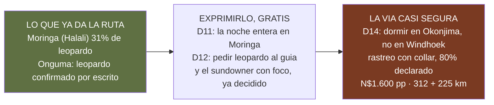
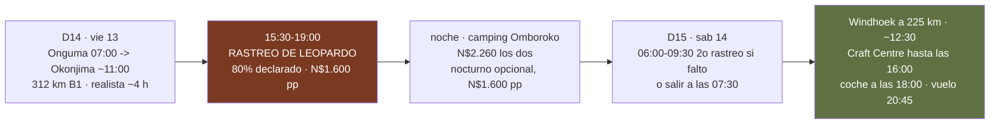

# El plan de felinos — el leopardo, sin tocar el día del guepardo

*Documento de consulta aparte — **fuera del dossier impreso**, como todo lo que es deliberación y
no ruta. El guepardo ya tiene su plan operativo en [el plan del guepardo](plan-del-guepardo.md)
*(26/08)*, y este documento **no lo toca**: lo da por hecho y añade **el otro felino que el viajero
pone en la misma frase**.*

> **Namibia · 30 oct – 15 nov 2026 · la clásica del norte** — [← índice del dossier](../README.md)
>
> **Y el criterio que ordena este documento, dicho por el viajero el 27/08: el CCF no le interesa —
> «me parece más un zoo que ver a los animales en libertad»—.** Así que aquí no hay centros con
> animales cautivos ni semicautivos: **solo fauna suelta**, en el parque o en reserva privada. El CCF
> queda descartado del todo, y no como plan B.
>
> El viajero lo ha dicho tres veces y la última así: **«lo fundamental, aparte de lo fácil de ver,
> es ver leopardos y sobre todo guepardos»** *(27/08)*. Del guepardo se ocupa el plan del 26/08:
> cinco ventanas diurnas, el D13 entero en las llanuras del este y **sin plan B**, porque el único
> que había —bajar al CCF— se comía justo ese día. **Este documento es el del leopardo**: qué da ya
> la ruta, cifra a cifra; cómo exprimirlo sin gastar; y **la única vía casi segura que cabe sin
> tocar el D13 ni las dos noches de Onguma** — la noche del D14 en Okonjima en vez de en Windhoek —,
> medida en kilómetros, horas y dinero.
>
> **~N$20 = €1** *(rango 19,5–20,5)* · **✅** fuente primaria · **◐** secundaria concordante ·
> **○** práctica común, sin fuente · **❌** sin verificar, dicho en blanco
>
> *Escrito el 27/08/2026. Los porcentajes de Etosha son los partes de viajeros de Expert Africa
> que ya usa la guía de fauna, con su muestra; las tarifas de Okonjima salen de **sus dos PDF
> oficiales de 2026, abiertos hoy por primera vez** *(`11`)*; los kilómetros, del mismo OSRM que
> dibuja el mapa.*

---

## 🎯 Lo primero: los dos felinos se buscan a horas contrarias, y eso es una suerte

El guepardo **«caza de día, a plena luz»** ✅ *(su ficha en la guía)*: se busca conduciendo despacio
por llanura abierta con el sol alto. El leopardo es lo contrario: **charca iluminada, foco y
primera y última luz**. **No compiten por las mismas horas**, así que el plan del leopardo se puede
montar **entero alrededor** del plan del guepardo sin robarle un minuto de llanura. Lo único que
compite es una noche —la del D14— y esa noche **hoy no está reservada ni tiene fauna**: es ciudad.

Y la asimetría que decide: el guepardo no tiene ningún sitio *casi seguro* **con el animal suelto**
—los centros no cuentan—; el leopardo **sí lo tiene, y cae en la carretera de vuelta**: Okonjima,
**220 km² de reserva sin recintos**, con collares de telemetría en parte de los adultos y un
**«alrededor del 80 %» de éxito declarado por su jefe de guías** ◐. Con el criterio del viajero
delante, conviene decirlo con precisión: **es el mismo tipo de sitio que Onguma** —reserva privada
vallada, animales libres dentro de ella—, no un centro; lo que añade es que a algunos leopardos se
les puede localizar por radio. **Okonjima no tiene guepardo desde 2020** ✅ *(desvíos §3)* — es sitio
de leopardo, y solo de eso va esto.

---

## 1 · Lo que la ruta ya da, medido — y dónde se juega

Los partes de viajeros de Expert Africa, campamento a campamento, con su muestra *(el método y sus
límites, en `09`; los intervalos, en el [estudio de las charcas](charcas-de-los-campamentos-de-etosha.md))*:

- 🐆 **Leopardo** — **Halali 31 %** *(12 de 39; intervalo 19–46)* · Namutoni 15 % *(2 de 13)* ·
  Okaukuejo **5 %** *(6 de 111)* · media del parque **12 %**. GBIF: 109 registros en Etosha, **14 en
  oct–nov** ✅. ⚠️ Como el 50 % de guepardo de Namutoni, **estos porcentajes son por estancia**, no
  por charca ni por hora; lo que sí dicen es **dónde**: la única fama de leopardo del parque que los
  números sostienen es **Moringa, la charca iluminada de Halali** — una de las tres diferencias que
  aguantan el intervalo en todo el estudio de charcas. Y de día, **Goas y Rietfontein** *(`09`)*.
- 🏕️ **Onguma** *(D12 y D13, reservado y firme)* — reserva privada de 35.970 ha con **leopardo
  confirmado por escrito en su web** ✅. Sin porcentaje ❌. Y **el Sundowner Drive del D12 ya está
  decidido y en el presupuesto** *(N$980 · ~€49 pp — `02` §9)*: sale al atardecer y vuelve **de
  noche, con foco y campo a través**, que es exactamente el método del leopardo.
- 🐆 **Okonjima** *(B1, al sur de Otjiwarongo — en la carretera del D14)* — 220 km² de reserva,
  **dos tercios de los leopardos adultos con collar** ◐, y **«alrededor del 80 %» de éxito** en el
  rastreo, según su jefe de guías ◐ *(entrevista en Expert Africa)*. **Es el mejor sitio de leopardo
  del país para quien tiene una tarde y una mañana.** El `11` lo daba a N$880/970 y **estaba mal**:
  eso es el game drive; **el rastreo son N$1.600 (~€80) por adulto en temporada alta** ✅.

> **Lectura honesta.** Con la ruta tal cual y sin gastar nada más, el leopardo es **«uno de cada
> tres» la noche del D11**, más lo que dé Onguma con foco el D12. Es una opción real; no es una
> probabilidad alta. **Lo que la sube de verdad son los collares de Okonjima**, y eso cuesta una
> noche cambiada y ~€160–320 la pareja.

---

## 2 · Exprimir lo que ya hay — sin tocar una reserva ni un céntimo

Esto va **encima** del plan del guepardo, no en su lugar; las horas de llanura del D11–D13 no se
tocan.

- **D11 · Halali, la noche del leopardo** — llegar con luz, cenar pronto y **sentarse en Moringa
  desde el ocaso** *(19:06)* **y hasta que el cuerpo aguante, por turnos**: uno mira, otro duerme, y
  se cambia. El leopardo de Moringa llega **de noche**, no a la hora de las fotos de elefante. Y
  **el koppie de Halali al atardecer**, que es la única caminata del parque y mira sobre la
  llanura *(`01`)*.
- **D12 · la guiada de mañana de Halali** *(comprada, N$650 pp)* — **pedid leopardo al guía: Goas,
  Rietfontein**, y después llanura para el guepardo. Son los dos felinos en la misma salida y a la
  misma hora buena.
- **D12 · el Sundowner Drive de Onguma** *(decidido para hoy el 26/08)* — foco y campo a través:
  **decidle al guía que el objetivo es el leopardo**; Onguma lo tiene, y el foco es el método.
- **D13 · nada nuevo**: el día entero es de llanura y del guepardo *(el plan del 26/08)*. Si el
  leopardo aparece, será de propina.

---

## 3 · La vía casi segura — la noche del D14 en Okonjima, no en Windhoek

**La idea**: el D14 se conduce **Onguma → Okonjima, 312 km** en vez de Onguma → Windhoek, 539; se
duerme **en su camping** *(la noche de Windhoek del D14 no está reservada — `20` §6)*; se hace **el
rastreo de leopardo de la tarde** y, si falla, **el de la mañana siguiente**; y el D15 son **225 km
por la B1 hasta Windhoek**, con la tarde de regalos y la entrega del coche como estaban. **Ni el
D13, ni las dos noches de Onguma, ni el vuelo se tocan.**

### Los kilómetros y las horas, medidos *(OSRM, 27/08; tiempos con el convenio del `13`)*

- **Onguma → Okonjima: 312 km** ✅, B1 asfaltada casi entera *(por Tsumeb y Otjiwarongo)*. **Mínimo
  ~3 h 15 a 100 · realista ~4 h** con el repostaje de Tsumeb y una parada. Saliendo a las **07:00**
  *(no hay puerta que esperar: se duerme fuera)* se llega **hacia las 11:00**: comer, montar la
  tienda, y a las **15:30** el rastreo *(vuelta 19:00–19:30 ✅)*. **Se conduce 227 km menos que en
  el D14 actual**, y el día más largo del viaje desaparece.
- **Okonjima → Windhoek: 225 km** ✅ de B1. **Mínimo ~2 h 15 · realista ~2 h 45.** Con el segundo
  rastreo *(06:00–09:30)* se sale hacia las **10:00** y se está en Windhoek **hacia las 12:45**; sin
  él, saliendo a las 07:30, hacia las **10:15**. El Craft Centre abre los sábados **09:00–16:00** ✅
  y el coche se entrega a las **18:00** *(`01` §D15)*: **el D15 sigue cabiendo con margen**, y un
  pinchazo en la B1 *(+1 h)* también.
- **Total D14 + D15: 312 + 225 + 45 = 582 km**, contra los **539 + 45 = 584** del plan actual:
  **los mismos kilómetros, repartidos en dos días en vez de uno**.

### Lo que cuesta, en dinero

- **Camping Omboroko, una noche**: N$880 + N$250 de tasa de parque **= N$1.130 (~€56,5) por persona
  → N$2.260 (~€113) los dos** ✅ *(rack 2026, temporada alta; cuatro parcelas con ducha, wc y
  enchufe propios, leña incluida)*. Cena en el lodge N$750 pp y desayuno N$420 pp, **a reservar al
  llegar** ✅ — o el braai de despedida, que era el plan de Windhoek.
- **Rastreo de leopardo**: **N$1.600 (~€80) pp → N$3.200 (~€160) los dos** ✅. **Se puede reservar
  por adelantado** ✅ *(no está entre los que el PDF marca «solo en el lodge»)*. **El segundo, si el
  primero falla, otros N$3.200** — y a esa hora, con el 80 % declarado, casi nunca hace falta.
- **Opcional**: el **nocturno**, N$1.600 pp, **solo se pide en el lodge** y según el tiempo ✅ —
  zorro orejudo, lobo de tierra, y el leopardo otra vez de noche.
- **Lo que se ahorra**: la noche del Urban Camp de Windhoek *(sin reservar, tarifa ❌)* y ~230 km
  del D14 *(~N$700 · ~€35 de gasóleo ○)*. **Lo que se pierde**: la cena de despedida en Joe's del
  D14 *(se puede hacer el D15 al mediodía)* y la última noche «de ciudad» antes del vuelo.
- **Neto: ~N$5.460 (~€273) los dos** con un rastreo, **~N$8.660 (~€433)** con dos — es decir,
  **~€135–215 por persona** sobre los ~€4.082 del `02`. Es el precio de pasar el leopardo de «uno
  de cada tres» a «ocho de cada diez, dos veces».

### Lo que cuesta, aparte del dinero

- **El leopardo de Okonjima no es el de Moringa**: es habituado y lleva collar. Cuenta como
  fotografía y como animal libre en 220 km²; **no cuenta como el de la charca**. Por eso el §2 se
  hace igual, y por eso el rastreo es el seguro y no el plan.
- **Okonjima en noviembre es temporada alta y el camping son cuatro parcelas** ◐: **hay que
  reservar la noche del 13 por adelantado**, no llegar. Y **sus condiciones de cancelación no se han
  pedido** ❌ — es la primera pregunta del email.
- **El D15 empieza a 225 km del aeropuerto**, con la tienda por desmontar. El margen está medido
  arriba y sobra; pero la red del D14 —dormir a 45 km del avión— desaparece.
- **La Línea Roja** *(`07`)*: la carne cruda que sube a Etosha **no baja**; el braai de Okonjima se
  compra en Otjiwarongo de paso, no se trae del parque.

---

## 4 · La recomendación, y qué pedir ya

1. **El §2 se hace siempre**: Moringa por turnos el D11, leopardo al guía el D12, y el sundowner
   con el foco puesto en él. No cuesta nada más.
2. **Se pide HOY por email a Okonjima** *(info@okonjimalodge.com · +264 83 373 1400)*: **una parcela
   del camping Omboroko para el 13 de noviembre, el rastreo de leopardo de esa tarde, y sus
   condiciones de cancelación** ❌. Con eso en la mano, la decisión final se toma **la tarde del D13
   en Onguma, con lo visto**: si el leopardo ya salió en Moringa o con el foco, se cancela *(según
   lo que digan esas condiciones)* y el D14 vuelve a ser Windhoek; si no, se va a por él.
3. **Nada de lo anterior toca el plan del guepardo**: las cinco ventanas, el D13 entero, las dos
   noches firmes de Onguma y el game drive del D13 siguen exactamente como están.

> **En una frase**: el guepardo se juega de día en Etosha y ya tiene su plan; el leopardo se juega
> de noche en Moringa y con el foco de Onguma, **y se asegura al 80 % declarado durmiendo el D14 en
> Okonjima en vez de en Windhoek** — los mismos kilómetros repartidos en dos días, ~€135–215 por
> persona, y sin tocar nada de lo que ya está decidido.

---

## 🕳️ Lo que este documento no afirma

- **El 80 % de Okonjima es una declaración de su jefe de guías** en una entrevista ◐, no un registro
  publicado. Es coherente con los collares y con las reseñas; no es una medición nuestra.
- **No hay porcentaje para Onguma**: «confirmado por escrito» es presencia, no probabilidad.
- **Las condiciones de cancelación de Okonjima y la disponibilidad de su camping el 13 de
  noviembre** están sin pedir ❌; el precio del Urban Camp de Windhoek que se dejaría, también.
- Los tiempos son el convenio del `13` sobre kilómetros de OSRM: **mínimos y bandas**, no promesas.

---

*Precios en N$ y € · ~N$20 = €1 · Porcentajes: partes de viajeros de Expert Africa, con su muestra
· Tarifas de Okonjima: PDF oficiales 2026 (06/12/2025) · Kilómetros: OSRM sobre OpenStreetMap,
27/08/2026 · Escrito el 27/08/2026*
