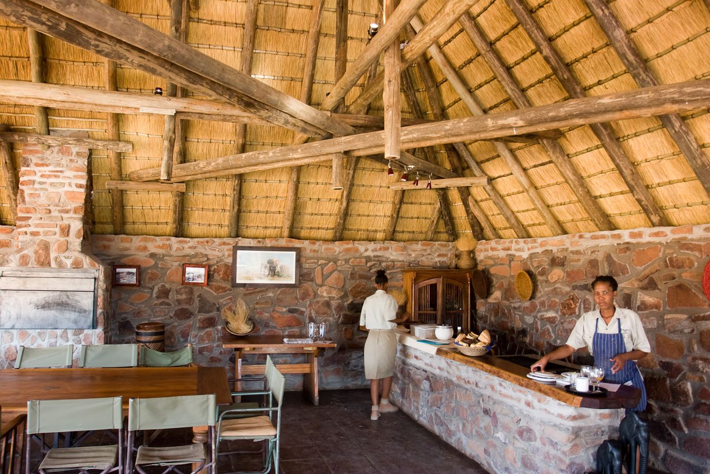
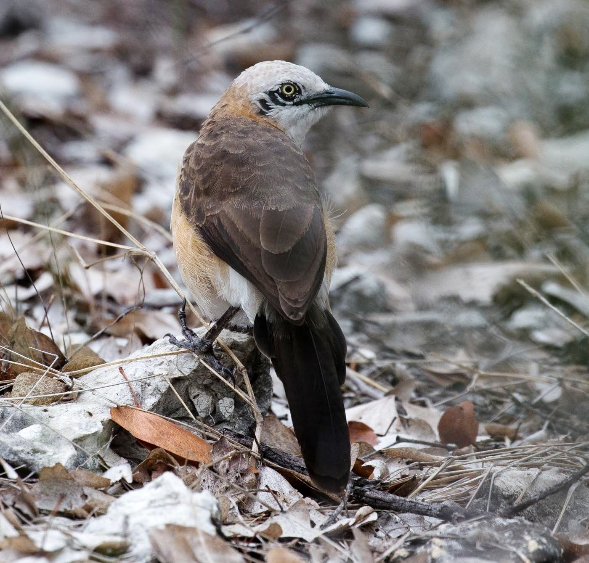
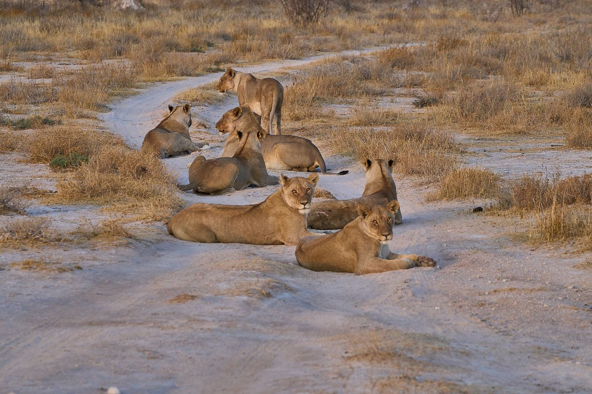
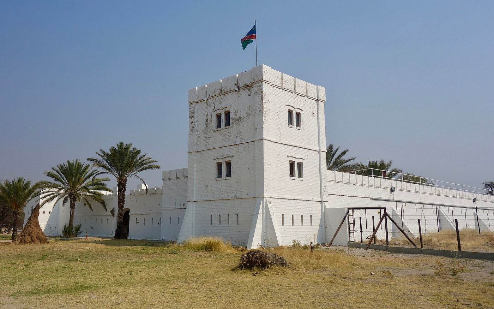
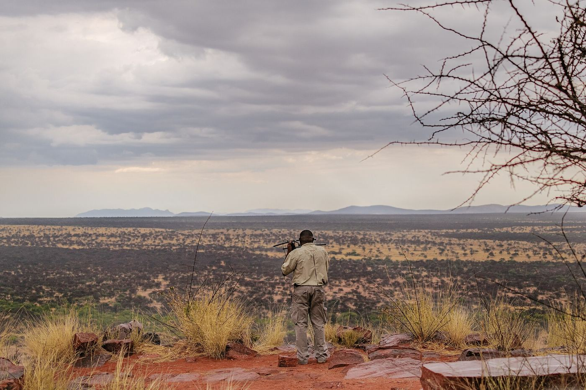
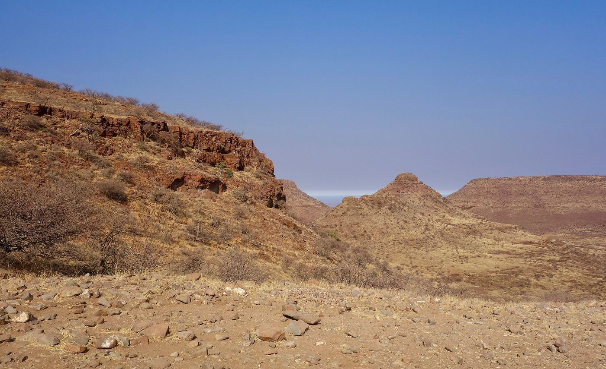
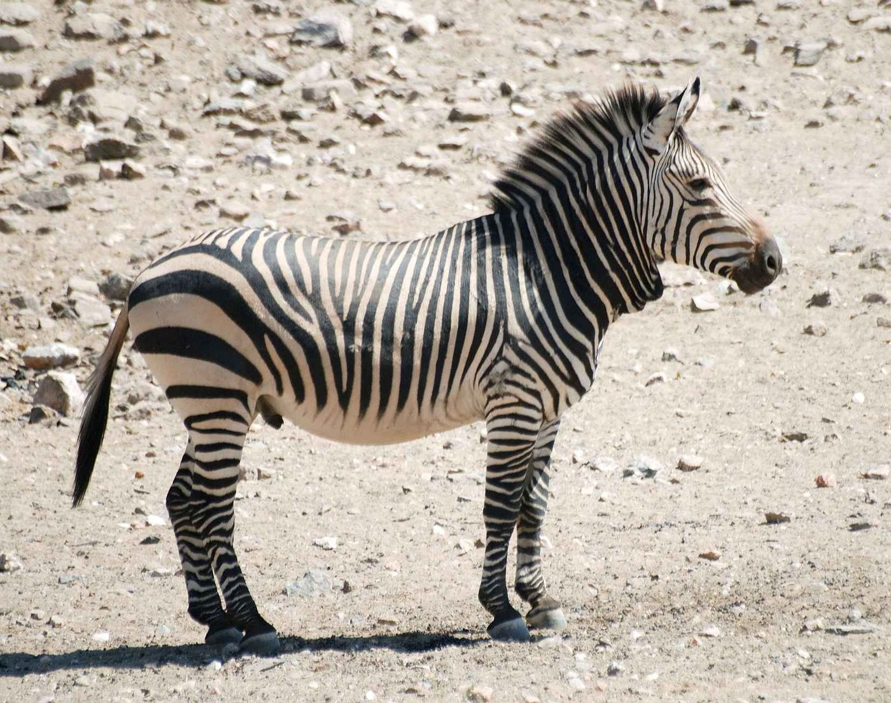

# Etosha vs. reservas privadas — comparativa

*Documento de consulta aparte — sin enlazar todavía desde el README ni desde ninguno de los dos
PDF. Investigación del 12/08/2026, con enlaces y precios verificados abriendo la web real de cada
operador (PDF de tarifas cuando existe, no un resumen de terceros) — nunca de memoria.*

**Marco**: el presupuesto del viaje es ajustado (~€4.000 por persona en 15 días, alojamiento sobre
todo en camping), así que esto es sobre si vale la pena un **lujo puntual de una noche o una
actividad suelta**, no un cambio de plan. La pregunta no es "¿es mejor que Etosha?" en abstracto,
sino **qué da una reserva privada que el self-drive de Etosha estructuralmente no puede dar**:

- **Etosha (NWR, parque público)**: solo self-drive de día, entre el amanecer y el anochecer del
  parque; prohibido bajarse del coche fuera de las charcas señalizadas; prohibido salirse de la
  pista; sin safaris a pie; sin game drives nocturnos dentro del parque (los "nocturnos" que se
  contratan en los campamentos NWR salen y vuelven a girar cerca del propio campamento, no
  recorren el parque).
- **Reserva privada**: guía profesional al volante, conducción campo a través donde el terreno lo
  permite, game drives nocturnos de verdad (la fauna nocturna de Namibia —zorro orejudo, gineta,
  oso hormiguero, gato montés africano— casi no se ve de día), a veces tracking a pie de
  rinoceronte o depredadores con collar de radio, densidad de vehículos mucho más baja.

Confianza: ✅ fuente primaria (web propia del operador, PDF de tarifas oficial) · ◐ fuente
secundaria concordante · ❌ sin verificar. Conversión N$→€ con la convención del proyecto,
~N$20 = €1; cuando el operador publica en US$ o R (rand, paridad fija con el N$), se avisa.

*Etosha, el self-drive normal — la referencia frente a la que se compara todo este documento.
Foto: Christoph Strässler, CC BY-SA 2.0 — [Wikimedia Commons](https://commons.wikimedia.org/wiki/File:Drinking_Giraffe_at_the_Okaukuejo_Waterhole,_Etosha_National_Park,_Namibia.jpg)*

---

## 0 · Sin dormir fuera — de camino, cero desvío

*Foto: Greg Willis, CC BY-SA 2.0 — [Wikimedia Commons](https://commons.wikimedia.org/wiki/File:Interior_of_lodge_(3690395368).jpg)*

**[Palmwag Lodge](https://gondwana-collection.com/accommodation/palmwag-lodge) (Gondwana)** ✅ — no
exige ni una noche ni un kilómetro de más: **ya es parada confirmada de repostaje** en la ruta
(`07`, tramo Twyfelfontein→Palmwag). Está dentro de la Concesión Palmwag, la que tiene, según su
propia web, *"la mayor población de depredadores fuera de Etosha"* (reclamo de marketing, no
verificado de forma independiente). Precios propios:

- Nature drive medio día (rinoceronte, elefante del desierto): **N$1.355 (~€68)/persona**
- Nature drive día completo: **N$3.555 (~€178)/persona**
- **Rhino tracking a pie** (medio día, no recomendado menores de 12): **N$3.975 (~€199)/persona**
- Under Canvas (noche de acampada con cena junto al fuego): N$4.995 (~€250)/persona

Es la única opción de todo este documento que suma rinoceronte negro + elefante del desierto **sin
tocar la ruta ya cerrada** — aunque el rhino tracking (media jornada) sí exige reorganizar el
horario de ese día de repostaje.

---

## 1 · Gama alta — reservas privadas de verdad

### Ongava Game Reserve — [ongava.com](https://www.ongava.com/) ✅

*Sin paisaje ni foto del lodge libres en Commons: esta es fauna fotografiada dentro de Andersson's
at Ongava, uno de los alojamientos de la reserva. Foto: Ragnhild & Neil Crawford, CC BY-SA 2.0 —
[Wikimedia Commons](https://commons.wikimedia.org/wiki/File:Bare-cheeked_Babbler-5996_-_Flickr_-_Ragnhild_%26_Neil_Crawford.jpg)*

- **Ruta**: linda con Etosha en la puerta **Andersson**, la misma que ya se usa para Okaukuejo el
  D9 — de camino, sin desvío. Distancia exacta lodge↔puerta no publicada ❌.
- 324 km² / 32.400 ha ◐. Precio pp/noche, [tarifa 2026 oficial](https://cdn.sanity.io/files/t3qm2dt2/production/b87a4d3f75de438c55302cf5ca4c92a81b42ebe3.pdf)
  ✅ (válida 11 ene 2026–10 ene 2027, cubre el viaje):
  - Ongava Lodge, Full Board: N$11.800 + N$1.200 tasa conservación = **N$13.000 (~€650)** — el
    escalón de entrada
  - Ongava Lodge/Encounter, Fully Inclusive: **N$18.500 (~€925)**
  - Anderssons at Ongava, FI: **N$24.600 (~€1.230)**
  - Horizon, FI: **N$52.000 (~€2.600)** — el tope
- **Fauna**: la única de las cuatro con rinoceronte **negro Y blanco** confirmados ✅. Leopardo y
  guepardo **no aparecen mencionados** en ongava.com ni en safaribookings.com — no se afirma que no
  estén, pero no es su reclamo.
- **De más que Etosha**: night drive (N$1.400 pp), paseo guiado a pie (N$700 pp), y game drives
  organizados **dentro de la propia Etosha** desde el lodge (N$2.600 pp).

### Onguma Game Reserve — [onguma.com](https://onguma.com/) ✅

*Foto: Graeme Churchard, CC BY 2.0 — [Wikimedia Commons](https://commons.wikimedia.org/wiki/File:L%C3%B6we_(Panthera_leo),_Rudel_ruhend.jpg)*

*Namutoni y su puerta, Von Lindequist — Onguma linda justo al otro lado.
Foto: Sonse, CC BY 2.0 — [Wikimedia Commons](https://commons.wikimedia.org/wiki/File:Namutomi_Fort_(37073116643).jpg)*

- **Ruta**: linda con la puerta **Von Lindequist**, a solo ~10 km de los campamentos de Onguma —
  y Von Lindequist está a 17 km de Namutoni, donde ya duermen el D11-D12 ◐. **El desvío más
  pequeño de todo este documento: ~27 km desde donde ya se duerme.**
- 35.970 ha ✅. Su año fiscal corre 1 nov-31 oct, así que las noches del viaje (11-12 nov) caen en
  la tarifa **"2027"**, no en la "2026" — usada aquí: [PDF 2027](https://onguma.com/wp-content/uploads/2026/07/1.-Onguma-2027-Rack.pdf)
  ✅, leído completo:
  - Campsite Leadwood/Tamboti: N$620+80 tasa = **N$620 (~€31)** — el más barato de toda la lista,
    casi lo mismo que el camping dentro de Etosha
  - Bush Camp, Rondavel DBB: **N$3.410 (~€171)** *(cruza con una fuente secundaria independiente,
    R2.782-3.029 pp — mismo orden de magnitud ◐)*
  - Tented Camp, All Inclusive: **N$16.250 (~€813)**
  - The Fort, Bush Suite FI: **N$16.520 (~€826)**
  - Camp Kala (el tope, 4 suites, all-inclusive): **N$30.750 (~€1.538)**
  - Recargo aparte, confirmado en fuente oficial: "Rhino Conservation Levy" N$275 (~€14) pp/noche
    en lodge, N$65 (~€3) pp/noche en camping
- **Fauna**: texto literal de su PDF oficial ✅ — *"Four of the Big Five (lion, leopard, rhino and
  elephant) roam free"*; guepardo también en su web ✅. **La única con leopardo Y guepardo
  confirmados por escrito en fuente propia**, junto al rinoceronte.
- **De más que Etosha**: Onkolo Hide junto a un charco (N$650 pp), paseo interpretativo (N$890 pp,
  16+), game drives privados, el "Dream Cruiser" (dormir en un vehículo de observación bajo las
  estrellas, N$9.800/vehículo). ⚠️ **Night drive con una contradicción menor sin cerrar**: la
  propia página de actividades solo publicita "Sunrise & Sundowner Daily" sin nombrar explícitamente
  el nocturno, mientras que un agregador independiente (safaribookings.com) sí lo confirma — mejor
  preguntar directo al reservar.

### Okonjima Nature Reserve / AfriCat — [okonjima.com](https://okonjima.com/) ✅

*Foto de la propia reserva, subida a su cuenta oficial de Commons. CC BY-SA 4.0 —
[Wikimedia Commons](https://commons.wikimedia.org/wiki/File:Okonjima_Nature_Reserve.jpg)*

- **Ruta**: 48 km al sur de Otjiwarongo por la B1 + 10 km de pista — es exactamente la parada
  opcional que `01` ya contempla para el D13 Etosha→Windhoek, **de camino, sin desvío extra**.
- 22.000 ha ✅. Precio pp/noche, [tarifa 2026 oficial](https://okonjima.com/wp-content/uploads/2026/08/Okonjima-Rack-Rates-2026-.pdf)
  ✅ (temporada alta 01/07-31/12/26, cubre el viaje):
  - Campsite: **N$1.130 (~€57)**
  - Plains Camp, Classic DBB: **N$5.670 (~€284)**
  - Bush Camp Chalet, FI: **N$15.650 (~€783)**
  - Private Bush Suite, FI: **N$22.350 (~€1.118)** — el tope
- **Esto no son game drives, son trackings dirigidos por investigadores con collar de radio** —
  precio aparte, sujetos a disponibilidad, no reservables por adelantado: leopard tracking N$1.600
  pp (~€80), **rhino tracking a pie N$2.200 pp (~€110)**, brown hyaena tracking N$1.600 pp,
  pangolin tracking N$2.900 pp (mín. 2 noches), night drive N$1.600 pp.
- **Fauna**: el foco actual de AfriCat es leopardo, hiena parda y pangolín ✅ (africat.org); el
  guepardo, histórico de la fundación, ya no aparece en su resumen actual. **Perro salvaje:
  confirmado ausente** ✅ — no aparece en programas presentes ni pasados.
- **Es la experiencia con más contenido de investigación/conservación real de las cuatro** — no una
  versión nocturna del mismo game drive, sino ciencia de seguimiento de verdad.

### Etosha Heights (Safarihoek / Etosha Mountain Lodge) — operador **Natural Selection** ✅

*Sin foto: ninguna variante de búsqueda (Etosha Heights, Safarihoek, Etosha Mountain Lodge,
Natural Selection) devuelve un fichero ni una categoría en Wikimedia Commons — comprobado el
12/08/2026 ❌. Coherente con ser una marca pequeña y reciente que no sube material a Commons; no
se rellena el hueco con una foto de otro sitio.*

⚠️ `etoshanationalparknamibia.com`, el resultado que aparece como aparente "oficial", **es un
portal de terceros**, no el operador — el gestor real de los lodges es Natural Selection, con
[PDF de tarifas propio](https://naturalselection.travel/wp-content/uploads/2025/12/2026-NS-Rack-Namibia31.pdf)
✅. **Descubrimiento nuevo, no citado antes en el repo.**

- **Ruta**: linda con Etosha por el suroeste, 65 km de frontera compartida ◐. **Exige desvío real**:
  ~90 km desde Kamanjab hasta la reserva + ~115 km más hasta la puerta Andersson ◐ — no está en la
  carretera directa Damaraland→Etosha, es una excursión de medio día aparte.
- 60.000+ ha ◐ ("la reserva privada más grande de Namibia", sin verificar contra fuente primaria).
  Precio pp/noche ✅ (temporada alta 1 sep-31 oct / media 1 nov-19 dic, el viaje cruza las dos):
  - Etosha Mountain Lodge, DBB: **N$6.245–7.125 (~€312-356)** — el lodge (no camping) más barato
    de los cuatro operadores de gama alta
  - Safarihoek, Classic DBB: **N$7.400–8.325 (~€370-416)**
  - Safarihoek, Luxury FI: **N$10.895–12.025 (~€545-601)**
  - Safari House (villa entera, 4 habitaciones, no es precio por persona): N$42.925-48.725 por
    unidad/noche
- **Fauna**: rinoceronte negro como reclamo principal, *"una de las mejores zonas de África para
  verlo"* ✅. Leopardo y guepardo solo aparecen en la fuente secundaria, **no en la ficha propia de
  Safarihoek**.
- **De más que Etosha**: night drives, hide de fotografía de dos plantas junto a un charco, paseos
  guiados de 1-3h y 3h+. Precio de actividades sueltas: "bajo petición", no publicado ❌.

### Erindi Private Game Reserve — [erindi.com](https://erindi.com/) — **cerrada, descartada**

Habría sido la mejor situada de las cinco (180 km al norte de Windhoek / 125 km al sur de
Otjiwarongo, prácticamente sobre la B1 del D13) y la única con **perro salvaje africano
confirmado** ✅ (sin rinoceronte). Pero su propia web dice, textual: Old Traders Lodge *"currently
closed for renovations until further notice"* (posible reapertura 2027, sin fecha), Camp Elephant
*"permanently closed and will not be reopening"*, sin visitas de día. **No hay ninguna forma de
alojarse ni de visitar Erindi en oct-nov 2026.**

*Mención aparte, no investigada a fondo por quedar fuera de alcance*: **Desert Rhino Camp**
(concesión de Palmwag, operado por Wilderness Safaris con Save the Rhino Trust) está a ~90 min de
Twyfelfontein, literalmente dentro de la zona que la ruta ya recorre — pero solo se encontraron
paquetes multi-campamento (desde US$11.685 pp por 7 noches en 3 campamentos), sin precio de una
sola noche aislable ❌.

---

## 2 · Precio contenido — concesiones y lodges económicos

### Grootberg Lodge — [grootberg.com](https://www.grootberg.com) ◐

*La meseta de Grootberg — la foto es del paso, no del lodge en sí, que se asienta en el mismo
altiplano. Foto: Sonse, CC BY 2.0 — [Wikimedia Commons](https://commons.wikimedia.org/wiki/File:Grootberg_Pass_(37090707863).jpg)*

- **Ruta**: meseta de Grootberg, concesión ‡Khoadi-//Hôas, Damaraland — ya en la zona de la ruta
  (área de Hoada, D8).
- **Rhino tracking a pie**: gestionado por la propia comunidad (‡Khoadi-//Hôas Conservancy,
  reconocida por el MEFT namibio como custodio de rinoceronte) ✅. ¾ de día, 4x4 + caminata en
  terreno rocoso, mínimo 2 personas, **prohibido menores de 16**, sin garantía de avistamiento.
  También hay elephant tracking (medio día, sin precio publicado ❌).
- **Precio**: **N$4.318 (~€216) pp/noche** DBB, 01/07–15/11/26 (cubre el viaje) — dato ◐◐
  concordante entre dos agregadores independientes. ⚠️ **Hueco reconocido**: la web oficial y
  SafariFind dan cifras más altas y distintas (N$6.178-6.790 pp) que no se pudieron reconciliar —
  se dejan las dos referencias en vez de forzar un número único. Según SafariFind (◐, no
  confirmado en fuente propia) el rhino tracking podría ir incluido en la tarifa, no como extra.
- **De más que Etosha**: tracking de rinoceronte negro a pie — Etosha no permite ningún safari a
  pie, bajo ninguna circunstancia.

### Hobatere Lodge — [hobatere-lodge.com](https://hobatere-lodge.com) ✅

*Foto: Moongateclimber, CC BY-SA 3.0 — [Wikimedia Commons](https://commons.wikimedia.org/wiki/File:Hartmann_zebra_hobatere_S.jpg)*

- **Ruta**: oeste de Etosha, concesión ≠Khoadi-//Hôas, junto a Galton Gate. **Es un desvío
  real, no un paso de camino**: 65 km al norte de Kamanjab por la C35 (asfalto) + 16-17 km de pista
  ◐. El propio `13-itinerario.md` de este proyecto ya señala que **Galton, al oeste, exige reserva y
  es más largo por dentro** — cualquier ruta a Okaukuejo pasa por Kamanjab y Outjo (265-271 km). Ir a
  Hobatere exige ida y vuelta a Kamanjab (~164 km extra): noche propia, reestructura el D9.
- **Precio**, [tarifa 2026 oficial](https://hobatere-lodge.com/uploads/documents/7469de5362c08fd69bd484ce6a0b30eab40a68d6.pdf)
  ✅ — ⚠️ nuestras fechas (fin oct-nov) caen en su temporada **ALTA** (01/07–15/11/26), la más cara
  del año ahí, al revés que los campamentos NWR de Etosha donde noviembre es más barato:
  - Bungalow doble/twin con veranda, DBB: **N$3.557 (~€178) pp/noche**
  - Rondavel twin sin veranda: **N$2.817 (~€141) pp/noche**
  - Tree House (1 unidad, 2 adultos): N$8.436 — ambiguo si es por persona o por la unidad entera ❌
  - Game drive AM/PM: N$1.050 (~€53) pp — Night drive: **N$798 (~€40) pp**
- **De más que Etosha**: night drives orientados específicamente a fauna nocturna pequeña y
  esquiva — zorro orejudo, tejón mielero, gineta, gato montés africano, liebre saltadora, búhos,
  chotacabras, oso hormiguero — nada de esto se ve de día. Salida 20:00, ~1,5h, máx. 8
  personas/vehículo.

### Camp Kipwe — [campkipwe.com](https://campkipwe.com/) ◐

- Damaraland, Conservancy Uibasen-Twyfelfontein. Distancia exacta a Twyfelfontein no publicada ❌.
- "Desert Elephant Game Drive" guiado + visita a los petroglifos de Twyfelfontein. **Sin
  confirmar** si el drive de elefante circula por el lecho del río Aba Huab con acceso restringido a
  guías (plausible, sin fuente directa) ❌. Sin indicio de night drive u off-road explícito ❌.
- **Precio**: US$411 pp doble compartida (~€380 / ~N$7.600, conversión aproximada no verificada
  hoy), 1 abr-30 nov 2026, DBB — fuente secundaria (Siyabona), no confirmado en la web oficial.
- **Valoración**: el elefante del desierto también se ve en self-drive normal por la zona — su
  ventaja específica frente a Etosha es la más débil de este documento.

### Twyfelfontein Country Lodge — [twyfelfontein.com.na](https://twyfelfontein.com.na) ❌

- La web oficial **bloqueó el acceso directo (HTTP 403)** — todo lo de abajo es vía fuentes
  secundarias, sin poder profundizar.
- Actividades citadas (◐, no verificadas en profundidad): "Dry River Drive" (conducción por lecho
  seco de río), Game Drive, petroglifos, senderismo guiado, ciclismo.
- **Precio**: desde US$223 pp compartida — pero la tarifa encontrada cubre solo mayo-octubre 2026;
  **la tarifa de noviembre, cuando de verdad se pasaría por Damaraland, no aparece** ❌.

### Etendeka Mountain Camp — [etendeka-namibia.com](https://www.etendeka-namibia.com) ✅ — descartada con dato

La única opción de todo el documento con **senderismo real de varios días** (overnight walking
trail, plataformas elevadas bajo las estrellas) en concesión propia — pero:

- **Ruta**: "hora y media de pista" desde el punto de recogida — desvío significativo, no está de
  camino ❌.
- **Precio**, [tarifa oficial](https://www.etendeka-namibia.com/rooms/rates/) ✅ (temporada alta
  01/07-31/12/26): **N$6.885 (~€344) pp/noche** todo incluido + N$280 (~€14) pp/noche de tasa de
  conservación aparte → **~€358 pp/noche total** — más del doble que Grootberg, casi 4× Hobatere.

---

## 3 · Dentro de Etosha, de acceso restringido — NO son reservas privadas

Dos campamentos NWR (es decir, siguen siendo Etosha, no reservas privadas) dan acceso a zonas del
parque cerradas al self-drive normal. Se incluyen aquí porque responden a la misma pregunta —"¿qué
da más que el self-drive estándar?"— sin salir del parque ni cambiar de operador.

### Dolomite Camp (NWR)

- Precio ya documentado en `03`: N$3.180 (~€159) pp *(media pensión/pensión completa según fuente,
  discrepancia ya marcada en el proyecto)*.
- **Nuevo, verificado ahora**: el acceso al oeste de Etosha (antiguo "Galton") es hoy **esencialmente
  exclusivo para huéspedes de Dolomite** ◐ (dos fuentes secundarias concordantes). Punto fuerte: el
  pozo Klippan, con avistamientos frecuentes de rinoceronte negro y blanco.
- **Distancia real**: Okaukuejo→Dolomite, **160-180 km** ◐◐◐ (tres fuentes en ese rango) — dentro
  del parque, a velocidad limitada: un desvío serio dentro de la propia estancia en Etosha.

### Onkoshi Resort (NWR)

- [nwr.com.na](https://www.nwr.com.na) ✅ — NE de Etosha, borde de la salina, cerca de Fisher's Pan,
  *"far away from the public self-drive routes"* (cita directa), accesible solo por carretera
  privada desde King Nehale Gate — acceso exclusivo confirmado por cuatro fuentes secundarias
  concordantes.
- **Distancia real**: Namutoni→Onkoshi, ~40 km ◐ — donde ya se duerme en la ruta actual: **el
  desvío más pequeño de los dos NWR "premium".**
- **Precio** ✅, Bed & Breakfast: jul-oct N$4.320 (~€216) pp / **nov-jun N$3.180 (~€159) pp** — el
  viaje cae justo en el cambio de temporada (31 oct-14 nov), qué tarifa aplica según noche exacta
  no se pudo fijar ❌. Solo 15 chalets, máximo 30 huéspedes a la vez.
- **De más que Etosha**: acceso exclusivo a una zona que el self-drive normal no puede pisar en
  absoluto, con el menor desvío de las dos opciones NWR restringidas.

---

## 4 · El perro salvaje africano — la respuesta honesta

### En el corredor de esta ruta

Ninguna de las cuatro reservas de gama alta (Ongava, Onguma, Okonjima, Etosha Heights) menciona el
perro salvaje en su propia web. Sobre Etosha mismo las fuentes se contradicen ◐: un gestor del
parque citado por [New Era](https://neweralive.na/namibias-wild-dogs-under-threat/) dice que lleva
*"ausente de Etosha 20 años"*; otra fuente ([mat-travel.com](https://mat-travel.com/namibia/etosha/wild-dog/))
dice que es *"extremadamente raro pero la Eastern Extension tiene una pequeña población
residente"*. En todo el corredor de esta ruta, solo dos sitios lo confirman: **Erindi** (cerrada,
no visitable) y **[N/a'an ku sê Wildlife Sanctuary](https://www.naankuse.com)** cerca de Windhoek
✅ — pero es un santuario de rehabilitación con animales **en recintos**, no una reserva de fauna
libre, visitable de medio día en el D0 o D13. **Si el perro salvaje es un objetivo real, el dato
honesto es que esta ruta, con este plan, no lo garantiza en ningún alojamiento — abierto ni de
lujo.**

### En Namibia entera, sin restricción de ruta — sí existe, pero está lejos

La pregunta más amplia tiene respuesta clara: **sí hay perro salvaje libre en Namibia**, con
sitios reales que lo confirman — pero todos caen en la **Región de Zambezi** (antiguo Caprivi), en
el extremo noreste del país, a más de 1.200 km de esta ruta: un viaje aparte, no un desvío.

- **Población silvestre real** ✅◐ — Bwabwata, Mudumu y Nkasa Rupara, más las conservancies
  comunitarias de alrededor (Mashi, Mayuni, Kwando, Wuparo). Lo confirma el *Namibia Carnivore Red
  Data Book* (2022, MEFT + Large Carnivore Management Association + Namibia Chamber of Environment
  — citado vía relé, el PDF primario no se pudo abrir directamente) y el **Kwando Carnivore
  Project**, con base en Kongola desde hace más de dos décadas, que estima **40-80 individuos** en
  la zona.
- **[Nambwa Tented Lodge](https://africanmonarchjourneys.com/stay/nambwa-tented-lodge/)** (Bwabwata
  NP, Kwando Core Area) ✅◐ — el único lodge namibio confirmado por dos vías independientes a la
  vez: lo anuncia él mismo en sus game drives *("lions, elephants, buffalos and leopards, as well
  as wild dogs")* **y** [Expert Africa](https://www.expertafrica.com/wildlife/wild-dog/namibia)
  —el mismo tipo de parte de viajeros que usa este proyecto para las charcas de Etosha— le da un
  **23 % de éxito sobre 13 partes** desde 2018: la mejor tasa de un alojamiento en libertad de
  todo el país.
- **[Omaanda](https://www.zannierhotels.com/omaanda/)** (Zannier Hotels, ~30 min de Windhoek) —
  otra categoría, no libertad plena: reserva **vallada** de ~7.500-9.000 ha (la cifra varía según
  la página del propio grupo) con una manada reintroducida y monitorizada por collar GPS (la
  "Eiseb Pack", ~10 ejemplares, gestión de N/a'an ku sê Foundation + KAWDCP) — más parecida al
  leopardo con collar de Okonjima que a un parque abierto. **25 % de éxito sobre 8 partes** ◐
  (Expert Africa), la tasa más alta de todo el ranking namibio, aunque sobre muestra pequeña y sin
  que el propio lodge lo anuncie por nombre en su web comercial.
- **Lo que no se pudo confirmar**: ningún lodge de Mudumu o Nkasa Rupara (Namushasha River Lodge,
  Nkasa Lupala, Lianshulu) publicita el perro salvaje pese a estar en zona con población
  confirmada por investigación local — puede que lo tengan y no se haya encontrado, no se afirma
  que no lo tengan ❌.
- **Censo nacional**: sin dato reciente y fiable. La cifra que más se repite es **~544 perros en
  ~45 manadas**, de un estudio de **2015** todavía citado en el Red Data Book de 2022; un informe
  de 2025 da **~350**, sin fuente que reconcilie la discrepancia ❌. Clasificado **En Peligro** a
  nivel nacional.

**En resumen**: si el perro salvaje pesa más que el resto del viaje, está en la Región de
Zambezi, no en Etosha ni en Damaraland — y es un viaje distinto, no un añadido a esta ruta.

---

## 5 · Valoración final

Con el marco del viaje —self-drive, presupuesto ajustado, una sola noche o actividad de capricho—:

1. **Mejor relación calidad-precio pura, sin tocar la ruta**: Palmwag Lodge (nature drive o rhino
   tracking, sin dormir) — rinoceronte negro + elefante del desierto por N$1.355-3.975 pp, en un
   punto donde ya se repostará.
2. **Mejor acceso exclusivo dentro del propio Etosha**: Onkoshi (40 km de desvío desde Namutoni)
   gana a Dolomite (160-180 km) para el mismo tipo de ventaja — zona vetada al self-drive público.
3. **Mejor "fauna que Etosha no puede dar" fuera del parque**: Okonjima — tracking con collar de
   investigación (leopardo, rinoceronte a pie, hiena parda, pangolín), ya integrado como parada
   D13 sin desvío. Grootberg le sigue de cerca para rinoceronte a pie específicamente, también
   cerca de ruta, pero con el precio sin reconciliar entre fuentes.
4. **Reserva de gama alta más completa en fauna**: Ongava (único con rinoceronte negro y blanco
   confirmados), pero el escalón de entrada es el más caro de las cuatro y no confirma leopardo ni
   guepardo.
5. **Mejor encaje geográfico si dormir fuera es la prioridad**: Onguma — a 27 km de donde ya se
   duerme, el rango de precio más amplio (N$620-30.750 pp/noche), leopardo+guepardo+rinoceronte
   confirmados — con la única duda real del documento sobre si hacen night drive de verdad.
6. **Descartadas con su dato**: Erindi (cerrada), Etosha Heights (desvío real de 90-115 km fuera
   del camino directo), Hobatere (164 km de desvío + temporada más cara del año + Galton exige
   reserva propia y es rodeo, ya sabido por `13`), Etendeka (desvío + el precio más alto de
   la lista económica), Camp Kipwe y Twyfelfontein Country Lodge (ventaja floja frente a lo que ya
   se ve desde la carretera pública, y este último sin tarifa de noviembre verificada).
7. **Perro salvaje**: no garantizado en ningún alojamiento realista de esta ruta. Existe de verdad
   en Namibia —Región de Zambezi, con Nambwa Tented Lodge como la opción mejor confirmada—, pero
   es un viaje aparte, a más de 1.200 km de esta ruta, no un añadido — ver arriba.

**Huecos que quedan reconocidos, no rellenados**: precio y régimen exactos de Grootberg (dos
cifras discrepantes sin reconciliar), precio del rhino/elephant tracking cuando no va empaquetado,
tarifa de noviembre de Twyfelfontein Country Lodge, si el drive de Kipwe es realmente off-road
restringido, si Onguma hace night drive de verdad, y el precio por noche aislado de Desert Rhino
Camp. Todos con su URL arriba para cerrarlos con una llamada o email directo si alguna de estas
opciones pasa de "comparativa" a "reserva real".
